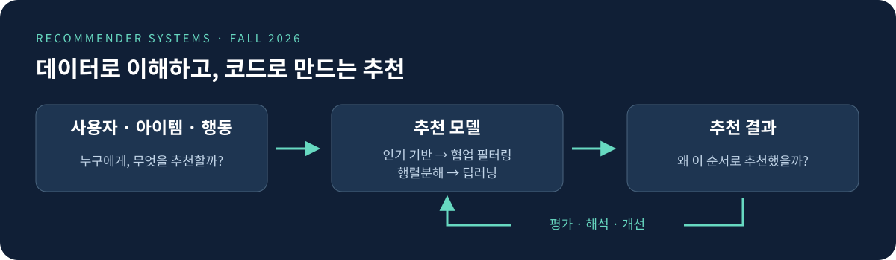

# 딥러닝응용I(추천시스템)

동덕여자대학교 데이터사이언스전공 · 2026-2 · 3학점

담당교수 **유원상** · 화·목 10:30-11:45

**사용자에게 무엇을 추천할지, 왜 그렇게 추천했는지, 좋은 추천인지 함께 알아봅니다.**

인기 기반 추천에서 시작해 협업 필터링, 행렬분해, 딥러닝 추천으로 발전시키는 수업입니다. Python과 Google Colab으로 작은 데이터를 직접 다루고, 추천 결과를 비교·평가하며, 한 학기 동안 작은 추천 웹 애플리케이션을 단계적으로 발전시킵니다.

## 수업 시작하기

1. 아래 표에서 오늘 수업의 **MD 또는 PDF 강의노트**를 엽니다. Notion 링크로도 읽을 수 있습니다.
2. **Colab**을 열어 Drive에 사본을 저장하고, 설명을 읽으며 위에서 아래로 실습합니다.
3. 점검 퀴즈를 먼저 풀고 **퀴즈 답안**으로 확인합니다. 코드 실행 뒤에는 추천 결과가 나온 이유를 설명해 봅니다.

[전체 PDF·답안](course/handouts/README.md) · [Python 복습 길잡이](course/python-basics.md) · [모든 참고자료](course/references.md) · [과제](assignments/student/README.md) · [데이터 안내](data/README.md)

## 차시별 강의자료

자료가 추가되면 이 표도 함께 갱신됩니다. `—`는 아직 게시되지 않았거나 별도 자료가 없는 항목입니다. 일정 변경과 과제 제출·시험 안내는 스마트클래스 공지를 확인하세요.

| 차시 | 강의 날짜 | 강의 주제 | 강의노트 | 퀴즈 답안 | 실습 ipynb | Colab |
|---|---|---|---|---|---|---|
| W01A | 2026-09-01 (화) | 오리엔테이션과 추천시스템의 세계 | [MD](course/notion/sessions/w01a-orientation-and-recommenders.md) · [PDF](course/handouts/w01a-orientation-and-recommenders.pdf) · [Notion](https://app.notion.com/p/w01a-orientation-and-recommenders-3cd7fd00109f818db55fc0a452d428f3?source=copy_link) | [보기](course/handouts/w01a-orientation-and-recommenders-quiz.md) · [PDF](course/handouts/w01a-orientation-and-recommenders-quiz.pdf) | [ipynb](https://github.com/lunalab-ai/recommender/blob/2026-fall-w01a-r3/notebooks/student/w01a-orientation-and-recommenders.ipynb) | [수업 버전](https://colab.research.google.com/github/lunalab-ai/recommender/blob/2026-fall-w01a-r3/notebooks/student/w01a-orientation-and-recommenders.ipynb) |
| W01B | 2026-09-03 (목) | Colab 환경 구축과 첫 추천 앱 | [MD](course/notion/sessions/w01b-colab-and-first-recommender-app.md) · [PDF](course/handouts/w01b-colab-and-first-recommender-app.pdf) · [Notion](https://app.notion.com/p/W01B-Colab-3d07fd00109f8168a7e9c245cd0fdd97?source=copy_link) | [보기](course/handouts/w01b-colab-and-first-recommender-app-quiz.md) · [PDF](course/handouts/w01b-colab-and-first-recommender-app-quiz.pdf) | [ipynb](https://github.com/lunalab-ai/recommender/blob/2026-fall-w01b/notebooks/student/w01b-colab-and-first-recommender-app.ipynb) | [수업 버전](https://colab.research.google.com/github/lunalab-ai/recommender/blob/2026-fall-w01b/notebooks/student/w01b-colab-and-first-recommender-app.ipynb) |

강의노트와 답안은 최신 자료입니다. 실습의 ipynb·Colab 링크는 같은 버전을 열며, `수업 버전`은 공지된 검증 tag, `최신본`은 main을 사용합니다. PDF는 MD와 같은 내용이며 화면 배치와 페이지 나눔은 다를 수 있습니다.

## 이 수업에서 배우는 것

- 추천시스템의 전통적 방법과 딥러닝 기반 방법의 핵심 원리를 설명한다.
- Python으로 추천 데이터를 전처리하고 주요 알고리즘을 구현한다.
- 추천 결과를 적절한 지표로 평가하고 해석한다.
- 실제 데이터와 사용자 시나리오에 맞는 추천 모델과 미니 애플리케이션을 설계한다.

## 16주 커리큘럼

[강의계획](course/course.yml)의 주차별 내용을 따릅니다. 차시별 실제 날짜와 자료는 위 표에서 확인하세요.

| 주차 | 주제 | 학습목표 |
|---|---|---|
| 1 | 강의 소개 · 평가 및 운영 · 추천시스템 개념과 적용 사례 · Python/Jupyter/Colab 환경 설정 | 수업 운영 방식과 추천시스템 과목의 전체 흐름을 이해하고 Python 실습 환경을 구축한다. |
| 2 | 데이터 불러오기 · 인기 기반 추천 · 사용자 집단별 추천 · 내용 기반 추천 · 기본 성능 평가 | 기본적인 추천 방법과 추천 성능 평가의 필요성을 이해한다. |
| 3 | 사용자-아이템 평점 행렬 · 유사도 · 기본 협업 필터링 | 협업 필터링의 기본 원리와 유사도 기반 추천 방식을 이해한다. |
| 4 | 이웃 기반 CF · 최적 이웃 크기 · 평가경향 보정 · User-CF · Item-CF | 이웃 기반 협업 필터링을 구현하고 사용자 기반과 아이템 기반 추천을 비교한다. |
| 5 | RMSE · MAE · precision · recall · ranking 평가 · 모델 비교 | 추천 성과측정지표를 이해하고 기본 알고리즘의 성능을 비교한다. |
| 6 | Matrix Factorization · 잠재요인 · 손실함수 · SGD | 행렬분해 기반 추천의 원리와 SGD 기반 학습 절차를 이해한다. |
| 7 | train/test · 성능 평가 · 하이퍼파라미터 탐색 · MF와 SVD · 중간고사 정리 | 행렬분해 모델의 학습·검증 절차와 파라미터 조정 방법을 적용한다. |
| 8 | 중간고사 | 전반부 핵심 개념과 적용 능력을 점검한다. |
| 9 | Factorization Machines · MF와 신경망의 연결 · 딥러닝 추천 개요 | 특징 상호작용을 반영하는 추천 모델을 이해하고 딥러닝 기반 추천으로 확장한다. |
| 10 | Keras MF · Embedding layer · 사용자·아이템 특성 · 학습과 평가 | Keras로 딥러닝 기반 추천 모델을 구현하고 추가 변수를 반영한다. |
| 11 | AutoEncoder · encoder/decoder · 선호 복원 · AE 추천 | 오토인코더의 원리를 이해하고 추천시스템에 적용한다. |
| 12 | Transformer · 순차 추천 · 행동 시퀀스 · 구현 개관 | Transformer 기반 추천의 기본 개념과 활용 방법을 이해한다. |
| 13 | LLM 추천 · prompting · text embedding · 한계와 주의점 | LLM을 활용한 추천 방식과 임베딩 기반 추천의 가능성을 이해한다. |
| 14 | 하이브리드 · sparse matrix · cold start · scalability · presentation · implicit feedback | 실제 추천시스템 구축에서 발생하는 주요 문제와 대응 전략을 설명한다. |
| 15 | 알고리즘 비교 · 평가 지표 복습 · 장단점 · 코드 리뷰 · 기말 대비 | 학기 동안 학습한 알고리즘을 종합 비교하고 핵심 개념을 정리한다. |
| 16 | 기말고사 | 전체 내용을 종합적으로 정리하고 추천시스템 적용 능력을 평가한다. |

## Python 기초가 약하다면

한 번에 모든 문법을 익히려고 하기보다 **셀 실행 → 변수와 list → 조건문과 반복문 → 함수 → DataFrame** 순서로 복습하세요. [Python 복습 길잡이](course/python-basics.md)에 각 단계의 예제와 확인할 질문을 모았습니다.

공식 Python 자습서는 기본적인 프로그래밍 경험을 가정합니다. 프로그래밍 자체가 처음이면 길잡이의 작은 예제와 Helsinki 입문 자료부터 시작하고, 공식 문서는 문법을 찾아보는 용도로 활용하세요.

| 분야 | 자료 | 언어 | 활용 방법 |
|---|---|---|---|
| Python 기초 | [이 수업을 위한 Python 복습 길잡이](course/python-basics.md) | 한국어 | Colab 실행부터 변수·반복문·함수·표 읽기까지, 짧은 예제로 복습 |
| Python 기초 | [Python 한국어 공식 자습서](https://docs.python.org/ko/3/tutorial/) | 한국어·일부 영어 | 문법을 배운 적이 있다면 3·4·5·8장으로 복습 |
| Python 기초 | [University of Helsinki — Python Programming MOOC 2026](https://programming-26.mooc.fi/) | 영어 | 프로그래밍이 처음이라면 Introduction의 Part 1부터 연습 |

## 교재와 참고자료

주교재: 임일, 『AI 에이전트를 위한 개인화 추천 알고리즘: Python, 머신러닝, AI, LLM 활용』, 도서출판청람, 2025.

아래 자료는 수업을 위한 보충 읽기입니다. 각 링크의 설명은 학습을 돕기 위해 추가했으며, 외부 예제의 데이터와 실행 환경은 수업 notebook과 다를 수 있습니다.

| 분야 | 자료 | 언어 | 활용 방법 |
|---|---|---|---|
| 실습 도구 | [Google Colab 시작 notebook](https://colab.research.google.com/notebooks/intro.ipynb) | 영어 중심 | 브라우저에서 notebook을 열고 셀 실행 연습 |
| 실습 도구 | [NumPy — Absolute basics for beginners](https://numpy.org/doc/stable/user/absolute_beginners.html) | 영어 | 배열·shape·인덱싱을 이해하고 평점 행렬 준비 |
| 실습 도구 | [pandas — Getting started tutorials](https://pandas.pydata.org/docs/getting_started/intro_tutorials/index.html) | 영어 | 표 읽기·행 선택·요약 통계를 MovieLens 실습과 연결 |
| 실습 도구 | [Matplotlib — Pyplot tutorial](https://matplotlib.org/stable/tutorials/pyplot.html) | 영어 | 평점 분포와 실험 결과를 그래프로 표현 |
| 추천시스템·머신러닝 | [Google — Recommendation systems](https://developers.google.com/machine-learning/recommendation) | 영어 | 추천 문제와 주요 추천 방법을 개괄 |
| 추천시스템·머신러닝 | [scikit-learn — Getting Started](https://scikit-learn.org/stable/getting_started.html) | 영어 | 학습·예측·전처리·평가 API 복습; 머신러닝 기초 이후 |
| 추천시스템·머신러닝 | [Keras — Collaborative Filtering for Movie Recommendations](https://keras.io/examples/structured_data/collaborative_filtering_movielens/) | 영어 | Embedding 기반 영화 추천 예제; 딥러닝 추천 단원에서 참고 |

**[차시별 출처와 본문 참고 링크 전체 보기](course/references.md)** — 매 수업의 참고자료를 한곳에 모아 확인할 수 있습니다.

## 과제·데이터·수업 코드

- [학생용 과제 안내](assignments/student/README.md): 공개 과제 자료와 실습 제출 안내
- [학생용 notebook 모음](notebooks/student/): 실습 파일을 내려받아 보관할 때
- [수업 Python 패키지](src/luna_recsys/): 여러 차시에서 재사용하는 추천·데이터 처리 코드
- [데이터 사용 안내](data/README.md) · [데이터 목록과 출처](data/registry.yml) · [소규모 샘플](data/sample/)
- [Notion 강의자료 목차](course/notion/index.md) · [PDF·퀴즈 답안 모음](course/handouts/README.md)

MovieLens 100K 원본은 저장소에 포함하지 않습니다. 수업 notebook의 데이터 준비 절차에 따라 공식 배포처에서 내려받거나 제공된 synthetic sample을 사용하세요.

## 수업 운영과 학습 방법

중간고사 **30%** · 기말고사 **40%** · 과제물 **10%** · 출석 **20%**

실습 과제는 원칙적으로 통과 10점 또는 탈락 0점으로 평가합니다.

수업 전에는 핵심 질문을 읽고, 수업 중에는 조건을 바꾸어 결과를 비교하고, 수업 후에는 퀴즈와 Take-home message로 설명할 수 있는지 점검하세요. 질문할 때는 어느 차시·어느 셀인지와 오류 메시지를 함께 준비하면 좋습니다. 제출·상담 등 운영 세부 사항은 스마트클래스와 수업 시간 안내를 따릅니다.
