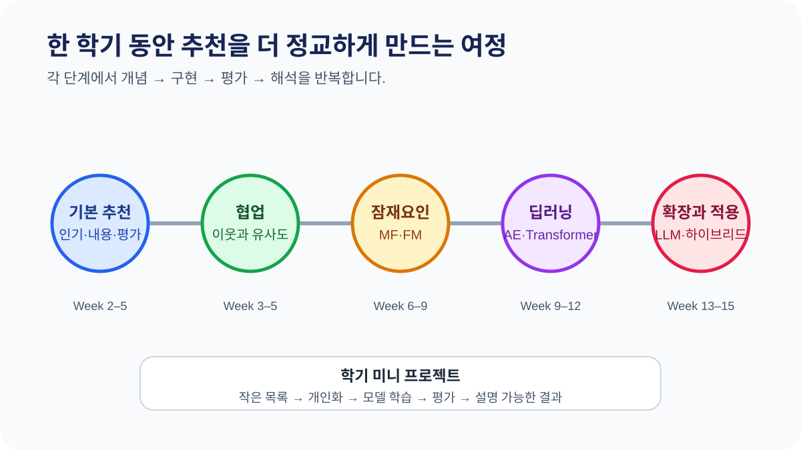
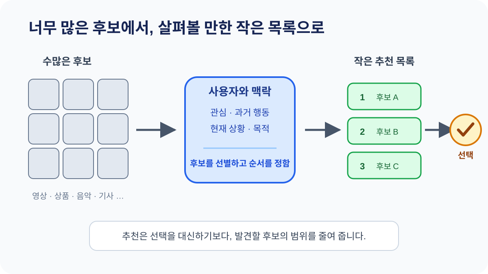
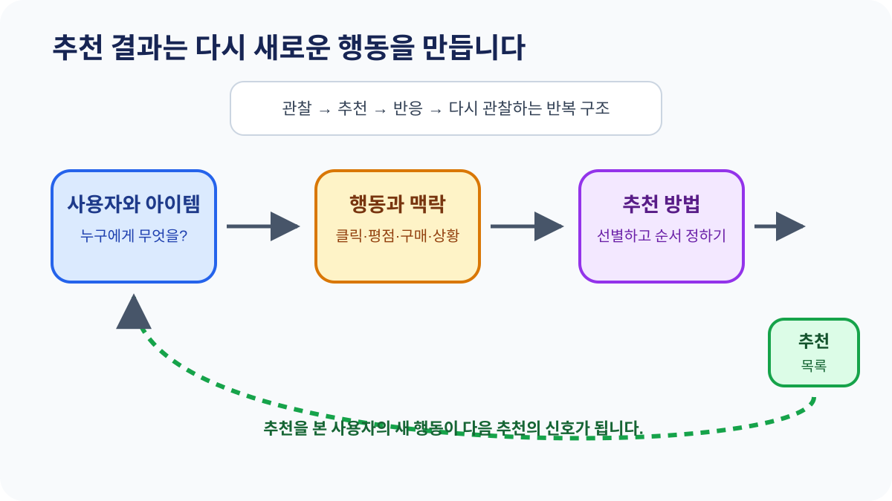
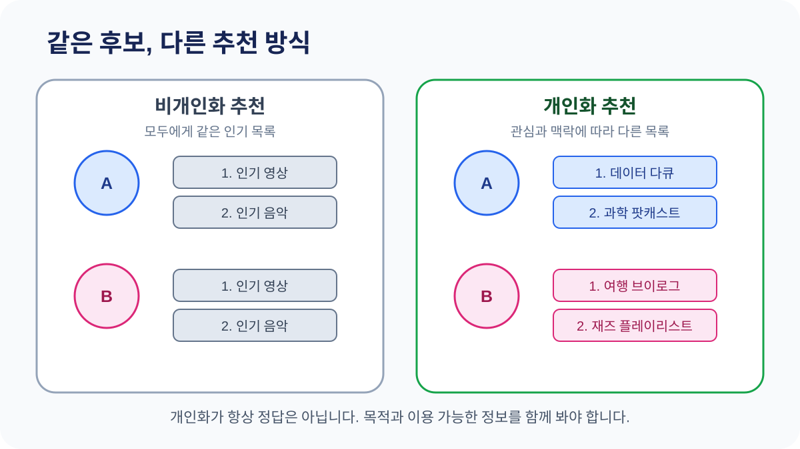

# W01A · 오리엔테이션과 추천시스템의 세계

> 딥러닝응용I(추천시스템) · 동덕여자대학교 데이터사이언스전공 · 유원상 교수 · 2026-2

## 오늘의 핵심 질문

- 이 과목에서 한 학기 동안 무엇을 배우고 만들게 될까?
- 선택할 수 있는 항목이 너무 많을 때 추천시스템은 어떤 도움을 줄까?
- 모든 사람에게 같은 순위를 보여주는 것과 개인별 추천은 무엇이 다를까?

## 학습목표

수업을 마치면 다음을 할 수 있습니다.

1. 추천시스템이 해결하려는 문제를 자신의 말로 설명한다.
2. 비개인화 추천과 개인화 추천을 구분한다.
3. 추천시스템을 사용자, 아이템, 행동, 추천 결과의 관계로 설명한다.
4. 한 학기 동안 배울 추천 방법의 흐름을 개괄한다.

## 수업 흐름

| Part | 시간 | 내용 |
|---|---:|---|
| 1. 강의 소개 | 30분 | 목표, 수업 방식, 학기 로드맵, 평가와 운영 |
| 질의응답 | 5분 | 수업 운영과 학습 준비에 관한 질문 |
| 2. 추천시스템의 세계 | 40분 | 필요성, 기본 구조, 개인화, 적용 사례, 정리 |

# Part 1. 강의 소개

## 1. 이 과목에서 무엇을 배우는가

이 과목은 추천시스템의 전통적 방법에서 출발해 딥러닝 기반 방법과 실제 구축 이슈까지 단계적으로 학습합니다. 이론을 이해하는 데 그치지 않고 Python으로 데이터를 다루고, 추천 결과를 만들고, 그 결과를 평가하고 해석합니다.

학기 말에는 다음 질문에 근거를 들어 답하는 것을 목표로 합니다.

- 이 사용자에게 왜 이 아이템을 추천했는가?
- 이 추천이 좋은지 무엇으로 판단할 수 있는가?
- 어떤 데이터와 모델이 이 상황에 적절한가?
- 이 시스템이 놓치고 있는 사용자나 아이템은 없는가?

### 학기 학습 흐름

1. 인기 기반·내용 기반 추천과 기본 평가
2. 협업 필터링과 이웃 기반 추천
3. Matrix Factorization과 Factorization Machines
4. 딥러닝·AutoEncoder·Transformer 추천
5. LLM·하이브리드 추천과 실제 구축 이슈

각 단계에서 개념, 구현, 평가, 해석을 연결합니다. 앞에서 만든 코드를 버리지 않고 다음 단계의 더 정교한 추천으로 발전시키는 방식입니다.

## 2. 수업 방법과 미니 프로젝트

수업은 이론 설명과 Google Colab 실습을 함께 진행합니다.

| 과정 | 학생이 하는 일 |
|---|---|
| 문제 정의 | 누구에게 무엇을 왜 추천할지 정한다. |
| 데이터 이해 | 사용자, 아이템, 행동 데이터를 확인한다. |
| 추천 생성 | baseline부터 딥러닝 모델까지 구현한다. |
| 평가 | 추천 결과를 지표와 사례로 점검한다. |
| 해석과 개선 | 실패 사례를 찾고 다음 모델을 설계한다. |

학기 미니 프로젝트는 이 과정을 누적해서 경험하는 작은 추천 애플리케이션입니다. 첫 실행에서는 단순한 목록으로 시작하지만, 수업이 진행되면서 개인화, 모델 학습, 평가와 설명 기능을 더합니다.

## 3. 평가와 학습 준비

| 평가 요소 | 비율 |
|---|---:|
| 중간고사 | 30% |
| 기말고사 | 40% |
| 과제물 | 10% |
| 출석 | 20% |

- 기본 Python 문법을 알고 있다고 가정합니다.
- 실습에는 Google Colab을 사용합니다.
- 실습 과제는 원칙적으로 통과 10점 또는 탈락 0점으로 평가합니다.
- 자세한 출결, 상담, 소통 채널과 수업 운영 공지는 스마트클래스와 수업 시간에 안내합니다.
- 주교재는 임일의 『AI 에이전트를 위한 개인화 추천 알고리즘』입니다.

## 4. LUNA Lab과 질문하기

LUNA Lab의 연구 주제와 학생 참여 방법은 수업 시간에 교수자가 직접 소개합니다. 구체적인 활동과 참여 조건은 당일 안내와 스마트클래스 공지를 기준으로 확인합니다.

다음 내용을 중심으로 자유롭게 질문해 봅시다.

- 선수 지식과 Python 준비 수준
- Colab 실습과 과제 방식
- 시험과 평가
- 학기 미니 프로젝트
- 수업 중 질문과 상담 방법

# Part 2. 추천시스템의 세계

## 5. 추천은 왜 필요한가

영상, 상품, 음악, 뉴스처럼 후보가 매우 많으면 사용자가 모든 항목을 직접 살펴볼 수 없습니다. 추천시스템은 사용자에게 관련 있을 가능성이 높은 후보를 먼저 보여 주어 탐색을 돕습니다.

교재는 추천을 사용자에게 필요한 정보나 제품을 골라 제시하는 시스템으로 설명하고, 개인화를 핵심 특징으로 소개합니다.

> 추가 교육적 해석: 추천은 사용자를 대신해 하나의 정답을 결정하는 장치라기보다, 많은 후보 사이에서 발견과 선택을 지원하는 장치로 볼 수 있습니다.

## 6. 추천시스템의 기본 구조

추천시스템을 처음 만날 때는 네 가지 요소를 찾으면 됩니다.

| 요소 | 확인할 질문 | 예시 |
|---|---|---|
| 사용자 | 누구에게 추천하는가? | 시청자, 구매자, 독자 |
| 아이템 | 무엇을 추천하는가? | 영상, 상품, 음악, 기사 |
| 행동과 맥락 | 어떤 신호를 사용하는가? | 조회, 클릭, 평점, 구매 |
| 추천 결과 | 무엇을 어떤 순서로 보여주는가? | 후보 목록과 순위 |

사용자가 추천 결과를 보고 행동하면 새로운 데이터가 생깁니다. 다음 추천은 그 데이터를 다시 사용할 수 있습니다. 이 때문에 추천시스템은 한 번 계산하고 끝나는 표가 아니라 반복적으로 관찰하고 개선하는 시스템입니다.

## 7. 비개인화 추천과 개인화 추천

비개인화 추천은 모든 사용자에게 같은 결과를 보여줄 수 있습니다. 예를 들어 전체 사용자에게 많이 선택된 아이템 순위를 제시할 수 있습니다.

개인화 추천은 사용자의 관심, 과거 행동, 현재 맥락 등에 따라 결과가 달라집니다.

| 구분 | 결과 | 장점 | 주의할 점 |
|---|---|---|---|
| 비개인화 | 사용자에게 같은 목록 | 단순하고 설명하기 쉽다. | 개인의 취향 차이를 반영하기 어렵다. |
| 개인화 | 사용자마다 다른 목록 | 개인의 관심을 반영할 수 있다. | 충분한 정보와 적절한 평가가 필요하다. |

개인화가 언제나 더 좋은 것은 아닙니다. 처음 방문한 사용자처럼 정보가 거의 없거나, 모두가 알아야 하는 공지처럼 동일한 결과가 필요한 상황도 있습니다.

## 8. 추천 방법의 큰 지도

교재는 추천 방법을 협업 필터링, 내용 기반 필터링, 지식 기반 필터링, 딥러닝, 하이브리드 등으로 소개합니다. 오늘은 이름과 큰 차이만 확인하고, 계산과 구현은 이후 수업에서 다룹니다.

| 방법 | 출발점 |
|---|---|
| 협업 필터링 | 여러 사용자의 행동 패턴 |
| 내용 기반 추천 | 사용자가 좋아한 아이템의 특성 |
| 지식 기반 추천 | 사용자의 요구 조건과 분야 지식 |
| 딥러닝 기반 추천 | 복잡한 사용자·아이템 관계를 학습하는 모델 |
| 하이브리드 추천 | 여러 방법의 장점을 함께 사용 |

## 9. 어디에서 추천을 만나는가

교재는 영상 서비스와 전자상거래 서비스를 대표 사례로 설명합니다. 아래의 음악·뉴스 사례와 관찰 질문은 공식 서비스 설명을 바탕으로 수업을 위해 추가했습니다. 서비스 화면을 복제하지 않고 각 링크를 직접 열어 추천이 해결하는 질문과 사용하는 신호를 찾아봅시다.

| 영역 | 직접 확인할 실제 사례 | 추천이 답하려는 질문 | 관찰할 신호와 위치 |
|---|---|---|---|
| 영상 | [YouTube 홈](https://www.youtube.com/) · [맞춤 동영상 공식 설명](https://support.google.com/youtube/answer/16089387?hl=ko) | 지금 이 사용자가 보고 싶어 할 영상은 무엇인가? | 홈과 다음 동영상, 시청·검색 기록, 좋아요·관심 없음 |
| 쇼핑 | [Amazon](https://www.amazon.com/) · [추천시스템 공식 연구 소개](https://www.amazon.science/publications/two-decades-of-recommender-systems-at-amazon-com) | 이 사용자의 목적과 현재 맥락에 맞는 상품은 무엇인가? | 상품 상세 페이지의 연관 상품, 현재 보고 있는 상품, 과거 행동 |
| 음악 | [Spotify Web Player](https://open.spotify.com/) · [Made For You 공식 설명](https://support.spotify.com/us/article/find-playlists/) | 지금 상황과 취향에 어울리는 곡과 플레이리스트는 무엇인가? | Made For You와 Discover Weekly, 청취·좋아요·저장·건너뛰기 |
| 뉴스 | [Google 뉴스의 내 뉴스](https://news.google.com/foryou?hl=ko&gl=KR&ceid=KR%3Ako) · [기사 선택 공식 설명](https://support.google.com/googlenews/answer/9005749?hl=ko) | 이 독자가 지금 관심을 가질 가능성이 높은 기사는 무엇인가? | 내 뉴스와 헤드라인의 차이, 관심 주제·출처·과거 활동 |

> 직접 확인할 때 주의: 로그인 여부, 기록 설정, 지역, 구독 상태에 따라 서로 다른 화면이 보이거나 일부 기능이 제한될 수 있습니다. 개인 계정 화면을 발표 자료에 캡처해 공유하지 말고, 어떤 신호 때문에 결과가 달라졌을지 관찰 결과만 기록하세요.

### 활동: 무엇이 개인화되었을까

다음 세 화면을 상상하고 질문에 답해 봅시다.

1. 모든 학생에게 같은 “이번 주 인기 영상 10개”가 보인다.
2. 내가 최근 선택한 장르와 비슷한 영상이 보인다.
3. 비 오는 저녁에는 차분한 음악 목록이 보인다.

- 각 화면은 비개인화 또는 개인화 중 어디에 가까운가?
- 추천을 만들기 위해 사용한 신호는 무엇인가?
- 그 신호가 사용자의 실제 만족을 항상 뜻한다고 볼 수 있는가?

## 10. 다음 수업과 연결

다음 수업 W01B에서는 Google Colab 환경을 확인하고 작은 데이터로 첫 추천 결과를 실행합니다. 오늘 배운 네 요소 중 사용자, 아이템, 행동이 실제 표에서 어떤 열로 나타나는지 찾아봅니다.

수업 전 준비 사항은 다음과 같습니다.

- Google 계정으로 Colab에 접속할 수 있는지 확인하기
- 수업에 사용할 브라우저 준비하기
- Python의 list, dictionary, 함수 호출 복습하기

## 점검 퀴즈

1. 후보가 매우 많을 때 추천시스템이 필요한 이유는 무엇인가?
2. 모든 사용자에게 같은 인기 목록을 보여주는 것은 개인화 추천인가?
3. 추천시스템의 네 요소를 쓰시오.
4. 클릭을 곧바로 사용자의 만족이라고 단정하기 어려운 이유는 무엇인가?
5. 협업 필터링과 내용 기반 추천은 각각 무엇에서 출발하는가?
6. 개인화 추천이 항상 비개인화 추천보다 적절하다고 할 수 있는가?
7. 다음 수업에서 확인할 사용자 행동 데이터의 예를 하나 쓰시오.

## Take-home message

- 추천시스템은 많은 후보 중 사용자가 발견하고 선택할 항목을 찾도록 돕는다.
- 비개인화 추천은 모두에게 같은 결과를, 개인화 추천은 사용자와 맥락에 따라 다른 결과를 제시할 수 있다.
- 추천은 사용자, 아이템, 행동과 맥락, 추천 결과의 관계로 이해할 수 있다.
- 다음 수업부터 작은 데이터와 Colab으로 이 구조를 직접 확인한다.

## 참고자료와 출처 구분

- 강의 소개와 평가: 2026학년도 2학기 공식 강의계획서 및 `course/course.yml`
- 추천시스템 정의, 방법의 범주, Netflix·Amazon 사례: 임일, 『AI 에이전트를 위한 개인화 추천 알고리즘: Python, 머신러닝, AI, LLM 활용』, 도서출판청람, 2025, 1장, pp. 2–9
- 실제 서비스 관찰 링크와 신호 설명: YouTube 고객센터, Amazon Science, Spotify Support, Google 뉴스 고객센터의 공식 공개 페이지(2026-09-01 확인)
- 발견과 선택을 지원한다는 표현, 가상 화면과 네 요소 활동: 수업을 위한 추가 교육적 해석과 독자적 예시
- 이 페이지의 모든 도식은 수업을 위해 새로 제작했으며 교재 그림이나 서비스 화면을 복제하지 않았습니다.
