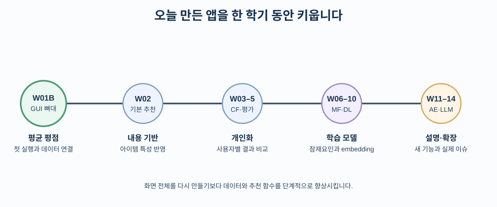
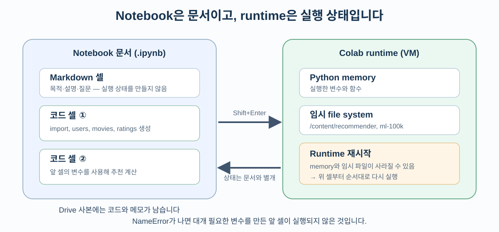
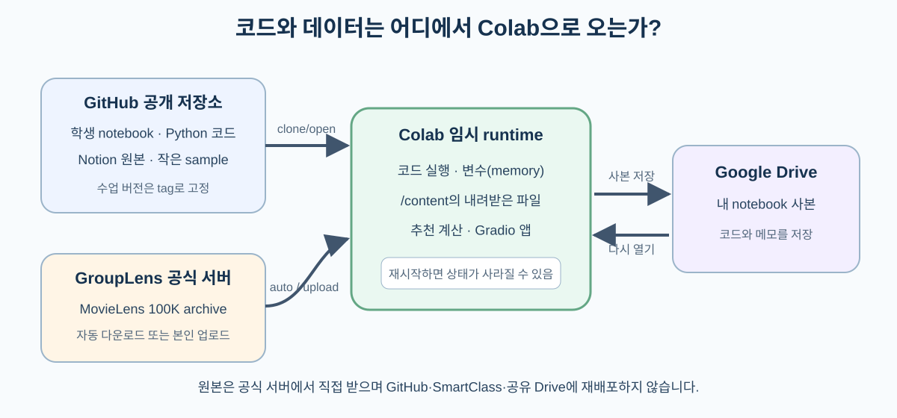
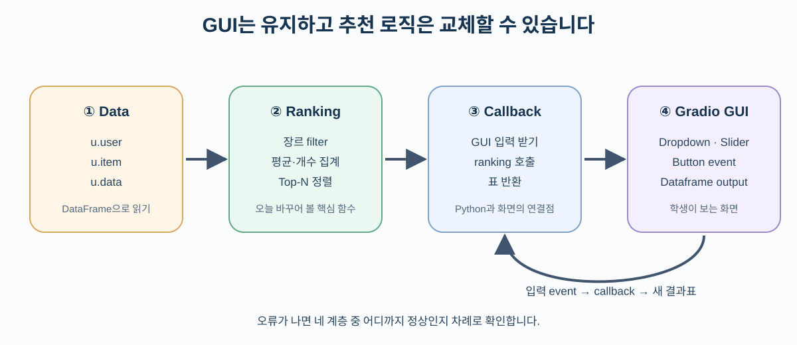

# W01B · Colab 환경 구축과 첫 추천 앱

> 딥러닝응용I(추천시스템) · 동덕여자대학교 데이터사이언스전공 · 유원상 교수 · 2026-2 · 2026년 9월 3일

## 오늘의 완성 모습

오늘은 GitHub에 있는 수업 notebook을 Google Colab에서 열고, 공식 다운로드·검증된 수동 업로드·synthetic sample 중 한 방법으로 데이터를 준비한 뒤, 조건을 바꾸어 추천 영화를 확인하는 작은 웹 애플리케이션을 실행합니다.

앱에는 세 가지 입력이 있습니다.

- 장르: 전체 또는 특정 영화 장르
- 최소 평점 수: 추천 후보가 되기 위해 필요한 평점 개수
- 추천 개수: 화면에 표시할 영화 수, 즉 Top-N

버튼을 누르면 영화 제목, 평균 평점, 평점 수가 표로 나타납니다. 오늘의 추천은 아직 사용자마다 달라지지 않는 간단한 baseline입니다. 이후 수업에서는 같은 화면 안의 추천 함수를 더 정교한 알고리즘으로 바꾸어 갑니다.



## 학습목표

수업을 마치면 다음을 할 수 있습니다.

1. GitHub의 학생용 notebook을 Colab에서 열고 Drive 사본을 만든다.
2. Colab의 Markdown 셀, 코드 셀, runtime, 임시 파일의 차이를 설명한다.
3. MovieLens 100K의 `u.user`, `u.item`, `u.data`를 DataFrame으로 읽는다.
4. 영화별 평균 평점과 평점 수로 첫 추천 목록을 만든다.
5. 추천 함수를 Gradio 입력·버튼·결과표에 연결해 웹 앱을 실행한다.

## 75분 수업 흐름

| 구간 | 시간 | 결과 |
|---|---:|---|
| 오늘의 앱 미리보기 | 5분 | 앞으로 만들 결과를 먼저 확인한다. |
| Colab 준비 | 10분 | notebook 사본을 만들고 셀을 실행한다. |
| GitHub 연결 | 8분 | 공개 저장소를 runtime에 clone한다. |
| 데이터 연결 | 10분 | 공식 archive를 내려받고 검증한다. |
| 세 파일 읽기 | 12분 | 사용자·영화·평점 표를 확인한다. |
| 첫 추천 함수 | 11분 | 평균 평점 baseline을 만든다. |
| Gradio 웹 앱 | 12분 | GUI와 callback을 연결한다. |
| 활동과 정리 | 7분 | 조건을 바꾸고 결과를 해석한다. |

# Part 1. GitHub notebook을 Colab에서 실행하기

## 1. 준비물 확인

다음 세 가지를 준비합니다.

- Google 계정에 로그인할 수 있는 최신 Chrome, Firefox 또는 Safari
- 수업 중 사용할 개인 Drive 공간
- 코드를 틀려도 다시 실행해 볼 마음

로컬 PC에 Python이나 Anaconda를 설치할 필요는 없습니다. Colab은 브라우저에서 사용하는 hosted Jupyter Notebook 환경입니다. 무료 runtime의 자원과 사용 시간은 고정적으로 보장되지 않으므로, 중요한 코드는 Drive의 notebook 사본에 저장해야 합니다.

## 2. 학생용 notebook 열기

1. [W01B 학생용 Colab 열기](https://colab.research.google.com/github/lunalab-ai/recommender/blob/2026-fall-w01b/notebooks/student/w01b-colab-and-first-recommender-app.ipynb)를 새 탭에서 엽니다.
2. 상단에 GitHub 원본을 보고 있다는 안내가 나타나면 `드라이브로 복사`를 누릅니다.
3. 복사된 notebook의 제목 앞에 자신의 학번이나 이름을 붙입니다.
4. `파일 → 드라이브에 사본 저장`이 가능한지 확인합니다.
5. 오른쪽 위의 `연결`을 눌러 runtime을 시작합니다.

링크가 열리지 않으면 다음 순서로 복구합니다.

1. [학생용 GitHub 저장소](https://github.com/lunalab-ai/recommender)를 엽니다.
2. `notebooks/student/` 폴더에서 `w01b-colab-and-first-recommender-app.ipynb`를 선택합니다.
3. notebook 위쪽의 `Open in Colab` 링크를 누르거나, Colab에서 `파일 → 노트 업로드`를 선택합니다.

## 3. Markdown 셀과 코드 셀

Notebook은 설명과 실행 코드를 함께 담는 문서입니다.

| 구분 | 눈에 보이는 내용 | 실행 결과 |
|---|---|---|
| Markdown 셀 | 제목, 설명, 표, 질문 | 설명을 읽기 좋게 표시한다. |
| 코드 셀 | Python 코드 또는 `%`, `!` 명령 | runtime에서 계산하고 결과를 만든다. |

코드 셀 왼쪽의 실행 버튼을 누르거나 `Shift+Enter`를 사용합니다. 실행 중에는 원이 돌고, 끝나면 대괄호 안에 실행 순서가 표시됩니다.



코드 셀은 가능한 한 위에서 아래로 실행합니다. 앞 셀이 만든 변수를 뒤 셀이 사용하기 때문입니다. `NameError`가 나오면 오타를 찾기 전에 필요한 변수를 만든 앞 셀이 실행되었는지 먼저 확인합니다.

## 4. 첫 환경 확인 셀

다음 셀은 Python 버전과 현재 작업 폴더를 확인합니다.

```python
from pathlib import Path
import platform

print("Python:", platform.python_version())
print("현재 폴더:", Path.cwd())
```

코드를 한 줄씩 읽어 봅시다.

- `from pathlib import Path`: 파일 경로를 다루는 `Path`를 가져옵니다.
- `import platform`: 실행 환경 정보를 확인하는 표준 library를 가져옵니다.
- `Path.cwd()`: 현재 작업 폴더(current working directory)를 반환합니다.
- `print(...)`: 괄호 안의 값을 셀 아래에 출력합니다.

Colab의 기본 작업 폴더는 보통 `/content`입니다. 이것은 자신의 Windows `C:` 드라이브나 Google Drive 폴더가 아닙니다.

## 5. GitHub 저장소 clone

GitHub repository는 코드와 문서의 버전 기록을 보관하는 원격 공간입니다. `git clone`은 그 repository의 사본을 현재 runtime으로 내려받습니다.

```python
from pathlib import Path
import subprocess

REPO_URL = "https://github.com/lunalab-ai/recommender.git"
repo_dir = Path("/content/recommender")

if repo_dir.exists():
    print("이미 clone되어 있습니다:", repo_dir)
else:
    subprocess.run(
        ["git", "clone", "--depth", "1", REPO_URL, str(repo_dir)],
        check=True,
    )

print("저장소 파일 예:", sorted(path.name for path in repo_dir.iterdir()))
```

핵심 문법은 다음과 같습니다.

- `REPO_URL = ...`: 주소를 변수에 저장합니다. 이후에는 긴 주소 대신 변수 이름을 씁니다.
- `Path("/content/recommender")`: clone될 폴더를 나타냅니다.
- `if ... else ...`: 조건에 따라 둘 중 한 코드 묶음만 실행합니다.
- `subprocess.run([...], check=True)`: 목록에 적힌 외부 명령을 실행하고 실패하면 오류를 냅니다.
- `--depth 1`: 오늘 확인하는 최신 상태만 받아 다운로드 양을 줄입니다.

셀을 다시 실행했을 때 “already exists” 오류가 나지 않도록 폴더가 있는지 먼저 확인합니다. 수업 중에는 repository를 삭제하지 않습니다. 깨끗하게 다시 시작하려면 `런타임 → 런타임 다시 시작` 후 위에서부터 실행합니다.



# Part 2. MovieLens 100K 연결하기

## 6. 왜 데이터를 GitHub에 같이 넣지 않는가

이번 실습은 GroupLens Research가 배포하는 MovieLens 100K를 사용합니다. 공식 README에 따르면 이 데이터는 943명의 사용자가 1,682개 영화에 남긴 100,000개의 1–5점 평점으로 구성됩니다.

이 구버전 데이터의 사용 조건은 연구 목적 사용, 출처 표기, 비상업적 사용과 별도 허가 없는 재배포 금지를 포함합니다. 그래서 수업 저장소나 Notion ZIP에 원본 파일을 넣지 않습니다. 학생의 Colab runtime이 [GroupLens 공식 페이지](https://grouplens.org/datasets/movielens/100k/)에서 직접 받거나, 학생이 공식 페이지에서 직접 받은 ZIP을 자기 runtime에 올립니다.

> 데이터 윤리: 사용자 ID는 실제 이름 대신 숫자로 표현되지만 `u.user`에는 나이, 성별, 직업, 우편번호가 있습니다. 오늘은 파일 구조 확인에만 사용합니다. 개인을 재식별하려고 시도하거나 인구통계 집단에 대한 고정관념을 만드는 근거로 사용하지 않습니다.

## 7. 앱 library 준비

Colab에는 많은 data-science library가 미리 있지만 버전은 바뀔 수 있습니다. 다음 셀은 오늘 사용하는 Gradio 범위를 명시합니다.

```python
import subprocess
import sys

subprocess.run(
    [sys.executable, "-m", "pip", "install", "-q", "gradio>=5,<7"],
    check=True,
)
```

- `sys.executable`: 현재 notebook을 실행하는 Python을 뜻합니다.
- `-m pip install`: 바로 그 Python 환경에 package를 설치합니다.
- `-q`: 설치 로그를 짧게 표시합니다.
- `gradio>=5,<7`: 이 수업에서 확인한 major version 범위를 사용합니다.

설치 직후 import 오류가 계속되면 `런타임 → 세션 다시 시작` 후 셀을 위에서부터 다시 실행합니다.

## 8. 데이터 준비 모드와 checksum 확인

먼저 `DATA_MODE`에서 한 가지 방법을 선택합니다.

| 값 | 동작 | 언제 선택하는가 |
|---|---|---|
| `"auto"` | 공식 URL 다운로드 시도 → 실패하면 synthetic으로 자동 전환 | 기본값, 가장 빠르게 수업을 시작할 때 |
| `"upload"` | 학생이 직접 받은 `ml-100k.zip`을 Colab에 업로드 | 실제 100K 전체 데이터가 이미 있을 때 |
| `"synthetic"` | 저장소의 CC0 가상 데이터 사용 | 네트워크 없이 코드 구조부터 연습할 때 |

`upload`를 사용하려면 [GroupLens 공식 페이지](https://grouplens.org/datasets/movielens/100k/)에서 `ml-100k.zip`을 본인 컴퓨터로 먼저 받습니다. 브라우저가 보안 경고를 표시하면 경고를 우회하지 말고 `synthetic`을 선택합니다. 파일명은 `ml-100k.zip`으로 유지합니다.

> `upload`는 `런타임 → 모두 실행` 도중 파일 선택을 기다립니다. 파일 선택 창에서 `ml-100k.zip` 한 개를 고르고 업로드가 끝날 때까지 기다리세요.

아래 셀은 자동 다운로드와 수동 업로드에 똑같은 검사를 적용합니다. MD5 checksum을 공식값과 비교하고, 오늘 필요한 세 파일이 각각 한 번씩 있는지 확인한 뒤 `/content/data/ml-100k`에 풉니다.

```python
from pathlib import Path
import hashlib
import shutil
import tempfile
import urllib.error
import urllib.request
import zipfile

DATA_MODE = "auto"  # "auto", "upload", "synthetic" 중 하나
if DATA_MODE not in {"auto", "upload", "synthetic"}:
    raise ValueError("DATA_MODE 값을 auto, upload, synthetic 중에서 고르세요.")
DATA_URL = "https://files.grouplens.org/datasets/movielens/ml-100k.zip"
EXPECTED_MD5 = "0e33842e24a9c977be4e0107933c0723"
NEEDED_FILES = ("u.user", "u.item", "u.data")

def has_lesson_files(path):
    return all((path / name).is_file() for name in NEEDED_FILES)

def extract_verified_archive(archive_path, root):
    actual_md5 = hashlib.md5(
        archive_path.read_bytes(), usedforsecurity=False
    ).hexdigest()
    if actual_md5 != EXPECTED_MD5:
        raise ValueError(f"checksum 불일치: {actual_md5}")

    expected_members = {f"ml-100k/{name}" for name in NEEDED_FILES}
    data_dir = root / "ml-100k"
    with zipfile.ZipFile(archive_path) as archive:
        names = archive.namelist()
        missing = expected_members.difference(names)
        if missing:
            raise ValueError(f"필요한 파일이 없습니다: {sorted(missing)}")
        duplicates = [name for name in expected_members if names.count(name) != 1]
        if duplicates:
            raise ValueError(f"중복 파일이 있습니다: {duplicates}")

        data_dir.mkdir(parents=True, exist_ok=True)
        for member in sorted(expected_members):
            with archive.open(member) as source:
                with (data_dir / Path(member).name).open("wb") as output:
                    shutil.copyfileobj(source, output)
    return data_dir

def download_movielens_data(root):
    data_dir = root / "ml-100k"
    if has_lesson_files(data_dir):
        return data_dir
    root.mkdir(parents=True, exist_ok=True)
    data_dir.mkdir(parents=True, exist_ok=True)
    with tempfile.NamedTemporaryFile(dir=root, suffix=".zip", delete=False) as temp_file:
        archive_path = Path(temp_file.name)
    try:
        with urllib.request.urlopen(DATA_URL, timeout=60) as response:
            with archive_path.open("wb") as output:
                shutil.copyfileobj(response, output)
        return extract_verified_archive(archive_path, root)
    finally:
        archive_path.unlink(missing_ok=True)

def upload_movielens_data(root):
    from google.colab import files

    print("ml-100k.zip 한 개만 선택하세요.")
    uploaded = files.upload()
    if set(uploaded) != {"ml-100k.zip"}:
        raise ValueError("파일명을 확인하고 ml-100k.zip 한 개만 다시 올리세요.")
    archive_path = Path("ml-100k.zip")
    archive_path.write_bytes(uploaded["ml-100k.zip"])
    try:
        return extract_verified_archive(archive_path, root)
    finally:
        archive_path.unlink(missing_ok=True)

def write_generated_synthetic_data(path):
    path.mkdir(parents=True, exist_ok=True)
    occupations = [
        "student", "student", "engineer", "artist", "scientist",
        "writer", "educator", "programmer", "designer", "researcher",
    ]
    user_lines = [
        f"{uid}|{19 + uid}|{'F' if uid % 2 else 'M'}|{job}|00000"
        for uid, job in enumerate(occupations, start=1)
    ]

    genres = [
        "unknown", "Action", "Adventure", "Animation", "Children's", "Comedy",
        "Crime", "Documentary", "Drama", "Fantasy", "Film-Noir", "Horror",
        "Musical", "Mystery", "Romance", "Sci-Fi", "Thriller", "War", "Western",
    ]
    movie_specs = [
        ("Starlight Library", "Drama"), ("Robot's Day", "Sci-Fi"),
        ("Summer Recipe", "Romance"), ("Data Detective", "Mystery"),
        ("Concert Across Sea", "Musical"), ("Friends on Tiny Planet", "Animation"),
        ("Last Algorithm", "Thriller"), ("Alley Camera", "Documentary"),
        ("Train Above Clouds", "Fantasy"), ("Midnight Comedy", "Comedy"),
        ("Green City", "Documentary"), ("Map of Memory", "Drama"),
    ]
    item_lines = []
    for movie_id, (title, genre) in enumerate(movie_specs, start=1):
        flags = ["1" if name == genre else "0" for name in genres]
        fields = [str(movie_id), f"{title} (2026)", f"{movie_id:02d}-Jan-2026", "", "", *flags]
        item_lines.append("|".join(fields))

    rating_lines = []
    timestamp = 1
    for user_id in range(1, 11):
        for offset in range(6):
            movie_id = ((user_id - 1 + 2 * offset) % 12) + 1
            rating = 3 + ((user_id + movie_id + offset) % 3)
            rating_lines.append(f"{user_id}\t{movie_id}\t{rating}\t{timestamp}")
            timestamp += 1

    (path / "u.user").write_text("\n".join(user_lines) + "\n", encoding="latin-1")
    (path / "u.item").write_text("\n".join(item_lines) + "\n", encoding="latin-1")
    (path / "u.data").write_text("\n".join(rating_lines) + "\n", encoding="latin-1")
    return path

def synthetic_data_dir(root):
    bundled = repo_dir / "data" / "sample" / "ml100k_tiny"
    if has_lesson_files(bundled):
        return bundled, "bundled-synthetic"
    generated = write_generated_synthetic_data(root / "ml100k_tiny_generated")
    print("저장소 sample이 없어 notebook 내장 규칙으로 synthetic 데이터를 만들었습니다.")
    return generated, "generated-synthetic"

root = Path("/content/data")
if DATA_MODE == "upload":
    data_dir = upload_movielens_data(root)
    DATASET_KIND = "official"
    DATA_SOURCE = "manual-upload"
elif DATA_MODE == "synthetic":
    data_dir, synthetic_source = synthetic_data_dir(root)
    DATASET_KIND = "synthetic-fallback"
    DATA_SOURCE = f"selected-{synthetic_source}"
else:
    try:
        data_dir = download_movielens_data(root)
        DATASET_KIND = "official"
        DATA_SOURCE = "official-download-or-cache"
    except (urllib.error.URLError, TimeoutError, ValueError, zipfile.BadZipFile) as error:
        data_dir, synthetic_source = synthetic_data_dir(root)
        DATASET_KIND = "synthetic-fallback"
        DATA_SOURCE = f"automatic-{synthetic_source}-fallback"
        print("공식 서버에 안전하게 연결하지 못해 synthetic fallback을 사용합니다.")
        print("원인:", error)

print("데이터 종류:", DATASET_KIND)
print("데이터 출처:", DATA_SOURCE)
print([path.name for path in sorted(data_dir.iterdir())])
```

긴 셀이지만 핵심은 네 단계입니다.

1. `DATA_MODE`로 자동 다운로드, 수동 업로드 또는 synthetic을 고릅니다.
2. 공식 ZIP bytes의 checksum이 예상값과 같은지 확인합니다.
3. ZIP 전체가 아니라 허용한 세 파일만 추출합니다.
4. 임시 다운로드 파일이나 업로드 ZIP을 runtime에서 지웁니다.

마지막 출력은 `['u.data', 'u.item', 'u.user']`여야 합니다. 전체 데이터를 쓰려면 `데이터 종류: official`, 직접 올렸다면 `데이터 출처: manual-upload`도 확인합니다.

### 다운로드 오류 복구

| 마지막 오류 | 먼저 확인할 것 | 복구 |
|---|---|---|
| `URLError`, `TimeoutError` | 인터넷과 GroupLens 접속 | `synthetic-fallback`으로 전환되었는지 확인 |
| `checksum 불일치` | 다운로드가 불완전하거나 올린 파일이 공식 ZIP과 다른지 | 파일을 사용하지 말고 공식 출처와 파일명을 다시 확인 |
| 업로드 창에서 대기 | `DATA_MODE == "upload"`인지 | `ml-100k.zip` 한 개를 선택하고 완료될 때까지 대기 |
| 업로드 파일명 오류 | ZIP 이름과 선택 개수 | 파일명을 `ml-100k.zip`으로 고치고 한 개만 선택 |
| 저장소 sample 없음 | 아직 W01B가 공개 저장소에 반영되지 않았는지 | notebook이 `ml100k_tiny_generated`를 만들었는지 출력 확인 |
| `BadZipFile` | ZIP이 정상적으로 끝까지 받았는지 | runtime을 다시 시작하고 다운로드 셀 재실행 |

2026년 9월 3일 로컬 사전 검증에서는 `files.grouplens.org`의 TLS 인증서 만료가 확인되었습니다. 인증서 검증을 끄거나 출처가 불명확한 제3자 mirror를 사용하는 것은 안전하지 않습니다. `auto`는 안전한 연결이 실패하면 GitHub의 `data/sample/ml100k_tiny/`로 자동 전환합니다. 아직 그 폴더가 공개 저장소에 없으면 notebook이 같은 크기와 형식의 synthetic 데이터를 직접 만듭니다. 전체 ZIP을 이미 안전하게 받았다면 `upload`, 네트워크 없이 계속하려면 `synthetic`을 선택합니다.

Synthetic fallback은 실제 MovieLens에서 추출하거나 변환한 데이터가 아니라 같은 세 파일 형식을 연습하도록 만든 CC0 데이터입니다. MovieLens 원본 ZIP은 GitHub, Notion ZIP, SmartClass 또는 교수자 공유 Drive에 올리지 않습니다. 수업 화면에서는 `데이터 종류`와 `데이터 출처`를 함께 확인합니다.

## 9. 세 파일을 DataFrame으로 읽기

먼저 `pandas`를 가져오고 열 이름을 준비합니다.

```python
import pandas as pd

USER_COLUMNS = ["user_id", "age", "sex", "occupation", "zip_code"]
GENRES = [
    "unknown", "Action", "Adventure", "Animation", "Children's", "Comedy",
    "Crime", "Documentary", "Drama", "Fantasy", "Film-Noir", "Horror",
    "Musical", "Mystery", "Romance", "Sci-Fi", "Thriller", "War", "Western",
]
ITEM_COLUMNS = [
    "movie_id", "title", "release_date", "video_release_date", "imdb_url",
    *GENRES,
]
RATING_COLUMNS = ["user_id", "movie_id", "rating", "timestamp"]
```

`list`는 순서가 있는 값의 묶음입니다. `*GENRES`는 장르 목록의 각 값을 `ITEM_COLUMNS` 안에 펼칩니다.

이제 파일마다 다른 구분자를 지정합니다.

```python
users = pd.read_csv(
    data_dir / "u.user",
    sep="|",
    names=USER_COLUMNS,
    encoding="latin-1",
)

movies = pd.read_csv(
    data_dir / "u.item",
    sep="|",
    names=ITEM_COLUMNS,
    encoding="latin-1",
)

ratings = pd.read_csv(
    data_dir / "u.data",
    sep="\t",
    names=RATING_COLUMNS,
    encoding="latin-1",
)
```

인자의 의미를 비교합니다.

| 인자 | 의미 | 오늘의 값 |
|---|---|---|
| 첫 번째 값 | 읽을 파일 경로 | `data_dir / "u.user"` 등 |
| `sep` | 한 줄의 열을 나누는 문자 | `u.user`, `u.item`은 `|`; `u.data`는 tab `\t` |
| `names` | header가 없는 파일에 붙일 열 이름 | 위에서 만든 세 목록 |
| `encoding` | bytes를 문자로 해석하는 규칙 | `latin-1` |

잘못된 `sep`를 사용하면 오류가 나지 않더라도 모든 값이 한 열에 들어갈 수 있습니다. 그래서 읽은 직후 shape와 열 이름을 확인해야 합니다.

```python
print("users:", users.shape, users.columns.tolist())
print("movies:", movies.shape)
print("ratings:", ratings.shape, ratings.columns.tolist())
```

공식 데이터의 예상 결과는 다음과 같습니다.

- `users`: `(943, 5)`
- `movies`: `(1682, 24)`
- `ratings`: `(100000, 4)`

Synthetic fallback에서는 `(10, 5)`, `(12, 24)`, `(60, 4)`가 표시됩니다. 크기는 다르지만 열, 구분자와 이후 함수의 입력 구조는 같습니다.

개별 사용자의 우편번호는 화면에 출력하지 않고 필요한 구조만 확인합니다.

```python
display(users[["user_id", "age", "sex", "occupation"]].head(3))
display(movies[["movie_id", "title", "release_date"]].head(3))
display(ratings.head(3))
```

한 평점 행에서 `user_id=196`, `movie_id=242`, `rating=3`이라면 196번 사용자가 242번 영화에 3점을 주었다는 뜻입니다. `timestamp`는 평가 시점을 숫자로 기록한 값이며 오늘의 추천에는 사용하지 않습니다.

## 10. 데이터 무결성 점검

코드가 실행되었다는 사실과 데이터가 올바르다는 사실은 다릅니다. 다음 조건을 확인합니다.

```python
expected_sizes = (943, 1682, 100000) if DATASET_KIND == "official" else (10, 12, 60)
assert (len(users), len(movies), len(ratings)) == expected_sizes
assert ratings["rating"].between(1, 5).all()
assert ratings["user_id"].isin(users["user_id"]).all()
assert ratings["movie_id"].isin(movies["movie_id"]).all()

print("데이터 크기, 평점 범위, ID 연결 검사를 통과했습니다.")
```

- `assert 조건`: 조건이 거짓이면 즉시 멈춥니다.
- `.between(1, 5)`: 각 평점이 범위 안인지 확인합니다.
- `.isin(...)`: rating의 ID가 사용자 또는 영화 표에 실제로 있는지 확인합니다.
- `.all()`: 모든 행이 조건을 만족하는지 하나의 `True`/`False`로 줄입니다.

# Part 3. 첫 추천 함수 만들기

## 11. 영화별 평균과 평점 수

`ratings`에는 영화 제목이 없고 `movies`에는 개별 평점이 없습니다. 먼저 평점을 영화별로 묶고, 그 결과를 영화 표와 연결합니다.

```python
movie_stats = (
    ratings.groupby("movie_id", as_index=False)["rating"]
    .agg(rating_count="count", mean_rating="mean")
    .merge(movies[["movie_id", "title", *GENRES]], on="movie_id", how="inner")
)

display(movie_stats.head())
```

괄호 안에서 줄을 나누어 쓴 것을 method chain이라고 합니다.

1. `groupby("movie_id")`: 같은 영화를 평가한 행끼리 묶습니다.
2. `.agg(...)`: 각 묶음의 평점 개수와 평균을 계산합니다.
3. `.merge(...)`: 같은 `movie_id`를 기준으로 제목과 장르를 붙입니다.

## 12. 왜 최소 평점 수가 필요한가

평균이 5.0인 영화가 두 편 있다고 생각해 봅시다.

- A 영화: 1명이 5점을 줌
- B 영화: 100명이 평균 5점을 줌

두 평균은 같지만 관찰한 정보의 양은 크게 다릅니다. 오늘은 복잡한 통계 보정을 배우지 않고, 일정 수 이상의 평점을 받은 영화만 후보로 남겨 이 차이를 눈으로 확인합니다.

## 13. 추천 함수

```python
def recommend_movies(genre="전체", min_ratings=50, top_n=10):
    candidates = movie_stats.copy()

    if genre != "전체":
        candidates = candidates.loc[candidates[genre].eq(1)]

    candidates = candidates.loc[candidates["rating_count"] >= min_ratings]

    ranked = candidates.sort_values(
        ["mean_rating", "rating_count", "title", "movie_id"],
        ascending=[False, False, True, True],
        kind="mergesort",
    ).head(top_n)

    result = ranked[["movie_id", "title", "mean_rating", "rating_count"]].copy()
    result["mean_rating"] = result["mean_rating"].round(3)
    return result.reset_index(drop=True)
```

함수를 위에서 아래로 읽어 봅시다.

- `def`: 여러 번 사용할 작업에 이름을 붙입니다.
- 매개변수의 `=50`, `=10`: 값을 생략했을 때 사용할 기본값입니다.
- `.copy()`: 원래 `movie_stats`를 바꾸지 않는 별도 표를 만듭니다.
- `.loc[조건]`: 조건이 참인 행만 고릅니다.
- `sort_values`: 평균, 평점 수, 제목, ID 순서로 결정적으로 정렬합니다.
- `.head(top_n)`: 앞에서부터 필요한 개수만 남깁니다.
- `return`: 호출한 곳으로 결과를 돌려줍니다.

```python
DEFAULT_MIN_RATINGS = 50 if DATASET_KIND == "official" else 3
MAX_MIN_RATINGS = 200 if DATASET_KIND == "official" else 5
recommend_movies(genre="전체", min_ratings=DEFAULT_MIN_RATINGS, top_n=10)
```

### 예측 활동

실행 전에 예상하고 실제 결과와 비교합니다.

1. `min_ratings`를 1로 낮추면 평균 5.0인 영화가 더 많이 나타날까요?
2. `min_ratings`를 100으로 높이면 후보 영화 수는 늘어날까요, 줄어들까요?
3. `genre="Comedy"`이면 장르 열의 어떤 값이 1인 영화만 남을까요?

# Part 4. 추천 함수를 웹 앱에 연결하기

## 14. 앱의 네 계층



오늘 앱은 다음처럼 나눕니다.

1. Data: 세 파일을 DataFrame으로 읽는다.
2. Ranking: 조건에 맞는 영화를 정렬한다.
3. Callback: GUI 값을 추천 함수에 전달하고 표시할 표를 반환한다.
4. GUI: 입력 component, 버튼과 출력 component를 배치한다.

이 구조를 사용하면 다음 수업에서 GUI 전체를 버리지 않고 ranking 함수만 개선할 수 있습니다.

## 15. Callback 만들기

```python
def recommend_for_app(genre, min_ratings, top_n):
    result = recommend_movies(
        genre=genre,
        min_ratings=int(min_ratings),
        top_n=int(top_n),
    )
    return result.rename(
        columns={
            "movie_id": "영화 ID",
            "title": "영화 제목",
            "mean_rating": "평균 평점",
            "rating_count": "평점 수",
        }
    )
```

Slider 값은 환경에 따라 숫자형 표현이 달라질 수 있어 `int(...)`로 정수 변환합니다. 내부 계산의 영문 열 이름은 유지하고, 화면에 보내기 직전에 한글 이름으로 바꿉니다.

GUI를 만들기 전에 callback만 직접 검사합니다.

```python
test_result = recommend_for_app("Comedy", DEFAULT_MIN_RATINGS, 5)
assert list(test_result.columns) == ["영화 ID", "영화 제목", "평균 평점", "평점 수"]
assert len(test_result) <= 5
display(test_result)
```

이 셀이 정상이어야 GUI 오류가 발생했을 때 추천 계산과 화면 문제를 구분할 수 있습니다.

## 16. Gradio GUI 만들기

```python
import gradio as gr

with gr.Blocks(title="LUNA 영화 추천 실험실", analytics_enabled=False) as demo:
    gr.Markdown(
        "# 🎬 LUNA 영화 추천 실험실\n"
        "장르와 조건을 선택해 평균 평점 기반 추천을 관찰하세요."
    )

    with gr.Row():
        genre_input = gr.Dropdown(
            choices=["전체", *GENRES[1:]],
            value="전체",
            label="장르",
        )
        min_ratings_input = gr.Slider(
            minimum=1,
            maximum=MAX_MIN_RATINGS,
            value=DEFAULT_MIN_RATINGS,
            step=1,
            label="최소 평점 수",
        )
        top_n_input = gr.Slider(
            minimum=1,
            maximum=20,
            value=10,
            step=1,
            label="추천 개수",
        )

    run_button = gr.Button("추천 영화 보기", variant="primary")
    result_output = gr.Dataframe(
        headers=["영화 ID", "영화 제목", "평균 평점", "평점 수"],
        interactive=False,
        label="추천 결과",
    )

    gr.Markdown("이 baseline은 아직 개인 취향을 반영하지 않습니다.")

    run_button.click(
        fn=recommend_for_app,
        inputs=[genre_input, min_ratings_input, top_n_input],
        outputs=result_output,
    )
```

- `Blocks`: 앱 전체를 담는 영역입니다.
- `Row`: 입력 component를 한 행에 배치합니다.
- `Dropdown`, `Slider`: 사용자가 callback에 전달할 값을 고릅니다.
- `Button`: 사용자가 계산을 요청하는 event를 만듭니다.
- `Dataframe`: callback이 반환한 표를 화면에 표시합니다.
- `.click(...)`: 버튼을 눌렀을 때 실행할 함수와 입출력을 연결합니다.

## 17. 앱 실행

```python
demo.launch(share=True, debug=False)
```

셀 아래에 앱이 나타나거나 `gradio.live`로 끝나는 링크가 나타납니다. 링크는 Colab runtime에서 실행 중인 앱으로 연결되는 임시 tunnel입니다.

- 영구적인 웹사이트가 아닙니다.
- runtime이 종료되면 작동하지 않습니다.
- 링크를 아는 사람이 접근할 수 있으므로 개인 정보나 비공개 데이터를 입력하지 않습니다.
- 오늘 앱은 고정된 Dropdown과 Slider만 사용하며 학생 입력을 저장하지 않습니다.

앱을 닫으려면 다음 셀을 사용합니다.

```python
demo.close()
```

### 앱 오류 진단 순서

1. `ratings`, `movies`, `movie_stats`가 만들어졌는가?
2. `recommend_movies(...)`를 직접 호출하면 표가 나오는가?
3. `recommend_for_app(...)`를 직접 호출하면 한글 열 이름이 나오는가?
4. Gradio component가 만들어졌는가?
5. `.click(...)`의 `inputs` 순서가 callback 매개변수 순서와 같은가?
6. 마지막으로 `launch`와 네트워크 상태를 확인한다.

화면이 열리지 않더라도 1–3번이 통과하면 추천 로직은 정상입니다. GUI 문제와 추천 계산 문제를 분리해서 설명할 수 있어야 합니다.

## 활동 1. 최소 평점 수 바꾸기

공식 데이터에서는 최소 평점 수를 1, 20, 50, 100으로 바꾸어 봅니다. Synthetic fallback이면 1, 2, 3, 5를 사용합니다.

| 최소 평점 수 | 눈에 띄는 변화 | 가능한 이유 |
|---:|---|---|
| 1 |  |  |
| 20 |  |  |
| 50 |  |  |
| 100 |  |  |

Fallback을 사용했다면 표의 20, 50, 100을 각각 2, 3, 5로 바꾸어 기록합니다.

다음 질문에 한 문장으로 답합니다.

- 조건이 커질수록 후보 수는 어떻게 변했는가?
- 평균 평점 상위 영화의 평점 수는 어떻게 달라졌는가?
- 어느 조건이 “정답”이라고 말할 수 있는가?

## 활동 2. Separator 디버깅

다음 코드는 일부러 잘못 작성했습니다.

```python
broken_ratings = pd.read_csv(
    data_dir / "u.data",
    sep="|",
    names=RATING_COLUMNS,
    encoding="latin-1",
)
print(broken_ratings.shape)
print("rating 열에서 읽힌 값 수:", broken_ratings["rating"].notna().sum())
display(broken_ratings.head())
```

`u.data`의 실제 구분자를 떠올려 한 줄만 고칩니다. 오류가 발생하지 않아도 shape와 첫 행이 이상할 수 있다는 점을 설명합니다.

## 활동 3. 앱 문구와 기본값 수정

다음 중 하나를 바꾸고 GUI를 다시 만듭니다.

- 버튼 문구를 `나의 첫 추천 실행`으로 변경
- 최소 평점 수 기본값을 100으로 변경
- 추천 개수 기본값을 5로 변경

이미 만들어진 `demo`를 수정하기보다 해당 GUI 셀을 고친 뒤 다시 실행합니다. 필요하면 먼저 `demo.close()`를 실행합니다.

## 오늘 앱의 한계

- 사용자 ID를 입력받지 않아 모든 사용자에게 같은 기준을 적용합니다.
- 평균 평점이 취향의 일치, 다양성, 새로움, 만족을 모두 의미하지 않습니다.
- 오래된 영화와 오래된 평점으로 구성된 교육용 benchmark입니다.
- 장르가 여러 개인 영화는 여러 장르 filter에 나타날 수 있습니다.
- 영구 hosting, 로그인, 데이터베이스와 사용자 입력 저장 기능이 없습니다.

이 한계는 실패가 아니라 다음 수업에서 개선할 목록입니다.

## 점검 퀴즈

1. GitHub repository와 Colab runtime은 각각 무엇을 보관하는가?
2. runtime을 다시 시작한 뒤 `ratings`가 사라지는 이유는 무엇인가?
3. MovieLens 100K 원본을 수업 GitHub에 넣지 않는 이유는 무엇인가?
4. `u.user`, `u.item`, `u.data`는 각각 무엇을 나타내는가?
5. `u.data`의 `sep="\t"`에서 `\t`는 무엇인가?
6. 평균 평점만 정렬할 때 평점 수가 매우 적은 영화가 문제가 될 수 있는 이유는 무엇인가?
7. `run_button.click`에서 callback, inputs, outputs는 어떤 순서로 연결되는가?
8. 오늘 앱이 개인화 추천이 아닌 이유는 무엇인가?

## Take-home message

- Notebook 문서와 runtime의 실행 상태는 서로 다르므로 코드를 순서대로 실행하고 중요한 변경은 Drive 사본에 저장한다.
- 공개 GitHub에는 코드와 설명을 두고, MovieLens 100K 원본은 사용 조건에 따라 공식 서버에서 runtime으로 직접 받는다.
- 데이터 파일을 읽은 직후 shape, 열 이름, 값 범위와 ID 연결을 확인한다.
- 평균 평점 baseline은 간단한 출발점이며 최소 평점 수에 따라 결과가 달라진다.
- 데이터, ranking, callback, GUI를 분리하면 이후 추천 알고리즘을 단계적으로 개선할 수 있다.

## 참고자료와 출처 구분

- MovieLens 100K 데이터와 사용 조건: [GroupLens 공식 데이터 페이지](https://grouplens.org/datasets/movielens/100k/)와 [공식 README](https://files.grouplens.org/datasets/movielens/ml-100k-README.txt)
- Colab runtime, notebook 공유와 GitHub 연동: [Google Colab FAQ](https://research.google.com/colaboratory/intl/en-GB/faq.html)
- Repository clone: [GitHub 공식 문서](https://docs.github.com/en/repositories/creating-and-managing-repositories/cloning-a-repository)
- Python 복습: [Python 한국어 자습서](https://docs.python.org/ko/3/tutorial/)의 3장과 4장
- pandas 보충: [pandas Getting started tutorials](https://pandas.pydata.org/docs/getting_started/intro_tutorials/index.html)의 표 읽기, 선택, 요약 통계
- Gradio 앱 구조: [Gradio Blocks 문서](https://www.gradio.app/docs/gradio/blocks)와 [share link 설명](https://www.gradio.app/guides/understanding-gradio-share-links)
- 교재 기반 범위: 임일, 『AI 에이전트를 위한 개인화 추천 알고리즘: Python, 머신러닝, AI, LLM 활용』, 도서출판청람, 2025, 2장, pp. 12–17
- 교재에서 가져온 것은 MovieLens 세 파일의 구조와 평균 평점 기반 추천의 출발점입니다. 최소 평점 수 비교, 앱 계층, 오류 진단, GUI와 활동은 수업을 위해 새로 구성했습니다.
- 이 페이지의 모든 도식과 코드는 수업을 위해 독자적으로 제작했으며 교재 페이지, 교재 코드 또는 서비스 화면을 복제하지 않았습니다.
