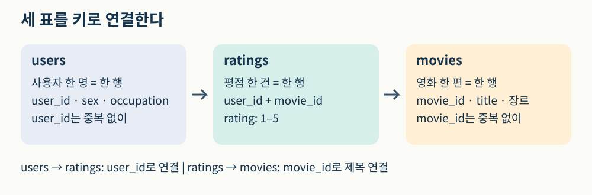
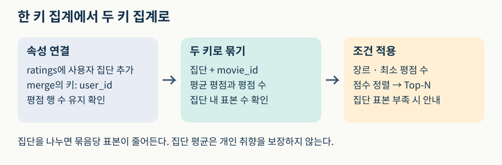
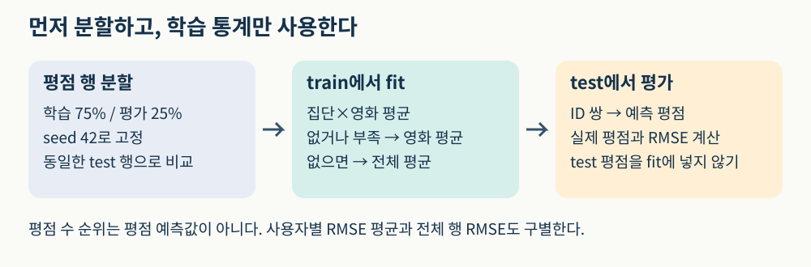
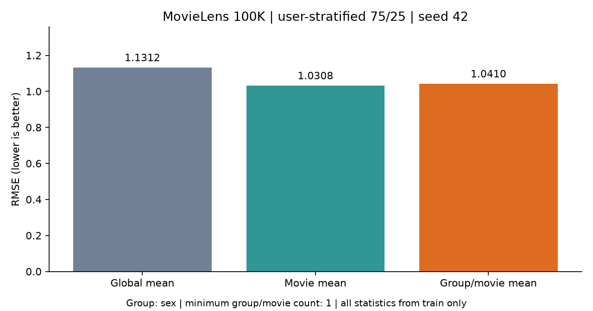

# W02A · 기본적인 추천 방법 (1)

**딥러닝응용I(추천시스템) · 동덕여자대학교 데이터사이언스전공 · 유원상 교수 · 2026년 2학기**

지난 수업에서는 MovieLens 데이터를 읽고 평균 평점으로 영화를 고르는 첫 앱을 만들었다. 이번에는 같은 앱에 서로 다른 추천 기준을 넣는다. **누가 많이 평가했는가, 평가한 사람은 얼마나 좋아했는가, 어떤 집단이 좋아했는가**는 서로 다른 질문이다.

## 학습목표

1. 사용자·영화·평점 표를 식별자로 연결한다.
2. 평점 수 순위와 평균 평점 순위를 구분하고 작은 표본의 영향을 설명한다.
3. 사용자 집단별 추천을 만들고 표본 부족 시 대체 기준을 해석한다.
4. 학습·평가 데이터를 분리하고 평점 예측 RMSE를 해석한다.
5. 기존 앱에 새 알고리즘을 연결하며 재사용 모듈의 역할을 설명한다.


그림 1. 같은 영화 목록도 집계 기준에 따라 달라진다. 수업을 위해 AI로 생성한 개념 그림이며 실제 MovieLens 관측값이나 성능 결과를 표현하지 않는다. 사람의 외형으로 집단이나 취향을 추정하는 모델도 아니다.

## 1. 데이터가 먼저다: 세 표를 연결하기

MovieLens 100K는 명시적 평점 데이터를 제공한다. 여기서 한 행은 “한 사용자가 한 영화에 남긴 평점”이다. 영화가 행이 되는 추천 결과 표와 구별하자.

| 파일 | 한 행의 의미 | 주요 열 | 읽을 때 주의 |
|---|---|---|---|
| `u.user` | 사용자 한 명 | `user_id`, `age`, `sex`, `occupation` | 세로선 구분자, 열 이름 별도 지정 |
| `u.item` | 영화 한 편 | `movie_id`, `title`, 장르 표시 | 세로선 구분자, `latin-1` 인코딩 |
| `u.data` | 사용자–영화 평점 | `user_id`, `movie_id`, `rating`, `timestamp` | 탭 구분자, 평점 1–5 |

이번 실습은 실제 MovieLens 100K를 기본으로 사용한다. 자동 준비 함수는 캐시를 재사용하거나 공식 서버에서 다운로드하며, 연결 실패 시 동일한 ZIP의 고정된 HTTPS 대체 경로를 사용한다. SHA-256과 MD5를 확인하고 파일 업로드 없이 세 표를 준비한다. `real` 모드는 모든 다운로드가 실패하면 원인을 표시하고 중단한다. **독자적으로 만든 합성 데이터**는 `synthetic` 모드를 직접 선택할 때 사용할 수 있으며, 그 결과를 실제 MovieLens 성능으로 보고해서는 안 된다.

```python
from luna_recsys import prepare_movielens

prepared = prepare_movielens()  # 자동 준비; 한 번 받은 파일은 재사용
dataset = prepared.data
users, movies, ratings = dataset.users, dataset.movies, dataset.ratings
print(prepared.description)
print(len(users), len(movies), len(ratings))
```

원본 MovieLens를 사용하면 세 표의 크기는 각각 943, 1,682, 100,000이다. 이 크기는 합성 데이터에는 적용하지 않는다. 파일 존재뿐 아니라 ID 중복, 평점 범위, 다른 표에 없는 ID도 확인해야 한다. 자동 로더는 이 연결 검사를 수행한다.



그림 2. `ratings`에 사용자 속성을 붙이면 집단별로 평점을 모을 수 있다. 영화 제목은 집계 후 `movie_id`로 붙이면 된다. 교재의 세 파일 구조를 바탕으로 독자적으로 구성한 도식이다.

`merge`는 공통 키로 다른 표의 열을 붙인다. 다음 코드는 평점마다 사용자 집단을 붙이며, 오른쪽의 사용자 ID가 하나씩만 있어야 한다는 조건까지 검사한다.

```python
joined = ratings.merge(
    users[["user_id", "sex", "occupation"]],
    on="user_id", how="left", validate="many_to_one",
)
```

`left`는 왼쪽의 평점 행을 유지한다. 연결된 속성이 비어 있다면 “그 집단이 없다”는 결론을 내리기 전에 키가 잘못되었는지 확인한다. 오른쪽 ID가 중복이면 평점 행이 늘어나 통계가 달라질 수 있다.

**생각해 보기:** 평점 표와 사용자 표를 `movie_id`로 연결하면 왜 문제가 생길까? 실습 notebook의 첫 디버깅 문제에서 잘못된 키를 고쳐 보자. 힌트는 두 표가 공통으로 갖는 열이다.

## 2. 인기 기반 추천: 많이 평가된 영화와 높은 평점의 영화

“인기”를 하나의 뜻으로 쓰면 혼동하기 쉽다. 평점 수는 참여량의 대리값이다. 이 데이터에는 평가하지 않은 모든 시청 기록이 없으므로 평점 수를 전체 관객 수로 단정하지 않는다.

| 기준 | 계산 | 장점 | 놓칠 수 있는 점 |
|---|---|---|---|
| 평점 수 | 영화별 관측 평점의 개수 | 많이 평가된 영화를 찾기 쉬움 | 혹평이 많아도 상위에 올 수 있음 |
| 평균 평점 | 영화별 평점 합 / 평점 수 | 평가자의 평균 선호를 반영 | 소수의 높은 점수가 상위를 차지할 수 있음 |

교재의 **인기제품 방식**(best-seller)은 영화별 **평균 평점**으로 순위를 만든다. 이 수업은 그 용어를 유지하면서 평점 수 순위를 비교 대상으로 추가한다.

독자적인 작은 예를 계산해 보자.

| 영화 | 관측 평점 | 평점 수 | 평균 평점 |
|---|---|---:|---:|
| A | 3, 3, 4, 4 | 4 | 3.5 |
| B | 5 | 1 | 5.0 |
| C | 4, 5 | 2 | 4.5 |

평점 수 기준에서는 A가 먼저이고 평균 평점 기준에서는 B가 먼저다. 최소 평점 수를 2로 정하면 B는 후보에서 빠진다. 최소 개수는 불확실성을 다루는 단순한 조건이며, 통계적 신뢰도나 품질을 보장하는 장치는 아니다.

### `groupby`를 읽는 방법

`groupby`는 같은 키를 모으고, 각 묶음에 집계 함수를 적용한다. `mean`은 평균, `count`는 결측이 아닌 평점 개수다. 결측이 있을 때 모든 행 수를 세는 `size`와 달라질 수 있다.

```python
movie_stats = ratings.groupby("movie_id")["rating"].agg(["mean", "count"])
```

먼저 후보 조건을 적용하고 정렬한 뒤 `head(top_n)`으로 필요한 개수만 고른다. 동점일 때의 추가 정렬 기준도 정해 두어야 같은 입력에서 같은 결과를 설명하기 쉽다.

```python
from luna_recsys.baselines import baseline_recommendations

popular = baseline_recommendations(
    ratings, movies, method="count", min_ratings=5, top_n=5,
)
```

**예측·비교 문제:** 최소 평점 수를 1에서 20으로 높이면 후보 수는 늘어날 수 있을까? notebook에서 먼저 예측을 적고 두 목록을 비교하자. 결과가 비어 있어도 함수 오류와 구별해야 한다.

## 3. 사용자 집단별 추천

전체 사용자 평균은 모두에게 같은 기준을 적용한다. 사용자 속성으로 집단을 나누면 같은 영화도 집단에 따라 평균이 달라질 수 있다. 교재는 성별 그룹을 설명하며, 이번 실습에서는 직업 그룹으로도 확장한다.

집단별 추천은 **집단 수준의 차이를 반영하는 방법**이다. 같은 집단의 두 사용자에게 서로 다른 취향이 있을 수 있다. 데이터의 `sex` 필드는 수집 당시의 범주이며 현재의 모든 정체성이나 개인 선호를 설명하지 않는다.

처리 순서는 다음과 같다.

1. 평점 표에 사용자 속성을 연결한다.
2. **집단과 영화의 두 키**로 묶는다.
3. 집단 안의 영화 평균과 평점 수를 계산한다.
4. 최소 평점 수, 장르, Top-N 조건을 적용한다.



그림 3. 집단을 더 세분화하면 각 묶음의 표본 수가 줄어든다. 이 도식은 집계 절차를 설명하는 수업용 재구성이다.

```python
group_list = baseline_recommendations(
    ratings, movies, method="group", users=users,
    group_col="occupation", group_value="student",
    min_ratings=5, top_n=5,
)
```

함수는 여러 차시가 함께 쓰는 `src/luna_recsys`에 있다. notebook은 같은 구현을 매번 복사하는 대신 입력과 조건을 바꾸며 실험한다. `basis` 열은 실제로 어떤 집단 또는 대체 기준을 썼는지 알려 준다.

### 표본이 부족하면 어떻게 할까?

현재 앱의 **추천 목록**은 선택 집단에서 조건을 만족하는 영화가 하나도 없으면 전체 사용자 평균 목록으로 전환하며 이를 표시한다. 이때 표시되는 평점 수 역시 전체 사용자 기준이다. 전체 목록도 조건을 충족하지 않으면 조건을 완화하라는 안내를 보여 준다.

뒤에서 사용할 **평점 예측**은 각각의 사용자–영화 쌍에 대해 다음 순서로 대체한다.

**충분한 집단×영화 평균 → 학습 데이터의 영화 평균 → 학습 데이터의 전체 평균**

교재 예시의 고정 평점 대체와 달리, 이 수업의 마지막 대체값은 학습 전체 평균이다. 이를 교재 원문과 같은 구현으로 취급하지 않는다. 작은 그룹을 과도하게 신뢰하지 않도록 최소 집단 평점 수도 바꿔 볼 수 있다.

**빈칸 채우기:** notebook의 별도 장난감 표에서 “지역×상품”의 두 키와 집계 함수를 완성하자. 목표는 특정 정답 코드를 외우는 것이 아니라 한 키 집계와 두 키 집계의 차이를 이해하는 것이다.

## 4. 기본 성능 평가: 예측하지 않은 평점으로 확인하기

좋아 보이는 목록이 나왔다고 성능이 확인된 것은 아니다. 이번에는 **이미 관측된 평점 일부를 가려 놓고 그 값을 예측**한다. 학습 데이터는 평균을 계산하는 데, 평가 데이터는 예측 오차를 계산하는 데 쓴다.



그림 4. 평가 평점이 평균 계산에 들어가면 데이터 누수가 생긴다. 사용자 속성 자체와 가린 평점값도 구별하자. 도식은 scikit-learn의 데이터 누수 지침과 이번 수업의 대체 규칙을 바탕으로 새로 작성했다.

### 같은 분할에서 세 가지 평점 예측을 비교한다

| 예측기 | 예측에 사용하는 학습 통계 |
|---|---|
| 전체 평균 | 모든 학습 평점의 평균 |
| 영화 평균 | 해당 영화의 학습 평점 평균, 없으면 학습 전체 평균 |
| 집단별 영화 평균 | 해당 집단·영화 평균, 부족하면 영화 평균, 마지막으로 전체 평균 |

```python
from luna_recsys import split_ratings, evaluate_means

split = split_ratings(ratings, test_size=0.25, seed=42)
scores = evaluate_means(split, users, group_col="sex")
```

기본은 사용자 비율을 고려한 학습 75%·평가 25% 분할이다. 고정 seed는 같은 데이터에서 분할을 재현하게 한다. 아주 작은 데이터에서 층화 조건을 만족하지 못하면 고정 seed의 단순 무작위 분할로 바뀌며 `split.method`가 이를 알려 준다.

이 분할은 관측 평점 행을 무작위로 나누는 입문 실험이다. 미래 행동을 예측하는 시간 순서 평가나 새 사용자 평가까지 검증한 것은 아니다.

### RMSE: 오차를 제곱하고, 평균 내고, 제곱근 취하기

```text
오차 = 실제 평점 - 예측 평점
MSE  = 각 오차의 제곱을 더한 값 / 평가한 평점 수
RMSE = MSE의 제곱근
```

독자적인 예로 실제 평점이 `[5, 2, 4]`, 예측값이 `[4, 2, 2]`라면 오차는 `[1, 0, 2]`다. 제곱 오차는 `[1, 0, 4]`이고 RMSE는 `sqrt(5/3) ≈ 1.291`이다. RMSE는 평점과 같은 단위로 읽으며 이 기준에서는 0에 가까울수록 좋다. 큰 오차가 제곱 때문에 더 크게 반영된다.

**주의:** 평점 수 120은 영화의 예상 평점 120점이 아니다. 따라서 평점 수 순위 점수를 그대로 실제 평점과 빼서 RMSE를 계산하지 않는다. 순위 품질을 직접 평가하는 지표는 후속 수업에서 다룬다.

교재의 전체 데이터 계산 예와 사용자별 RMSE를 평균하는 예를, 이번 수업의 holdout 전체 평가 행 RMSE와 동일한 수치로 비교하지 않는다. 사용자별 평가 수가 다르면 집계 방식도 달라진다.



그림 5. 보유 MovieLens 100K 사본, seed 42, 사용자 층화 75/25 분할, 성별 그룹·최소 집단 평점 수 1에서 실제 계산한 결과다. 자세한 수치는 함께 제공한 실습의 실행 결과와 비교한다. 막대는 이번 조건에서의 결과이며 집단별 방법의 개선을 보장하지 않는다. 원자료의 개별 행은 포함하지 않는다.

| 평점 예측 방법 | RMSE | 동일한 평가 행 수 |
|---|---:|---:|
| 전체 평균 | 1.1312 | 25,000 |
| 영화 평균 | 1.0308 | 25,000 |
| 집단별 영화 평균 | 1.0410 | 25,000 |

이번 조건에서는 영화 평균의 오차가 더 작다. 집단을 나누어 얻는 차이와 표본 감소를 함께 고려해야 한다. 합성 모드의 실습에서는 이 표와 다른 숫자가 나오는 것이 정상이다.

**오류 해결:** 전체 데이터로 평균을 먼저 계산한 뒤 학습·평가를 나눈 코드는 무엇이 잘못되었을까? notebook에서는 `train`만 `fit`에 넣도록 고치는 문제를 푼다.

## 5. 함수에서 클래스로: 다음 수업에도 사용할 코드

평균 계산처럼 **학습한 상태**를 여러 번 예측에 쓰면 클래스로 관리하기 편하다.

```python
from luna_recsys import MeanRatingPredictor

model = MeanRatingPredictor("group", group_col="occupation", min_group_ratings=2)
model.fit(split.train, users)
predictions = model.predict(split.test[["user_id", "movie_id"]])
```

- `__init__`: 사용할 기준과 최소 표본 조건을 정한다.
- `fit`: 전달받은 학습 데이터에서 통계를 계산해 보관한다.
- `predict`: 새 사용자–영화 쌍의 예측값을 반환한다. 정답 평점은 필요하지 않다.
- `predict_details`: 예측값과 실제 사용한 대체 수준을 함께 보여 준다.

단순한 변환까지 모두 클래스로 만들 필요는 없다. 데이터 준비·목록 정렬·분할 함수와 학습 상태를 가진 예측기를 구분한다. 구현과 API 안내는 [재사용 코드 안내](https://github.com/lunalab-ai/recommender/blob/main/src/luna_recsys/README.md)에 누적한다.

## 6. 앱을 누적 확장하기

| 기능 | 지난 수업 | 이번 수업 |
|---|---|---|
| 데이터 준비 | MovieLens와 합성 대안 | 자동 준비 함수로 재사용 |
| 추천 조건 | 장르·최소 평점 수·Top-N | 기존 조건 유지 |
| 알고리즘 | 평균 평점 | 평점 수·평균·집단별 평균 선택 |
| 결과 해석 | 영화 목록 | 평점 수와 집계 기준, 대체 안내 |
| 평가 | 다음 단계로 예고 | 같은 분할의 RMSE·대체 사용 건수 |
| 화면 | 첫 웹 앱 | 모바일 카드·추천/평가/기록 탭 |

```python
from luna_recsys.demo_app import build_baseline_lab

app = build_baseline_lab(dataset, data_mode=prepared.description)
app.launch(share=True)  # Colab에서 실행 후 표시되는 링크 사용
```

스마트폰에서는 완성 앱의 조건을 바꾸고 카드를 비교한다. 긴 표는 표 안을 가로로 이동해 본다. 코드 편집은 Colab 환경에서 진행한다. 공유 링크는 실행 중인 런타임으로 연결되므로 런타임을 끄면 앱을 계속 사용할 수 없다.

**앱 실험:** 같은 장르와 최소 평점 수를 유지하고 알고리즘만 바꾼다. 다음에는 집단만 바꾼다. 마지막에 평가 화면을 확인한다. 한 번에 하나의 조건을 바꿔야 결과 차이의 이유를 설명하기 쉽다.

## 점검 퀴즈

1. 평점 표에서 한 행은 무엇을 의미하는가?
2. 평점 수가 가장 많은 영화가 평균 평점도 가장 높다고 할 수 있는가?
3. 최소 평점 수 조건을 높이면 후보 수는 어떻게 변할 수 있는가?
4. 사용자 집단별 영화 평균에는 어떤 두 집계 키가 필요한가?
5. 평가 데이터를 포함해 영화 평균을 계산하면 왜 문제가 되는가?
6. 학습 데이터에 없는 영화의 평점을 이 수업의 모델은 어떻게 예측하는가?
7. 평점 수 순위 점수를 RMSE에 그대로 넣으면 안 되는 이유는 무엇인가?
8. 집단별 평균의 RMSE가 더 작으면 모든 사용자의 추천 만족도가 높아졌다고 말할 수 있는가?

별도 퀴즈 해설은 강의 PDF와 함께 제공한다. 실습의 빈칸·디버깅 문제는 notebook에서 직접 해결한다.

## 핵심 정리

- 데이터의 행·키·모드를 먼저 확인한다.
- 인기의 기준을 명시하고 평균과 표본 수를 함께 본다.
- 집단별 추천에는 표본 부족과 개인차가 남는다.
- 학습 통계로 가려 둔 평점을 예측하고 같은 평가 자료에서 비교한다.
- 재사용 모듈과 앱을 누적하면서 다음 수업의 내용 기반 추천으로 이어간다.

## 참고자료와 출처

- 임일, 『AI 에이전트를 위한 개인화 추천 알고리즘: Python, 머신러닝, AI, LLM 활용』, 청람, 2025, 2.2–2.4, pp.16–26. 인기제품·집단별 추천·RMSE의 수업 전개와 용어를 참고했다. 평점 수 비교, 대체 규칙, 앱과 연습 예는 수업용 추가 구성이다.
- [GroupLens MovieLens 100K](https://grouplens.org/datasets/movielens/100k/): 데이터 출처. [README](https://files.grouplens.org/datasets/movielens/ml-100k-README.txt)의 사용 조건을 따른다. 원자료를 수업 저장소에 재배포하지 않는다.
- [pandas: 요약 통계](https://pandas.pydata.org/docs/getting_started/intro_tutorials/06_calculate_statistics.html): `groupby`·평균·개수 집계 복습.
- [pandas: 표 결합](https://pandas.pydata.org/docs/getting_started/intro_tutorials/08_combine_dataframes.html): 공통 키와 `merge` 복습.
- [scikit-learn: 데이터 누수](https://scikit-learn.org/stable/common_pitfalls.html#data-leakage): 학습 통계와 평가값의 분리.
- [scikit-learn: RMSE](https://scikit-learn.org/stable/modules/generated/sklearn.metrics.root_mean_squared_error.html): 평점 예측 오차 계산 API.
- [Gradio: 화면 배치](https://gradio.app/guides/controlling-layout): 줄바꿈 가능한 열과 탭 구성.

시각자료는 수업을 위해 새로 제작했다. 개념 그림은 생성 이미지이며 도식과 성능 그래프는 재현 가능한 코드로 작성했다.
