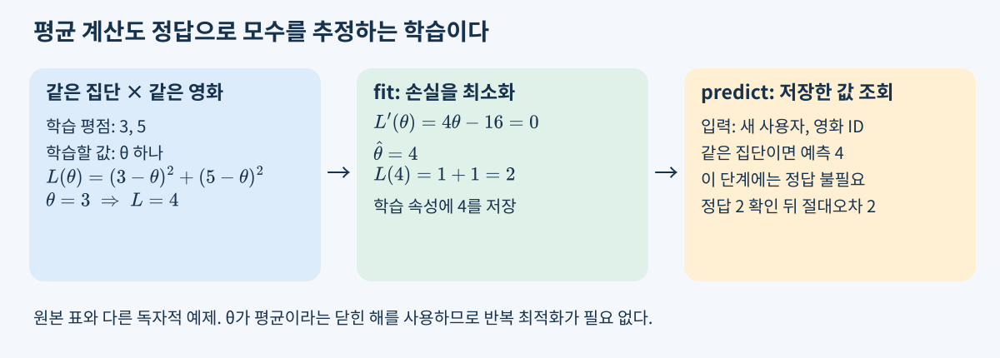
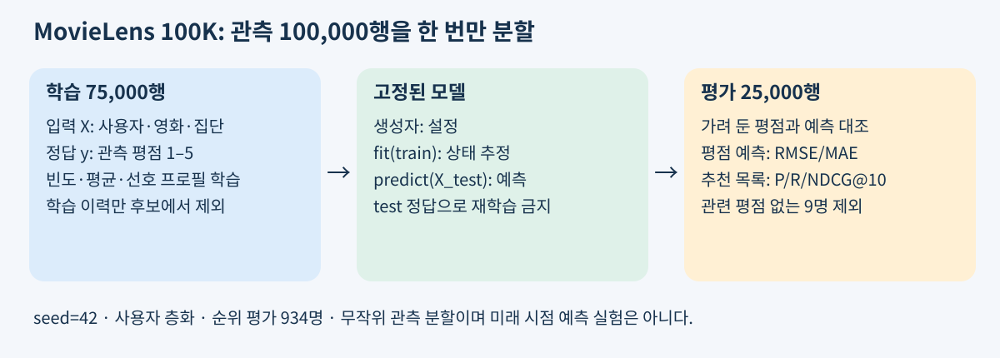
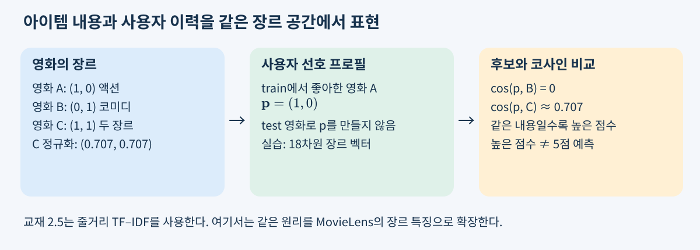
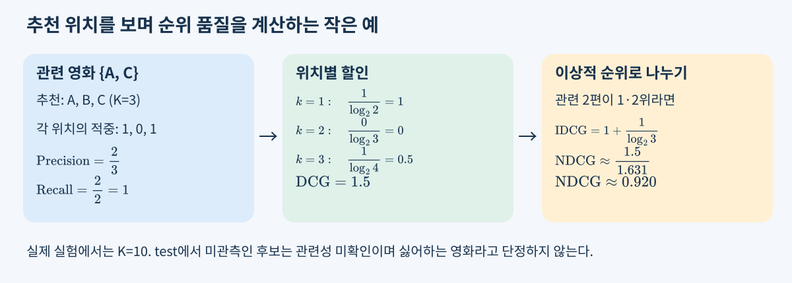
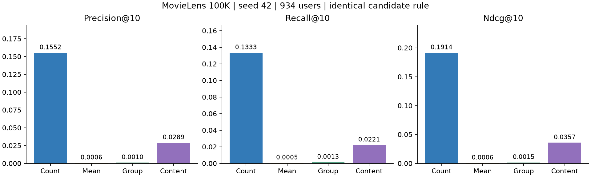
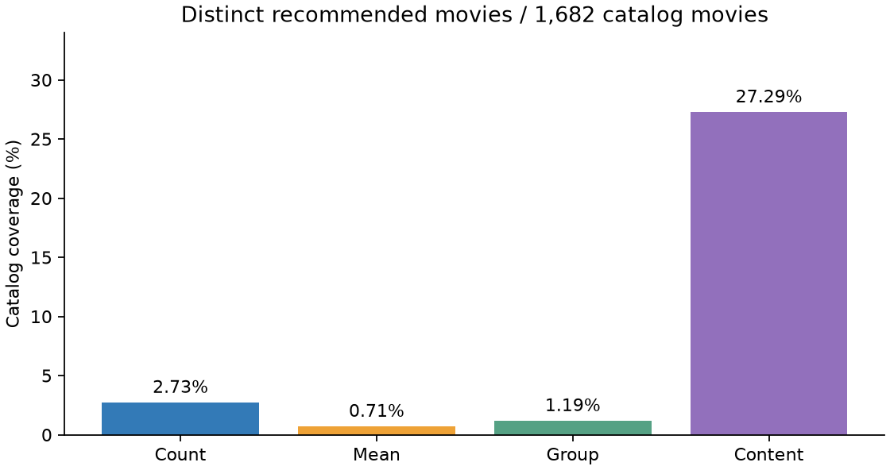

# W02B · 기본적인 추천 방법 (2)

> 딥러닝응용I(추천시스템) · 동덕여자대학교 데이터사이언스전공 · 유원상 교수 · 2026-2
> 2026년 9월 10일 목요일 10:30

## 이번 수업에서 연결할 것

“평균을 계산했을 뿐인데 학습이라고 할 수 있을까?”라는 질문에서 시작한다. 지난 시간의 집단 추천을 수식과 작은 표로 다시 이해하고, `MeanRatingPredictor`의 학습과 예측을 실제 MovieLens 데이터에서 추적한다. 이어서 영화의 **내용 특징**으로 추천하고, 네 방법의 결과를 같은 조건에서 비교한다.

수업을 마치면 집단 평균의 의미와 대체 규칙, `fit`이 추정하는 모수, 가려 둔 정답으로 평가하는 이유를 설명할 수 있어야 한다. 또한 내용 유사도와 예측 평점을 구별하고, 순위 지표와 추천 목록을 함께 읽을 수 있어야 한다.

## 1. 사용자 집단별 추천: 어떤 평점을 평균하는가?

사용자 $u$, 영화 $i$, 관측 평점 $r_{ui}$, 사용자의 집단 $g(u)$를 생각하자. 학습 관측 집합을 $D_{\mathrm{train}}$이라고 쓴다. $g(u)$는 성별·직업처럼 미리 주어진 속성으로 정할 수 있다. 이번 방식은 군집화 알고리즘으로 집단 자체를 학습하는 방법은 아니다.

영화 $i$에 대해 집단 $g$가 남긴 **학습 평점만** 모은 집합을 다음과 같이 정의한다.

$$
\begin{aligned}
D_{gi}&=\{(u,i,r_{ui})\in D_{\mathrm{train}}:g(u)=g\},\\
n_{gi}&=|D_{gi}|,\\
\mu_{gi}&=\frac{1}{n_{gi}}\sum_{(u,i,r_{ui})\in D_{gi}}r_{ui}\quad(n_{gi}>0).
\end{aligned}
$$

여기서 분모는 집단의 전체 인원수가 아니다. **그 집단에서 해당 영화를 평가한 관측 수**다. 다음은 원자료와 별개로 만든 작은 학습 표다.

| 사용자 | 집단 | 영화 | 학습 평점 |
|---|---|---|---:|
| P | 동쪽 | A | 3 |
| Q | 동쪽 | A | 5 |
| P | 동쪽 | B | 2 |
| R | 서쪽 | A | 1 |
| S | 서쪽 | A | 5 |

동쪽×A는 $\frac{3+5}{2}=4$, 서쪽×A는 $\frac{1+5}{2}=3$, 동쪽×B는 $\frac21=2$다. A 전체 평균은 $\frac{14}{4}=3.5$, 학습 전체 평균은 $\frac{16}{5}=3.2$다. `groupby(["집단", "영화"])`는 이 표를 두 키가 같은 묶음으로 나누는 연산이다. 영화 하나만 키로 사용하면 집단 차이가 사라진다.

### 표본이 없거나 너무 적다면

최소 집단 표본 수를 $m=2$로 정하면, 동쪽×B의 평점 하나는 집단 평균으로 쓰지 않는다. 이번 예측기의 규칙은 다음과 같다. $n_i$는 영화 $i$의 학습 관측 수이며, $\mu_i$와 $\mu$는 각각 영화 평균과 학습 전체 평균이다.

$$
\widehat r_{ui}=\begin{cases}
\mu_{g(u),i},&n_{g(u),i}\ge m,\\
\mu_i,&n_{g(u),i}<m\ \text{and}\ n_i>0,\\
\mu,&n_i=0.
\end{cases}
$$

동쪽 사용자의 A는 4, 서쪽 사용자의 B는 영화 평균 2, 학습에 없는 C는 전체 평균 3.2로 예측한다. 동쪽×B도 결과는 2지만 **집단 평균이 아니라 영화 평균을 사용했다**. 같은 숫자라도 근거가 다를 수 있으므로 `predict_details`의 `level`을 확인한다.

집단을 세분하면 취향 차이를 포착할 가능성과 표본 부족이 함께 커진다. 같은 집단이라고 모두 같은 취향은 아니다. 최소 표본 수를 높인다고 오차가 반드시 작아지는 것도 아니다.

### 평균도 지도학습인 이유

집단×영화마다 하나의 모수 $\theta_{gi}$를 학습한다고 생각하자. 그 묶음의 모든 평점을 같은 값으로 예측하는 **범주별 상수 회귀모형**이다.

$$
\begin{aligned}
L_{gi}(\theta)&=\sum_{(u,i,r_{ui})\in D_{gi}}(r_{ui}-\theta)^2,\\
\frac{dL_{gi}}{d\theta}&=2n_{gi}\theta-2\sum_{(u,i,r_{ui})\in D_{gi}}r_{ui},\\
\frac{dL_{gi}}{d\theta}=0&\ \Longrightarrow\ \widehat\theta_{gi}=\frac{\sum_{(u,i,r_{ui})\in D_{gi}}r_{ui}}{n_{gi}},\\
\frac{d^2L_{gi}}{d\theta^2}&=2n_{gi}>0.
\end{aligned}
$$

평균은 제곱오차를 최소화하는 유일한 해다. 평점이라는 정답 레이블을 이용해 모수를 추정하므로 지도학습이다. 학습에 반드시 신경망이나 경사하강법이 필요한 것은 아니다. 데이터가 달라지면 추정한 평균도 바뀐다. 표본이 없는 묶음에서는 이 손실로 모수를 결정할 수 없으므로 위의 대체 규칙을 추가한다. 대체 규칙 자체는 이번 수업의 모델 설계다.



교재의 집단별 추천을 최소제곱 회귀로 해석한 설명과 위의 작은 표는 이해를 돕기 위해 추가한 것이다.

## 2. MovieLens에서는 학습 데이터를 어떻게 준비하는가?

[MovieLens 100K](https://grouplens.org/datasets/movielens/100k/)에는 사용자 943명, 영화 1,682편, 평점 100,000개가 있다. 학생 실행 시 공식 ZIP 또는 해시가 같은 고정 HTTPS 대체 경로에서 다운로드하며 원본 데이터를 수업 저장소에 재배포하지 않는다.

| 표 | 한 행의 의미 | 핵심 열 | 학습에서의 역할 |
|---|---|---|---|
| `users` | 사용자 한 명 | `user_id`, `sex`, `occupation` | ID로 집단 속성을 연결 |
| `movies` | 영화 한 편 | `movie_id`, `title`, 장르 19열 | 제목·내용 특징; `unknown`은 프로필에서 제외 |
| `ratings` | 사용자–영화의 관측 평점 | `user_id`, `movie_id`, `rating`, `timestamp` | 입력 쌍과 정답 레이블 |

평점 행 하나를 머신러닝의 관점에서 보면 `X=(user_id, movie_id, g(user_id))`, `y=rating`이다. ID 숫자의 크기를 연속형 특징으로 회귀하는 것은 아니다. ID는 학습 통계를 조회하는 범주 키다. 영화 장르는 예측 시 이미 알려진 카탈로그 정보로 가정한다.

### 처음 사용하는 준비 함수의 계약

`prepare_movielens(cache_dir, local_dir=None, mode="auto", timeout=20)`는 데이터 준비 함수다. `cache_dir`는 캐시 폴더 경로, `local_dir`는 이미 가진 전체 데이터 폴더이며 일반 학생은 지정할 필요가 없다. API 기본값은 `auto`지만 **이번 실습은 `mode="real"`을 명시**하여 다운로드 실패를 합성 데이터로 숨기지 않는다. 반환 객체의 `.data`에는 `.users`, `.movies`, `.ratings` 표가 있고 `.mode`, `.description`은 실제 사용한 데이터 종류를 설명한다. 폴더 생성·다운로드는 이 함수의 부작용이다.

`split_ratings(ratings, test_size=0.25, seed=42)`는 관측 **행 위치**를 한 번 분할하고 `RatingSplit` 객체의 `.train`, `.test`, `.method`를 반환한다. 원본 표를 변경하지 않는다. MovieLens에서는 사용자를 층화하므로 같은 사용자의 관측이 학습·평가 양쪽에 들어가지만, 동일 사용자–영화 쌍은 겹치지 않는다. 사용자 전체를 가리는 새로운 사용자 평가와 다르다. 아주 작은 자료에서는 층화할 수 없어 `.method="random-small-data"`가 될 수 있다.

정의·인자별 설명은 [준비와 분할 API 안내](https://github.com/lunalab-ai/recommender/blob/2026-fall-w02b/src/luna_recsys/README.md)를 참조한다. notebook의 각 import 앞에서도 같은 입력·출력과 정의 위치를 확인할 수 있다.

```python
from luna_recsys import prepare_movielens, split_ratings

prepared = prepare_movielens("data/local", mode="real")
data = prepared.data
split = split_ratings(data.ratings, test_size=0.25, seed=42)
print(len(split.train), len(split.test), split.method)
# 실제 결과: 75000 25000 user-stratified
```



이것은 무작위 관측 holdout이다. `timestamp` 순서대로 미래를 예측하는 실험은 아니다. 실제 서비스의 미래 추천을 주장하려면 시간 분할·노출 조건 등도 검토해야 한다.

## 3. MeanRatingPredictor를 생성·학습·예측·평가하기

`MeanRatingPredictor`는 **클래스**다. `MeanRatingPredictor(...)`를 호출하면 설정을 가진 객체가 만들어지고, `fit(...)`을 호출해야 평균이 학습된다. 함수 하나를 불러오는 것과 객체의 메소드를 호출하는 것을 구별하자.

| 코드 | 입력 | 하는 일 | 출력·상태 |
|---|---|---|---|
| `MeanRatingPredictor("group", group_col="sex", min_group_ratings=2)` | 기준·집단 열·최소 표본 | 설정 검사 | 아직 평균 없는 객체 |
| `model.fit(split.train, data.users)` | 학습 평점 표, 사용자 속성 표 | 정답으로 평균 추정 | `self`; 아래 학습 속성 생성 |
| `model.predict(pairs)` | `user_id`, `movie_id` 두 열 | 저장한 평균 조회 | 입력 순서의 예측 Series |
| `model.predict_details(pairs)` | 같은 두 열 | 예측과 대체 수준 조회 | `prediction`, `level` DataFrame |

`mode`의 기본값은 `"movie"`, `group_col`은 `"sex"`, `min_group_ratings`는 1이다. `"global"`은 전체 평균, `"movie"`는 영화 평균, `"group"`은 집단×영화 평균을 사용한다. `group`에서는 사용자 ID가 유일하고 집단 값이 빠지지 않은 `users`가 필요하다. `predict`에 아직 학습하지 않은 객체를 사용하면 오류가 난다.

`fit` 후에는 다음 상태가 생긴다. 마지막 밑줄은 학습 후 속성이라는 명명 관례다.

| 속성 | 내용 | 표 연산과의 연결 |
|---|---|---|
| `global_mean_` | 숫자 하나 | `train.rating.mean()` |
| `movie_means_` | 영화 ID별 Series | `train.groupby("movie_id").rating.mean()` |
| `user_groups_` | 사용자 ID→집단 | 사용자 표의 집단 열 |
| `group_means_` | 집단·영화 다중 인덱스 Series | 속성을 연결한 뒤 두 키로 평균/개수 집계 |

```python
from luna_recsys import MeanRatingPredictor

model = MeanRatingPredictor("group", group_col="sex", min_group_ratings=2)
model.fit(split.train, data.users)                 # y_train으로 모수 추정
pairs = split.test[["user_id", "movie_id"]]       # y_test를 제거한 입력
details = model.predict_details(pairs)            # 학습 상태를 그대로 사용
y_test = split.test["rating"].to_numpy()           # 이제 정답을 평가에만 사용
y_hat = details["prediction"].to_numpy()
errors = y_test - y_hat
mae = abs(errors).mean()
rmse = (errors ** 2).mean() ** 0.5
```

`fit`에는 정답을 주고, `predict`에는 정답을 주지 않는다. 평가자가 `y_test`를 별도로 보관했다가 예측과 비교한다. `to_numpy()`는 여기서 행 순서대로 숫자 배열을 얻는 연산이다. 표 인덱스가 섞인 상태에서 잘못 정렬하지 않도록 입력 순서를 보존한다.

**작은 오차 예:** 실제 평점이 `[5, 2, 4]`, 예측이 `[4, 3, 4]`라면 오차는 `[1, −1, 0]`이다. MAE는 $\frac23\approx0.667$, RMSE는 $\sqrt{\frac23}\approx0.816$이다. 큰 오차를 제곱하므로 RMSE가 더 크게 반응한다. 학습 평점을 다시 예측한 오차만 보면 이미 사용한 정답에 잘 맞는 정도를 측정하게 된다.

### 실제 평균 예측기의 결과

다음은 동일 분할, 집단 `sex`, 최소 집단 표본 **1**일 때의 실제 실행값이다. 위 코드의 표본 2 예와 설정을 구별한다. `evaluate_means(split, users, group_col="sex", min_group_ratings=1)`는 세 모델을 각각 학습해 같은 25,000행에서 RMSE와 대체 사용 건수를 반환하는 편의 함수다.

| 평점 예측 모형 | RMSE | 집단 평균 사용 | 영화 평균 사용 | 전체 평균 사용 |
|---|---:|---:|---:|---:|
| 전체 평균 | 1.131210 | 0 | 0 | 25,000 |
| 영화 평균 | 1.030792 | 0 | 24,953 | 47 |
| 집단×영화 평균 | 1.041019 | 24,882 | 71 | 47 |

이번에는 집단을 나누지 않은 영화 평균이 더 낮은 RMSE를 보였다. 세분화가 무조건 성능 개선은 아니다. `level`이 집단인 행이 많다는 사실도 정확도 향상을 뜻하지 않는다. 이 RMSE 표는 아래 네 방법의 순위 평가표와 다른 질문에 답한다.

### 누수와 모델 설정

전체 평점으로 평균을 만든 뒤 train/test를 나누면 이미 정답 일부가 학습 통계에 들어갔다. `fit(data.ratings)`를 한 모델은 평가 정답을 본 것이다. [scikit-learn의 누수 안내](https://scikit-learn.org/stable/common_pitfalls.html)처럼 분할을 먼저 하고 학습에 쓰는 통계는 train에서만 계산해야 한다.

최소 표본 수·장르 처리·선호 하한을 test 점수를 보며 고르면 test도 모델 선택에 사용한 셈이다. 값을 비교해 선택할 때는 train 안에 validation을 추가하고 마지막 test는 고정한다. 이번 주 비교의 설정은 실행 전에 고정했다.

## 4. 내용 기반 필터링: 비슷한 내용을 찾는다

교재 2.5는 영화 줄거리를 특징으로 바꾸고, 좋아하는 영화와 내용이 비슷한 영화를 찾는 흐름을 설명한다. 다른 사용자의 평가 패턴을 직접 비교하는 협업 필터링과 입력 신호가 다르다. 내용 특징은 텍스트뿐 아니라 장르·태그·속성일 수도 있다. [Google의 내용 기반 추천 설명](https://developers.google.com/machine-learning/recommendation/content-based/basics)에서도 사용자 행동과 아이템 특징을 같은 공간에서 연결한다.

### 교재의 텍스트 특징: TF–IDF

각 문서에서 자주 나오면서 모든 문서에 흔하지 않은 단어에 상대적으로 큰 가중치를 준다. scikit-learn 기본 `smooth_idf=True`에서는 다음 IDF를 사용하고, 기본 `norm="l2"`로 각 문서 벡터를 정규화한다.

$$
\begin{aligned}
\operatorname{idf}(t)&=\log\frac{1+N}{1+\operatorname{df}(t)}+1,\\
\operatorname{tfidf}(t,d)&=\operatorname{tf}(t,d)\operatorname{idf}(t),\\
\cos(\mathbf x,\mathbf z)&=\frac{\mathbf x^\top\mathbf z}{\|\mathbf x\|_2\|\mathbf z\|_2}.
\end{aligned}
$$

$N$은 문서 수, $\operatorname{df}(t)$는 단어 $t$를 포함한 문서 수,
$\operatorname{tf}(t,d)$는 문서 $d$의 단어 $t$ 빈도다. 코사인은 두 벡터가 영벡터가 아닐 때 정의한다.


`TfidfVectorizer()`의 `fit_transform(documents)`는 문자열 문서 목록에서 어휘·IDF를 추정하고 문서 수×어휘 수의 희소행렬을 반환한다. `get_feature_names_out()`은 열의 단어 이름을 반환한다. 이 `fit`은 평점 정답을 사용하지 않는 특징 추정이다. **같은 메소드 이름 `fit`이 모두 지도학습을 뜻하지 않는다.** [공식 API](https://scikit-learn.org/stable/modules/generated/sklearn.feature_extraction.text.TfidfVectorizer.html)에서 기본값을 확인할 수 있다.

```python
from sklearn.feature_extraction.text import TfidfVectorizer

documents = ["space robot adventure", "space adventure", "family comedy"]
vectorizer = TfidfVectorizer()
features = vectorizer.fit_transform(documents)
similarity_to_first = (features @ features[0].T).toarray().ravel()
```

위 문장은 직접 만든 예다. 첫 문서와 두 번째 문서는 단어를 공유하며, 세 번째는 공유하지 않아 내적이 0이다. 첫 문서 자신은 유사도가 1이므로 실제 추천에서는 ID를 기준으로 제외해야 한다. 교재의 모든 영화 쌍 유사도 행렬 대신 한 문서의 열만 계산하면 큰 행렬을 만들지 않아도 된다.

### 동일 MovieLens 비교에서는 장르를 사용한다

MovieLens 100K에는 줄거리 열이 없다. 교재의 `movies_metadata.csv`는 별도 데이터이므로 여기로 바꿔 계산한 점수를 같은 비교표에 넣지 않는다. 이번 실험은 **19개 장르 중 `unknown`을 제외한 18개 multi-hot 특징**을 사용한다. 한 영화에 장르가 여러 개면 1이 여러 개이므로 one-hot과 다르다.

$$
\begin{aligned}
\mathbf x_i&\in\{0,1\}^{18},\\
\mathbf v_i&=\begin{cases}\mathbf x_i/\|\mathbf x_i\|_2,&\|\mathbf x_i\|_2>0,\\\mathbf 0,&\|\mathbf x_i\|_2=0,\end{cases}\\
H_u&=\{i:(u,i,r_{ui})\in D_{\mathrm{train}},\ r_{ui}\ge4\},\\
\mathbf q_u&=\frac{1}{|H_u|}\sum_{i\in H_u}\mathbf v_i\quad(|H_u|>0),\\
\mathbf p_u&=\frac{\mathbf q_u}{\|\mathbf q_u\|_2}\quad(\|\mathbf q_u\|_2>0),\\
s(u,j)&=\mathbf p_u^\top\mathbf v_j.
\end{aligned}
$$

먼저 영화를 정규화하여 장르 수가 많은 영화 하나가 단순히 더 큰 벡터를 갖지 않도록 한다. 좋아한 영화 벡터를 평균하고, 방향을 비교하기 위해 사용자 프로필도 정규화한다. 낮게 평가한 영화를 직접 빼는 모델은 아니다. 4점 미만은 이 프로필에서 사용하지 않는다.



프로필이 비었거나 영벡터이면 해당 사용자의 내용 추천 전체를 영화 평균으로 대체한다. 정상 프로필에서 장르가 없는 후보는 유사도 0으로 둔다. 실제 카탈로그에는 알려진 장르가 없는 영화 2편, 전체 학습 사용자 중 유효 프로필 없는 사용자 1명이 있었다. 순위 평가에 포함된 934명에서는 빈 프로필 대체가 발생하지 않았다.

## 5. 네 방법을 공정하게 비교하는 실험

`FourMethodRecommender().fit(train, users, movies)`는 같은 학습 자료로 네 기준을 준비한다. `recommend(user_id, method, k=10)`은 이미 학습에서 평가한 영화를 제외하고 `movie_id`, `score`, `basis`, `title`, `genres` 열의 표를 반환한다. `method`는 아래 네 문자열 중 하나다. `score_catalog(user_id, method)`는 후보 제거 전 모든 영화의 점수를 반환해 내부 동작을 점검할 때 사용한다.

| method | 점수를 학습하는 방법 | 점수 단위 | 개인별로 달라지는 부분 |
|---|---|---|---|
| `count` | 영화별 train 관측 수 | 평점 개수 | 이미 본 영화 제외 |
| `mean` | 영화별 train 평점 평균 | 예측 평점 | 이미 본 영화 제외 |
| `group` | 사용자 집단×영화의 train 평균 | 예측 평점 | 집단 및 본 영화 제외 |
| `content` | train 선호와 장르 프로필 | 코사인 유사도 | 사용자 선호 및 본 영화 제외 |

이번 비교는 최소 관측 수로 후보를 추가 제거하지 않은 **기본형**이다. 영화 평균은 표본 하나의 5점도 5로 추정한다. 지난 수업 앱의 최소 평점 수 필터를 적용한 결과와 섞지 않는다. 집단 평균 최소 표본은 1이다. 학습 관측이 없는 영화는 count에서 0, 평균 계열에서 전체 평균으로 대체한다.

### 공통 평가 조건

1. `split_ratings`를 한 번만 실행한다: train 75,000행, test 25,000행, seed 42.
2. 전체 1,682편 카탈로그에서 사용자별 **train 이력만** 제외한다. test 이력을 제외하면 추천해야 할 정답 후보가 사라진다.
3. 점수 내림차순, 동점은 영화 ID 오름차순으로 정한다. 표시용 반올림 전에 정렬한다.
4. test에서 4점 이상 준 영화를 관련 아이템으로 정한다. 관련 영화가 없는 9명은 모든 방법에서 똑같이 제외하여 934명을 평가한다.
5. 각 사용자에서 K=10으로 측정한 뒤 사용자별 단순평균을 낸다. 많은 평점을 남긴 사용자에게 평균에서 더 큰 가중치를 주지 않는다.

### 순위 지표를 작은 예로 이해하기

관련 영화가 `{A,C}`, 추천이 `[A,B,C]`이고 K=3이면 적중은 두 개다. Precision은 $\frac23$, Recall은 $\frac22=1$이다. NDCG는 같은 적중도 앞에 놓을수록 높게 평가한다. 이진 관련성의 $\operatorname{DCG}@K=\sum_{k=1}^{K}\frac{\operatorname{hit}(k)}{\log_2(k+1)}$를 관련 영화가 맨 위에 있는 이상적 순위의 $\operatorname{IDCG}$로 나눈다.



`ranking_metrics(recommended, relevant, k=10)`는 한 사람의 지표 사전을 반환한다. 빈 관련 집합은 오류로 처리하므로 제외 기준이 숨겨지지 않는다. `evaluate_rankings(model, test, k=10, relevance_threshold=4)`는 학습된 객체를 재학습하지 않고 **요약표, 사용자별 결과표, 평가 인원·조건 사전**을 반환한다. 자세한 수식은 [NDCG 공식 API 설명](https://scikit-learn.org/stable/modules/generated/sklearn.metrics.ndcg_score.html)과 비교할 수 있다. 우리 구현은 동점 정렬을 먼저 확정한 이진 관련성 계산이다.

### 실제 정량 결과: 2026-09-09 실행

| 방법 | Precision@10 | Recall@10 | NDCG@10 | 카탈로그 커버리지 |
|---|---:|---:|---:|---:|
| 평점 수 | 0.155246 | 0.133349 | 0.191447 | 2.73% |
| 영화 평균 | 0.000642 | 0.000505 | 0.000602 | 0.71% |
| 집단×영화 평균 | 0.000964 | 0.001319 | 0.001524 | 1.19% |
| 내용 기반 | 0.028908 | 0.022107 | 0.035705 | 27.29% |



이 조건에서는 평점 수가 관측된 관련 영화의 회수에 가장 유리했다. 반면 표본 수 제약 없는 평균은 드물게 평가된 5점 영화가 상위를 차지해 test의 관측 관련 영화와 잘 겹치지 않았다. “평균 기반 추천은 항상 나쁘다”는 결론이 아니라 **이번 기본형·분할·관련성 관측 조건의 결과**다. 최소 표본 수나 수축 평균을 도입하는 후속 연구의 출발점이다.



내용 기반은 순위 지표가 평점 수보다 낮지만 전체 사용자에게 추천된 영화의 범위가 더 넓었다. 커버리지는 **전체 카탈로그에서 얼마나 넓게 추천했는가**이며 한 사용자의 목록 내 다양성이나 만족도 자체는 아니다. 집단 방식은 상위 추천 항목의 약 5.85%에서 영화/전체 평균으로 대체했다. 내용 방식의 상위 목록에 장르 영벡터 영화가 들어간 비율은 0이었다.

### 정성 비교: 목록을 직접 읽는다

notebook에서는 실험 전에 고른 두 익명 사용자 사례의 상위 목록을 나란히 출력한다. 개인 속성·개별 원본 평점은 공개 출력하지 않는다. **사례 A**에서 평점 수 방식의 선두는 *Star Wars (1977)*, 영화 평균 방식은 표본이 매우 적은 5점 영화 *Great Day in Harlem, A (1994)*였다. 제목뿐 아니라 `score`의 단위와 학습 표본 수를 함께 읽어야 한다.

다음 네 질문으로 두 사례를 비교한다. 실습 정답·해설은 교수자판에 별도로 제공한다.

- 같은 인기 점수인데 두 사용자 목록이 다르면, 학습에서 이미 본 영화 제외로 설명할 수 있는가?
- 평균 5점의 학습 표본 수는 충분한가? 관련 test 영화가 없다는 것이 낮은 품질의 증거인가?
- 내용 기반 상위 영화의 장르 조합은 사용자 프로필의 큰 성분과 연결되는가?
- 서로 다른 내용의 영화를 발견하게 하는가, 비슷한 장르만 반복하는가? 커버리지와 목록 내 다양성을 혼동하지 않았는가?

**평가의 한계:** MovieLens의 미관측 영화는 싫어한 영화가 아니다. 사용자는 모든 영화를 무작위로 평가하지 않았으며 노출·선택 편향이 남는다. 모든 미관측 후보를 관련성 0으로 채점한 이번 오프라인 지표가 실제 만족도의 참값은 아니다. 무작위 분할 하나의 결과에는 불확실성도 있다. 추가 분할·시간 분할·사용자 집단별 분석은 별도 실험으로 다룬다.

## 6. 결과를 웹 앱으로 연결하기

이번 앱은 지난 수업의 데이터 준비→추천 함수→화면 callback 구조를 이어간다. 학습은 한 번 수행하고, 사용자와 방법을 바꿀 때 저장된 모델에서 추천한다. `comparison_table(model, user_id, k=10)`은 네 목록을 하나의 표로 합치는 callback이며 `build_comparison_app(model)`은 Gradio 앱 객체를 반환한다. 앱 생성과 서버 실행은 분리된다.

실습에서는 callback의 `k`를 바꾸고 표의 순위·점수·근거를 확인한 뒤 버튼에 연결한다. `launch(share=True)`는 Colab에서 실행 중인 임시 서버로 연결되며 영구 배포 주소가 아니다. 같은 방법의 숫자는 비교할 수 있지만 평점 개수와 코사인 크기를 서로 비교하지 않는다.

## 점검 퀴즈

1. 집단×영화 평균의 분모는 집단 전체 인원수인가, 어떤 관측 수인가?
2. 경사하강법 없이 평균을 계산하는 것도 지도학습이라고 할 수 있는 이유는 무엇인가?
3. MeanRatingPredictor 객체를 만든 직후와 fit 직후의 차이는 무엇인가?
4. predict에 test의 실제 평점이 필요하지 않은 이유는 무엇인가?
5. MovieLens 100K에서 교재의 줄거리 대신 장르를 사용한 이유는 무엇인가?
6. 내용 프로필을 test에서 좋아한 영화까지 포함하여 만들면 어떤 문제가 생기는가?
7. 평점 수와 코사인 점수를 RMSE에 바로 넣지 않고 순위 지표로 비교한 이유는 무엇인가?
8. 내용 기반의 카탈로그 커버리지가 높다는 사실만으로 더 만족스러운 추천이라고 할 수 있는가?

## 더 공부할 자료

- 임일, 『AI 에이전트를 위한 개인화 추천 알고리즘: Python, 머신러닝, AI, LLM 활용』, 청람, 2025, 2.4와 2.5(pp.27–32의 내용 기반 필터링). 교재의 용어와 내용 유사도 흐름을 사용했다. 최소제곱 해석, 작은 표, 장르 프로필과 네 방법의 공통 평가는 수업용 추가 설계다.
- [수업 재사용 API와 정의 링크](https://github.com/lunalab-ai/recommender/blob/2026-fall-w02b/src/luna_recsys/README.md): 인자·반환값·학습 속성·오류 및 원본 구현을 함께 확인한다.
- [GroupLens MovieLens 100K](https://grouplens.org/datasets/movielens/100k/): 데이터 소개와 사용 조건. 원본이나 교재 줄거리 데이터를 강의 ZIP에 포함하지 않는다.
- [데이터 누수](https://scikit-learn.org/stable/common_pitfalls.html), [내용 기반 추천](https://developers.google.com/machine-learning/recommendation/content-based/basics), [TF–IDF API](https://scikit-learn.org/stable/modules/generated/sklearn.feature_extraction.text.TfidfVectorizer.html), [NDCG API](https://scikit-learn.org/stable/modules/generated/sklearn.metrics.ndcg_score.html): 본문의 개념과 실습을 보충하는 공식 자료(2026-09-09 확인).

## 코드 정의에서 보충 학습하기

[API: arguments, results and examples](https://github.com/lunalab-ai/recommender/blob/2026-fall-w02b/src/API.md)

- [build_comparison_app](https://github.com/lunalab-ai/recommender/blob/2026-fall-w02b/src/luna_recsys/comparison_app.py#L51): 학습된 model을 사용하는 gradio.Blocks 객체를 만들고 반환한다.
- [prepare_movielens](https://github.com/lunalab-ai/recommender/blob/2026-fall-w02b/src/luna_recsys/datasets.py#L62): 캐시/다운로드/명시한 사본을 준비하고 데이터 종류까지 반환한다.
- [split_ratings](https://github.com/lunalab-ai/recommender/blob/2026-fall-w02b/src/luna_recsys/evaluation.py#L28): ratings의 행 위치를 한 번 나누어 RatingSplit(train,test,method)를 반환한다.
- [evaluate_means](https://github.com/lunalab-ai/recommender/blob/2026-fall-w02b/src/luna_recsys/evaluation.py#L60): 동일한 split에서 세 평균 회귀모형을 학습·평가해 DataFrame을 반환한다.
- [FourMethodRecommender](https://github.com/lunalab-ai/recommender/blob/2026-fall-w02b/src/luna_recsys/ranking.py#L18): 평점 수·영화 평균·집단 평균·장르 프로필을 같은 후보에서 비교한다.
- [evaluate_rankings](https://github.com/lunalab-ai/recommender/blob/2026-fall-w02b/src/luna_recsys/ranking.py#L186): 학습 완료 model을 고정하고 동일 test/후보/사용자에서 네 방법을 평가한다.
- [MeanRatingPredictor](https://github.com/lunalab-ai/recommender/blob/2026-fall-w02b/src/luna_recsys/rating_models.py#L29): 관측 평점을 이용해 범주별 상수 회귀모형을 학습하는 클래스.
- [MeanRatingPredictor.fit](https://github.com/lunalab-ai/recommender/blob/2026-fall-w02b/src/luna_recsys/rating_models.py#L77): ratings의 정답 평점으로 평균 모수를 추정하고 self를 반환한다.
- [MeanRatingPredictor.predict](https://github.com/lunalab-ai/recommender/blob/2026-fall-w02b/src/luna_recsys/rating_models.py#L147): pairs(user_id/movie_id 표)의 평점 예측 Series를 반환한다.
