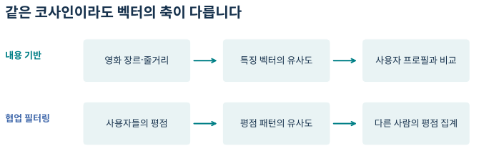
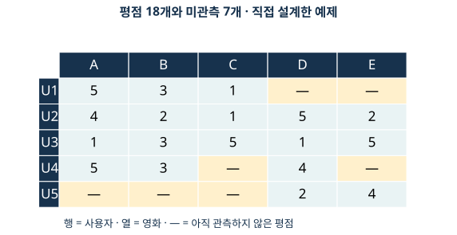
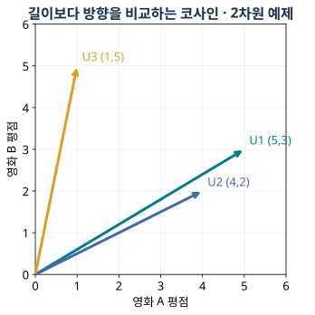
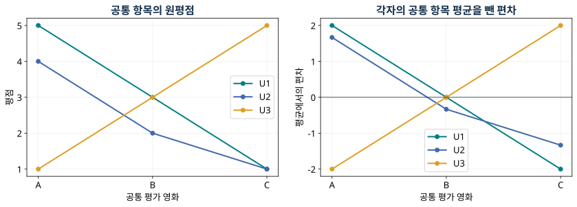
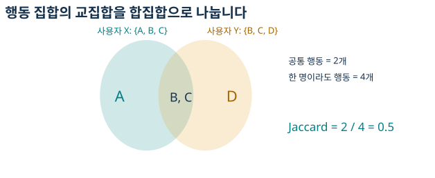
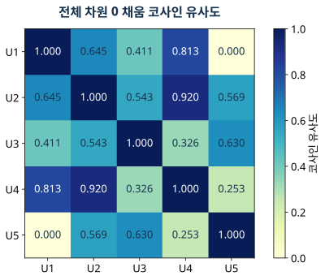
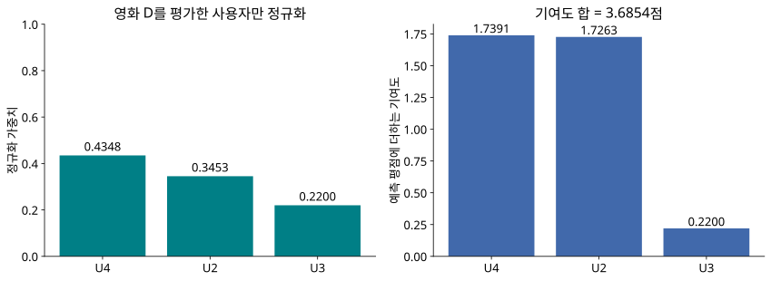
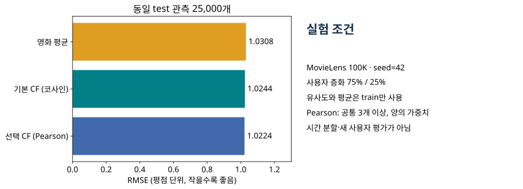
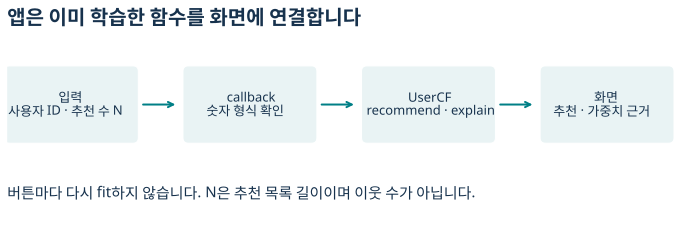

# W03A · 협업 필터링의 기본 원리와 유사도 기반 추천

> 딥러닝응용I(추천시스템) · 동덕여자대학교 데이터사이언스전공 · 유원상 교수 · 2026-2
> 2026년 9월 15일 화요일 · 주교재 3.1–3.3

## 이번 수업의 질문

영화의 줄거리나 장르를 몰라도 추천할 수 있을까? 나와 비슷한 영화를 좋아했던 사람들의 평점을 이용하면 가능하다. 이번 수업은 **평점 행렬 → 사용자 유사도 → 영화별 평가자 → 가중평균 → 추천**의 연결을 직접 따라간다. 수식의 각 기호를 표의 행·열과 연결하고, 작은 수계산을 Python 결과와 대조한다.

학습 후에는 협업 필터링의 정보 출처, 세 유사도 지표의 차이, 미관측값 처리, 기본 CF 예측의 분자와 분모를 설명할 수 있어야 한다. 실습에서는 MovieLens 평점을 자동으로 준비하고 기존 추천 앱에 CF와 추천 근거를 추가한다.

작은 표의 U1–U5와 영화 A–E는 수업을 위해 직접 설계한 가상 자료다. 실제 MovieLens 결과는 별도 실험 절에 표시한다. 숫자는 계산 중 반올림하지 않고 최종 표시만 반올림한다.

## 1. 협업 필터링은 무엇을 공유하는가?

**협업 필터링(Collaborative Filtering, CF)**은 여러 사용자의 상호작용에서 취향의 규칙을 찾아 추천한다. 이 수업은 명시적 평점과 사용자 간 유사도를 이용하는 기본 방법을 다룬다. 비슷한 평점 패턴이 다른 영화의 선호에도 도움이 될 것이라는 가정이며, 항상 맞는 보장은 아니다.

| 방법 | 사용자 사이의 관계를 만드는 정보 | 이번 예에서 필요한 입력 |
|---|---|---|
| 사용자 집단별 추천 | 미리 주어진 집단 속성 | 집단 속성, 영화별 평점 |
| 내용 기반 추천 | 아이템의 장르·텍스트 특징 | 특징 벡터, 사용자의 선호 이력 |
| 사용자 기반 CF | 같은 아이템에 보인 평가 패턴 | 사용자 ID, 영화 ID, 평점 |

CF에서 사용자 ID는 관측을 연결하는 식별자다. ID 숫자가 가까운 사용자가 취향도 비슷하다는 뜻은 아니다. 기본 CF는 성별이나 줄거리가 없어도 계산할 수 있다. 다만 평점 이력이 적거나 전혀 없으면 다른 근거가 필요하다.



그림 1. 같은 코사인 함수를 사용하더라도 벡터의 축과 비교 대상이 다르다. 지난 시간의 장르 축이 이번에는 영화별 평점 축으로 바뀐다. 교재 3.1의 개념과 W02B를 연결해 독자적으로 구성했다.

## 2. 행렬의 빈칸부터 정확히 읽기

사용자 집합을 $\mathcal U$, 영화 집합을 $\mathcal I$라고 하자. 사용자 $u$가 영화 $i$에 준 관측 평점이 $r_{ui}$이다. 행렬 $R$의 행은 사용자, 열은 영화다. 빈칸은 아직 알지 못하는 평점이며 0점이 아니다.



그림 2. U1은 A·B·C에만 평점을 남겼다. D·E는 추천 후보가 될 수 있다. U5가 A·B·C를 평가하지 않았다는 사실만으로 U1과 취향이 반대라고 판단할 수 없다. 교재 표 3-1의 행렬 읽기 개념을 바탕으로 데이터를 새로 설계했다.

### 이 수업의 기호 사전

| 기호 | 의미 | 표에서 찾는 위치 |
|---|---|---|
| $u,v\in\mathcal U$ | 대상 사용자와 다른 사용자 | 두 행 |
| $i,j\in\mathcal I$ | 예측할 영화와 합산할 영화 | 열 |
| $r_{ui}$ | 관측 평점 | 값이 있는 칸 |
| $\widehat r_{ui}$ | 모델의 예측 평점 | 채우려는 빈칸 |
| $I_u$ | 사용자 $u$가 학습에서 평가한 영화 집합 | 해당 행의 관측 열 |
| $I_{uv}=I_u\cap I_v$ | 두 사용자가 모두 평가한 영화 | 두 행의 공통 관측 열 |
| $s_{uv}$ | 두 사용자 사이 유사도 | 유사도 행렬의 한 칸 |
| $U_i$ | 영화 $i$를 학습에서 평가한 사용자 집합 | 해당 열의 관측 행 |
| $V_{ui}$ | 자기 자신을 제외한, 양의 유사도를 가진 영화 $i$의 평가자 | 예측에 실제 기여하는 행 |

작은 표에서 $I_1=\{A,B,C\}$, $I_4=\{A,B,D\}$이므로 $I_{14}=\{A,B\}$이다. 영화 D의 평가자는 $U_D=\{2,3,4,5\}$이다. 사용자 전체 수, 공통 평가 영화 수, 특정 영화의 평가자 수를 서로 구별하자.

**생각해 보기 L1.** U1과 U5의 공통 평가 영화가 없다는 것은 “두 사람의 취향이 반대”와 같은 뜻일까? 관측된 사실과 아직 모르는 것을 구별해 한 문장으로 설명하자.

## 3. 코사인 유사도: 방향을 비교한다

길이가 같은 두 벡터 $\mathbf x,\mathbf y$의 코사인 유사도는 정규화된 내적이다.

$$
\operatorname{cos}(\mathbf x,\mathbf y)
=\frac{\mathbf x^{\mathsf T}\mathbf y}{\|\mathbf x\|_2\|\mathbf y\|_2}
=\frac{\sum_j x_jy_j}{\sqrt{\sum_jx_j^2}\sqrt{\sum_jy_j^2}}.
$$

$j$는 두 벡터에서 **같은 특징**을 가리켜야 한다. $\mathbf x^{\mathsf T}\mathbf y$는 대응 성분의 곱을 더한 내적이고, $\|\mathbf x\|_2$는 제곱합의 제곱근인 길이다. 분모가 0이면 수학적으로 정의되지 않는다. 일반적인 코사인 범위는 $[-1,1]$이고, 0 이상인 원평점 벡터에서는 $[0,1]$이다. 코사인 1은 같은 방향을 뜻하며 값의 크기까지 동일하다는 뜻은 아니다.



그림 3. 원점에서 나가는 방향을 비교한다. 그림은 두 영화만 사용한 기하학 예시다. 실제 기본 CF의 코사인은 전체 영화 차원에서 계산하므로 이 그림의 두 좌표만으로 아래 유사도 행렬을 계산하지 않는다. 교재 그림 3-1의 벡터 각도 개념을 독립적으로 재구성했다.

### 3.1 미관측의 0 채움은 계산 표현이다

교재 3.3처럼 모든 영화 열을 정렬한 뒤, 계산용 벡터에서만 미관측을 0으로 둔다.

$$
\widetilde r_{uj}=\begin{cases}r_{uj},&j\in I_u,\\0,&j\notin I_u.\end{cases}
\qquad
s^{\mathrm{cos}}_{uv}
=\frac{\sum_{j\in I_{uv}}r_{uj}r_{vj}}
{\sqrt{\sum_{j\in I_u}r_{uj}^2}\sqrt{\sum_{j\in I_v}r_{vj}^2}}.
$$

분자의 곱은 공통 관측 항목에서만 남는다. **분모는 각 사용자가 평가한 모든 항목**의 길이를 사용한다. 따라서 공통 항목만 남긴 뒤 두 벡터 길이까지 다시 계산하는 코사인과는 다르다. 교재 3.2의 $I_x,I_y$ 분모와 3.3의 `fillna(0)`를 이 관계로 읽으면 된다.

U1과 U2의 전체 영화 벡터는 $(5,3,1,0,0)$과 $(4,2,1,5,2)$이다.

$$
s_{12}=\frac{5\cdot4+3\cdot2+1\cdot1}
{\sqrt{5^2+3^2+1^2}\sqrt{4^2+2^2+1^2+5^2+2^2}}
=\frac{27}{\sqrt{35}\sqrt{50}}\approx0.6454.
$$

공통 A·B·C만으로 양쪽 길이를 계산하면 $27/(\sqrt{35}\sqrt{21})\approx0.9959$가 된다. 두 값이 다른 이유는 계산에 사용하는 분모가 다르기 때문이다. 기본 실습에서는 **0 채움 전체 차원 코사인**을 사용한다. 미관측을 “실제 0점”으로 해석하여 평균이나 정답에 넣지는 않는다.

`sklearn.metrics.pairwise.cosine_similarity(X)`는 행을 비교한다. 입력이 사용자 수×영화 수이면 결과는 사용자 수×사용자 수다. `X`를 전치하면 비교 대상이 달라진다. 공식 구현은 영벡터와의 결과를 0으로 반환하므로, 이 값을 “유사도 계산에 쓸 관측이 부족함”과 구분해 해석한다. [공식 수식·입출력·예제](https://scikit-learn.org/stable/modules/generated/sklearn.metrics.pairwise.cosine_similarity.html)

**생각해 보기 L2.** 유사도 행렬을 만들기 전에 `R.T`를 사용하면 행과 열은 무엇을 의미하게 될까?

## 4. 피어슨 상관계수: 평균에서의 변화 패턴을 비교한다

두 사람이 비슷한 순서로 영화를 좋아하지만 한 사람은 전반적으로 후한 점수를 줄 수 있다. Pearson은 각자의 평균을 뺀 편차가 함께 증가·감소하는지를 비교한다. 이번 수업에서는 두 사용자의 **공통 관측 집합에서 계산한 평균**을 사용한다.

$$
\overline r_{u\mid uv}=\frac{1}{|I_{uv}|}\sum_{j\in I_{uv}}r_{uj},\qquad
\overline r_{v\mid uv}=\frac{1}{|I_{uv}|}\sum_{j\in I_{uv}}r_{vj}.
$$

세로 막대 뒤의 $uv$는 어떤 사용자 쌍의 공통 항목으로 평균을 계산했는지 나타낸다. 사용자 $u$가 가진 모든 평점의 평균과 혼동하지 않는다.

$$
s^{\mathrm P}_{uv}=
\frac{\sum_{j\in I_{uv}}(r_{uj}-\overline r_{u\mid uv})(r_{vj}-\overline r_{v\mid uv})}
{\sqrt{\sum_{j\in I_{uv}}(r_{uj}-\overline r_{u\mid uv})^2}
 \sqrt{\sum_{j\in I_{uv}}(r_{vj}-\overline r_{v\mid uv})^2}}.
$$



그림 4. U1과 U3는 같은 영화에 대해 반대 방향으로 변한다. U1은 $(5,3,1)$, U3는 $(1,3,5)$이고, 각 평균은 3이다. 편차 $(2,0,-2)$와 $(-2,0,2)$의 상관은 $-1$이다. 위의 비음수 원평점 코사인이 양수인 것과 모순이 아니다. 비교하는 표현이 다르다.

U1과 U2의 공통 세 영화에서는 평균이 각각 $3$, $7/3$이고,

$$
s^{\mathrm P}_{12}=\frac{6}{\sqrt{8}\sqrt{14/3}}\approx0.9820.
$$

Pearson의 값은 $[-1,1]$이다. 공통 관측이 2개 미만이거나 한쪽이 상수이면 계산할 수 없다. 공통 관측 2개만 있으면 비상수인 경우 $\pm1$이 나오므로 높은 절댓값을 충분한 근거로 오해하지 않는다. 선택 심화 실습은 **공통 관측 3개 이상**을 요구하며, 이것이 신뢰성을 보장하는 기준은 아니라고 명시한다. 상수 입력은 [SciPy 공식 문서](https://docs.scipy.org/doc/scipy/reference/generated/scipy.stats.pearsonr.html)에서도 정의 불가로 처리한다.

Pearson으로 유사도를 구하는 것과 예측 공식에서 사용자 평균 편차를 보정하는 것은 별도 선택이다. 이번 선택 실험은 **양의 Pearson 가중치로 원평점을 평균**한다. 평균을 빼고 다시 더하는 보정 CF는 후속 범위다.

## 5. 타니모토·자카드: 행동 집합을 비교한다

클릭·구매 여부처럼 행동의 존재를 다룰 때는 양의 행동 집합을 비교할 수 있다. 두 사용자 행동 집합을 $A,B$라고 하자. 이 절의 $A,B$는 영화 이름이 아니라 **집합 변수**다.

$$
J(A,B)=\frac{|A\cap B|}{|A\cup B|}=\frac{c}{a+b-c},
\qquad a=|A|,\ b=|B|,\ c=|A\cap B|.
$$



그림 5. 한 사람이라도 행동한 항목은 4개이고 공통 행동은 2개이므로 유사도는 $2/4=0.5$이다. 두 사람 모두 행동하지 않은 항목 수를 분모에 추가하지 않는다. 이진 집합에서 교재의 타니모토 식은 이 Jaccard 유사도와 같다.

`binary_jaccard({1,2},{2,3})`의 결과는 $1/3$이다. 반면 `scipy.spatial.distance.jaccard`는 **거리**를 반환하므로 유사도는 `1-distance`다. 두 집합이 비면 수업 함수는 근거 없음인 `NaN`을 반환한다. SciPy의 양쪽 영벡터 거리 0 규약과 의도적으로 구별한다. [공식 Jaccard 설명](https://docs.scipy.org/doc/scipy/reference/generated/scipy.spatial.distance.jaccard.html)

**교재 보충 설명.** 이진 벡터에도 코사인은 계산할 수 있다. 예를 들어 두 비어 있지 않은 행동 집합의 이진 벡터 코사인은 $c/\sqrt{ab}$이며 Jaccard와 분모가 다르다. 교재의 “이진값에는 코사인을 사용할 수 없다”는 문장을 수학적인 금지로 외우지 않는다. 중요한 것은 입력의 의미, 정의 조건, 얻고 싶은 유사성이다. 또한 평점 4 이상을 좋아요로 바꾸는 것과 실제 클릭 여부는 서로 다른 관측이다.

### 세 지표를 선택할 때

| 지표 | 무엇을 비교하는가? | 이번 사용 범위 | 주의점 |
|---|---|---|---|
| 코사인 | 벡터 방향 | 기본 CF의 전체 차원 평점 벡터 | 미관측 표현·벡터 축 확인 |
| Pearson | 평균에서의 편차 패턴 | 비교 및 선택 심화 | 공통 관측 수·분산 0·음수 |
| 이진 Tanimoto/Jaccard | 양의 행동 집합의 겹침 | 작은 행동 집합 비교 | 거리와 유사도, 빈 집합 |

어떤 유사도든 데이터와 평가 조건에 따라 결과가 달라진다. 값이 더 크다고 추천 성능도 자동으로 더 좋지는 않다.

## 6. 기본 CF: 유사도를 평점 예측으로 바꾸기

교재 3.1의 직관은 “비슷한 사람의 선호를 참고한다”이다. 교재 3.3의 기본 구현은 상위 몇 명을 미리 정하지 않고 **전체 사용자를 후보**로 삼는다. 그중 목표 영화를 실제로 평가했고 양의 유사도를 가진 사람을 집계한다.

$$
U_i=\{v\in\mathcal U:i\in I_v\},\qquad
V_{ui}=\{v\in U_i:v\ne u,\ s_{uv}>0\}.
$$

$$
\widehat r_{ui}=\frac{\sum_{v\in V_{ui}}s_{uv}r_{vi}}{\sum_{v\in V_{ui}}s_{uv}}
=\sum_{v\in V_{ui}}w_{uvi}r_{vi},\qquad
w_{uvi}=\frac{s_{uv}}{\sum_{k\in V_{ui}}s_{uk}}.
$$

$k$는 분모에서 다른 평가자를 세기 위한 임시 인덱스다. 분자와 분모는 **같은 영화별 평가자 집합**을 사용한다. 정규화 가중치 $w_{uvi}$의 합은 1이고, 양의 가중평균은 사용한 평점의 최솟값과 최댓값 사이에 있다. 단위는 코사인 점수가 아니라 **평점**이다.



그림 6. 대각선은 자기 유사도이지만 예측 근거에서는 자신을 제외한다. U1–U5의 0은 공유 관측이 없어서 곱이 남지 않은 결과다. 0을 선호의 정반대라고 해석하지 않는다.

### 계산 예제: U1의 영화 D 예측

| 평가자 | U1과의 유사도 | D 평점 | 정규화 가중치 | 평점 기여도 |
|---|---:|---:|---:|---:|
| U2 | 0.645423 | 5 | 0.345261 | 1.726303 |
| U3 | 0.411201 | 1 | 0.219967 | 0.219967 |
| U4 | 0.812755 | 4 | 0.434773 | 1.739091 |
| U5 | 0 | 2 | 0 | 0 |

U5는 D를 평가했지만 U1과의 가중치가 0이므로 기여하지 않는다. U1은 D를 아직 평가하지 않았으며, 어느 경우에도 자기 평점으로 자신을 맞히지 않는다.

$$
\widehat r_{1D}=\frac{0.645423\cdot5+0.411201\cdot1+0.812755\cdot4}
{0.645423+0.411201+0.812755}\approx3.6854.
$$

위 식에 표시된 숫자는 반올림값이다. 실제 구현은 전체 정밀도로 계산한다. 유사도를 같은 비율로 모두 확대해도 분자와 분모가 함께 변하므로 예측은 변하지 않는다.



그림 7. 왼쪽 가중치의 합은 1, 오른쪽 기여도의 합은 3.6854점이다. 가장 비슷한 U4만 사용하는 예측도, 모든 평가자의 단순 평균도 아니다. 수계산과 실제 코드로 재현한 값이다.

**생각해 보기 L3.** D를 평가하지 않은 사용자들의 유사도까지 분모에 더하면 예측값은 어떻게 바뀔까? 양수인 추가 가중치가 있을 때를 가정해 설명하자.

### 근거가 부족하면 무엇을 반환하는가?

분모가 0이면 나눗셈을 수행하지 않는다. 수업 구현은 학습 영화 평균으로 대체하고, 영화도 학습에서 없으면 학습 전체 평균으로 대체한다. 미등록 사용자도 같은 경로를 따른다. 출력의 `basis`가 `cf`, `movie-mean`, `global-mean` 중 무엇인지 확인한다.

교재는 미등록 영화에 고정값 3.0을 쓴다. 여기의 평균 대체는 이전 수업 API와 연결한 **교육적 보강**이며 교재 원문의 규칙과 구별한다. 대체로 숫자가 나왔다고 개인화 CF 근거가 충분했다는 뜻은 아니다.

## 7. 수식에서 Python API로

실습에서 `UserCF`는 `luna_recsys.collaborative`에 정의된 클래스다. 생성자는 설정을 저장하고, `fit`은 학습 평점과 관측 마스크, 유사도, 대체 평균을 준비한다. 이 기본 CF는 경사하강법으로 모수를 최적화하는 알고리즘이 아니다. 같은 `fit` 이름이 항상 같은 학습 절차를 뜻하지 않는다.

| 호출/속성 | 입력 또는 의미 | 출력/확인할 것 |
|---|---|---|
| `toy_ratings()` | 인자 없음, 독자적 예제 | 18행, `user_id/movie_id/rating` |
| `UserCF(metric="cosine")` | 기본 코사인 설정 | 아직 미학습인 객체 |
| `fit(train)` | 중복 없는 정수 ID와 1–5점 관측 | 학습된 `self`, 원본은 보존 |
| `rating_matrix_` | 사용자×학습 영화 | 미관측 `NaN` 유지 |
| `similarity_` | 사용자×사용자 | 동일 ID 순서의 유사도 |
| `predict_details(pairs)` | `user_id/movie_id` 표 | 같은 행 순서의 예측·근거·평가자 수·가중치 합 |
| `predict(pairs)` | 동일 입력, 정답 열 불필요 | `(N,)` 예측 평점 배열 |
| `explain(user_id,movie_id)` | 한 사용자–영화 쌍 | 전체 기여자의 평점·가중치·기여도 |
| `recommend(user_id,movies,top_n=10)` | 영화 ID/제목 카탈로그 | 학습 이력 제외, 점수 내림차순·동점 ID 오름차순 |

학습된 상태를 나타내는 속성에는 밑줄 접미사를 붙였다. `predict`는 test의 `rating`을 읽지 않는다. `explain`이 빈 표이면 `predict_details`의 대체 이유를 확인한다. 모든 API의 인자·기본값·예외·정의 줄 링크는 [W03A 코드 사용 안내](https://github.com/lunalab-ai/recommender/blob/2026-fall-w03a/src/W03A-API.md)에 정리했다. 해당 안내와 노트북은 같은 수업 버전을 참조한다.

```python
from luna_recsys.collaborative import UserCF, toy_ratings
import pandas as pd

toy = toy_ratings()
model = UserCF().fit(toy)
pairs = pd.DataFrame({"user_id": [1], "movie_id": [4]})
model.predict_details(pairs)
model.explain(1, 4)
```

첫 결과의 `prediction`은 약 3.6854, `basis`는 `cf`, `n_contributors`는 3이다. `explain`은 세 행을 반환하며 가중치 합과 기여도 합을 위 표와 비교할 수 있다. `np.dot` 같은 함수 이름을 외우기 전에 **어떤 사용자의 값끼리 곱하는지** 확인하자.

## 8. MovieLens에서 동일 조건으로 평가하기

실습은 [GroupLens MovieLens 100K](https://grouplens.org/datasets/movielens/100k/)를 자동 다운로드하거나 캐시에서 읽는다. 업로드나 개인 PC 경로 입력은 필요하지 않다. 개인정보나 원본 평점 파일을 제출·공개 저장소에 올리지 않는다.

`prepare_movielens(cache_dir, mode="real", timeout=20)`은 데이터와 출처 설명을 반환한다. 여기서는 실제 비교를 위해 `real`을 명시한다. 네트워크 장애 때는 별도의 `synthetic` 모드로 개념 실습을 할 수 있지만 합성 결과를 아래 성능값과 비교하지 않는다. 다운로드 성공, 캐시 재사용, 합성 모드는 각각 구별한다.

`split_ratings(ratings, test_size=0.25, seed=42)`는 사용자별 관측을 가능한 한 층화하여 학습 75,000행과 평가 25,000행을 만든다. 두 집합에 같은 사용자가 있을 수 있으나 동일 사용자–영화 관측 쌍은 겹치지 않는다. 이 평가는 **기존 사용자의 보류 평점 예측**이며 미래 시간대나 새 사용자에 대한 일반화를 그대로 증명하지 않는다.

순서는 분할 → train 평점 행렬 → train 유사도/평균 → test 쌍 예측 → test 정답으로 채점이다. test 평점을 행렬이나 평균 계산에 넣으면 정답 일부를 미리 본 셈이다. [데이터 누수 공식 설명](https://scikit-learn.org/stable/common_pitfalls.html)

$$
\operatorname{RMSE}=\sqrt{\frac{1}{|D_{\mathrm{test}}|}
\sum_{(u,i,r_{ui})\in D_{\mathrm{test}}}(r_{ui}-\widehat r_{ui})^2}.
$$

$D_{\mathrm{test}}$는 가려 둔 관측의 집합이며 분모는 실제 평가한 관측 수다. 예측 오차를 제곱해 평균하고 제곱근을 취하므로 단위는 평점이다. 코사인 점수 자체에 RMSE를 적용하지 않고, 평점을 예측하는 두 모델을 비교한다.

### 실제 실행 결과 · 2026-09-15

| 모델 | RMSE | CF 근거 부족으로 평균 대체한 비율 |
|---|---:|---:|
| 영화 평균 기준선 | 1.0308 | 해당 없음: 처음부터 평균 모델 |
| 기본 CF · 코사인 | 1.0244 | 0.192% |
| 선택 CF · Pearson | 1.0224 | 0.328% |

943명·1,682편·100,000평점의 보유 MovieLens 사본, Python 3.12.10, 위 동일 분할에서 직접 측정했다. Pearson은 공통 관측 3개 이상, 양의 가중치, 원평점 가중평균을 사용했다. 교재에 실린 약 1.017을 복사한 결과가 아니다. 성능 차이는 작으며, 한 번의 분할만으로 일반적인 우열을 확정할 수 없다. Pearson의 대체 비율이 더 높다는 점도 함께 읽자.



그림 8. 작은 성능 차이를 과장하지 않도록 0에서 시작한 축을 사용했다. 이 그림은 실제 실행의 집계 결과이며 위 작은 가상 표의 결과가 아니다.

평점 예측 평가와 Top-N 추천은 출력이 다르다. RMSE는 test의 알려진 정답 쌍을 채점한다. 추천은 학습에서 이미 평가한 영화를 후보에서 제외하고 목록을 만든다. 미관측 영화가 관련 없는 영화라는 뜻은 아니다. 이번에는 순위 지표 최적화를 추가하지 않고 기본 CF의 계산을 이해하는 데 집중한다.

## 9. 실습 활동과 누적 앱

Colab은 설명을 읽고 예상값을 적은 뒤 셀을 실행한다. 빈칸은 `None`으로 표시되어 있으며 미완성 문제를 건너뛰어도 뒤의 독립 실습을 계속할 수 있다. 입력 오류를 숨기거나 임의 결과로 성공 처리하지 않는다.

| 활동 | 직접 할 일 | 자가 점검 |
|---|---|---|
| E1 관측 마스크 | 공통 평가 집합을 예측 | 미관측과 0점을 구별했는가? |
| E2 코사인 | 방향이 다른 두 벡터의 계산 빈칸 | 분자와 두 노름을 따로 적었는가? |
| E3 Pearson | 음수와 상수 입력 결과를 설명 | 정의 불가와 0을 구별했는가? |
| E4 Jaccard | 행동 집합의 유사도 계산 | 합집합에 중복을 한 번만 셌는가? |
| E5 가중평균 | 미평가자의 가중치가 남은 분모를 수정 | 분자·분모의 평가자 집합이 같은가? |
| E6 누수 | 전체 평점으로 fit한 코드를 수정 | test 정답을 학습에서 제거했는가? |
| E7 앱 연결 | 입력→callback→출력 연결을 완성 | N이 이웃 수가 아니라 목록 길이인가? |
| E8 해석 | 두 사용자의 목록과 대체 여부 비교 | 실제 관찰과 추측을 구별했는가? |



그림 9. 기존 앱에 기본 CF 탭을 추가한다. `UserCF`는 한 번 학습하고 버튼은 `recommend`와 `explain`을 호출한다. 예측 근거가 많은 경우 화면은 상위 20명만 표시하며, 요약의 전체 기여도 합과 구별한다.

`cf_view(model,movies,user_id,top_n)`은 요약 HTML, 추천 표, 첫 추천의 근거 표를 반환한다. `build_cf_app(model,movies,comparison)`에 기존 `FourMethodRecommender`를 전달하면 이전 네 방법 비교 탭도 유지한다. 화면에 보이는 숫자를 바꾸어 보는 것에서 끝내지 않고, 학생이 버튼 이벤트의 입력과 출력을 직접 연결한다.

Colab의 `launch(share=True)` 공유 주소는 실행 중인 런타임에 의존한다. 런타임을 종료하면 다시 실행해야 하며 영구 강의자료 주소로 사용하지 않는다. 로컬 코드 검사, 실제 브라우저 조작, Colab 실행은 서로 다른 확인이다.

## 점검 퀴즈

1. 내용 기반 추천과 협업 필터링은 각각 어떤 정보를 이용해 유사성을 판단하는가?
2. 미관측 평점을 코사인 계산용 행렬에서 0으로 채워도 실제 0점으로 평균에 넣으면 안 되는 이유는 무엇인가?
3. 전체 차원 코사인과 공통 평가 항목만으로 양쪽 노름을 계산한 코사인이 다른 값을 가질 수 있는 이유는 무엇인가?
4. Pearson 상관계수가 정의되지 않는 두 가지 상황은 무엇인가?
5. 두 행동 집합의 크기가 각각 4와 3이고 공통 항목이 2개라면 Jaccard 유사도는 얼마인가?
6. 기본 CF의 가중평균 분모에는 어떤 사용자의 유사도를 포함해야 하는가?
7. test 평점까지 포함하여 사용자 유사도를 계산한 뒤 같은 test로 RMSE를 구하면 왜 문제가 되는가?

## 기억할 것

CF는 다른 사용자의 행동을 추천 근거로 사용한다. 유사도는 **벡터의 의미와 관측 범위**를 함께 정의해야 한다. 예측할 영화의 평가자를 고른 뒤 같은 집합으로 분자와 분모를 계산한다. 수치가 반환되면 예측 근거와 대체 여부를 함께 확인한다. 평가는 train에서 계산한 모델을 고정하고 가려 둔 test에서 수행한다.

## 참고자료

- 임일(2025), 『AI 에이전트를 위한 개인화 추천 알고리즘: Python, 머신러닝, AI, LLM 활용』, 청람, 3.1–3.3, pp.34–41. 표·그림은 개념을 참고해 수업용으로 독자 재구성했다.
- [scikit-learn cosine_similarity](https://scikit-learn.org/stable/modules/generated/sklearn.metrics.pairwise.cosine_similarity.html): 정규화 내적과 입력/출력 차원.
- [SciPy pearsonr](https://docs.scipy.org/doc/scipy/reference/generated/scipy.stats.pearsonr.html): 중심화와 정의 불가 조건.
- [SciPy Jaccard distance](https://docs.scipy.org/doc/scipy/reference/generated/scipy.spatial.distance.jaccard.html): 거리와 집합 유사도.
- [Surprise 기본 이웃 알고리즘](https://surprise.readthedocs.io/en/stable/knn_inspired.html): 양의 유사도 가중평균의 보충 참고. 해당 패키지를 실습 의존성으로 추가하지 않는다.
- [GroupLens MovieLens 100K](https://grouplens.org/datasets/movielens/100k/): 실제 평점 데이터의 공식 출처.
- [scikit-learn 데이터 누수](https://scikit-learn.org/stable/common_pitfalls.html): train/test 분리.

외부 문서 확인일: 2026-09-14. 성능 실험은 2026-09-15 한국시간에 실행했다.
