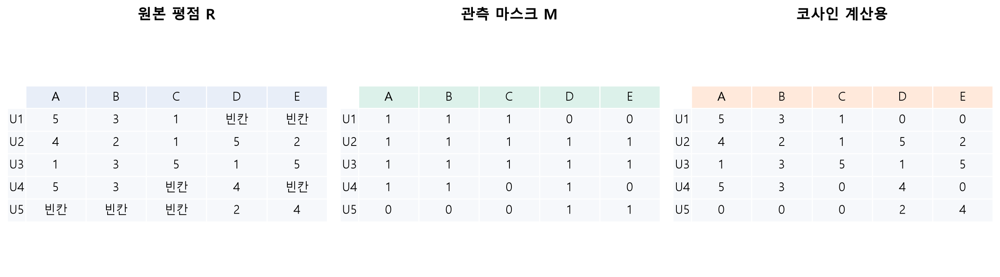
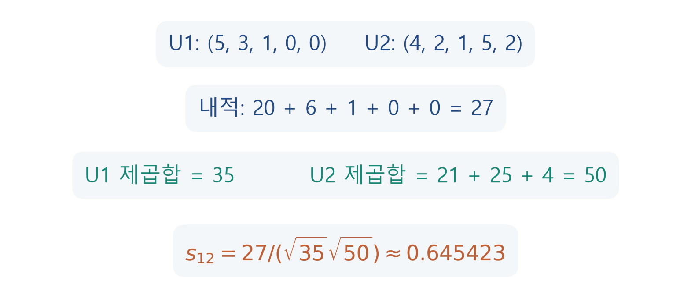
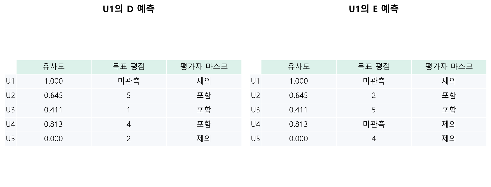
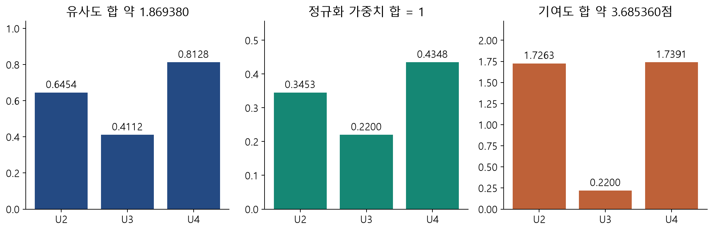
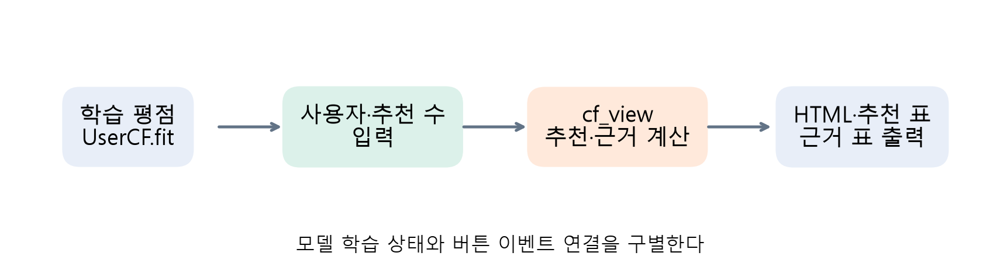

# 협업 필터링 따라가기: 평점 행렬부터 추천 근거까지

> 딥러닝응용I(추천시스템) · 동덕여자대학교 데이터사이언스전공 · 유원상 교수 · 2026-2
> W03B · 2026년 9월 17일 목요일 · 주교재 3.1–3.3 보충

## 이번 수업의 자료 사용 순서

[기존 W03A 강의](https://fancy-ballcap-a15.notion.site/W03a-3db7fd00109f8184ad2df949b899097c)를 주교안으로 사용하고, 이 노트로 계산 과정을 함께 따라간다. 처음부터 CF를 배우는 속도로 관측 표, 벡터, 영화별 가중평균을 연결한다. 기존 유사도 비교와 MovieLens 실습은 W03A에서 이어서 사용할 수 있다.

[보충 Colab](https://colab.research.google.com/github/lunalab-ai/recommender/blob/2026-fall-w03b/notebooks/student/w03b-cf-step-by-step.ipynb) · [기존 MovieLens Colab](https://colab.research.google.com/github/lunalab-ai/recommender/blob/2026-fall-w03a/notebooks/student/w03a-collaborative-filtering-basics.ipynb)

보충 실습은 기존 공개 수업 버전 `2026-fall-w03a`의 `UserCF`를 그대로 사용한다. 새로 학습할 핵심은 호출 횟수가 아니라 각 계산의 입력과 분모다. 아래 U1–U5, A–E는 수업용으로 독자 설계한 합성 평점표이며 실제 사용자 데이터가 아니다.

## 1. 같은 데이터를 세 가지 표로 읽기

그림 1. 원본 표의 빈칸, 마스크의 0, 계산용 표의 0은 서로 다른 역할이다. 마스크의 1은 관측이 있다는 표시이며 평점 1점이라는 뜻이 아니다. 교재 표 3-1의 행렬 읽기 개념을 바탕으로 기존 수업의 합성 데이터를 사용해 새로 구성했다.

원본 `R`은 5행×5열이다. 행은 사용자 ID, 열은 영화 ID다. `R.loc[1,4]`는 U1의 D 평점으로 현재 `NaN`이다. `R.notna()`는 같은 모양의 Boolean 표이고, `R.fillna(0)`은 원본을 보존한 채 계산용 표를 반환한다.

$$
M_{ui}=\begin{cases}1,&r_{ui}\text{가 관측됨},\\0,&\text{미관측},\end{cases}
\qquad
\widetilde r_{ui}=\begin{cases}r_{ui},&M_{ui}=1,\\0,&M_{ui}=0.\end{cases}
$$

U1은 A·B·C에 5·3·1점을 주었다. 관측 평균은 $(5+3+1)/3=3$이다. 계산용 0까지 포함한 $(5+3+1+0+0)/5=1.8$을 U1의 평점 평균이라고 부르면 관측 수를 잘못 센 것이다. 이 표는 관측 18개, 빈칸 7개를 갖는다.

**생각해 보기 L1.** U1과 U5의 공통 평가 영화가 없다는 사실만으로 취향이 반대라고 말할 수 있는가? 관측된 사실과 모르는 것을 구분해 적어 보자.

## 2. 코사인의 분자와 두 노름을 따로 계산하기

같은 영화 순서로 정렬한 U1과 U2의 계산용 벡터는

$$
\widetilde{\mathbf r}_1=(5,3,1,0,0),\qquad
\widetilde{\mathbf r}_2=(4,2,1,5,2).
$$

내적은 대응하는 열끼리 곱한 뒤 더한다. 두 사용자의 영화 순서를 다르게 놓으면 수학 계산은 실행되어도 다른 영화를 비교하는 오류가 된다.

$$
\widetilde{\mathbf r}_1^\mathsf T\widetilde{\mathbf r}_2=20+6+1+0+0=27.
$$

각자의 제곱합은 35와 50이다. 그러므로

$$
s_{12}=\frac{27}{\sqrt{35}\sqrt{50}}\approx0.645423.
$$

그림 2. D·E는 U1의 내적 항에 기여하지 않지만 U2 벡터의 길이에는 기여한다. 교재 3.2–3.3의 전체 차원 정의를 숫자 단위로 풀어 독립 제작했다.

공통 A·B·C만 남긴 뒤 양쪽 길이를 다시 계산하면 분모가 $\sqrt{35}\sqrt{21}$이 되어 약 0.995910이다. 이것은 구현 오차가 아니라 비교에 사용한 벡터가 달라진 결과다. 기본 실습은 전체 차원 코사인을 사용한다.

`np.dot(x,y)`는 두 길이 5 벡터의 내적을 스칼라로 반환하고, `np.linalg.norm(x)`는 벡터 길이를 반환한다. `cosine_similarity(X)`는 **행끼리** 비교하므로 `X.shape=(5,5)`일 때 사용자×사용자 표를 얻는다. 크기만 같다고 축의 의미도 같지는 않다. 영화 유사도를 구하려고 전치하는 것은 다른 질문이다.

**생각해 보기 L2.** U2의 D 평점만 바꾼 뒤 모델을 다시 만들면 U1–U2 유사도와 U1의 E 예측도 바뀔 수 있다. E 열을 바꾸지 않아도 가능한 이유를 분모에서 찾아보자.

## 3. 예측할 영화가 정해진 뒤 평가자를 고르기

유사도 행렬 한 행만으로 평점을 예측할 수는 없다. 목표 영화의 평점 열과 관측 마스크를 함께 사용해야 한다.

$$
V_{ui}=\{v:\ v\ne u,\ M_{vi}=1,\ s_{uv}>0\},\qquad
\widehat r_{ui}=\frac{\sum_{v\in V_{ui}}s_{uv}r_{vi}}{\sum_{v\in V_{ui}}s_{uv}}.
$$

| U1의 예측 대상 | 실제 기여자 | 제외 이유의 예 | 정규화 전 유사도 합 |
|---|---|---|---|
| D | U2, U3, U4 | U5의 유사도가 0 | 약 1.869380 |
| E | U2, U3 | U4는 E를 평가하지 않음 | 약 1.056625 |

그림 3. 같은 사용자 유사도 행을 사용해도 목표 영화가 바뀌면 마스크와 분모가 바뀐다. 기본 CF의 영화별 집계 과정을 기존 합성 표로 새로 도식화했다.

E를 예측하면서 D의 분모를 사용하면, E 평점을 제공하지 않은 U4의 양수 유사도만 분모에 남는다. 분자는 그대로인데 분모만 커져 예측이 부당하게 낮아진다. 이런 오류는 Python 에러 메시지를 만들지 않으므로 계산 집합을 직접 점검해야 한다.

자기 자신은 항상 제외한다. 이 예에서 U1–D는 미관측이지만, 이미 아는 자기 평점을 다시 맞히는 경우에도 자기 유사도 1을 근거에 넣으면 안 된다.

## 4. 유사도, 정규화 가중치, 평점 기여도 구별하기

$$
w_{uvi}=\frac{s_{uv}}{\sum_{k\in V_{ui}}s_{uk}},\qquad
\sum_{v\in V_{ui}}w_{uvi}=1,\qquad
\widehat r_{ui}=\sum_{v\in V_{ui}}w_{uvi}r_{vi}.
$$

| D의 평가자 | 유사도 | D 평점 | 정규화 가중치 | 평점 기여도 |
|---|---:|---:|---:|---:|
| U2 | 0.645423 | 5 | 0.345261 | 1.726303 |
| U3 | 0.411201 | 1 | 0.219967 | 0.219967 |
| U4 | 0.812755 | 4 | 0.434773 | 1.739091 |

그림 4. 유사도 합은 약 1.869380, 정규화 가중치 합은 1, 평점 기여도 합은 약 3.685360점이다. 세 합의 이름과 단위를 구별한다. 그림의 수치는 기존 공개 모델로 직접 계산했다.

`predict_details`의 `weight_sum`은 **정규화 전 유사도 합**이다. `explain`이 반환한 표의 `weight` 합과 이름이 비슷하지만 같은 양이 아니다. `contribution`은 가중치×평점으로 단위가 점수다.

E의 예측은 U2와 U3만 사용하여 약 3.167495점이다. 이때 정규화 가중치는 약 0.610835와 0.389165다. D에서 쓰던 정규화 가중치를 그대로 복사하지 않는다. 모든 중간 계산은 반올림하지 않고, 표에 보여 줄 때만 반올림한다.

양의 가중평균은 사용한 평점의 최솟값과 최댓값 사이에 있다. 모든 유사도에 같은 양수를 곱하면 분자와 분모가 함께 바뀌어 예측은 같다. 이는 디버깅에 사용할 수 있는 불변량이다.

## 5. 숫자가 반환돼도 근거를 읽어야 한다

적격 평가자가 없으면 분모가 0이므로 CF 가중평균을 계산하지 않는다. 기존 구현은 train 영화 평균, 그것도 없으면 train 전체 평균을 반환한다.

| 호출 조건 | 예측 | basis | CF 기여자 |
|---|---:|---|---:|
| U1, D | 약 3.685360 | cf | 3 |
| 미등록 사용자 99, D | 3.0 | movie-mean | 0 |
| 미등록 사용자 99, 미등록 영화 99 | 약 3.111111 | global-mean | 0 |

위 결과는 이 합성 표의 값이다. 미등록 사용자에게 3점이 나왔다고 취향을 알아냈다는 뜻은 아니다. `explain`의 빈 표, `basis`, 기여자 수를 함께 읽는다. 교재의 미등록 영화 고정값 3.0과 여기의 학습 전체 평균 대체는 구별한다.

**생각해 보기 L3.** 근거가 없는 예측을 비교할 때 점수 하나 외에 어떤 열을 함께 보고 설명해야 하는가? 자신의 표현으로 근거 부족 안내 문장을 작성하자.

## 6. 수식과 실제 API를 연결하기

실습에서 사용하는 정의는 [W03A 코드 안내](https://github.com/lunalab-ai/recommender/blob/2026-fall-w03a/src/W03A-API.md)와 동일한 고정 버전이다.

| 호출 | 입력과 상태 | 반환과 확인점 |
|---|---|---|
| `toy_ratings()` | 인자 없음, 합성 관측 생성 | 18행 DataFrame: user_id, movie_id, rating |
| `UserCF().fit(train)` | 고유한 정수 ID 쌍, 1–5점 관측 | self; 행렬·마스크·유사도·평균 준비 |
| `predict_details(pairs)` | 두 ID 열, 정답 평점 불필요 | 입력 행 순서로 prediction, basis, n_contributors, weight_sum |
| `explain(1,4)` | 사용자·영화 정수 ID | 유사도 내림차순의 기여자 표; 빈 표일 수 있음 |
| `cf_view(model,movies,1,2)` | 학습 모델, movie_id/title 표, 사용자와 추천 수 | 요약 HTML, 추천 표, 첫 추천 근거 표 |
| `build_cf_app(model,movies)` | 같은 학습 모델·카탈로그 | 실행 전 Gradio Blocks; 자동 재학습 없음 |

`fit`은 여기서 경사하강법을 수행하지 않는다. 학습 평점으로 계산에 필요한 표를 준비하는 과정이다. 입력을 바꾼 뒤 다시 `fit`하면 평점뿐 아니라 유사도와 평균도 다시 계산된다.

실습에서 U2의 D 평점을 5→1로 변경하고 다시 학습하면 U1–D는 약 2.150669점, U1–E는 약 2.944391점이 된다. 이는 평점을 바꾸면서 가중치를 고정한 계산과 다르다. 실험 조건과 재학습 여부를 함께 기록하자.

평가에서는 먼저 관측을 train/test로 나누고 train으로만 `fit`한다. test 평점은 마지막 오차 계산에만 사용한다. 같은 사용자가 두 집합에 등장할 수 있어도 같은 사용자–영화 관측 쌍이 겹치면 안 된다. 이번 작은 보류 실험은 누수 절차를 연습하는 것이며, 관측 하나의 오차로 추천 성능을 일반화하지 않는다.

## 7. 실습에서 앱으로 마무리하기

그림 5. 버튼은 준비된 모델의 추천·설명 함수를 호출한다. 학생은 사용자 선택과 추천 수 입력을 콜백의 인자에, 세 반환값을 화면의 세 출력에 연결한다. 재사용 함수와 이벤트 연결을 구별해 독립 설계했다.

| 활동 | 학생이 할 일 |
|---|---|
| E1 | 관측 개수와 관측 평균을 확인하고 빈칸의 의미 설명 |
| E2 | 두 노름과 코사인 계산 빈칸 완성 |
| E3 | E 예측에 잘못 사용한 평가자 분모 수정 |
| E4 | test 관측이 학습에 남은 코드를 수정 |
| E5 | 평점 변경 후 D·E 예측의 변화를 관찰·해석 |
| E6 | 공통 `cf_view`를 자신의 버튼과 세 출력에 연결 |

`top_n`은 보여 줄 추천 목록의 길이이며 예측에 쓰는 이웃 수가 아니다. 앱에서 사용자와 추천 수를 바꾸고, 이미 평가한 영화가 목록에 없는지 확인한다. 근거 표의 행 수만 보고 충분한 정확도를 보장하지 않는다.

Colab에서는 CPU 런타임을 사용한다. 라이브러리는 첫 셀에서 준비하고 데이터는 코드가 자동 생성한다. 설치 후 재시작 안내가 나오면 런타임을 다시 시작하고 첫 셀부터 실행한다. 앱의 공유 링크는 실행 중인 런타임에 의존하므로 영구 수업 자료 링크로 쓰지 않는다.

## 점검 퀴즈

1. 원본 평점표와 코사인 계산용 0 채움 표를 별도로 유지해야 하는 이유는 무엇인가?
2. U1–U2의 전체 차원 코사인에서 두 번째 노름에 D와 E 평점도 포함되는 이유는 무엇인가?
3. U1의 D와 E 예측에서 평가자 집합과 가중평균 분모가 달라지는 이유는 무엇인가?
4. predict_details의 weight_sum과 explain의 weight 합은 각각 무엇인가?
5. 학습에 없던 사용자에게 숫자 예측이 반환되면 개인화 근거가 충분하다고 볼 수 있는가?

## 기억할 것

원본의 관측 여부를 보존하고, 벡터의 축을 맞춘다. 유사도를 구한 뒤 **목표 영화별** 평가자를 고른다. 분자와 분모에는 같은 집합을 쓴다. 유사도 합·정규화 가중치 합·평점 기여도 합을 구별한다. 예측값과 근거 부족 여부를 함께 읽고, 평가는 train에서만 준비한 모델로 수행한다.

## 참고자료

- 임일(2025), 『AI 에이전트를 위한 개인화 추천 알고리즘』, 청람, 3.1–3.3, 인쇄 34–41쪽. 원본 스캔과 출판사 코드는 이 자료에 포함하지 않았다.
- [W03A 강의와 기존 실습](https://github.com/lunalab-ai/recommender/tree/2026-fall-w03a): 기존 수업용 합성 표와 독자 구현을 재사용했다.
- [scikit-learn cosine_similarity](https://scikit-learn.org/stable/modules/generated/sklearn.metrics.pairwise.cosine_similarity.html): 정규화 내적과 입력·출력 차원. 확인 2026-09-16.
- [Gradio 6.27.0](https://pypi.org/project/gradio/6.27.0/): 함수와 앱 입력·출력 연결, 실행 중 런타임의 공유 방식. 확인 2026-09-17.
