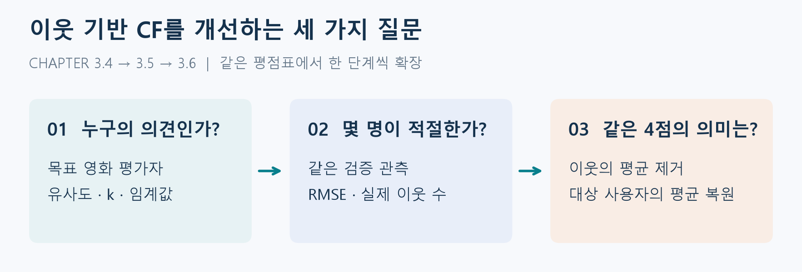
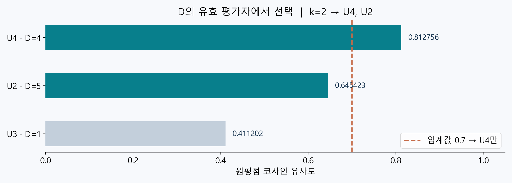
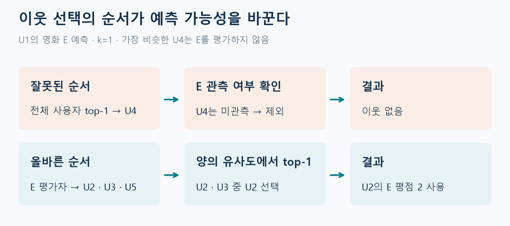
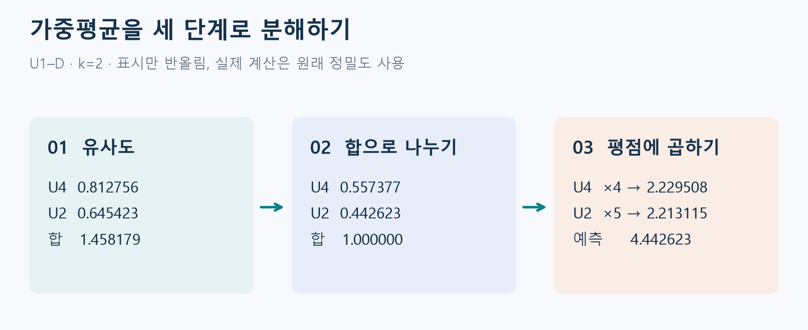
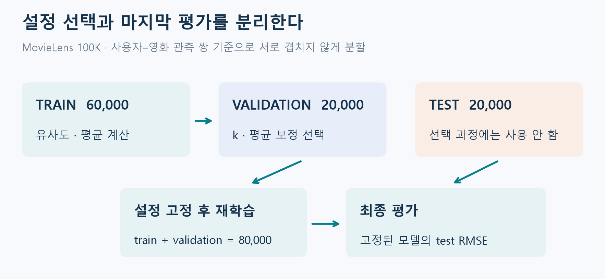
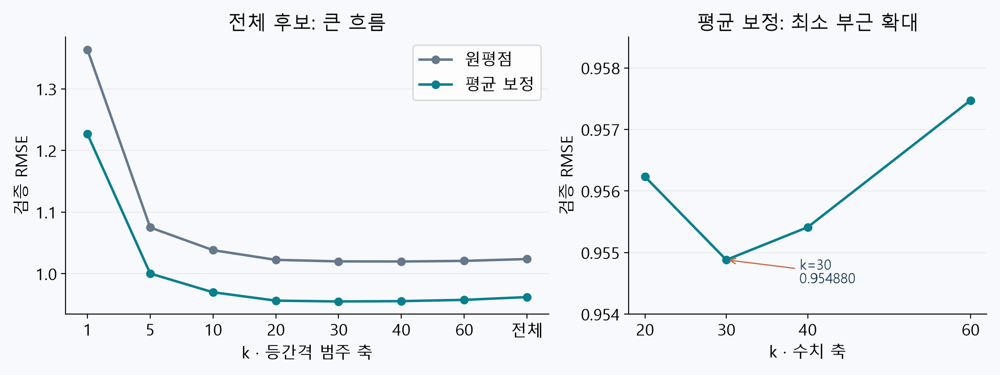
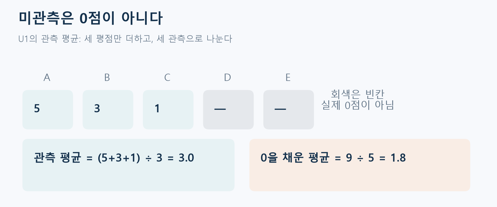
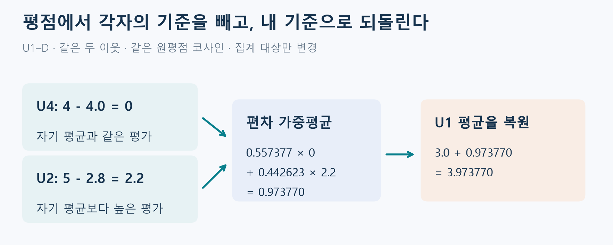
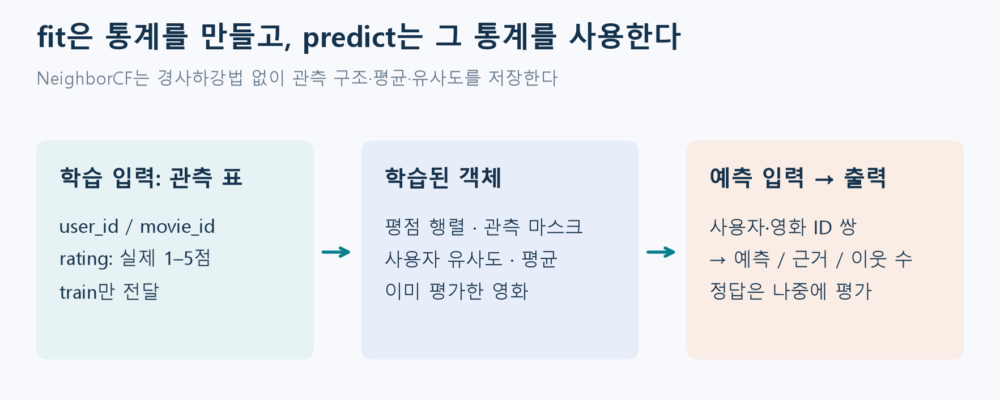
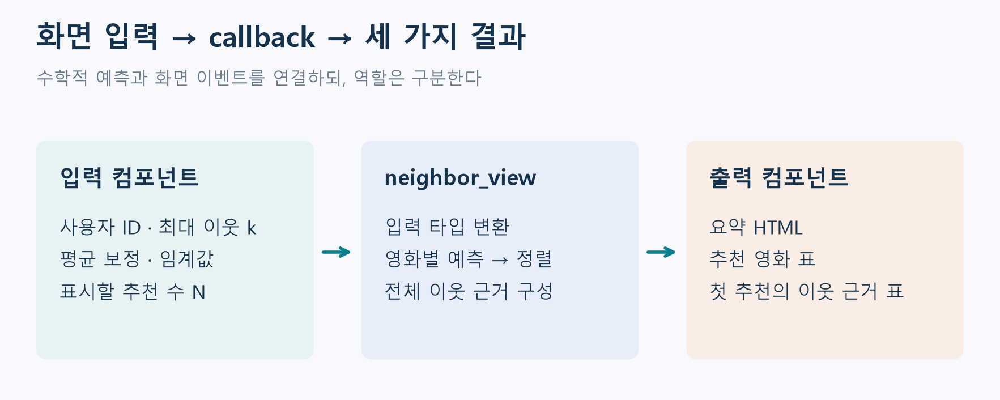

# W04A · 이웃 기반 CF의 개선

**딥러닝응용I(추천시스템) · 동덕여자대학교 데이터사이언스전공 · 유원상 교수 · 2026-2**

2026년 9월 22일 화요일 · 4주차 1차시 · 주교재 3.4–3.6

## 이번 수업의 핵심 질문



그림 1. 오늘의 세 개선은 서로 다른 질문에 답한다. **이웃 선택**은 누구의 의견을 쓸지, **검증**은 몇 명을 쓸지, **평점 보정**은 그 의견을 어떤 기준으로 해석할지를 결정한다.

기본 CF는 유사한 사용자의 평점을 가중평균했다. 오늘은 “누구의 평점을 얼마나 사용하고, 각자의 점수 습관을 어떻게 보정할까?”를 다룬다.

- 목표 영화를 평가한 사람 중 이웃을 선택한다.
- 검증 데이터로 이웃 수를 결정하고 테스트 데이터의 역할을 구분한다.
- 이웃의 평점편차를 집계한 뒤 대상 사용자의 평균으로 되돌린다.
- 기존 추천 앱에 이웃 수와 평균 보정 조절 기능을 추가한다.


[학생 Colab 실습](https://colab.research.google.com/github/lunalab-ai/recommender/blob/2026-fall-w04a-v2/notebooks/student/w04a-neighborhood-cf.ipynb) · [강의 PDF](https://github.com/lunalab-ai/recommender/blob/2026-fall-w04a-v2/course/handouts/w04a-neighborhood-cf.pdf) · [점검 퀴즈 해설 PDF](https://github.com/lunalab-ai/recommender/blob/2026-fall-w04a-v2/course/handouts/w04a-neighborhood-cf-quiz.pdf)

## 1. 출발점: 평점표와 영화별 근거

### 1.1 지난 수업의 계산에서 무엇을 바꾸는가?

지난 시간에는 사용자 사이의 유사도를 먼저 계산하고, 예측할 영화를 평가한 사람들의 평점을 유사도로 가중평균했다. 그러나 유사도가 조금이라도 양수인 사람을 모두 사용하면 나와 거의 관련 없는 평가까지 섞일 수 있다. 반대로 가장 비슷한 한 사람만 쓰면 그 사람의 특이한 평가에 크게 흔들릴 수 있다. 또한 어떤 사람은 대체로 후한 점수를, 다른 사람은 대체로 박한 점수를 준다. 이들의 4점을 같은 의미로 취급해도 되는지 검토해야 한다.

이 수업에서는 정보의 출처를 바꾸지 않는다. 여전히 **사용자–영화–평점**이 입력이고 영화의 줄거리나 장르는 유사도에 사용하지 않는다. 바꾸는 것은 이웃을 고르는 규칙, 그 규칙의 설정값을 정하는 절차, 평점을 집계하는 기준이다.

| 지난 차시에서 이어받는 것 | 이번 차시에서 추가하는 것 |
| --- | --- |
| 관측 평점 행렬과 미관측 마스크 | 목표 영화별 상위 k명·임계값 필터 |
| 전체 영화 차원의 원평점 코사인 | 동일한 이웃 집합에서 두 예측식 비교 |
| 영화별 평점 가중평균 | 사용자 평균을 제거한 편차 가중평균 |
| 학습 관측으로만 통계 계산 | 검증으로 설정 선택 후 최종 테스트 |

### 1.2 한 표를 끝까지 사용하기

다음은 W03B에서 사용한 독자 합성 자료다. MovieLens의 실제 사용자나 일부 자료가 아니다. 대시는 미관측이다.

| 사용자 | A | B | C | D | E | 관측 평균 |
| --- | --- | --- | --- | --- | --- | --- |
| U1 | 5 | 3 | 1 | — | — | 3.0 |
| U2 | 4 | 2 | 1 | 5 | 2 | 2.8 |
| U3 | 1 | 3 | 5 | 1 | 5 | 3.0 |
| U4 | 5 | 3 | — | 4 | — | 4.0 |
| U5 | — | — | — | 2 | 4 | 3.0 |

사용자 $u$가 영화 $i$에 준 관측 평점을 $r_{ui}$, 사용자 유사도를 $s_{uv}$라 하자. 미관측을 0으로 채운 벡터는 코사인 계산에만 쓴다. 평균과 관측 여부는 원본 표에서 계산한다.

$$
s_{uv}=\frac{\boldsymbol{x}_u^{\mathsf T}\boldsymbol{x}_v}{\|\boldsymbol{x}_u\|_2\|\boldsymbol{x}_v\|_2}
$$

이 수업은 지난 차시와 동일한 전체 영화 차원의 원평점 코사인을 유지한다. U1과 U4의 유사도는 약 0.812756, U2는 0.645423, U3은 0.411202, U5는 0이다. **유사도가 높아도 목표 영화를 평가하지 않았다면 그 영화의 예측에는 기여할 수 없다.**

### 1.3 수식의 기호를 표의 행과 열에 연결하기

| 기호 | 읽는 방법 | U1의 D 평점 예측에서 |
| --- | --- | --- |
| $u$ | 추천받을 대상 사용자 | U1 |
| $v$ | 의견을 제공하는 이웃 사용자 | U2, U3, U4 등 |
| $i$ | 평점을 예측할 목표 영화 | D |
| $r_{vi}$ | 이웃이 목표 영화에 실제로 준 평점 | U2의 D는 5 |
| $s_{uv}$ | 대상과 이웃의 유사도 | U1–U2는 약 0.645423 |
| $I_v$ | 사용자가 학습 자료에서 평가한 영화 집합 | U4는 A, B, D |
| $N_{u,i}$ | 목표 영화에 사용할 유효 이웃 집합 | k=2이면 U4, U2 |

평점 표의 빈칸은 **0점 평가가 아니라 관측하지 못한 값**이다. U1의 평균은 $(5+3+1)/3=3$이며, 다섯 영화 중 두 개를 평가하지 않았다고 분모를 5로 늘리지 않는다. 코사인 계산을 위한 벡터에서는 빈칸을 0으로 표현하지만, 그 계산용 표현을 평점 통계와 섞지 않는다.

U1과 U4의 코사인을 한 번 다시 계산해 보자. 영화 순서를 A–E로 고정하면 U1은 $(5,3,1,0,0)$, U4는 $(5,3,0,4,0)$이다.

$$
\boldsymbol{x}_1^{\mathsf T}\boldsymbol{x}_4=5\times5+3\times3+1\times0+0\times4+0\times0=34
$$

$$
s_{14}=\frac{34}{\sqrt{35}\sqrt{50}}\approx0.812756
$$

공통 평가 영화 A·B만으로 벡터를 다시 만드는 계산과 구분한다. 여기서는 전체 영화 축을 유지하므로 U4의 D 평점도 U4 벡터의 길이에 들어간다. 이는 지난 차시와 동일한 설계다. 오늘 평균 보정을 추가해도 이 유사도 정의는 유지한다.

> **확인 Q1.** U4는 U1과 가장 비슷하다. 그렇다면 U1의 미평가 영화 D와 E를 예측할 때 U4를 항상 사용할 수 있을까? 표의 빈칸을 근거로 설명하라.

## 2. 3.4 · 이웃을 고려한 CF

### 2.1 KNN과 Thresholding

KNN(K-Nearest Neighbors)은 유사도가 높은 이웃을 최대 $k$명 고른다. Thresholding은 유사도가 정한 임계값 $\tau$보다 큰 사람을 고른다. 여기서 KNN은 분류기의 다수결이 아니라 평점 예측에 사용할 사용자의 선택이다.

| 선택 방식 | 직접 정하는 값 | 결과로 달라지는 값 |
| --- | --- | --- |
| KNN | 최대 이웃 수 $k$ | 마지막 이웃의 유사도 |
| Thresholding | 유사도 임계값 $\tau$ | 선택된 이웃 수 |
| 함께 적용 | 임계값과 최대 수 | 두 조건을 만족하는 실제 이웃 |



그림은 목표 D의 평가자 중 양의 유사도인 U4·U2·U3만 보여 준다. $k=2$면 U4와 U2, $\tau=0.7$이면 U4만 남는다. 평가자 수가 부족하면 실제 이웃 수는 $k$보다 작다. 우리 구현은 경계에서 엄격한 `similarity > threshold`를 사용한다.

### 2.2 두 선택 규칙의 차이를 숫자로 읽기

KNN에서 k=2는 “정확히 두 사람의 평점을 반드시 확보한다”는 뜻이 아니다. 목표 영화를 평가했고 유사도가 양수인 사람이 한 명뿐이면 한 명만 사용한다. 반대로 Thresholding에서 임계값 0.7은 “한 명을 선택한다”는 뜻이 아니다. 이 예의 D에서 우연히 U4 한 명만 남는 것이다. 다른 사용자나 영화에서는 여러 명 또는 아무도 남지 않을 수 있다.

| U1–D 설정 | 남는 사람 | 실제 인원 | 해석 |
| --- | --- | --- | --- |
| k=1, 임계값 0 | U4 | 1 | 가장 유사한 유효 평가자 |
| k=2, 임계값 0 | U4, U2 | 2 | 평가자 중 두 명까지 |
| k=10, 임계값 0 | U4, U2, U3 | 3 | 설정값보다 후보가 적음 |
| 전체, 임계값 0.7 | U4 | 1 | 유사도가 0.7보다 큼 |
| k=2, 임계값 0.9 | 없음 | 0 | 높은 임계값 때문에 근거 없음 |

두 규칙을 함께 적용할 때에는 유사도 기준을 통과한 평가자 안에서 상위 k명을 사용한다. 임계값과 같은 유사도를 포함할지는 구현 규약이다. 이번 구현은 엄격한 초과 조건이므로 유사도가 임계값과 정확히 같으면 제외한다. 음의 유사도는 반대 취향을 뜻할 수 있지만, 음수 가중치를 어떻게 집계할지는 별도 설계 문제이므로 이번 수업에서는 양의 유사도만 사용한다.

### 2.3 먼저 평가자를 고르고, 그 안에서 이웃을 선택한다

1. 목표 영화 $i$를 평가한 사용자를 남긴다.
2. 대상 사용자 자신과 0 이하 유사도를 제외한다. 임계값이 있으면 함께 적용한다.
3. 유사도 내림차순으로 정렬한다. 동점은 사용자 ID 오름차순으로 고정한다.
4. 최대 $k$명을 고르고 같은 집합으로 분자와 분모를 계산한다.

영화 E에서는 가장 유사한 U4가 E를 평가하지 않았다. 따라서 $k=1$이어도 U2를 골라야 한다. 전체 사용자 중 U4 한 명을 먼저 고른 뒤 E 미평가자를 지우면 유효한 U2를 놓친다.



그림 3. E는 U4가 평가하지 않았다. 잘못된 순서는 U4를 먼저 뽑아 나중에 버리므로 빈 이웃 집합을 만든다. 올바른 순서는 E의 평가자 U2·U3·U5 중 양의 유사도인 U2·U3을 남기고 U2를 고른다. **이웃은 사용자마다 하나의 고정 목록으로 끝나지 않고 목표 영화에 따라 달라진다.**

후보 집합을 먼저 다음과 같이 정의하면 필터의 의미가 분명해진다.

$$
C_{u,i}=\{v:v\ne u,\ r_{vi}\text{가 관측됨},\ s_{uv}>\tau\}
$$

그 안에서 유사도 내림차순 상위 k명을 골라 $N_{u,i}^{(k,\tau)}$를 만든다. 실제 인원은 $m_{ui}=\min(k,|C_{u,i}|)$이며, k=0을 전체 이웃으로 쓰는 것은 이번 코드의 특별한 약속이다. 수학적으로 이웃 0명을 뜻하는 것이 아니다.

선택된 집합을 $N_{u,i}^{(k,\tau)}$라 쓰면 기본 예측은 다음과 같다.

$$
\widehat r_{ui}=\frac{\sum_{v\in N_{u,i}^{(k,\tau)}}s_{uv}r_{vi}}{\sum_{v\in N_{u,i}^{(k,\tau)}}s_{uv}}
$$

### 2.4 D의 평점을 직접 계산하기

U1–D의 $k=2$ 이웃은 U4와 U2다. 반올림하기 전 유사도로 계산한 결과는 약 4.442623점이다.

$$
\widehat r_{1D}=\frac{0.812756\times4+0.645423\times5}{0.812756+0.645423}\approx4.442623
$$

| 이웃 수 | D에 사용한 이웃 | 원평점 예측 |
| --- | --- | --- |
| 1 | U4 | 4.000000 |
| 2 | U4, U2 | 4.442623 |
| 전체 | U4, U2, U3 | 3.685360 |

한 번의 분수 계산으로 끝내지 않고 가중치와 기여도를 나눠 보자. 전체 유사도 합은 약 1.458179이며, 이 값으로 각 유사도를 나누면 가중치 합이 1이 된다.

$$
w_{uv}=\frac{s_{uv}}{\sum_{z\in N_{u,i}}s_{uz}},\qquad \sum_{v\in N_{u,i}}w_{uv}=1
$$

| 계산 단계 | U4 | U2 | 합 또는 결과 |
| --- | --- | --- | --- |
| 유사도 | 0.812756 | 0.645423 | 1.458179 |
| 정규화 가중치 | 0.557377 | 0.442623 | 1.000000 |
| D 평점 | 4 | 5 | 단순평균은 4.5 |
| 가중치 × 평점 | 2.229508 | 2.213115 | **4.442623** |

U4의 가중치가 더 크므로 결과는 단순평균 4.5보다 U4의 4점 쪽에 가깝다. 양의 가중치 합이 1인 평균이므로 두 평점 4와 5 사이에 있어야 한다. 값이 6이나 0이면 분모, ID 정렬, 중복 또는 미관측 처리를 점검한다. k를 3으로 늘리면 U3의 D=1이 들어와 예측이 내려간다. 이것은 이 표의 결과이지 k가 커지면 항상 점수가 내려간다는 법칙이 아니다.



그림 4. 정규화 전 유사도와 정규화 후 가중치를 구분한다. 최종 예측은 오른쪽 두 기여도의 합이다. 분자만 상위 두 명으로 계산하고 분모에는 세 명의 유사도를 넣으면 다른 식이 된다.

> **확인 Q2.** U4와 U2의 평점에 같은 1점을 더하고 이웃과 가중치를 고정하면 예측값은 얼마나 변할까? 가중치의 합을 이용해 설명하라.

### 2.5 코드에서 사용자 대응을 유지하기

행 인덱스가 사용자 ID인 Series끼리는 ID로 정렬해 결합해야 한다. 유사도를 따로 내림차순 정렬한 배열과 원래 순서의 평점 배열을 곱하면 서로 다른 사람의 값을 곱할 수 있다. `pd.concat(..., axis=1)`은 같은 인덱스를 가진 값을 같은 행에 놓는다. 결합한 표 전체를 정렬한 다음 배열로 바꾸는 순서가 안전하다.

수업 모듈은 이 선택을 여러 영화에 대해 효율적으로 수행한다. 내부에서는 유사도 순서가 먼저 저장돼 있어도 영화별 관측 여부를 적용한 뒤 유효한 행을 누적하여 k개까지 남긴다. 즉, 코드에서 정렬이 앞에 보인다는 사실만으로 “잘못된 top-k 후 필터”라고 판단하면 안 된다. **인원 제한이 관측 마스크 적용 전인지 후인지**가 핵심이다.

**$k$와 추천 수 $N$은 다르다.** $k$는 각 영화의 예측에 사용할 사람 수를 제한한다. 추천 수 $N$은 예측을 마친 뒤 화면에 표시할 미평가 영화의 수를 제한한다.

## 3. 3.5 · 최적의 이웃 크기 결정

### 3.1 무조건 작은 값이나 큰 값이 답은 아니다

작은 $k$는 매우 유사한 소수에게 집중하지만 한 사람의 우연한 평점에 민감해질 수 있다. 큰 $k$는 근거를 늘리지만 상대적으로 덜 비슷한 사용자의 의견을 섞는다. 따라서 한쪽 방향의 변화가 항상 성능을 높인다고 보장할 수 없다. 교재의 약 30명이라는 결과는 해당 실험 조건의 관측값이며 보편적 상수가 아니다.

영화별로 평가자 수가 다르므로 설정 $k$와 실제 사용 인원은 다르다. RMSE뿐 아니라 CF 근거가 있었던 비율(coverage), 평균 실제 이웃 수도 함께 본다.

### 3.2 “최적”은 무엇을 최소화한다는 뜻인가?

오늘의 최적 k는 **정해 둔 후보 집합에서 검증 RMSE가 가장 작은 설정**을 뜻한다. 모든 가능한 데이터, 모든 추천 목표에서 영원히 가장 좋은 값이라는 뜻이 아니다. k는 관측 데이터에서 자동으로 계산되는 평점이 아니라 우리가 비교하고 선택하는 하이퍼파라미터다.

작은 k에서는 한 사람의 평점이 예측에 차지하는 비중이 커진다. 큰 k에서는 여러 평가를 평균하지만 관련성이 낮은 이웃의 영향도 누적된다. 전자는 우연한 관측에 민감해질 수 있고, 후자는 개인 취향의 차이를 흐리게 만들 수 있다. “많은 데이터가 좋다”는 말만으로 모든 이웃을 포함하는 선택을 정당화할 수 없다.

> **확인 Q3.** k를 30에서 60으로 늘렸는데 어떤 영화의 실제 이웃 수가 계속 8명이다. 이것을 프로그램 오류라고 볼 수 있는가? 관측 수와 임계값을 이용해 설명하라.

### 3.3 검증으로 선택하고 테스트로 평가한다

이 부분은 교재 내용을 실습에서 신뢰할 수 있게 평가하기 위한 보충 절차다. 같은 테스트 데이터의 점수를 보면서 계속 설정을 고르면 테스트 데이터가 선택 과정에 간접적으로 사용된다.



1. 관측을 train 60%, validation 20%, test 20%로 나눈다.
2. train만으로 평점 행렬, 유사도, 사용자 평균을 만든다.
3. 같은 validation에서 후보 $k$와 평균 보정 여부를 비교한다.
4. 검증 RMSE가 가장 작은 설정을 고정한다.
5. train+validation 80%로 다시 학습한다. test는 선택된 설정만 한 번 평가한다.

$$
\operatorname{RMSE}=\sqrt{\frac{1}{|V|}\sum_{(u,i)\in V}(r_{ui}-\widehat r_{ui})^2}
$$

$V$는 현재 평가에 쓰는 관측 쌍 집합이다. 같은 사용자나 영화가 여러 분할에 등장할 수 있지만 동일한 사용자–영화 관측 쌍이 겹쳐서는 안 된다. 이 실습은 기존 사용자의 가려진 평점 예측이며 미래 시점 평가나 새 사용자 평가는 아니다.

### 3.4 RMSE를 작은 표에서 직접 계산하기

RMSE는 예측값과 실제 평점의 차이를 제곱하여 평균한 뒤 제곱근을 취한다. 오차의 부호를 없애고 큰 오차를 더 강하게 반영한다. 다음은 계산법을 익히기 위한 독립 예제이며 MovieLens 측정값이 아니다.

| 관측 | 실제 평점 | 예측 평점 | 오차: 실제−예측 | 제곱오차 |
| --- | --- | --- | --- | --- |
| 첫 번째 | 5 | 4 | 1 | 1 |
| 두 번째 | 2 | 3 | −1 | 1 |
| 세 번째 | 4 | 4 | 0 | 0 |

$$
\operatorname{RMSE}=\sqrt{\frac{1+1+0}{3}}=\sqrt{\frac23}\approx0.816497
$$

분모는 사용자 수나 영화 수가 아니라 **평가에 사용한 관측 평점의 수**다. 오차를 단순히 더하면 1과 −1이 상쇄되지만, RMSE에서는 둘 다 제곱오차 1로 남는다. 반환값의 단위는 원래 평점과 같다. 다만 RMSE가 0.8이라는 결과를 “모든 영화에서 정확히 0.8점 틀린다”라고 읽지는 않는다.

이번 표는 관측별 평균이므로 평가 관측이 많은 사용자가 전체 점수에 더 큰 비중을 갖는다. 사용자별 RMSE를 먼저 계산한 뒤 사용자 간 평균을 구하면 다른 평가 기준이 된다. 서로 다른 기준의 값을 같은 열에서 비교하지 않는다.

### 3.5 학습·검증·테스트를 나누는 이유

`fit`에 전달하는 train은 유사도와 평균을 만드는 자료다. validation은 k와 평균 보정 여부를 선택하는 자료다. test는 설정 선택을 끝낸 뒤 성능을 보고하는 자료다. validation이나 test의 평점을 평균 계산에 미리 넣으면 정답 일부를 예측기의 재료로 쓴 셈이다. 이것이 데이터 누수다.

같은 validation에 여러 후보를 적용해야 k의 차이를 비교할 수 있다. 후보마다 데이터를 새로 무작위 분할하면 성능 차이가 설정 때문인지 분할 때문인지 구별하기 어렵다. 난수 seed를 고정하면 이번 분할을 재현할 수 있지만, 그 seed 하나에서의 결과가 모든 분할을 대표한다는 보장은 없다.

바깥 분할에서 100,000행 중 20%를 test로 남기면 80,000행이 남는다. 그 80,000행의 25%인 20,000행을 validation으로 떼면 train은 60,000행이다. 20%와 25%가 서로 다른 모집단에 적용된다는 점을 주의한다. 최종 설정을 고정한 뒤에는 train과 validation을 합친 80,000행으로 평균과 유사도를 다시 계산한다. test 20,000행은 이 재학습에도 포함하지 않는다.

### 3.6 이번 수업에서 실제 측정한 결과

MovieLens 100K의 943명·1,682편·100,000평점을 사용했다. 바깥 분할 seed는 `20260922`, 내부 분할 seed는 `20260923`이다. 사용자 층화 분할을 사용했고 임계값은 0, 자기 자신은 제외했다. 두 방식 모두 같은 원평점 코사인을 사용한다. 점수는 최종 1–5 범위 제한 후 계산했다.

| k | 원평점 검증 RMSE | 평균 보정 검증 RMSE | 평균 실제 이웃 수 |
| --- | --- | --- | --- |
| 1 | 1.363573 | 1.226644 | 1.00 |
| 5 | 1.074973 | 1.000196 | 4.95 |
| 10 | 1.038166 | 0.969805 | 9.79 |
| 20 | 1.022414 | 0.956232 | 19.07 |
| 30 | 1.019916 | 0.954880 | 27.77 |
| 40 | 1.019763 | 0.955412 | 35.78 |
| 60 | 1.020737 | 0.957472 | 49.75 |
| 전체(0) | 1.023732 | 0.961973 | 98.44 |



이번 후보 중 검증 최저는 **k=30, 평균 보정**, 검증 RMSE **0.954880**였다. 이 설정을 고정해 80,000행으로 재학습한 뒤 20,000개 테스트 관측에서 한 번 측정한 RMSE는 **0.934536**다. 테스트 CF coverage는 99.80%이고 clip이 적용된 예측은 245개였다. 이 결과는 교재의 실험 결과와 별개다.

이 수치는 이 구현·분할·후보 설정에 한정된다. 점수가 낮다고 모든 사용자에게 더 좋은 추천 순서를 제공한다고 결론 내리지는 않는다. 원평점/보정 방식의 근거 부족 대체 규칙도 다르므로 차이를 오직 한 수식의 효과로만 해석하지 않는다.

### 3.7 그래프와 보조 지표를 함께 읽기

두 곡선의 세로축은 같은 검증 관측에 대한 RMSE다. 먼저 k=1에서 k=10으로 갈 때의 큰 개선을 보고, 그다음 k=20–60 주변의 작은 차이를 본다. 평균 보정의 k=30과 40 차이는 약 0.000531점이다. 이번 후보의 최소값은 30이지만 이 작은 차이만으로 30이 언제나 확실히 우월하다고 말할 수 없다. 반복 분할이나 교차검증으로 안정성을 확인하는 것은 후속 실험이다.

`coverage`는 전체 평가 관측 중 실제 이웃의 CF 계산으로 예측한 비율이다. 영화 평균 등으로 대체한 행도 RMSE에는 포함되지만 CF coverage에는 포함되지 않는다. 모든 행에 최종 예측값이 존재한다는 것과 모든 행에 이웃 근거가 있다는 것은 다르다. `mean_neighbors`는 행별 실제 이웃 수의 평균이다. k=30에서도 평균이 27.77인 이유는 일부 영화에서 후보가 부족하기 때문이다.

| 함께 기록할 것 | 확인하려는 문제 |
| --- | --- |
| 검증 RMSE | 같은 관측에서 평점 오차가 작아지는가? |
| CF coverage | 평균 대체가 아닌 이웃 근거가 얼마나 있는가? |
| 평균 실제 이웃 수 | 설정한 k가 실제로 얼마나 사용되는가? |
| 대체 규칙·clip 여부 | 비교하는 방식의 다른 차이는 무엇인가? |
| 분할·seed·후보 목록 | 같은 실험을 다시 재현할 수 있는가? |

> **확인 Q4.** 검증표를 본 뒤 test에서 k=20·30·40을 모두 비교하고 가장 좋은 값만 보고했다. 어떤 단계에서 test의 역할이 바뀌었는가?

## 4. 3.6 · 사용자의 평가 경향을 고려한 CF

### 4.1 같은 4점도 의미가 다를 수 있다

평소 4점을 주는 사람의 4점은 보통 수준이다. 평소 2.8점을 주는 사람의 5점은 평소보다 2.2점 높은 평가다. 점수 자체 대신 “그 사람의 평소 수준에서 얼마나 벗어났는가?”를 비교한다.

사용자 $v$가 train에서 평가한 영화 집합을 $I_v$라 하면 관측 평균과 편차는 다음과 같다.

$$
\overline r_v=\frac{1}{|I_v|}\sum_{j\in I_v}r_{vj},\qquad d_{vi}=r_{vi}-\overline r_v
$$

`R.mean(axis=1)`은 영화 열들을 가로질러 사용자별 평균을 계산한다. pandas는 기본적으로 NaN을 제외한다. `R.fillna(0).mean(axis=1)`은 미관측을 0점으로 취급하므로 여기서 사용하지 않는다.

평가 경향은 **평소 점수 수준**에 관한 통계다. 평균이 높은 사용자에게 언제나 모든 영화가 더 좋다는 뜻은 아니다. 평균은 평가한 영화의 구성에도 영향을 받는다. 이 보정은 사용자의 심리를 완벽히 분리하는 모형이 아니라, 평점 수준 차이를 단순한 기준으로 반영하는 방법이다.

| 사용자 | 관측 평점의 합 | 관측 수 | 관측 평균 | 0을 채워 평균냈을 때 |
| --- | --- | --- | --- | --- |
| U1 | 9 | 3 | 3.0 | 1.8 |
| U2 | 14 | 5 | 2.8 | 2.8 |
| U4 | 12 | 3 | 4.0 | 2.4 |

0을 채운 평균은 평가 횟수가 적다는 사실을 낮은 선호로 바꿔 버린다. U1이 미평가한 D와 E에 실제로 0점을 준 것은 아니다. 따라서 학습용 원본 행렬의 NaN을 유지한 채 관측된 값만 평균한다. 또한 U1의 평균을 구할 때에는 U1의 행을 읽어야 하므로 `axis=1`이며, `axis=0`은 영화별 열 평균이다.



그림 6. 파란 칸은 실제 관측, 회색 칸은 미관측이다. 빈칸을 0점으로 바꾸면 합은 같아도 분모가 3에서 5로 바뀐다. 관측이 적은 사용자의 평균을 인위적으로 낮추게 된다.

### 4.2 이웃의 편차를 집계하고 내 평균을 더한다

$$
\widehat r_{ui}=\overline r_u+\frac{\sum_{v\in N_{u,i}^{(k,\tau)}}s_{uv}(r_{vi}-\overline r_v)}{\sum_{v\in N_{u,i}^{(k,\tau)}}s_{uv}}
$$

수식의 역할을 세 단계로 읽는다.

1. **이웃 기준 제거:** 각 이웃의 평점에서 그 이웃의 관측 평균을 뺀다.
2. **편차 집계:** 같은 이웃 집합과 유사도 가중치로 편차를 평균한다.
3. **내 기준 복원:** 대상 사용자 $u$의 관측 평균을 더한다.

여기서 코사인 유사도는 원평점 벡터로 계산한 값을 그대로 사용한다. 평균을 뺀 벡터의 코사인이나 Pearson 유사도로 바꾸는 것은 별도의 설계 변경이다.

### 4.3 같은 U1–D, 같은 두 이웃

| 이웃 | D 평점 | 이웃 평균 | D 편차 | 정규화 가중치 |
| --- | --- | --- | --- | --- |
| U4 | 4 | 4.0 | 0.0 | 0.557377 |
| U2 | 5 | 2.8 | 2.2 | 0.442623 |

$$
\widehat r_{1D}=3.0+(0.557377\times0+0.442623\times2.2)\approx3.973770
$$

원평점 방식은 약 4.442623, 평균 보정은 약 3.973770이다. U4의 4점을 U1에게 그대로 옮기는 대신 U4 기준으로 보통이라는 정보(편차 0)를 사용한다. 원점수의 크기만 보고 “보정하면 항상 낮아진다”라고 일반화할 수는 없다.



### 4.4 왜 마지막에 내 평균을 더하는가?

편차 0.973770은 평점 자체가 아니다. 선택된 이웃들이 D를 각자의 평균보다 얼마나 높게 평가했는지를 요약한 값이다. 이것을 U1의 평점 척도로 돌려놓기 위해 U1의 평균 3을 더한다. U4나 U2의 평균을 마지막에 한 번 더 더하면 대상 사용자가 아닌 이웃의 기준으로 돌아간다.

평균 보정식은 원평점 예측과 다음처럼 연결된다. 여기서는 **같은 이웃·같은 가중치·clip 전**이라는 조건이 중요하다.

$$
\widehat r_{ui}^{\mathrm{centered}}=\widehat r_{ui}^{\mathrm{raw}}+\overline r_u-\sum_{v\in N_{u,i}}w_{uv}\overline r_v
$$

즉, 원평점 예측에서 이웃들의 가중평균 점수 수준을 빼고 대상 사용자의 평균을 더한다. U1–D의 이웃 평균 가중합은 약 3.468852이므로, 4.442623에서 3.468852를 빼고 3을 더하면 3.973770이다. 대상 평균이 이웃 평균 가중합보다 높다면 보정 후 예측이 오를 수도 있다.

이 등식은 “평균 보정이면 항상 낮아진다”는 오해를 고쳐 준다. 보정의 방향은 대상과 이웃의 기준 수준 차이로 결정된다. clip이 적용되면 최종 화면 값끼리는 이 등식이 그대로 성립하지 않을 수 있으므로 `raw_prediction`을 비교한다.

> **확인 Q5.** 모든 이웃의 목표 영화 평점이 각자 평균과 정확히 같다면 평균 보정 예측은 무엇이 되는가? 두 단계로 설명하라.

### 4.5 평균 보정과 Pearson 유사도를 혼동하지 않기

평균을 빼는 연산이 등장한다고 두 방법이 같은 것은 아니다. Pearson 유사도는 **누가 비슷한지 측정하는 단계**에서 중심화한 패턴을 비교한다. 이번 평점편차 CF는 원평점 코사인으로 선택한 이웃을 유지하고 **그 이웃의 의견을 집계하는 단계**에서 사용자 평균을 제거한다.

| 비교 항목 | 이번 수업의 평점편차 CF | 유사도를 Pearson으로 변경 |
| --- | --- | --- |
| 바꾸는 위치 | 선택된 평점을 집계하는 식 | 사용자 유사도 계산 |
| 이웃 순서 | 같은 k·임계값에서 유지 | 바뀔 수 있음 |
| 중심화 기준 | 각 이웃의 train 관측 평균 | Pearson의 관측 범위·평균 정의에 따름 |
| 별도 검토 | 대상 평균 복원·범위 제한 | 공통 관측 수·분산 0·음수 유사도 |

두 변경을 동시에 적용할 수도 있지만, 그러면 어떤 변경이 성능 차이를 만들었는지 따로 비교해야 한다. 오늘은 집계식의 변화에 집중하기 위해 유사도 정의를 고정한다.

### 4.6 경계 조건도 예측의 일부다

| 조건 | 이번 실습의 처리 | 표시되는 근거 |
| --- | --- | --- |
| 유효 이웃이 1명 | 그 1명의 평점/편차 사용 | `cf`, 실제 이웃 1 |
| 보정 모드, 알려진 사용자, 이웃 없음 | train 사용자 평균 | `user-mean` |
| 그 외 이웃 없음, 알려진 영화 | train 영화 평균 | `movie-mean` |
| 사용자·영화가 모두 미등록 | train 전체 평균 | `global-mean` |
| 보정값이 범위 밖 | clip 전 값을 보존하고 최종값을 1–5로 제한 | `raw_prediction`, `prediction` |

교재 예제의 최소 이웃 처리와 이번 구현은 다르다. 교재 코드는 이웃이 1명 이하인 경우 원평점 방식에서 3점, 보정 방식에서 사용자 평균으로 대체한다. 여기서는 양의 근거가 1명이라도 있으면 사용한다. 이 차이를 숨긴 채 교재와 같은 RMSE를 기대해서는 안 된다.

원평점 양의 가중평균은 관측 평점 범위 안에 있지만, 대상 평균을 더한 편차 예측은 범위를 벗어날 수 있다. 근거 표의 합은 **clip 전 값**과 비교해야 한다.

범위 제한의 독립 예를 보자. 대상 평균이 4.5이고 이웃 편차의 가중평균이 1.0이면 clip 전 예측은 5.5다. 최종 평점 범위가 1–5이므로 화면에는 5를 표시한다. 근거를 검산할 때는 4.5+1.0=5.5와 비교하고, 그다음 범위 제한을 별도 단계로 확인한다. clip이 과도하게 자주 발생하면 단순히 화면만 예쁘게 만드는 것으로 끝내지 않고 예측식과 데이터의 적합성을 살펴야 한다.

유효 이웃이 없을 때 평균으로 대체하는 규칙도 모델의 일부다. “항상 3점”, “사용자 평균”, “영화 평균”은 같은 정책이 아니다. 예측과 함께 `basis`를 보여 주는 이유는 학생이 대체 예측을 CF 계산 결과로 오해하지 않도록 하기 위해서다.

> **확인 Q6.** 근거 표의 기여도 합에 대상 평균을 더한 값은 5.5인데 화면은 5.0이다. 계산 오류인지 판단하려면 어떤 출력 열을 확인해야 하는가?

## 5. 실습 · 이웃 설정을 조절하는 추천 앱

### 5.1 첫 셀부터 실행하기

Colab CPU 런타임에서 학생 실습을 연다. 첫 셀은 고정 수업 버전 `2026-fall-w04a-v2`와 Gradio를 설치한다. 런타임 재시작 안내가 나오면 재시작한 뒤 첫 셀부터 실행한다. 데이터는 공식 배포처에서 자동 준비하며 재실행은 캐시를 사용한다.

기본 모드는 `real`이다. 다운로드 실패를 합성 자료 성공으로 숨기지 않는다. 네트워크 사용이 불가능할 때만 `DATA_MODE="synthetic"`을 직접 선택한다. 이때 화면에 합성이라고 표시되고 위 MovieLens 측정값과 비교할 수 없다.

### 5.2 `fit`은 무엇을 저장하는가?

`NeighborCF`는 지난 차시의 `UserCF`를 확장한 클래스다. 생성자는 설정을 보관한다. `fit(train)`은 관측 표를 행렬로 바꾸고, 관측 마스크·사용자 유사도·사용자와 영화 평균·이미 평가한 영화 집합을 계산하여 객체에 저장한다. 이 통계를 이용해 여러 쌍의 평점을 반복 예측할 수 있다.

여기서 `fit`은 경사하강법으로 신경망 가중치를 학습하는 함수가 아니다. 평점과 관측 구조에서 필요한 통계를 구성하는 단계다. k의 최적화도 `fit`이 자동으로 수행하지 않는다. 설정을 비교하는 `validation_sweep`와 검증표의 선택 과정이 별도로 필요하다.



그림 8. 학습 때는 정답 평점이 필요하지만 예측 때는 사용자·영화 ID만 전달한다. 실제 정답은 예측이 끝난 뒤 평가 함수에 전달한다. 화살표의 방향을 뒤집어 test 평점을 학습 상태에 넣지 않는다.

| 객체의 상태 | 저장하는 내용 | 학습 후 모양 |
| --- | --- | --- |
| `rating_matrix_` | 원평점과 미관측 NaN | 사용자 수 × 영화 수 DataFrame |
| `similarity_` | 사용자 간 원평점 코사인 | 사용자 수 × 사용자 수 DataFrame |
| `user_means_` | 관측 사용자 평균 | 사용자 ID 인덱스 Series |
| `seen_` | 사용자가 이미 평가한 영화 | 사용자별 영화 ID 집합 |

생성자 직후에는 이 상태가 없으므로 예측할 수 없다. `fit`은 자기 자신을 반환하므로 `NeighborCF(...).fit(train)`처럼 연결할 수 있다. 원래 입력 표를 직접 수정하지 않으며, 이 클래스 자체는 파일 다운로드를 수행하지 않는다. 데이터 준비 함수의 역할과 구별한다.

### 5.3 재사용 API 읽기

```python
model = NeighborCF(k=20, centered=True, threshold=0.0)
model.fit(train)
details = model.predict_details(pairs)
evidence = model.explain(user_id=1, movie_id=4)
```

| API | 입력 → 출력 | 주의할 점 |
| --- | --- | --- |
| `NeighborCF(k,centered,threshold)` | 설정 → 모델 객체 | k=0은 전체 이웃 |
| `fit(train)` | 관측 표 → 학습된 자기 자신 | 평가 정답을 섞지 않음 |
| `predict_details(pairs)` | ID 두 열 → 예측/실제 인원/근거 종류 | rating 열은 읽지 않음 |
| `explain(u,i)` | 사용자·영화 ID → 전체 선택 이웃 표 | 보정 시 평균+기여도합 확인 |
| `validation_sweep(train,val)` | 분리된 두 관측 표 → 검증 비교표 | test 입력 없음 |
| `neighbor_view(...)` | 모델과 화면 설정 → 요약/추천/근거 | 서버 없이 callback 확인 가능 |

[모델 정의와 docstring](https://github.com/lunalab-ai/recommender/blob/2026-fall-w04a-v2/src/luna_recsys/neighborhood.py#L11) · [앱과 callback 정의](https://github.com/lunalab-ai/recommender/blob/2026-fall-w04a-v2/src/luna_recsys/neighborhood_app.py#L8)

### 5.4 입력과 반환값을 실제 코드에 연결하기

`train`은 한 행이 하나의 관측인 pandas DataFrame이다. `user_id`, `movie_id`, `rating` 세 열이 필요하고 평점은 1–5 범위다. 같은 사용자–영화 쌍의 중복은 허용하지 않는다. `pairs`에는 예측할 `user_id`, `movie_id`만 있으면 된다. 두 표의 행 수가 같을 필요는 없다.

```python
train_toy = toy_ratings()           # 18개의 관측, 5명·5편
model = NeighborCF(k=2, centered=True)
model.fit(train_toy)               # 행렬·유사도·평균 구성
pairs = pd.DataFrame({"user_id": [1], "movie_id": [4]})
details = model.predict_details(pairs)
evidence = model.explain(user_id=1, movie_id=4)
```

이 호출은 한 행의 예측 상세 표와 두 행의 이웃 근거 표를 만든다. `details`의 인덱스와 행 순서는 `pairs`를 따른다. `evidence`는 선택된 이웃 전체를 유사도 내림차순으로 반환한다. 동점에서는 사용자 ID 순서가 일정하도록 처리한다. 이는 결과를 반복 실행했을 때 순서가 불필요하게 바뀌는 것을 막는다.

| 상세 예측 열 | 의미 | 위 호출의 기대값 |
| --- | --- | --- |
| `prediction` | 1–5로 제한한 최종 평점 | 약 3.973770 |
| `raw_prediction` | 제한하기 전 계산 결과 | 약 3.973770 |
| `basis` | CF 또는 평균 대체 종류 | `cf` |
| `n_contributors` | 실제 선택된 이웃 수 | 2 |
| `weight_sum` | 정규화 전 유사도 합 | 약 1.458179 |

`evidence`의 `similarity`는 정규화 전 유사도, `weight`는 합이 1인 가중치다. `rating`은 목표 영화의 관측 평점, `user_mean`은 해당 이웃의 train 평균, `deviation`은 두 값의 차이다. `contribution`은 원평점 모드에서는 가중치×평점이고 보정 모드에서는 가중치×편차다. 같은 열 이름이라도 설정에 따라 집계 대상이 달라진다는 점을 읽어야 한다.

#### 데이터를 준비하고 분할하는 함수

`prepare_movielens(cache_dir, mode="real")`은 캐시 경로를 받아 준비 결과 객체를 반환한다. `prepared.data`에 사용자·영화·평점 표가 있고 `prepared.description`과 `prepared.mode`로 실제 또는 합성 모드를 확인한다. 최초 호출은 네트워크 다운로드와 로컬 캐시 저장이 발생할 수 있다. 캐시가 있으면 재사용한다. `split_ratings(ratings, test_size=..., seed=...)`는 원본 표를 바꾸지 않고 `train`, `test`를 가진 분할 결과를 반환한다. 내부 validation 분할에서는 반환 필드 이름이 `test`여도 역할은 validation이다.

#### 검증표를 만드는 함수

`validation_sweep(train, validation, k_values)`는 각 k와 보정 여부 두 가지를 비교한다. k 후보 8개면 반환 표는 16행이다. `rmse`, `coverage`, `mean_neighbors`를 포함하고 RMSE가 작은 순서로 정렬한다. `scores.iloc[0]`은 정수 위치 0의 첫 행이므로 최저 설정을 가리킨다. `.loc[0]`의 인덱스 라벨 접근과 개념적으로 구별한다. 이 함수는 train과 validation의 관측 쌍이 겹치면 오류를 낸다.

### 5.5 앱의 입력과 출력 연결

`사용자 ID, k, 평균 보정, 임계값, N` → 버튼의 callback → 같은 학습 통계로 새 예측 → 추천 목록과 첫 추천의 전체 이웃 근거.

화면 조작은 재학습이나 테스트 데이터 선택이 아니다. 검증용 모델로 설정의 효과를 살펴보는 탐색이다. 기존 기본 CF와 네 방법 비교 탭도 함께 유지한다. Gradio 공유 링크는 런타임이 종료되면 작동하지 않으므로 수업의 영구 링크는 Colab 링크다.



그림 9. 화면 입력의 순서와 함수 인자의 의미를 맞추고, 반환값 세 개를 출력 컴포넌트 세 개에 대응시킨다. 모델의 예측 논리와 화면을 연결하는 부분이 callback이다.

`neighbor_view(model, movies, user_id, k, centered, threshold, top_n)`의 반환값은 `(summary, rows, evidence)` 튜플이다. `summary`는 설정과 결과를 설명하는 HTML 문자열, `rows`는 추천 표, `evidence`는 첫 추천 영화의 전체 이웃 근거 표다. `movies`에는 영화 ID와 제목이 있어야 한다. `top_n`은 화면에 표시할 영화 수이며 원래 평점 예측식의 k와 다르다.

```python
summary, rows, evidence = neighbor_view(
    model=app_model, movies=data.movies, user_id=1,
    k=10, centered=True, threshold=0.0, top_n=5,
)
```

이 함수 호출만으로 웹 서버가 시작되지는 않는다. 먼저 표를 검사할 수 있고, 이후 Gradio 버튼의 이벤트가 같은 함수를 호출하도록 연결한다. 앱은 요청마다 설정을 복사해 사용하므로 한 사용자의 화면 조작이 다른 사용자의 공유 모델 설정을 바꾸지 않는다. `build_neighbor_app`은 화면을 구성하고, 마지막 `launch`가 실행 서버를 연다. 생성·연결·실행의 역할을 구별하자.

> **확인 Q7.** k를 고정하고 N만 5에서 3으로 줄였다. 같은 영화의 예측 평점이 바뀌어야 하는가? 예측 단계와 표시 단계를 구별하라.

### 5.6 실습에서 수행할 여섯 활동

- E1: 목표 영화 평가자 필터와 top-k 순서를 완성한다.
- E2: 유사도만 따로 정렬해서 생긴 평점 대응 오류를 고친다.
- E3: test 대신 validation에서 설정을 선택한다.
- E4: 행 평균·이웃 평균 제거·대상 평균 복원을 점검한다.
- E5: 원평점과 평균 보정 추천을 근거 표로 비교한다.
- E6: 화면 입력과 callback 인자의 순서를 연결한다.

활동의 빈칸은 독립 시연을 막지 않도록 구성했다. 먼저 예상과 근거를 적은 뒤 실행한다. 별도로 제출하는 채점 과제는 없다.

### 5.7 실습 중 결과가 예상과 다를 때

| 증상 | 먼저 확인할 것 | 확인하는 이유 |
| --- | --- | --- |
| k=30인데 실제 이웃이 3명 | 목표 영화 평가자 수·임계값 | k는 최대 수이기 때문 |
| D와 E의 이웃이 다름 | 각 영화의 관측 마스크 | 목표별 후보가 다르기 때문 |
| 정규화 가중치 합이 1이 아님 | 분모와 선택 집합 | 분자·분모는 같은 이웃이어야 함 |
| 사용자 평균이 지나치게 작음 | NaN을 0으로 채웠는지 | 미관측이 0점으로 섞일 수 있음 |
| 표의 합과 화면 점수가 다름 | `raw_prediction`, clip 여부 | 편차 집계 뒤 범위 제한이 별도 적용됨 |
| 교재와 RMSE가 다름 | 데이터·분할·대체·clip 규칙 | 알고리즘 이름만 같아도 실험은 다를 수 있음 |
| Colab 공유 링크가 열리지 않음 | 해당 런타임 실행 상태 | 공유 서버는 영구 배포가 아님 |

> **확인 Q8.** k를 고르는 실험에서 평균은 전체 평점으로 미리 계산하고 유사도만 train으로 계산했다. 왜 여전히 데이터 누수인가?

## 점검 퀴즈

1. 이웃 수 k와 추천 수 N은 각각 무엇을 제한하는가?
2. 목표 영화의 미평가자를 제거하는 일과 상위 k명 선택 중 무엇을 먼저 해야 하는가?
3. KNN과 Thresholding은 이웃 수와 유사도 중 무엇을 직접 통제하는가?
4. 검증 RMSE가 최소인 k를 찾을 때 테스트 데이터를 반복 사용하면 어떤 문제가 생기는가?
5. 사용자 평균을 구할 때 미관측 평점을 0으로 채운 표를 사용하면 안 되는 이유는 무엇인가?
6. 평점편차 기반 CF에서 이웃 평균을 빼고 마지막에 대상 사용자 평균을 더하는 이유는 무엇인가?
7. 평균 보정 후 예측이 5를 넘거나 유효 이웃이 없으면 어떻게 해석해야 하는가?

## 오늘 가져갈 세 문장

1. 이웃은 목표 영화별로 선택하며 k는 최대 수다.
2. 이웃 크기는 검증으로 선택하고 테스트는 마지막 평가에 남긴다.
3. 사용자 평점편차를 모은 뒤 대상 사용자 평균으로 되돌린다.

## 참고자료와 출처 구분

- 주교재 3.4–3.6: 이웃 선택, 이웃 크기, 사용자 평가 경향 보정의 용어와 설명 흐름을 따른다. 그림3-2/3-3은 개념만 참고했으며 본문의 도식·합성 예·코드·측정 그래프는 수업용 독립 제작이다. 교재 스캔과 출판사 코드를 배포하지 않는다.
- [Surprise 공식 k-NN 문서](https://surprise.readthedocs.io/en/stable/knn_inspired.html): 원평점/사용자 평균 보정 수식 교차 확인. 이 실습은 Surprise 패키지 실행이 아닌 자체 구현이다.
- [scikit-learn 공식 교차검증 안내](https://scikit-learn.org/stable/modules/cross_validation.html): 검증과 최종 테스트의 역할을 구분하는 보충 설명.
- [GroupLens MovieLens 100K](https://grouplens.org/datasets/movielens/100k/): 실제 데이터의 공식 배포처. 원본을 이 저장소에 재배포하지 않는다.
- [W03B 계산 복습](https://github.com/lunalab-ai/recommender/blob/2026-fall-w03b/course/notion/sessions/w03b-cf-step-by-step.md): 관측 마스크·코사인·가중평균의 연결.

외부 문서와 측정 조건 확인: 2026-09-22. 검증 데이터 분리, 명시적 대체/clip 정책, 앱의 근거 표시는 이해와 재현성을 위한 수업 보충이다.

공통 API 상세: [NeighborCF 생성·학습](https://github.com/lunalab-ai/recommender/blob/2026-fall-w04a-v2/src/luna_recsys/neighborhood.py#L11), [예측 상세](https://github.com/lunalab-ai/recommender/blob/2026-fall-w04a-v2/src/luna_recsys/neighborhood.py#L57), [이웃 근거](https://github.com/lunalab-ai/recommender/blob/2026-fall-w04a-v2/src/luna_recsys/neighborhood.py#L100), [검증 비교](https://github.com/lunalab-ai/recommender/blob/2026-fall-w04a-v2/src/luna_recsys/neighborhood.py#L124), [데이터 준비](https://github.com/lunalab-ai/recommender/blob/2026-fall-w04a-v2/src/luna_recsys/datasets.py#L62), [관측 분할](https://github.com/lunalab-ai/recommender/blob/2026-fall-w04a-v2/src/luna_recsys/evaluation.py#L28).

표준 API 참고: [pandas concat](https://pandas.pydata.org/docs/reference/api/pandas.concat.html), [DataFrame.mean](https://pandas.pydata.org/docs/reference/api/pandas.DataFrame.mean.html), [RMSE](https://scikit-learn.org/stable/modules/generated/sklearn.metrics.root_mean_squared_error.html), [Gradio Blocks](https://www.gradio.app/docs/gradio/blocks).
