# W04B · 협업 필터링 총정리

**CF 정확도 개선 · 사용자·아이템 기반 CF · 성과측정**

**딥러닝응용I(추천시스템) · 동덕여자대학교 데이터사이언스전공 · 유원상 교수 · 2026-2**

2026년 9월 23일 수요일 · 4주차 2차시 · 주교재 3.7–3.9 및 3장 총정리

원래 9월 24일 목요일 수업을 추석연휴로 9월 23일로 변경했습니다.

## 이번 수업에서 연결할 것

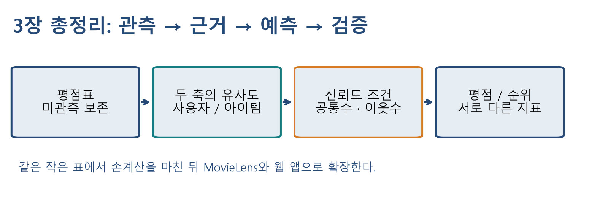

그림 1. 같은 관측 자료라도 이웃의 축, 근거의 양, 평가 질문에 따라 결과를 다르게 읽어야 한다.

이번 수업의 목표는 유사도 숫자를 계산하는 데서 한 걸음 더 나아가 **그 숫자를 믿을 근거가 충분한지, 어떤 정보를 집계했는지, 무엇을 잘했다고 평가하는지** 설명하는 것이다. 먼저 작은 평점표로 직접 계산하고, 동일한 알고리즘을 MovieLens와 웹 앱에서 실행한다.

- 공통 평가 수와 최소 유효 이웃 수를 서로 다른 조건으로 적용한다.
- 사용자 기반 CF와 아이템 기반 CF를 행렬의 행·열, 예측에 쓰는 평점으로 구별한다.
- 평점 오차, 순위 지표, coverage의 분모를 말하고 손으로 계산한다.
- 학습·검증·테스트를 분리하여 설정 변화와 추천 결과를 해석한다.

실습 파일은 `notebooks/student/w04b-cf-synthesis.ipynb`이다. [학생 Colab 실습](https://colab.research.google.com/github/lunalab-ai/recommender/blob/2026-fall-w04b/notebooks/student/w04b-cf-synthesis.ipynb)을 열고 첫 셀부터 실행한다. 수업 코드와 아래 링크는 고정 버전 `2026-fall-w04b`를 사용한다.

## 1. 3장 전체를 한 평점표에 연결하기

### 1.1 데이터 → 유사도 → 이웃 → 가중평균

다음은 W03B·W04A와 같은 독자 합성 자료다. 실제 MovieLens 사용자 자료가 아니다. A–E는 영화 ID 1–5, U1–U5는 사용자 ID 1–5다. 물음표는 **미관측**이며 실제 0점이 아니다.

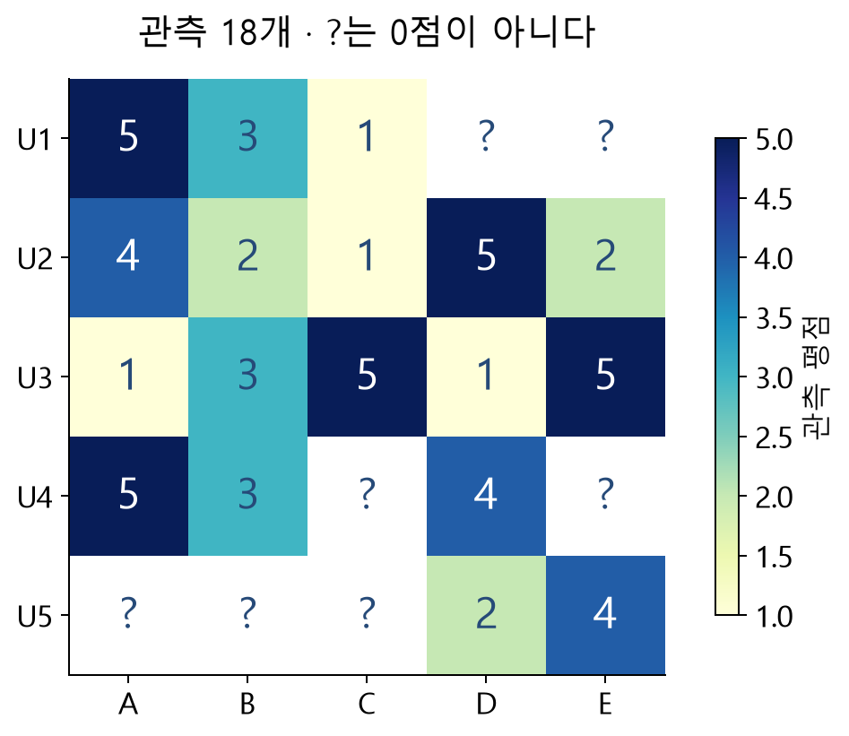

그림 2. U1에게 D 또는 E를 추천하려면 다른 관측에서 근거를 가져와야 한다. 미관측 정답을 만들어 학습 표에 채우지 않는다.

| 사용자 | A | B | C | D | E | 관측 평균 |
| --- | --- | --- | --- | --- | --- | --- |
| U1 | 5 | 3 | 1 | — | — | 3.0 |
| U2 | 4 | 2 | 1 | 5 | 2 | 2.8 |
| U3 | 1 | 3 | 5 | 1 | 5 | 3.0 |
| U4 | 5 | 3 | — | 4 | — | 4.0 |
| U5 | — | — | — | 2 | 4 | 3.0 |

사용자 벡터의 영화 순서를 A–E로 고정한다. 이 수업은 이전 차시와 동일하게 **전체 영화 차원에서 미관측을 계산용 0으로 채운 원평점 코사인**을 사용한다. 관측 평균은 원래 표의 NaN을 제외한다. 공통 평가 좌표만으로 분모까지 다시 계산하는 코사인이나 Pearson 상관계수와는 다른 정의다.

$$
s_{uv}=\frac{\sum_i x_{ui}x_{vi}}{\sqrt{\sum_i x_{ui}^2}\sqrt{\sum_i x_{vi}^2}}
$$

여기서 $x_{ui}$는 관측 평점 또는 계산용 0, $u$는 대상 사용자, $v$는 비교 사용자다. U1과 U4는 각각 $(5,3,1,0,0)$, $(5,3,0,4,0)$이다.

$$
s_{14}=\frac{5\times5+3\times3}{\sqrt{35}\sqrt{50}}=0.812755\ldots
$$

같은 방식으로 $s_{12}=0.645423$, $s_{13}=0.411201$, $s_{15}=0$이다. 목표 D를 평가한 양의 유사도 이웃 중 상위 두 명은 U4와 U2다. $k$는 **이 예측에 사용할 이웃 수 상한**, $N$은 **마지막 추천 목록 길이**다.

$$
\hat r_{1D}=\frac{0.812755\times4+0.645423\times5}{0.812755+0.645423}=4.442623
$$

실제 계산은 반올림 전 값으로 한다. 식에서 분자는 유사도로 가중한 평점의 합, 분모는 선택한 이웃의 유사도 합이다. U4의 정규화 가중치는 0.557377, U2는 0.442623이며 둘의 합은 1이다.

### 1.2 평소보다 얼마나 높게 평가했는가?

사용자 평균 보정은 이웃의 원평점 대신 **자신의 평균으로부터의 편차**를 집계한다. $\bar r_u$는 학습 자료에 있는 사용자 $u$의 관측 평균, $N_{u,i}$는 이번 예측의 유효 이웃 집합이다.

$$
\hat r_{ui}=\bar r_u+\frac{\sum_{v\in N_{u,i}}s_{uv}(r_{vi}-\bar r_v)}{\sum_{v\in N_{u,i}}s_{uv}}
$$

U4의 D=4는 자신의 평균 4와 같으므로 편차가 0이다. U2의 D=5는 평균 2.8보다 2.2 높다. 대상 U1의 평균 3으로 돌아오면 다음과 같다.

$$
\hat r_{1D}=3+\frac{0.812755(4-4)+0.645423(5-2.8)}{0.812755+0.645423}=3.973770
$$

유사도는 바꾸지 않았다. 평균 보정으로 바뀐 것은 집계할 값과 마지막 기준점이다. **확인 Q1:** U4는 가중치가 가장 큰데, 왜 평균 보정 결과를 올리지 않는가?

## 2. 기타 CF 정확도 개선 방법 · 주교재 3.7

### 2.1 비슷하다는 판단에 관측이 얼마나 있는가?

두 사람이 영화 한 편에서만 우연히 같은 점수를 주었을 수 있다. 유사도 크기만으로 공통 관측의 양까지 알 수 없다. 공통 평가 수를 따로 계산한다. 관측이면 1, 미관측이면 0인 행렬을 $M$이라 하면 사용자 쌍의 공통 평가 수는 다음과 같다.

$$
c_{uv}=\sum_i M_{ui}M_{vi},\qquad C=MM^{\mathsf T}
$$

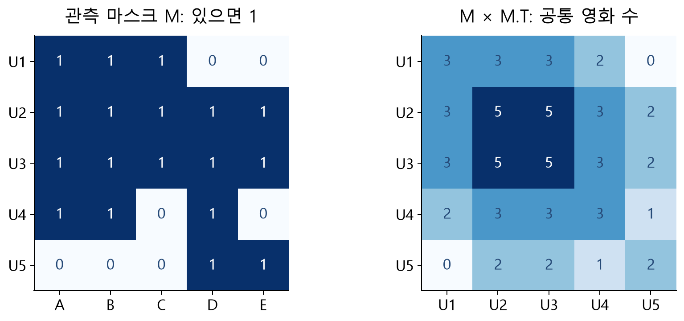

그림 3. U1–U4의 공통 영화는 A·B의 2편, U1–U2와 U1–U3은 A·B·C의 3편이다. 대각선은 자신의 관측 수이며 자기 자신은 이웃에서 제외한다.

```python
R = toy.pivot(index='user_id', columns='movie_id', values='rating')
M = R.notna().astype(int)       # bool 대신 정수로 개수를 센다
common = M @ M.T               # (5, 5) @ (5, 5) → 사용자 쌍 (5, 5)
print(common.loc[1, [2, 3, 4]])
```

결과는 차례로 3, 3, 2다. 주교재의 **significance weighting** 설명과 제공 코드의 `SIG_LEVEL`은 여기서 공통 평가 수가 기준보다 작으면 이웃을 제외하는 방식으로 연결한다. 연속적인 유사도 축소(shrinkage)도 가능한 확장이다. 예를 들어 $s'_{uv}=c_{uv}s_{uv}/(c_{uv}+\lambda)$는 근거가 적은 유사도를 더 작게 만든다. 그러나 이 연속 보정은 **비교를 위한 추가 해설**이며 오늘 구현은 공통수 하한 필터다. 두 방법을 같은 구현이라고 부르지 않는다.

### 2.2 공통수 하한과 최소 이웃 수는 다르다

| 조건 | 무엇을 검사하는가? | 이 실습의 설정 |
| --- | --- | --- |
| 공통 평가 수 하한 | 대상과 이웃 한 쌍이 함께 평가한 개수 | `min_common=3`이면 3개 이상 |
| 이웃 수 상한 | 유효 후보 중 실제 사용할 최대 개수 | `k=2`이면 최대 2명·2편 |
| 최소 유효 이웃 수 | 이번 예측 전체를 뒷받침하는 이웃 개수 | `min_neighbors=2`이면 2개 이상 |

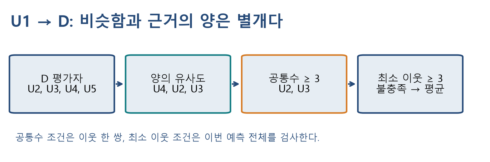

그림 4. 공통수가 충분한 U2·U3를 확보해도 최소 이웃을 3명 요구하면 CF 예측을 사용하지 못한다.

U1–D에서 `min_common=3`을 적용하면 U4가 빠진다. 남은 U2·U3의 편차는 2.2와 −2다. 평균 보정 예측은 다음과 같이 내려간다.

$$
\hat r_{1D}=3+\frac{0.645423\times2.2+0.411201\times(-2)}{0.645423+0.411201}=3.565507
$$

기여도는 $+1.343837$과 $-0.778330$이다. “공통수가 많으므로 예측값이 더 높아진다”는 결론은 나오지 않는다. 긍정적인 이웃이 빠질 수도 있기 때문이다.

여기에 `min_neighbors=3`을 적용하면 확보된 이웃은 2명이므로 사용자 평균 3.0으로 대체한다. `eligible_neighbors=2`와 `n_contributors=0`을 구별하여 기록한다. 실패한 CF 결과를 실제 개인화 예측처럼 표시하지 않는다.

주교재 제공 코드의 `MIN_RATINGS=2`와 `len(...) > MIN_RATINGS`는 **3개 이상**을 뜻한다. 본문 표현 “2명 이상”과 경계가 다르다. 이번 API는 이름에 맞춰 `count >= min_neighbors`를 사용하며, `min_neighbors=2`는 정확히 2개도 허용한다. **확인 Q2:** `k=2, min_neighbors=3`에서는 조건을 통과할 수 있는가?

### 2.3 예측 범위와 근거 부족 처리

양의 원평점 가중평균은 관측 범위 안에 있지만, 사용자 평균을 더하는 편차 방식은 1–5점을 벗어날 수 있다. 이 실습은 원예측을 보존하고 선택에 따라 최종값만 제한한다.

$$
\hat r^{\mathrm{clip}}_{ui}=\min(5,\max(1,\hat r_{ui}))
$$

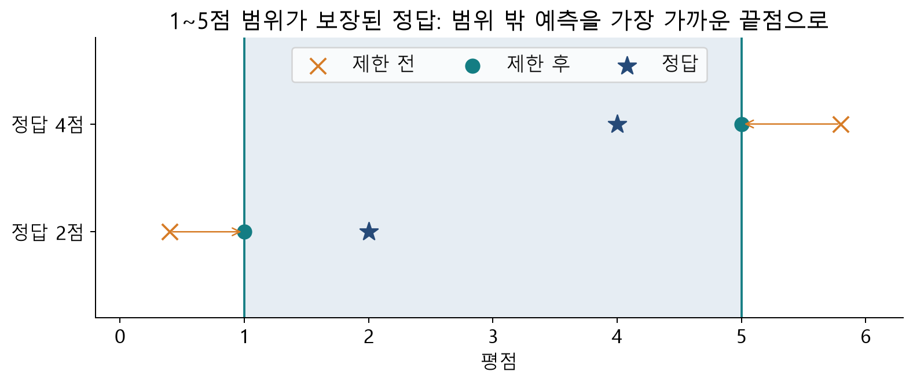

그림 5. 실제 정답이 1–5 범위에 있다는 전제에서 범위 제한은 각 관측의 절대·제곱 오차를 증가시키지 않는다. 순위 성능 개선까지 보장하지는 않으며 동점이 늘 수 있다.

정답이 $[4,2]$, 원예측이 $[5.8,0.4]$이면 절대오차는 $[1.8,1.6]$, MAE는 1.7이다. 제한 후 예측 $[5,1]$의 절대오차는 $[1,1]$, MAE는 1이다. RMSE도 $\sqrt{(3.24+2.56)/2}=\sqrt{2.9}$에서 1로 줄어든다.

근거가 부족하면 평균 보정 사용자 CF는 알려진 사용자 평균을, 나머지 방식은 알려진 영화 평균을 쓴다. 그것도 없으면 학습 전체 평균을 쓴다. 이는 강의 구현의 명시적 대체 규칙이며 주교재 아이템 예제의 고정 3점 대체와 구별한다. 어떤 평균도 validation/test 평점으로 계산하지 않는다.

## 3. 사용자 기반 CF와 아이템 기반 CF · 주교재 3.8

### 3.1 같은 표에서 비교하는 축을 바꾸기

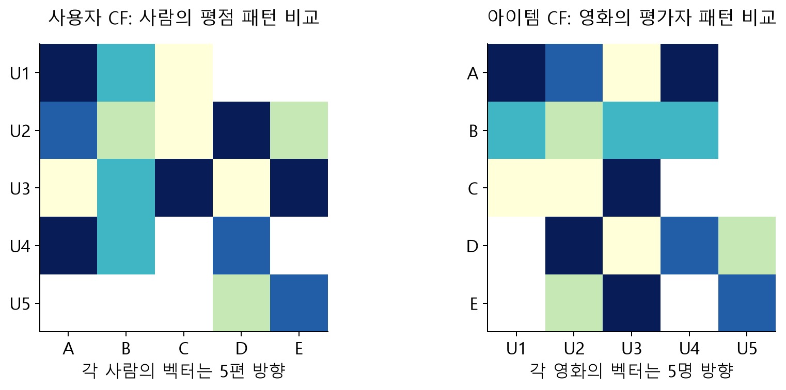

그림 6. 사용자 CF는 비슷한 사람의 D 평점을, 아이템 CF는 D와 비슷한 영화에 U1이 준 평점을 가져온다. 아이템 기반도 줄거리나 장르를 사용하는 콘텐츠 기반 추천과는 다르다.

| 비교 항목 | 사용자 기반 CF | 아이템 기반 CF |
| --- | --- | --- |
| 벡터 하나 | 한 사용자의 영화별 평점 | 한 영화의 사용자별 평점 |
| 유사도 행렬 | 사용자 수 × 사용자 수 | 영화 수 × 영화 수 |
| 공통 평가 수 | 두 사람이 함께 평가한 영화 수 | 두 영화를 함께 평가한 사용자 수 |
| U1–D 예측의 이웃 | D를 평가한 사람들 | U1이 평가한 영화들 |
| 집계하는 원평점 | 이웃 사용자의 D 평점 | U1 자신의 이웃 영화 평점 |
| 새 사용자·새 영화 | 유사도를 만들 관측이 부족할 수 있음 | 유사도를 만들 관측이 부족할 수 있음 |

이 표는 주교재 표 3-2의 구분을 독자 예시로 재구성한 것이다. 사용자 수를 $U$, 영화 수를 $I$라 할 때 밀집 유사도 저장량은 각각 $O(U^2)$, $O(I^2)$다. 어느 쪽이 더 빠른지는 두 수의 크기, 희소 구현, 사전 계산, 갱신 빈도에 달려 있다. 아이템의 관계를 미리 계산해 재사용할 수 있다는 장점이 있지만, 항상 더 빠르거나 더 정확하다는 정리는 아니다.

### 3.2 D와 비슷한 영화 찾기: 직접 계산

영화 A의 사용자 순서 벡터는 $(5,4,1,5,0)$, D는 $(0,5,1,4,2)$다. 따라서 내적은 $0+20+1+20+0=41$, 제곱합은 각각 67과 46이다.

$$
s_{DA}=\frac{41}{\sqrt{46}\sqrt{67}}=0.738529
$$

영화 B는 $(3,2,3,3,0)$이므로 D와의 내적은 25, 제곱합은 31이다.

$$
s_{DB}=\frac{25}{\sqrt{46}\sqrt{31}}=0.662034
$$

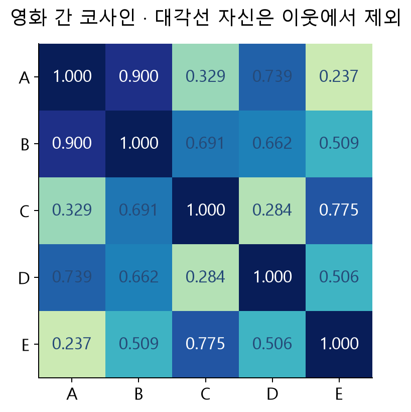

그림 7. D–E의 유사도가 양수여도 U1은 E를 평가하지 않았으므로 U1–D의 근거로 쓸 수 없다. 먼저 U1의 관측 영화 A·B·C로 후보를 제한한 후 그 안에서 상위 k개를 선택한다.

### 3.3 U1 자신의 평점으로 D 예측하기

아이템 이웃 집합 $J_{u,i}$는 대상 사용자 $u$가 평가한 영화 중 목표 $i$와 유사한 영화 집합이다. $s_{ij}$는 영화 유사도, $r_{uj}$는 **대상 사용자 본인**의 관측 평점이다.

$$
\hat r_{ui}=\frac{\sum_{j\in J_{u,i}}s_{ij}r_{uj}}{\sum_{j\in J_{u,i}}s_{ij}}
$$

U1이 본 A·B·C 중 D와 가장 비슷한 두 영화는 A와 B다. A=5, B=3을 대입한다.

$$
\hat r_{1D}=\frac{0.738529\times5+0.662034\times3}{0.738529+0.662034}=4.054617
$$

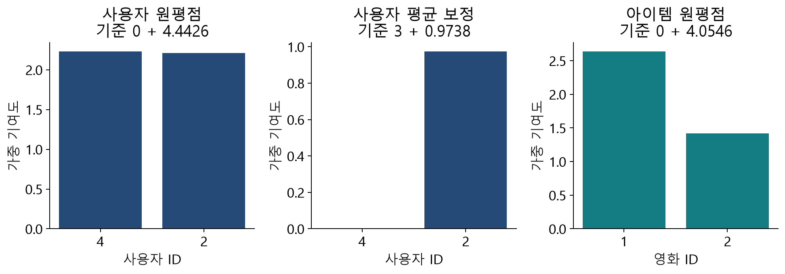

그림 8. 첫 두 그림의 이웃 ID는 사람, 마지막 그림의 ID는 영화다. 막대의 합에 기준 평균을 더하면 각 원예측을 복원할 수 있다.

**확인 Q3:** 사용자 CF 코드에서 표를 전치하기만 하면 모든 설명·인덱싱도 그대로 쓸 수 있는가? `common_counts_`의 단위와 이웃 ID의 뜻까지 말해 보자.

## 4. 추천 시스템 성과측정지표 · 주교재 3.9 복습

### 4.1 평점 숫자는 얼마나 틀렸는가?

평가 관측 집합을 $T$, 실제 평점을 $r$, 예측을 $\hat r$, 관측 개수를 $|T|$라 한다. 주교재의 MAD(mean absolute deviation)는 여기서 **실제–예측 절대오차 평균**, 즉 실습의 MAE와 같은 뜻으로 사용한다. 중앙값 기반 median absolute deviation과 혼동하지 않는다.

$$
\mathrm{MAE}=\frac{1}{|T|}\sum_{(u,i)\in T}|r_{ui}-\hat r_{ui}|
$$

$$
\mathrm{MSE}=\frac{1}{|T|}\sum_{(u,i)\in T}(r_{ui}-\hat r_{ui})^2,\qquad\mathrm{RMSE}=\sqrt{\mathrm{MSE}}
$$

| 관측 | 실제 | 예측 | 실제−예측 | 절대오차 | 제곱오차 |
| --- | --- | --- | --- | --- | --- |
| 1 | 5 | 4 | 1 | 1 | 1 |
| 2 | 2 | 3 | −1 | 1 | 1 |
| 3 | 4 | 4 | 0 | 0 | 0 |
| 4 | 1 | 3 | −2 | 2 | 4 |

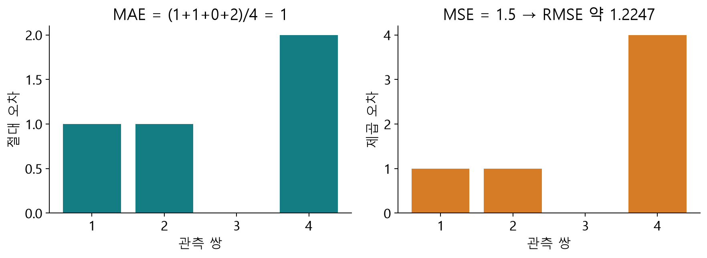

그림 9. MAE=4/4=1, MSE=6/4=1.5, RMSE=√1.5≈1.2247이다. 2점 오차는 절대오차 합에 2, 제곱오차 합에 4를 더한다. RMSE는 큰 오차에 더 민감하다.

RMSE를 0.9로 줄였다는 사실만으로 상위 추천 목록이 좋아졌다고 결론 내릴 수 없다. 많은 중간 점수 예측은 좋아졌지만, 상위 몇 편의 순서는 오히려 바뀔 수 있다.

### 4.2 추천한 목록에 관련 영화가 얼마나 있는가?

먼저 관련성을 정의해야 한다. 실습은 **미사용 평가 자료의 관측 평점이 4점 이상**이면 관련 영화로 본다. 교육용 예에서는 후보 A–F 모두의 관련성을 안다고 가정하고, 관련 집합을 {A,C,E}, Top-3 추천을 [A,B,C]로 둔다.

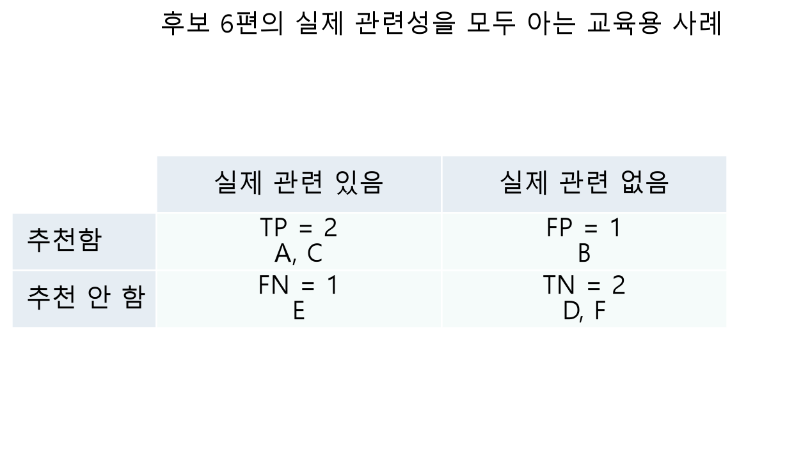

그림 10. 주교재 표 3-3의 의미를 6편의 독자 예제로 재구성했다. “추천함”은 이 예에서 Top-3 안에 들어갔다는 뜻이다.

$$
\mathrm{Precision}=\frac{TP}{TP+FP},\quad\mathrm{Recall}=\frac{TP}{TP+FN},\quad F_1=\frac{2PR}{P+R}
$$

여기서는 Precision@3=2/3, Recall@3=2/3, F1@3=2/3다. “추천 세 편 중 두 편을 맞힘”과 “관련 세 편 중 두 편을 찾음”의 분모가 우연히 같다. 관련 영화가 6편이었다면 같은 추천 적중 2개라도 recall은 2/6이다.

$$
\mathrm{Accuracy}=\frac{TP+TN}{TP+FP+FN+TN},\quad\mathrm{TPR}=\frac{TP}{TP+FN},\quad\mathrm{FPR}=\frac{FP}{FP+TN}
$$

현재 accuracy=4/6, TPR=2/3, FPR=1/3이다. TPR은 recall과 같다. 관련 영화가 매우 적은 거대한 카탈로그에서는 아무것도 추천하지 않는 방법도 TN이 많아 accuracy가 높을 수 있다. 그래서 accuracy 하나로 좋은 추천을 판단하지 않는다.

목록을 [A,B,C,D]로 늘리면 P@4=2/4, R@4=2/3, F1@4=4/7이다. [A,B,C,D,E]까지 늘리면 P@5=3/5, R@5=1이다. **같은 순위를 뒤로 늘릴 때 recall은 감소하지 않지만 precision은 늘 수도, 줄 수도 있다.** 서로 다른 모델로 순서까지 바꾸면 이 단조성도 그대로 적용할 수 없다.

실제 MovieLens에서 미관측 영화는 진짜 비선호가 아니라 **아직 관련성을 확인하지 못한 영화**다. 실습의 순위 평가에서는 전체 카탈로그에서 학습 이력만 제외하고, heldout의 4점 이상 관측을 적중 대상으로 둔다. 그 외 후보가 모두 실제 싫어하는 영화라는 주장은 하지 않는다. 따라서 실습 앱은 미관측을 TN으로 간주한 accuracy/FPR을 서비스 성과처럼 표시하지 않는다.

### 4.3 앞쪽에 잘 배치했는가? NDCG 다시 보기

NDCG는 이전 수업에서 다룬 순위 지표를 함께 복습하는 **추가 내용**이다. 이 수업에서는 관련성이 0 또는 1이다. 순위 $j$의 관련성을 $rel_j$라 할 때 다음과 같이 계산한다.

$$
\mathrm{DCG}@N=\sum_{j=1}^{N}\frac{rel_j}{\log_2(j+1)},\qquad\mathrm{NDCG}@N=\frac{\mathrm{DCG}@N}{\mathrm{IDCG}@N}
$$

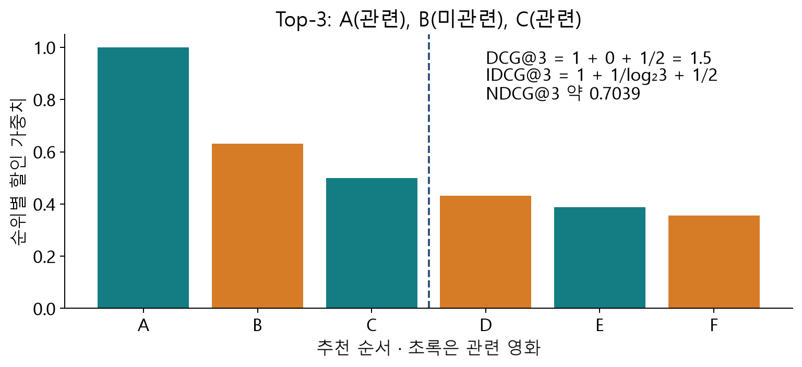

그림 11. 앞의 같은 사례에서 DCG@3=1+0+1/2=1.5다. 관련 영화가 3편이므로 이상적 Top-3은 모두 관련 영화이고, IDCG@3=1+1/log₂3+1/2≈2.13093이다. NDCG@3≈0.703918이다.

Precision과 Recall은 Top-N 안에서 순서만 바꾸면 같지만 NDCG는 달라질 수 있다. 여러 사용자 지표는 사용자별 P·R·F1·NDCG를 각각 계산하여 단순평균한다. **평균 P와 평균 R을 나중에 F1 식에 넣은 값은 평균 F1과 일반적으로 다르다.** 관련 영화가 없는 사용자는 순위 평가에서 제외하고 제외 수를 보고한다. 후보가 N보다 적을 때 이 실습의 precision 분모는 요청한 N을 유지한다.

### 4.4 얼마나 넓게 추천할 수 있는가? Coverage

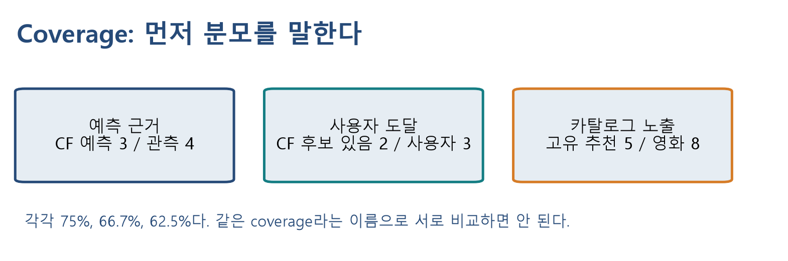

그림 12. Coverage는 단일한 공식 이름이 아니다. 무엇을 덮었는지와 분모를 먼저 고정해야 한다.

| 이번 구현의 이름 | 분자 / 분모 | 주의점 |
| --- | --- | --- |
| `cf_coverage` | CF 근거로 예측한 heldout 관측 / 전체 평가 관측 | 평균 대체는 분자에 넣지 않음 |
| `cf_user_coverage` | CF 근거 후보가 하나라도 있는 사용자 / 순위 평가 사용자 | 강의에서 정한 사용자 도달 정의 |
| `catalog_coverage` | 평가 사용자 추천 목록의 고유 영화 / 전체 카탈로그 영화 | N과 사용자 표본 수에도 좌우됨 |

평균 대체로 언제나 숫자를 반환하더라도 CF 근거 coverage가 100%인 것은 아니다. 공통수 하한을 높이면 근거 확보가 어려워질 수 있고, 대체 예측의 동점이나 순위 변화가 카탈로그 노출에도 영향을 줄 수 있다. 정확도·다양성·신규성·만족도는 다른 질문이다. 이번 실습이 노출 비율을 측정한다고 장르 다양성이나 온라인 만족도까지 측정한 것은 아니다.

## 5. 작은 예제의 끝까지: 예측과 평가를 분리하기

관측 18개는 그대로 두고, **평가용으로만 새로 정한 합성 정답** U1–D=5, U1–E=2를 봉투에 넣었다고 하자. 이 두 값은 이전 자료에서 알아낸 실제 정답이 아니며 `fit`에 넣지 않는다. 관련성은 4점 이상으로 정한다.

| 방법 | D 예측 | E 예측 | Top-1 |
| --- | --- | --- | --- |
| 사용자 원평점, k=2 | 4.442623 | 3.167495 | D |
| 사용자 평균 보정, k=2 | 3.973770 | 3.289662 | D |
| 평균 보정, 공통수≥3, 최소 이웃 2 | 3.565507 | 3.289662 | D |
| 아이템 원평점, k=2 | 4.054617 | 1.792807 | D |

아이템 방식의 이 두 관측 MAE는 $(|5-4.054617|+|2-1.792807|)/2=0.576288$이다. 관련 영화는 D 하나이므로 네 방식 모두 Top-1의 P·R·F1·NDCG가 1이다. 평점 오차가 다른데 같은 목록 적중이 나오는 구체적인 사례다. 두 관측·한 사용자 결과로 일반적인 우열을 주장할 수는 없다.

**확인 Q4:** 신뢰도 조건을 적용한 모델의 D 예측이 합성 정답 5에서 더 멀어졌다는 이유만으로 그 조건을 항상 제거해야 하는가?

전체 절차를 말로 설명해 보자. 관측 표와 마스크를 만든다 → 행 또는 열의 코사인을 만든다 → 목표 평점을 알고 있는 이웃만 남긴다 → 공통수 하한을 적용하고 k개를 선택한다 → 최소 개수를 확인한다 → 가중평균 또는 평균 대체를 계산한다 → 범위를 제한한다 → 학습 이력을 제외한 후보를 정렬한다 → 사용하지 않은 관측으로 평가한다.

## 6. MovieLens에서 같은 질문 검증하기

### 6.1 공정한 비교의 조건

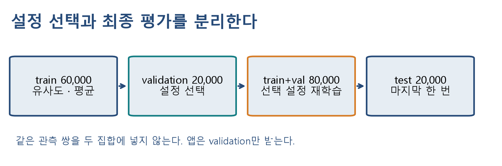

그림 13. 통계는 train에서 만들고 설정은 validation으로 고른다. 설정을 확정한 뒤 train+validation으로 재학습하고 test는 마지막 평가에만 쓴다.

MovieLens 100K는 GroupLens가 제공하는 943명·1,682편·100,000개 평점 자료다. 수업 실험은 이전 차시와 같은 분리 seed를 유지한다. 먼저 20% test(seed=20260922)를 분리하고, 남은 80%의 25%를 validation(seed=20260923)으로 떼어 최종 60/20/20 비율을 만든다. 사용자별 무작위 분리이므로 미래 시점 추천을 재현하는 시간순 평가와는 다르다.

평점 지표는 검증 **20,000개 전체**를 쓴다. 앱 응답 시간을 줄이기 위해 순위 지표는 seed=20260923으로 한 번 선택한 **고정 40명**을 모든 설정에 공통으로 쓴다. 각 사용자는 전체 카탈로그에서 train 이력만 제외한 후보를 평가한다. 순위 표본은 전체 943명을 대표한다고 보장할 수 없으며, 특히 적중 수가 적으면 작은 변화에 지표가 크게 흔들린다. 검증에서는 40명 모두 관련 영화가 있고, 최종 test에서는 동일 40명 중 관련 영화가 없는 1명을 제외해 39명을 평가했다.

### 6.2 실제 측정값과 해석

아래 값은 2026-09-23 KST에 Python 3.12 환경에서 실제 계산했다. 모든 방식은 clip을 사용하며 추천 수는 N=10이다. 방법의 기본 구성을 비교한 표이므로 평균 보정과 k의 인과 효과를 이 표 하나에서 분리하지 않는다. 효과를 분리하는 실험은 다음 절과 앱에서 한 조건씩 바꾼다.

| 방식과 설정 | 검증 RMSE | MAE | P@10 | R@10 | CF 근거 비율 | 카탈로그 노출 |
| --- | --- | --- | --- | --- | --- | --- |
| 사용자 원평점, 전체 이웃, 공통수1·최소1 | 1.0237 | 0.8141 | 0.0000 | 0.0000 | 99.680% | 1.546% |
| 사용자 평균 보정, k30, 공통수1·최소1 | 0.9549 | 0.7449 | 0.0050 | 0.0051 | 99.680% | 3.508% |
| 사용자 평균 보정, k30, 공통수3·최소2 | 0.9530 | 0.7439 | 0.0200 | 0.0174 | 99.355% | 5.707% |
| 아이템 원평점, k30, 공통수1·최소1 | 0.9937 | 0.7797 | 0.0075 | 0.0024 | 99.680% | 11.653% |

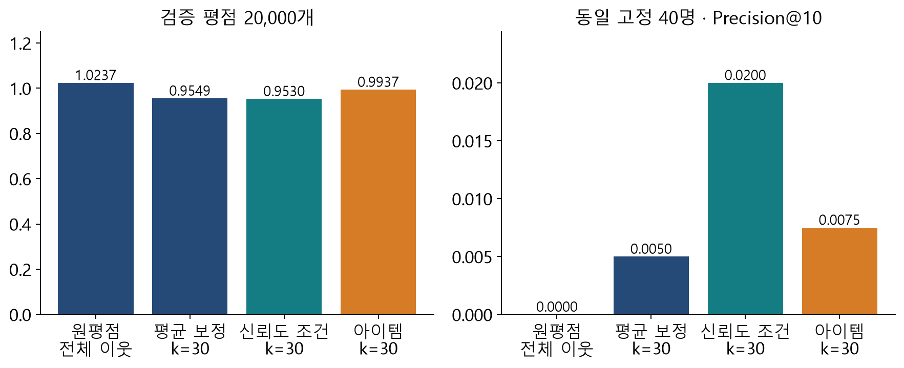

그림 14. 이 실험에서 RMSE가 가장 작은 방법과 카탈로그 노출이 가장 큰 방법은 다르다. 원평점 방식 P@10=0은 고정 40명의 알려진 관련 영화에 적중하지 못했다는 뜻이며, 실제 모든 추천이 싫어하는 영화라는 뜻은 아니다.

희소한 평가 자료에서는 평점이 높은 소수 관측 영화나 평균 대체로 높은 점수를 받은 후보가 상위에 오를 수 있다. 실제 앱의 `basis`, 기여 이웃 수와 추천 제목을 보고 확인할 가설이다. 평균 대체, 후보 규칙, 동점 처리, 표본을 함께 밝히지 않은 지표만 비교하지 않는다. 동점은 영화 ID 오름차순으로 처리한다.

### 6.3 파라미터를 크게 하면 계속 좋아지는가?

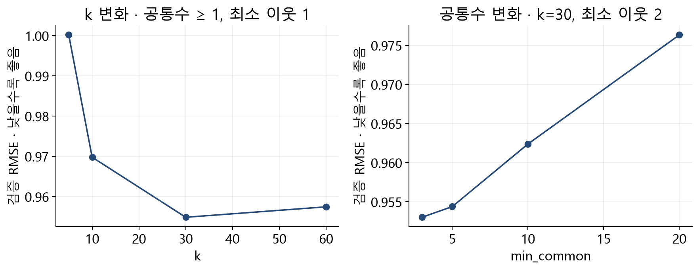

그림 15. 왼쪽은 평균 보정·공통수1·최소1을 고정하고 k를 바꿨다. 오른쪽은 평균 보정·k30·최소2를 고정하고 공통수 하한을 바꿨다. 두 패널 사이에는 최소 이웃 조건이 달라 직접 같은 곡선으로 연결하지 않는다.

- k=5 / 10 / 30 / 60의 검증 RMSE: **1.0002 / 0.9698 / 0.9549 / 0.9575**.
- 공통수 하한=3 / 5 / 10 / 20의 검증 RMSE: **0.9530 / 0.9544 / 0.9624 / 0.9763**.

네 기본 구성과 위 여덟 실험 행 중 검증 RMSE 최소 조건은 사용자 평균 보정·k30·공통수3·최소2였다. 이 설정을 고정하여 80,000개로 다시 학습한 최종 test RMSE는 **0.9343**, MAE는 **0.7295**였다. test 순위 지표는 39명의 P@10=0.0385, R@10=0.0560이다. 이는 해당 분리·선택 규칙의 결과이며 보편적인 성능 보증이 아니다. test를 본 뒤 설정을 다시 고르는 활동은 하지 않는다.

## 7. 구현 읽기와 웹 실험

### 7.1 중요한 함수의 역할과 데이터 흐름

`EvidenceCF`는 이전 차시 `UserCF`를 확장한다. 생성자는 설정만 저장한다. `fit(train)`은 관측 행렬·평균·유사도·공통수를 만든다. 신경망이나 경사하강법을 학습하는 함수가 아니다. k의 선택은 검증 실험에서 별도로 한다.

| 입력 / 기본값 | 타입과 의미 | 영향 |
| --- | --- | --- |
| `axis='user'` | `'user'` 또는 `'item'` | 사람 쌍 / 영화 쌍 유사도 |
| `k=30` | 0 이상 정수, 0은 전체 | 예측별 유효 이웃 상한 |
| `min_common=1` | 0 이상 정수 | 이웃 쌍 공통 관측 하한 |
| `min_neighbors=1` | 1 이상 정수 | CF를 쓸 최소 이웃 수 |
| `centered=False` | bool, 사용자 축만 허용 | 원평점 / 평균 편차 집계 |
| `clip=True` | bool | 반환 예측을 1–5로 제한 |

`fit` 입력은 `user_id, movie_id, rating` 열의 중복 없는 DataFrame이다. ID는 정수, 관측 평점은 유한한 1–5점이다. 출력은 학습 상태를 가진 같은 모델 객체다. `rating_matrix_`는 U×I, `similarity_`와 `common_counts_`는 사용자 축 U×U 또는 아이템 축 I×I, `user_means_`는 사용자 ID 인덱스 Series, `seen_`는 사용자별 관측 영화 집합이다. 입력 표와 미관측 마스크를 직접 덮어쓰지 않는다.

| 함수 | 입력 → 출력 | 호출 시점·주의 |
| --- | --- | --- |
| [`predict_details(pairs)`](https://github.com/lunalab-ai/recommender/blob/2026-fall-w04b/src/luna_recsys/cf_synthesis.py#L110) | ID 쌍 DataFrame → 같은 행 순서·인덱스의 예측·근거 표 | fit 뒤, rating 열이 있어도 예측에 사용 안 함 |
| [`explain(user_id, movie_id)`](https://github.com/lunalab-ai/recommender/blob/2026-fall-w04b/src/luna_recsys/cf_synthesis.py#L155) | 두 정수 → 선택된 전체 이웃의 기여 표 | 한 예측을 손계산과 대조, 평균 대체는 빈 표 |
| [`recommend(user_id, movies, top_n)`](https://github.com/lunalab-ai/recommender/blob/2026-fall-w04a-v2/src/luna_recsys/collaborative.py#L198) | 사용자·카탈로그·개수 → 추천 DataFrame | 학습 이력 제외, 점수 내림차순·동점 ID순 |
| [`configured(**settings)`](https://github.com/lunalab-ai/recommender/blob/2026-fall-w04b/src/luna_recsys/cf_synthesis.py#L72) | 예측 설정 → 새 모델 객체 | 학습 배열 공유, 원모델 설정 불변, axis 변경 불가 |
| [`rating_report(model, heldout)`](https://github.com/lunalab-ai/recommender/blob/2026-fall-w04b/src/luna_recsys/cf_synthesis.py#L175) | 학습된 모델·미사용 관측 → 지표 dict | 평점 전체 평가, 학습/평가 관측 중복은 오류 |
| [`evaluate_cf(..., top_n=10, ranking_users=None)`](https://github.com/lunalab-ai/recommender/blob/2026-fall-w04b/src/luna_recsys/cf_synthesis.py#L197) | 위 입력·카탈로그·선택 사용자 ID 목록 → 통합 지표 dict | None이면 전체, 지정 시 고정 집단 순위 평가 |

예측 표의 `raw_prediction`은 제한 전, `prediction`은 제한 후다. `basis`는 `cf`, `user-mean`, `movie-mean`, `global-mean` 중 하나다. `eligible_neighbors`는 k까지 적용하여 확보한 개수, `n_contributors`는 실제 사용한 개수, `weight_sum`은 실제 사용한 유사도 합이다. 최소 이웃 조건 실패 시 뒤의 두 값은 0이다.

`explain`의 `neighbor_id`는 축에 따라 사람 또는 영화다. `common_ratings`는 공통수, `similarity`는 원유사도, `rating`은 가져온 관측 평점, `reference_mean`은 보정 시 뺀 평균, `value`는 집계할 값, `weight`는 합이 1인 정규화 가중치, `contribution`은 `value*weight`다. 기여도 합에 대상 평균을 더하면 보정 원예측을 복원한다. 평균 대체를 위한 가짜 이웃은 만들지 않는다.

```python
model = EvidenceCF(axis='user', k=2, min_common=3,
                   min_neighbors=2, centered=True).fit(toy)
detail = model.predict_details(pd.DataFrame({'user_id':[1], 'movie_id':[4]}))
evidence = model.explain(1, 4)
```

이 핵심 API들은 다운로드나 서버 시작을 하지 않는다. 데이터 준비는 `prepare_movielens(cache_dir, mode='real')`이 담당한다. cache_dir은 Path/문자열 경로이며 반환 객체의 `.data`에 users·movies·ratings 표가 있다. `real`은 실제 다운로드 실패를 오류로 알린다. `synthetic`은 명시적으로 선택하는 소규모 합성 모드이며 MovieLens 성과와 구별한다. `split_ratings(..., test_size, seed)`는 새 train/test 표를 반환한다.

정의 위치(수업 고정 버전): [EvidenceCF와 평가 함수](https://github.com/lunalab-ai/recommender/blob/2026-fall-w04b/src/luna_recsys/cf_synthesis.py#L13), [CFLab·callback·앱](https://github.com/lunalab-ai/recommender/blob/2026-fall-w04b/src/luna_recsys/synthesis_app.py#L52). 이미 공개된 [데이터 준비 함수](https://github.com/lunalab-ai/recommender/blob/2026-fall-w04a-v2/src/luna_recsys/datasets.py#L62), [분리 함수](https://github.com/lunalab-ai/recommender/blob/2026-fall-w04a-v2/src/luna_recsys/evaluation.py#L28)도 함께 읽는다.

### 7.2 컨트롤이 숫자와 그림으로 바뀌는 경로

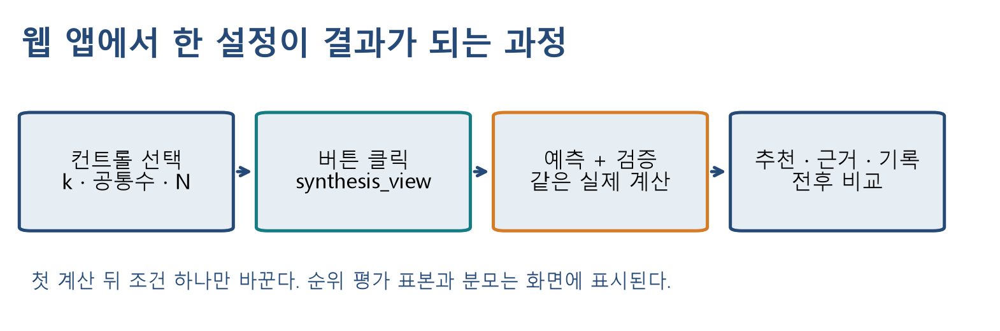

그림 16. 화면은 실제 계산 함수에 연결한다. 설정별 수치를 미리 만든 표로 바꿔 끼우지 않는다.

`CFLab(train, validation, movies, rank_limit=40, seed=20260923)`은 두 축을 학습하고 고정 순위 표본을 선택한다. `data_label`은 화면에 실제 자료 모드를 표시하는 선택 문자열이다. test는 받지 않는다. `lab.model(...)`은 설정 복사본을 만들고 `lab.metrics(...)`는 해당 설정의 검증 결과를 계산·캐시한다. 같은 설정의 재호출은 계산 결과를 재사용한다.

`synthesis_view(lab, mode, user_id, k, min_common, min_neighbors, clip, top_n, history=None)`는 요약 HTML, 추천 표, 전체 근거 표, 비교 표, 새 기록 리스트, Matplotlib 그림의 여섯 값을 반환한다. history는 브라우저 세션별 `gr.State`로 보관하며 이전 리스트를 직접 바꾸지 않는다. 그림은 최대 20개 이웃과 나머지 기여도 합을 보여주고 전체 개별 값은 근거 표에 남긴다.

`build_synthesis_app(lab, legacy=...)`는 Gradio Blocks를 반환한다. 이 함수는 서버를 시작하지 않는다. 버튼의 `.click`이 입력 컨트롤을 callback에, 여섯 반환값을 출력 컴포넌트에 연결한다. 마지막 `app.launch(...)`가 서버를 연다. 이전 이웃 CF 앱, 기본 CF 앱, 네 방법 비교 앱은 “이전 수업 누적 앱” 탭 안에 이어 붙인다.

실행은 CPU에서 노트북 첫 셀부터 순서대로 한다. 설치 후 재시작 안내가 나오면 런타임을 재시작하고 첫 셀부터 다시 실행한다. 실데이터 다운로드 실패를 숨기지 말고 연결을 확인한다. 합성 모드를 선택했다면 그 결과를 실데이터 측정표와 비교하지 않는다. Colab 공유 주소는 임시 주소이며 런타임을 종료하면 다시 실행해야 한다.

### 7.3 실습 활동 E1–E6

학생 노트북의 빈칸은 미완성 상태에서도 뒤의 독립 시연을 막지 않는다. 예측을 먼저 적고 실행 결과와 비교한다.

1. **E1 · 빈칸:** 관측 마스크 행렬곱으로 사용자 공통 평가 수를 구하고 U1–U4를 확인한다.
2. **E2 · 디버깅:** 정확히 2개 이웃일 때 `>2` 조건의 문제를 설명하고 “최소 2개”에 맞게 수정한다.
3. **E3 · 빈칸:** 아이템 축 행렬과 D–A 코사인의 분모를 구현한다.
4. **E4 · 예측·계산:** 후보 6편의 Top-3와 Top-4 P·R·F1을 계산하고 N 증가의 영향을 설명한다.
5. **E5 · 비교:** 평균 보정과 k를 고정하고 공통수 하한만 바꾼다. RMSE·CF 근거 비율·첫 추천의 근거가 어떻게 달라질지 예상한 뒤 기록한다.
6. **E6 · 연결:** 버튼 callback을 연결하여 실제 추천과 비교 기록이 함께 갱신되게 한다.

앱 실험은 먼저 사용자와 N을 고정한다. k만 5→30→60으로 바꾸어 기록하고, k=30에서 공통수만 1→3→10으로 바꾼다. 다음으로 최소 이웃을 바꾸고, 마지막에 방식과 N을 비교한다. 매번 추천 제목, 첫 추천의 확보/사용 이웃, 평균 대체 여부, RMSE, P@N, coverage를 함께 적는다. 수치가 바뀌지 않았을 때도 해당 조건이 선택 이웃을 실제로 바꿨는지 근거 표에서 설명한다.

## 점검 퀴즈

1. 공통 평가 수 하한과 최소 유효 이웃 수는 각각 무엇을 검사하는가?
2. 코드의 `MIN_RATINGS=2`와 `count > MIN_RATINGS`는 “최소 2명”과 같은가?
3. U1의 D 평점을 예측할 때 사용자 CF와 아이템 CF는 각각 누구의 어떤 평점을 가져오는가?
4. 실제 평점 [5,2,4,1], 예측 [4,3,4,3]의 MAE와 RMSE는 얼마인가?
5. 후보 A–F 중 관련 영화가 {A,C,E}, Top-3가 [A,B,C]일 때 Precision, Recall, F1, FPR은 얼마인가?
6. CF 근거 coverage와 카탈로그 coverage의 분모는 무엇이며, 평균 대체로 항상 숫자를 반환하면 둘 다 100%인가?
7. 검증 RMSE가 가장 낮은 설정을 고른 뒤 test를 반복 보며 설정을 바꾸면 왜 안 되는가?

## 마무리와 참고자료

CF는 관측 행렬에서 비교 가능한 이웃을 찾고 그들의 평가를 집계하는 과정이다. 공통수·이웃수·평균 보정·축·clip은 서로 다른 부분을 바꾼다. 평가할 때는 평점의 오차, 목록의 적중과 순서, 추천 근거와 노출 범위를 구별하고 데이터 분리와 분모를 함께 제시한다.

주교재 3.7–3.9(인쇄면 53–62)와 3장 제공 예제의 용어·알고리즘을 기준으로 설명했다. 도표는 스캔을 복사하지 않고 독자 값과 배치로 다시 만들었다. NDCG 복습, 연속 shrinkage 비교, 검증 절차, 명시적 fallback·coverage 정의 및 웹 구현은 수업을 위한 추가 설명이다.

- [Surprise KNN 알고리즘](https://surprise.readthedocs.io/en/stable/knn_inspired.html): 최소 이웃과 예측식 비교. 라이브러리의 fallback·유사도 정의를 이 실습과 동일하다고 가정하지 않는다.
- [Surprise 유사도 정의](https://surprise.readthedocs.io/en/stable/similarities.html): 공통 평가 좌표의 코사인과 이번 전체 차원 코사인의 차이를 확인한다.
- [Stanford IR: Precision과 Recall](https://nlp.stanford.edu/IR-book/html/htmledition/evaluation-of-unranked-retrieval-sets-1.html), [순위 평가](https://nlp.stanford.edu/IR-book/html/htmledition/evaluation-of-ranked-retrieval-results-1.html): 관련성과 순위 평가의 구분.
- [GroupLens MovieLens 100K](https://grouplens.org/datasets/movielens/100k/): 데이터 출처와 이용 조건. 원자료는 공개 저장소에 넣지 않는다.
- [scikit-learn: 교차 검증과 모델 선택](https://scikit-learn.org/stable/modules/cross_validation.html): 설정 선택과 최종 평가의 분리.

- 구현 문법: [NumPy 행렬곱 `@`](https://numpy.org/doc/stable/reference/generated/numpy.matmul.html), [pandas `pivot`](https://pandas.pydata.org/docs/reference/api/pandas.DataFrame.pivot.html), [scikit-learn `cosine_similarity`](https://scikit-learn.org/stable/modules/generated/sklearn.metrics.pairwise.cosine_similarity.html).

확인일: 2026-09-23. 공개 고정 버전 설치·실제 Colab·Notion 가져오기는 로컬 검증과 별도로 배포 단계에서 확인한다.
