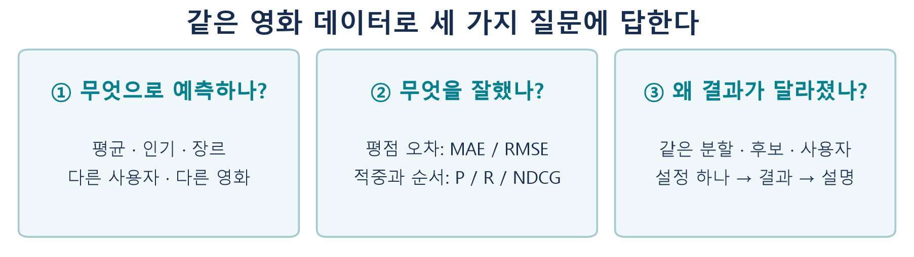
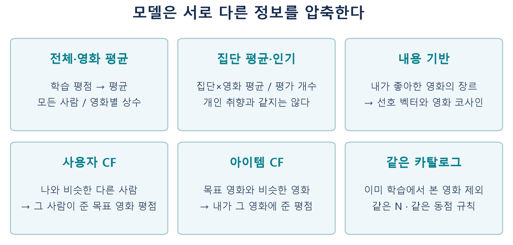
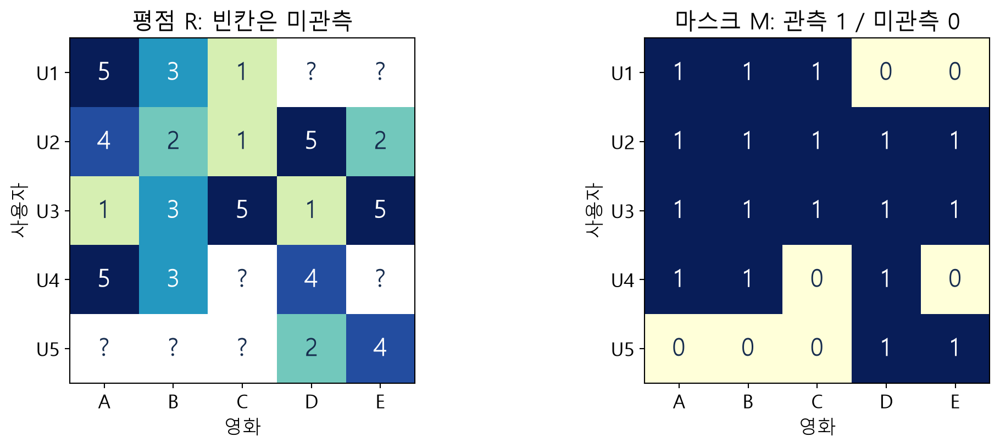
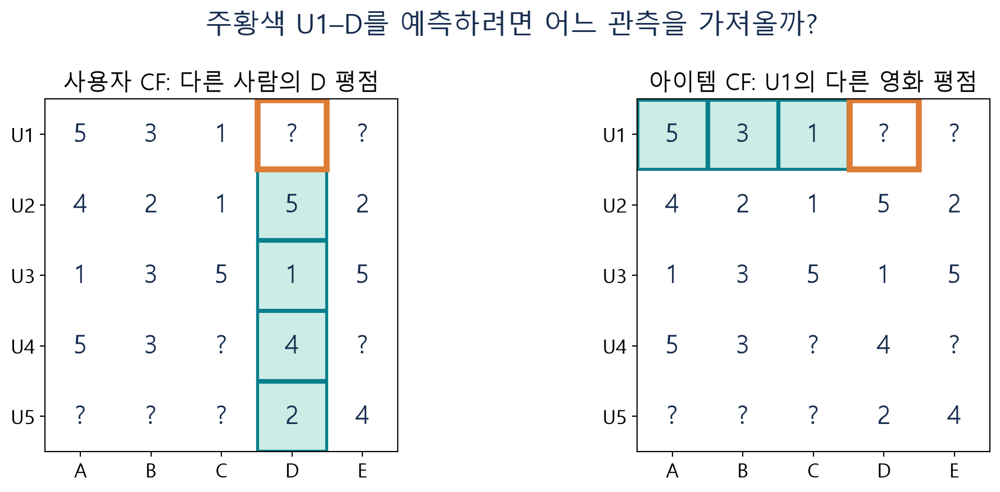
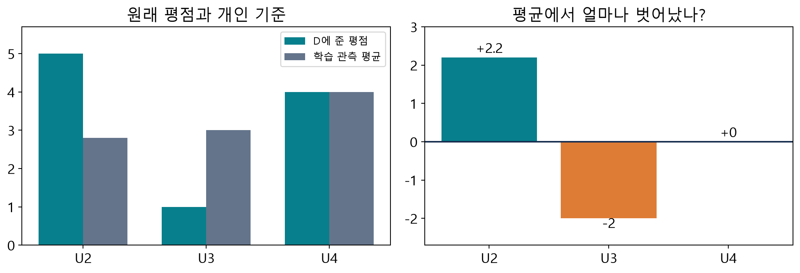
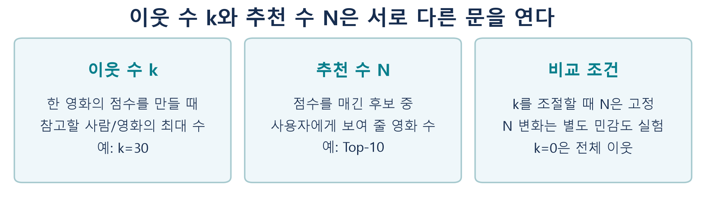
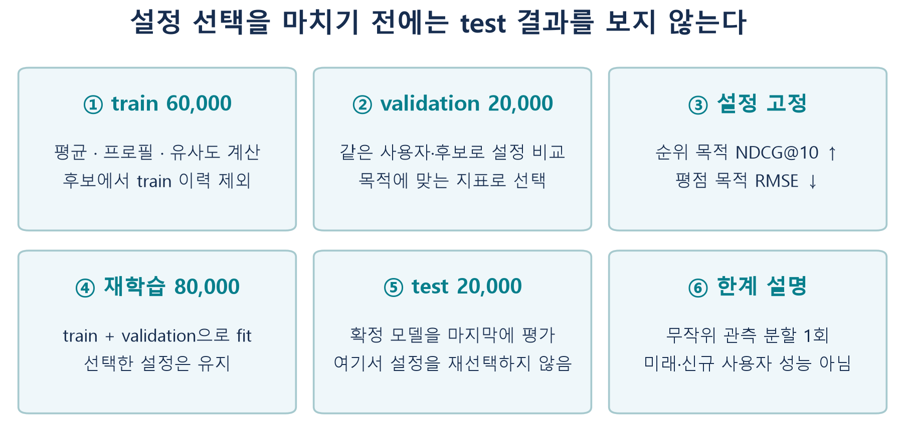
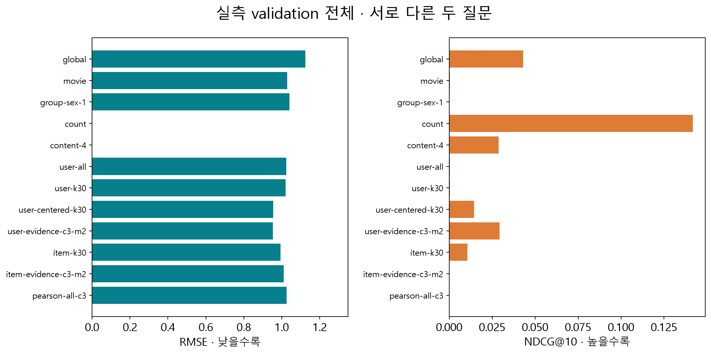
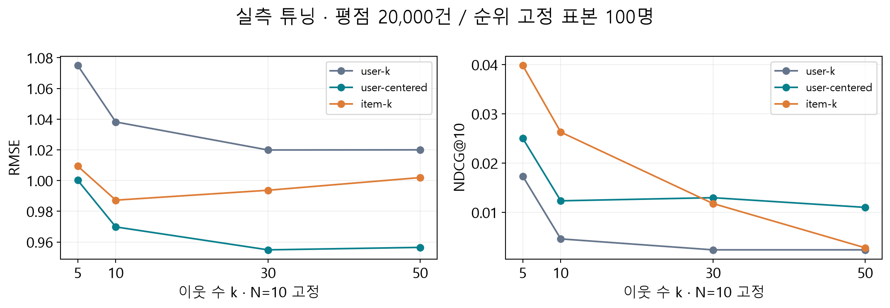
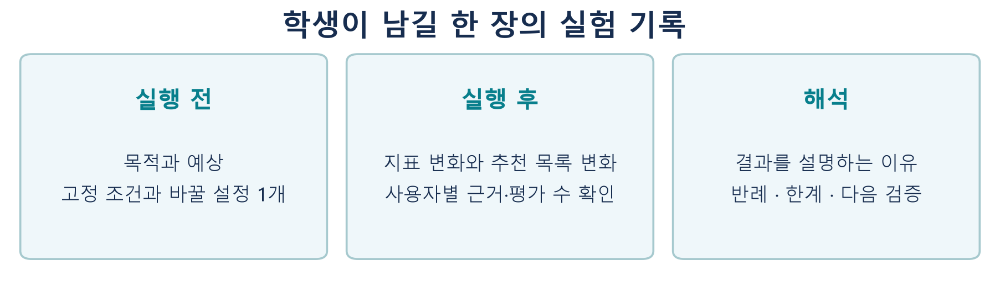

# W05A · 추천시스템 핵심 복습과 동일 데이터 모델 비교·튜닝·평가

**딥러닝응용I(추천시스템) · 동덕여자대학교 데이터사이언스전공 · 유원상 교수 · 2026-2**

2026년 9월 29일 화요일 · 5주차 1차시 · 주교재 1–3장

지금까지 배운 추천 모델을 하나의 데이터에서 비교합니다. 이번 시간의 목표는 가장 높은 숫자를 찾는 데서 끝나지 않습니다. **모델이 어떤 정보를 사용했고, 지표는 어떤 질문에 답하며, 설정을 바꾸자 추천 경험이 왜 달라졌는지 설명하는 것**이 목표입니다.

[별도 보강: 추천 성과지표를 그림과 계산으로 이해하기](../supplements/w05a-metrics-remediation.md) · [실습 A: 모델·지표 복습](https://colab.research.google.com/github/lunalab-ai/recommender/blob/2026-fall-w05a-v2/notebooks/student/w05a-review-metrics.ipynb) · [실습 B: 비교·튜닝·웹 앱](https://colab.research.google.com/github/lunalab-ai/recommender/blob/2026-fall-w05a-v2/notebooks/student/w05a-model-comparison.ipynb)

## 1. 먼저 세 문장으로 현재 이해를 확인하기

**D1.** 아이템 CF는 영화의 줄거리나 장르가 비슷한 영화를 찾는 방법인가요? 사용하는 자료를 적으세요.

**D2.** 예측 평점의 오차가 작은 모델이 Top-10 추천에서도 항상 더 좋은가요? 두 과업이 무엇을 요구하는지 구분하세요.

**D3.** 이웃 수 30을 추천 영화 30편으로 해석해도 될까요? 점수 계산과 목록 만들기를 구분하세요.

지금 답하지 못해도 괜찮습니다. 수업이 끝날 때 같은 문장을 다시 설명해 봅시다.

**그림 1.** 왼쪽에서 모델의 입력을 확인하고, 가운데에서 평가 질문을 고른 뒤, 오른쪽에서 결과 변화의 이유를 설명합니다. 독립 제작 도식입니다.

## 2. 모델 이름을 외우기 전에 정보의 출처를 보기

추천은 후보마다 점수를 매긴 뒤 높은 순서로 제시하는 과정입니다. 점수를 만드는 정보와 점수의 단위는 모델마다 다릅니다.

| 방법 | 학습에서 모으는 정보 | 점수의 뜻 | 개인화와 주의점 |
|---|---|---|---|
| 전체 평균 | 모든 학습 평점의 평균 | 예측 평점 | 모두 같은 점수; 순위는 동점 규칙에 의존 |
| 영화 평균 | 영화별 학습 평점 평균 | 예측 평점 | 사람마다 점수는 같고, 이미 본 영화만 달라짐 |
| 집단별 영화 평균 | 집단×영화의 평균 | 예측 평점 | 집단 속성이 개인 취향을 완전히 설명하지 않음 |
| 평가 수 인기 | 영화별 학습 평가 개수 | 관측 횟수 | 높은 평점과 많은 평가를 구분 |
| 내용 기반 | 좋아한 영화의 장르 프로필 | 장르 코사인 | 장르가 같은 영화 사이에 동점이 많을 수 있음 |
| 사용자 CF | 사용자 사이 평점 패턴 | 이웃의 평점을 집계한 예측 | 목표 영화를 평가한 다른 사람의 의견 |
| 아이템 CF | 영화 사이 평점 패턴 | 내 평점을 집계한 예측 | 내가 평가한 다른 영화에서 의견을 가져옴 |

**그림 2.** “영화를 비교한다”는 말만으로 내용 기반과 아이템 CF를 구분할 수 없습니다. 비교에 장르를 쓰는지, 여러 사용자의 평점을 쓰는지가 다릅니다.

생성자는 설정을 보관하고, `fit`은 학습 자료에서 필요한 상태를 만듭니다. 평균 모델은 평균을, 내용 모델은 선호 벡터를, CF는 평점 행렬·유사도·관측 이력을 만듭니다. 이 수업의 모든 `fit`이 신경망이나 경사하강법을 실행하는 것은 아닙니다.

## 3. 같은 작은 표에서 모델을 다시 따라가기

다음 5명×5편은 이전 수업에서 사용한 **독자 합성 자료**입니다. MovieLens의 일부가 아닙니다. 이번에는 U1·U2·U5를 가상 집단 F, U3·U4를 M으로 두고, A·D는 Action, C·E는 Comedy, B는 두 장르를 가진 것으로 설정합니다. 집단 기호는 계산 연습을 위한 것으로 개인 취향에 관한 가정이 아닙니다.

**그림 3.** 물음표는 0점이 아닙니다. 관측 평균을 계산할 때는 제외합니다. 코사인 행렬 연산에서 계산용 0을 채우더라도 원래 관측 마스크를 별도로 유지합니다.

U1이 아직 평가하지 않은 D의 점수를 생각해 봅시다.

- 전체 평균은 관측 18개의 합 56을 18로 나눈 약 3.111점입니다.
- 영화 평균은 D의 관측값 5, 1, 4, 2의 평균인 3점입니다.
- 집단 F의 D 관측은 U2의 5점과 U5의 2점이므로 3.5점입니다. 최소 집단 평가 수를 3으로 올리면 이 두 개만으로 집단 평균을 쓰지 않고 영화 평균으로 대체합니다.
- 인기 점수는 D를 평가한 사람이 4명이라는 개수입니다. 이 숫자 4를 예측 평점 4점으로 해석하지 않습니다.
- U1의 학습 평점이 4 이상인 영화는 A입니다. A의 Action 방향으로 만든 내용 프로필과 D의 방향은 같아 코사인이 1입니다. E의 Comedy 방향과는 직교하여 0입니다.

평균의 일반적인 형태는 다음과 같습니다. $T_i$는 학습에서 영화 $i$를 평가한 사용자 집합입니다.

$$
\hat r_{ui}=\bar r_i=\frac{1}{|T_i|}\sum_{v\in T_i}r_{vi}.
$$

집단 평균은 $T_i$ 중 대상 사용자의 집단과 같은 행만 모읍니다. 영화의 학습 관측도 없으면 학습 전체 평균으로 대체합니다. **대체 규칙은 예측의 일부이므로 결과표에 근거와 함께 남깁니다.**

**C1 · 예측하기.** U1에게 D와 E만 후보로 남았을 때 전체 평균 모델의 두 점수는 같습니다. 이번 동점 규칙이 영화 ID 오름차순이라면 어떤 정보가 추천 순서를 결정하나요?

### 내용 기반의 벡터를 읽는 방법

18개 장르의 0/1 벡터를 길이 1로 정규화합니다. 사용자가 좋아한 학습 영화들의 단위 벡터를 평균 내고 다시 정규화하여 선호 벡터 $p_u$를 만듭니다. 영화의 단위 벡터를 $x_i$라고 하면 점수는 다음과 같습니다.

$$
s(u,i)=\frac{p_u^\top x_i}{\|p_u\|\|x_i\|}=p_u^\top x_i.
$$

마지막 등식은 두 벡터가 단위 벡터일 때 성립합니다. 프로필이 비어 있으면 0으로 나누지 않고 영화 평균 목록으로 대체하며 `empty-profile`을 표시합니다. 장르가 없는 영화와 사용자의 빈 프로필은 서로 다른 상황입니다.

주교재의 내용 기반 예제는 별도 영화 자료의 줄거리에 TF–IDF를 적용합니다. TF–IDF는 문서 안에서 등장한 단어와 여러 문서에서 흔한 정도를 함께 반영해 텍스트를 벡터로 만듭니다. 실습 A의 세 문장으로 이 원리를 복습합니다. **MovieLens100K에는 줄거리 열이 없으므로 이번 공통 성과 비교에는 기존 수업과 같은 18개 장르를 사용합니다.** 두 데이터셋의 수치를 하나의 우열 표에 섞지 않습니다.

## 4. CF의 두 방향과 평균 보정을 분리하기

**그림 4.** 사용자 CF는 다른 사람의 D 평점을, 아이템 CF는 U1의 다른 영화 평점을 가져옵니다. 어느 쪽이든 아직 관측되지 않은 U1–D의 정답은 사용하지 않습니다.

사용자 CF의 기본식은 양의 유사도로 이웃의 평점을 가중평균합니다. $\mathcal N_{u,i}$는 목표 영화 $i$를 평가했고 필요한 근거 조건을 충족한 이웃 집합입니다.

$$
\hat r_{ui}=\frac{\sum_{v\in\mathcal N_{u,i}}s_{uv}r_{vi}}{\sum_{v\in\mathcal N_{u,i}}s_{uv}}.
$$

아이템 CF는 합산 대상이 바뀝니다. $\mathcal N_{i,u}$는 목표 영화 $i$와 비슷하면서 사용자 $u$가 학습에서 평가한 영화 집합입니다.

$$
\hat r_{ui}=\frac{\sum_{j\in\mathcal N_{i,u}}s_{ij}r_{uj}}{\sum_{j\in\mathcal N_{i,u}}s_{ij}}.
$$

평균 보정 사용자 CF는 “이웃이 평소보다 얼마나 높게 또는 낮게 평가했는가”를 집계하고 대상 사용자의 학습 평균을 다시 더합니다.

$$
\hat r_{ui}=\bar r_u+\frac{\sum_{v\in\mathcal N_{u,i}}s_{uv}(r_{vi}-\bar r_v)}{\sum_{v\in\mathcal N_{u,i}}s_{uv}}.
$$

**그림 5.** U4의 D 평점은 4점이지만 개인 평균도 4점이므로 편차는 0입니다. 높은 원점수가 언제나 예측을 올리는 양의 기여를 뜻하지 않습니다.

U1의 평균은 3점입니다. 앞선 수업의 `k=2`, 공통 평가 수 3 조건에서는 U2와 U3의 유사도 약 0.645423, 0.411201을 사용합니다. 두 편차 2.2와 −2를 가중평균하면 약 0.565507이므로 최종 예측은 약 3.565507점입니다. 실습 A에서 재사용 구현과 손계산을 대조합니다.

여기서 유사도는 **전체 영화 차원의 원평점 코사인**입니다. Pearson은 공통 관측의 평균에서 벗어나는 패턴을 비교하는 별도 유사도입니다. 이전 선택 실습의 Pearson CF는 양의 Pearson으로 원평점을 집계합니다. 이번 비교에 그 설정도 포함하지만, Pearson을 사용했다고 평균 보정 예측식까지 적용한 것은 아닙니다. 이진 행동의 Jaccard는 공통 행동 수/합집합 크기이며 실습 A의 작은 집합으로 복습합니다.

### 이웃의 수와 근거의 양

| 설정 | 검사하는 대상 | 부족하면 |
|---|---|---|
| `k` | 한 예측에 쓸 최대 이웃 수, 0은 전체 | 가능한 유효 이웃만 사용 |
| `min_common` | 두 사용자/영화가 공유한 관측 수 | 그 이웃을 후보에서 제외 |
| `min_neighbors` | 필터와 k 적용 뒤 이번 예측에 남은 이웃 수 | 학습 평균으로 대체 |
| `clip` | 최종 예측의 1–5 범위 | 켜면 범위를 벗어난 값을 제한 |

평균 보정 User-CF의 근거 부족은 사용자 평균, 다른 CF는 영화 평균→전체 평균으로 대체합니다. 평균 보정은 이번 구현에서 사용자 축에 적용합니다. Item-CF에 임의로 같은 옵션을 켜지 않습니다.

**그림 6.** k는 점수 생성의 설정이고 N은 목록과 평가의 조건입니다. k를 바꾸는 실험에서는 N을 고정합니다.

**C2 · 오류 찾기.** `k=2, min_neighbors=3`으로 설정한 결과에 예측값이 있다고 해서 CF 근거를 확보했다고 말할 수 있을까요? `basis`와 실제 기여 이웃 수를 확인하세요.

## 5. 지표는 서로 다른 질문에 답한다

### 평점을 얼마나 틀렸나: MAE와 RMSE

평가 관측이 $m$개이고 오차가 $e_j=y_j-\hat y_j$일 때,

$$
\mathrm{MAE}=\frac1m\sum_{j=1}^{m}|e_j|,\qquad
\mathrm{RMSE}=\sqrt{\frac1m\sum_{j=1}^{m}e_j^2}.
$$

둘 다 원래 평점과 같은 단위이며 작을수록 좋습니다. MAE는 평균적으로 몇 점 차이가 나는지를, RMSE는 큰 오차를 더 강하게 반영한 정도를 보여 줍니다. 주교재의 절대편차 평균 MAD는 이 문맥에서 MAE입니다. 중앙절대편차와 구분합니다.

**그림 7.** A의 절대오차 [1,1,1,1], B의 [0,0,0,4]는 모두 MAE=1입니다. 제곱 평균에 제곱근을 취하면 RMSE는 각각 1과 2입니다. 2는 “두 배 덜 정확하다”라는 보편적 비율이 아니라 이 오차 정의에서의 2점입니다.

평가 수 283회와 코사인 0.8은 1–5점 예측이 아닙니다. 따라서 인기·내용 기반에는 RMSE와 MAE를 **해당없음**으로 표시합니다. 빈값을 0으로 채우면 가장 좋은 평점 모델인 것처럼 보이는 오류가 생깁니다.

### 추천한 것 중 무엇을 맞혔나: Precision과 Recall

한 사용자의 상위 목록을 $L_u^N$, 보류한 평가 자료에서 4점 이상인 관련 영화 집합을 $G_u$라고 합니다.

$$
P@N=\frac{|L_u^N\cap G_u|}{N},\qquad
R@N=\frac{|L_u^N\cap G_u|}{|G_u|}.
$$

**그림 8.** 관련 영화 {A,C,E}, 추천 [A,B,C,D,F]이면 적중은 A와 C입니다. Precision@5는 2/5, Recall@5는 2/3입니다. “추천한 것 중 맞힌 비율”과 “찾아야 할 것 중 찾은 비율”은 다른 질문입니다.

여기서 비적중은 보류 자료에서 관련성이 **확인되지 않았다**는 뜻입니다. 실제로 보지 않은 영화를 싫어한다고 단정하지 않습니다. 이 제한 때문에 추천 후보 전체를 완전히 라벨링한 이진 분류와 같은 조건이라고 주장할 수 없습니다.

### 맞힌 것을 앞에 놓았나: NDCG

**그림 9.** 두 목록 모두 2개 적중하므로 P와 R은 같습니다. 앞쪽 적중을 더 높게 평가하려면 위치를 반영해야 합니다.

이번 실습은 이진 관련성 $rel_{u,j}\in\{0,1\}$을 사용합니다.

$$
DCG@N=\sum_{j=1}^{N}\frac{rel_{u,j}}{\log_2(j+1)},\qquad
NDCG@N=\frac{DCG@N}{IDCG@N}.
$$

**그림 10.** 첫 적중의 가치는 1, 두 번째는 약 0.631, 세 번째는 0.5입니다. IDCG는 관련 영화 수와 N을 고려해 만들 수 있는 가장 좋은 순위의 DCG입니다. 실제 목록을 이상적인 목록과 비교하므로 0–1 범위로 읽을 수 있습니다.

관련 영화가 없는 사용자는 Recall과 NDCG를 정의하기 어려우므로 모든 모델에서 동일하게 제외하고 제외 수를 보고합니다. 나머지 사용자의 지표를 각각 계산한 뒤 같은 비중으로 평균하는 **macro 평균**을 사용합니다. 전체 적중 수를 전체 관련 영화 수로 나눈 micro 비율과 다릅니다.

**C3 · 해석하기.** Precision@10이 0.1이라는 말은 평점 10개 중 하나를 정확히 맞혔다는 말인가요? 추천 자리 수와 적중의 정의를 사용해 다시 적으세요.

F1은 한 사용자의 P와 R의 조화평균 $2PR/(P+R)$입니다. 둘 다 0이면 0으로 둡니다. 전체 F1은 사용자별 F1의 평균이며 전체 평균 P·R로 다시 계산한 F1과 일반적으로 같지 않습니다.

## 6. 같은 시험을 치르게 만드는 평가 설계

**그림 11.** 마지막 test는 모형을 선택하는 연습장이 아닙니다. 설정을 고른 뒤 train+validation으로 다시 적합하고 한 번 평가합니다.

공통 데이터는 MovieLens100K의 943명·1,682편·100,000개 평점입니다. 평점은 1–5이고 사용자·영화 메타데이터를 함께 사용합니다. 원자료는 공식 경로에서 자동 준비하고 재실행에서는 캐시를 재사용합니다.

| 고정할 조건 | 이번 실습의 정의 |
|---|---|
| 분할 | test 20%, seed 20260922 → 남은 자료에서 validation 25%, seed 20260923 |
| 학습/검증/테스트 | 60,000 / 20,000 / 20,000 관측 |
| 통계 학습 | 평균·프로필·유사도는 train에서만 계산 |
| 후보 | 동일 1,682편 카탈로그에서 대상의 train 이력만 제외 |
| 동점 | 점수 내림차순, 영화 ID 오름차순; 반올림 전 정렬 |
| 관련성 | 평가 자료의 평점 4 이상, 모든 모델 동일 |
| 기본 추천 수 | N=10; N=5/20은 별도 민감도 비교 |
| 빠른 탐색 | seed 20260929로 고정한 100명; 평점은 20,000건 전체 |
| 전체 참조표 | 전체 평가 사용자 중 관련 영화가 있는 사용자 |
| 목적별 선택 | 순위 목적 NDCG@10 최대 / 평점 목적 RMSE 최소 |

내용 프로필에 넣는 **학습 선호 하한 3/4/5**는 조절할 수 있습니다. 그러나 평가 관련성의 **4점**을 같이 바꾸면 무엇을 맞혔는지의 정의까지 달라집니다. 두 설정을 혼동하지 않습니다.

이 실험은 같은 사용자의 다른 관측을 보류하는 무작위 분할입니다. 시간순 미래 추천이나 처음 보는 사용자의 성능을 측정하지 않습니다. 후보 카탈로그의 장르는 추천 시 알려진 것으로 가정합니다.

**C4 · 누수 고치기.** test의 NDCG를 보고 k를 여러 번 바꾼 뒤 최고 test 값을 보고하는 절차에서, 설정 선택에 사용해야 할 자료와 마지막 평가에 남겨야 할 자료를 적으세요.

## 7. 실제 결과를 읽을 때 보는 네 가지

아래 결과는 이 수업의 코드로 직접 실행한 참조 결과입니다. 빠른 표본 결과, 전체 validation 결과, 최종 test 결과는 서로 다른 표로 보관합니다. 학생이 실행한 결과에는 자신이 사용한 설정과 평가 집단을 함께 기록하세요.

### 7.1 같은 validation 전체에서 본 12개 기준 설정

train 60,000건에서 학습하고 validation 평점 20,000건을 모두 채점했습니다. 순위 평가는 전체 943명 중 관련 영화가 있는 **932명**, 제외 **11명**입니다. 모든 모델에서 N=10, 평가 관련성 4점, 학습 이력 제외와 동점 규칙이 같습니다. 표의 —는 평점 예측에 해당하지 않음을 뜻합니다.

| 설정 | MAE ↓ | RMSE ↓ | P@10 ↑ | R@10 ↑ | NDCG@10 ↑ |
|---|---|---|---|---|---|
| global | 0.9459 | 1.1245 | 0.0359 | 0.0289 | 0.0430 |
| movie | 0.8192 | 1.0290 | 0.0004 | 0.0005 | 0.0004 |
| group-sex-1 | 0.8261 | 1.0414 | 0.0003 | 0.0002 | 0.0002 |
| count | — | — | 0.1072 | 0.1161 | 0.1418 |
| content-4 | — | — | 0.0216 | 0.0203 | 0.0288 |
| user-all | 0.8141 | 1.0237 | 0.0003 | 0.0004 | 0.0003 |
| user-k30 | 0.8090 | 1.0199 | 0.0003 | 0.0004 | 0.0003 |
| user-centered-k30 | 0.7449 | 0.9549 | 0.0103 | 0.0088 | 0.0145 |
| user-evidence-c3-m2 | 0.7439 | 0.9530 | 0.0275 | 0.0266 | 0.0294 |
| item-k30 | 0.7797 | 0.9937 | 0.0128 | 0.0045 | 0.0106 |
| item-evidence-c3-m2 | 0.7910 | 1.0107 | 0.0003 | 0.0004 | 0.0003 |
| pearson-all-c3 | 0.8121 | 1.0261 | 0.0003 | 0.0002 | 0.0003 |

이 분할에서는 인기 개수(count)의 NDCG@10이 0.1418로 기준 설정 중 가장 높았습니다. 평균 보정·근거 조건을 넣은 User-CF는 RMSE가 0.9530으로 전체 평균의 1.1245보다 작았지만, NDCG@10은 0.0294였습니다. **평점 오차를 줄였다는 사실만으로 추천 목록도 더 좋다고 결론 내릴 수 없습니다.**

영화 평균과 일부 CF의 순위 성과가 매우 낮은 이유는 실습에서 실제 상위 목록의 `train_count`와 `basis`를 열어 확인합니다. 소수의 높은 평점으로 점수가 커진 영화, 관측되지 않아 관련성 확인이 안 되는 영화, 동점 순서가 결과에 어떤 영향을 주는지 구분하세요. 인기 추천의 우세 역시 이 관측 자료와 평가 조건의 결과이며 모든 서비스에서의 우세를 뜻하지 않습니다.

### 7.2 한 요소씩 바꾼 빠른 탐색

총 **38개 설정**을 동일한 순위 표본 100명에서 비교했습니다. 평점 오차는 표본과 무관하게 20,000건 전체입니다. k를 바꿀 때 N=10과 다른 조건은 고정했습니다.

곡선의 가장 좋은 k가 지표마다 다를 수 있습니다. 최종 선택은 목적을 먼저 정한 후 validation에서 합니다. 100명에서 찾은 최고 설정은 더 큰 사용자 집단에서도 최고라는 보장이 없습니다.

### 7.3 최종 평가와 사용자별 차이를 재현하기

[전체 실험 CSV와 분할·선택 기록](https://github.com/lunalab-ai/recommender/tree/2026-fall-w05a-v2/data/sample/w05a-results)에서 `validation-quick.csv`, `validation-full.csv`, `test-ranking.csv`, `test-rating.csv`를 구분해 읽으세요. 모델군마다 validation의 NDCG 최대 / RMSE 최소 설정을 먼저 고정하고 train+validation 80,000건으로 재학습한 뒤 test 20,000건에서 평가합니다. `selected-configurations.json`은 test 이전 선택 기록이고 `protocol.json`은 seed·관측 집합 식별자·실행 기록입니다.

`validation-activity.csv`와 `validation-distribution.csv`는 학습 이력의 양에 따른 집단 차이와 개인별 NDCG 분포를 담습니다. 실습 B에서는 이 두 집단의 개별 사용자를 골라 제목·장르·평가 수·추천 근거를 함께 확인합니다. 집단 간 차이를 학습 이력의 인과 효과로 해석하지 않습니다.

숫자를 읽을 때에는 먼저 단위와 분모, 다음으로 대체 비율, 마지막으로 사용자별 차이를 봅니다. 전체 평균 모델은 모든 후보가 동점이므로 순위 성능을 개인화 능력으로 해석하지 않습니다. 영화 평균 5점이 높은 추천 점수라고 해도 그 평균이 몇 명의 평가로 만들어졌는지를 확인해야 합니다.

**그림 12.** 숫자를 항상 반환하는 모델도 CF 근거가 부족할 수 있습니다. 같은 인기 영화만 반복 추천하면 반환 목록이 가득 차도 카탈로그 노출은 낮을 수 있습니다.

평균에서 차이가 작다는 이유만으로 모든 사용자에게 더 좋다고 결론 내리지 않습니다. 학습 이력이 적은 사용자와 많은 사용자의 결과를 따로 확인하고, 개인별 NDCG의 분포와 추천 목록을 함께 살펴봅니다. 이 한 번의 분할에는 온라인 만족도, 영화 소비 기회, 시간 변화가 충분히 반영되어 있지 않습니다.

## 8. 실습 A에서 B로: 계산 → 비교 → 설명

실습 A에서는 작은 합성 표에서 정보의 흐름을 따라갑니다. 평균·코사인·CF의 입력과 출력, 절대오차와 제곱오차, 적중 집합과 순서 할인을 직접 확인합니다. TF–IDF와 Jaccard·Pearson의 역할도 짧게 복습합니다.

실습 B에서는 실제 MovieLens를 자동으로 준비하고 공통 분할을 만듭니다. 모든 기본 모델의 빠른 성과표를 계산한 후 선택한 모델 1–2개에 집중합니다. 전체 참조 실험의 CSV도 함께 제공하지만, 자신의 새로운 실행 결과와 구분해 사용하세요.

| 바꿀 모델 | 한 번에 바꾸는 후보 | 함께 고정할 것 |
|---|---|---|
| 집단 평균 | 속성 sex/occupation, 최소 평가 수 1/5/10/20 | 분할·평가 관련성·N |
| 내용 기반 | 프로필에 넣는 학습 평점 하한 3/4/5 | 평가 관련성 4점 |
| User/Item CF | k=5/10/30/50 | 공통수·최소이웃·N |
| 평균 보정 User-CF | 평균 보정 여부 또는 k | 유사도 정의·다른 설정 |
| 신뢰도 CF | 공통수 1/3/5 또는 최소이웃 1/2/3 | k=30, 다른 조건 |

전체·영화 평균과 평가 수 인기는 이번 비교의 고정 기준선입니다. 없는 파라미터를 억지로 만들지 않습니다. 후보 조합 전체를 무작정 곱하지 않고 하나씩 바꿔 효과를 이해한 뒤 작은 후보 집합에서 선택합니다. `clip=False`는 범위 제한의 효과를 보는 별도 비교입니다.

**그림 13.** 실험 기록에는 “좋아졌다” 대신 어떤 지표가 얼마만큼 변했고 어떤 추천이 바뀌었는지를 적습니다.

**C5 · 내 실험 기록.** 목적, 가설, 고정 조건, 변경 설정, 전후 지표, 추천 목록 변화, 가능한 이유, 한계를 적으세요. 관측과 추측을 다른 문장으로 쓰세요.

## 9. 마지막 활동: 비교 결과를 웹 앱으로 연결하기

실습 B의 마지막 셀에서 누적 Gradio 앱을 실행합니다. 첫 화면에서 기준 모델과 변경 모델, 추천 목록을 볼 사용자, 공통 N을 선택합니다. 모델에 해당하는 설정 하나를 바꾼 뒤 **두 모델 비교하고 기록하기**를 누릅니다.

1. 두 목록의 제목·장르·점수·근거·학습 평가 수를 읽습니다. 서로 다른 단위의 점수 크기를 직접 비교하지 않습니다.
2. 지표 표의 평점 관측 수와 순위 사용자 수를 확인합니다. 빈 RMSE/MAE는 해당없음입니다.
3. 사용자를 바꾸어 개인 목록을 비교합니다. 사용자 선택은 고정 평가집단의 평균 지표를 바꾸는 조작이 아닙니다.
4. 비교 기록을 CSV로 내려받고 자신의 해석을 덧붙입니다.
5. 이전 수업 누적 앱 탭에서 유사도와 이웃의 기여도를 확인합니다.

**C6 · 화면 조립.** 실습 B의 마지막 구현 문제에서 버튼 입력과 함수 인자, 반환값과 화면 출력의 순서를 맞추세요. 추천 목록과 함께 자신의 한 줄 해석을 표시하도록 수정합니다. 완성 앱의 실행과 학생이 작성하는 연습 앱은 별도로 두어, 문제를 건너뛰어도 비교 실험을 계속할 수 있습니다.

Colab 공유 주소는 런타임이 실행 중일 때만 유지됩니다. 나중에 사용할 때 노트북을 다시 실행하고 새 주소를 사용하세요. 파일 메뉴에서 Drive 사본을 저장하고, 자신의 코드·실험 기록을 따로 보관하세요.

## 10. 코드를 열어 읽는 순서

노트북에는 사용하는 클래스·함수·메소드의 **고정 수업 버전 정의 줄**로 이동하는 바로가기를 제공합니다. `help(...)`로 입력과 반환을, `inspect.getsource(...)`로 실제 설치된 구현을 확인할 수 있습니다. 설치 버전과 GitHub 링크의 버전은 모두 `2026-fall-w05a-v2`입니다.

`ComparisonSuite(train, users, movies)`는 복사한 학습 표와 메타데이터를 보관합니다. `model(spec)`은 해당 설정의 기존 모델을 학습 또는 재사용하고, `recommend(spec, user_id, top_n)`은 같은 후보에서 추천 표를 반환합니다. `evaluate(spec, heldout, ranking_users=...)`는 요약 사전과 사용자별 지표 표를 반환하며 평가 정답은 이 단계에서만 채점에 사용합니다.

- [ModelSpec](https://github.com/lunalab-ai/recommender/blob/2026-fall-w05a-v2/src/luna_recsys/model_comparison.py#L21)
- [ComparisonSuite](https://github.com/lunalab-ai/recommender/blob/2026-fall-w05a-v2/src/luna_recsys/model_comparison.py#L111)
- [ComparisonSuite.model](https://github.com/lunalab-ai/recommender/blob/2026-fall-w05a-v2/src/luna_recsys/model_comparison.py#L131)
- [ComparisonSuite.recommend](https://github.com/lunalab-ai/recommender/blob/2026-fall-w05a-v2/src/luna_recsys/model_comparison.py#L150)
- [ComparisonSuite.evaluate](https://github.com/lunalab-ai/recommender/blob/2026-fall-w05a-v2/src/luna_recsys/model_comparison.py#L172)
- [compare](https://github.com/lunalab-ai/recommender/blob/2026-fall-w05a-v2/src/luna_recsys/model_comparison.py#L226)
- [select_best](https://github.com/lunalab-ai/recommender/blob/2026-fall-w05a-v2/src/luna_recsys/model_comparison.py#L241)
- [split_three](https://github.com/lunalab-ai/recommender/blob/2026-fall-w05a-v2/src/luna_recsys/model_comparison.py#L81)
- [ranking_metrics](https://github.com/lunalab-ai/recommender/blob/2026-fall-w05a-v2/src/luna_recsys/ranking.py#L163)
- [ComparisonLab](https://github.com/lunalab-ai/recommender/blob/2026-fall-w05a-v2/src/luna_recsys/comparison_lab.py#L16)
- [ComparisonLab.metrics](https://github.com/lunalab-ai/recommender/blob/2026-fall-w05a-v2/src/luna_recsys/comparison_lab.py#L32)
- [comparison_view](https://github.com/lunalab-ai/recommender/blob/2026-fall-w05a-v2/src/luna_recsys/comparison_lab.py#L39)
- [build_comparison_app](https://github.com/lunalab-ai/recommender/blob/2026-fall-w05a-v2/src/luna_recsys/comparison_lab.py#L87)

`ModelSpec`의 설정은 불변 객체로 관리합니다. 설정을 바꿀 때는 `dataclasses.replace`로 새 설정을 만들어 이전 기록과 혼동하지 않습니다. DataFrame의 행 순서와 ID를 유지하고, 반올림은 계산이 끝난 뒤 화면에 표시할 때만 적용합니다.

## 점검 퀴즈

1. 아이템 CF와 장르 내용 기반 추천은 영화를 비교할 때 각각 어떤 정보를 사용하는가?
2. 인기 개수와 코사인 점수에 평점 RMSE를 그대로 계산하면 왜 해석이 잘못되는가?
3. 절대오차가 [1,1,1,1]과 [0,0,0,4]인 두 모델의 MAE와 RMSE는 각각 얼마인가?
4. 관련 영화가 {A,C,E}, Top-5가 [A,B,C,D,F]일 때 Precision과 Recall은 얼마인가?
5. 두 추천 목록의 적중 개수가 같아도 NDCG가 달라질 수 있는 이유는 무엇인가?
6. 이웃 수 k, 추천 수 N, 학습 선호 하한, 평가 관련성 기준은 각각 어느 단계의 설정인가?
7. 설정을 validation에서 고른 뒤 최종 test를 평가하는 올바른 학습 순서는 무엇인가?
8. 전체 평균 성과와 개별 추천 목록을 함께 확인해야 하는 이유와 이 실험의 한계 한 가지를 설명하라.

## 핵심 정리와 출처

모델은 사용하는 정보와 점수의 의미로 구분합니다. 평점 오차, 적중 비율, 적중 위치는 다른 질문입니다. 공정한 비교는 같은 데이터뿐 아니라 분할·후보·사용자·분모를 맞추는 일입니다. 튜닝은 검증 자료에서 수행하고 최종 테스트 결과와 분리합니다. 좋은 설명은 지표, 추천 사례, 한계를 함께 제시합니다.

- 주교재: 임일, 『AI 에이전트를 위한 개인화 추천 알고리즘: Python, 머신러닝, AI, LLM 활용』, 청람, 2025, 1–3장. 기본 모델과 CF 및 성과지표 용어를 따른 설명입니다. 합성 예제·도식·통합 평가 설계·앱은 수업용으로 독립 제작했습니다.
- [GroupLens MovieLens100K](https://grouplens.org/datasets/movielens/100k/)와 [공식 README](https://files.grouplens.org/datasets/movielens/ml-100k-README.txt): 데이터 규모·스키마·이용 조건.
- [Stanford IR: 집합 기반 평가](https://nlp.stanford.edu/IR-book/html/htmledition/evaluation-of-unranked-retrieval-sets-1.html), [순위 기반 평가](https://nlp.stanford.edu/IR-book/html/htmledition/evaluation-of-ranked-retrieval-results-1.html): P/R/F1와 순위 할인. 이 수업의 NDCG는 이진 gain을 명시해 사용합니다.
- [scikit-learn: 검증과 test 분리](https://scikit-learn.org/stable/modules/cross_validation.html), [Surprise: 이웃 기반 알고리즘](https://surprise.readthedocs.io/en/stable/knn_inspired.html): 데이터 누수와 이웃 집계의 교차 확인.
- [Gradio Blocks](https://gradio.app/docs/gradio/blocks): 화면과 이벤트 연결. 외부 자료 확인일: 2026-09-28.
