# W05B · 행렬요인화(MF)와 SGD

**딥러닝응용I(추천시스템) · 동덕여자대학교 데이터사이언스전공 · 유원상 교수 · 2026-2**

2026년 10월 1일 · 5주차 2차시 · 주교재 4.1–4.3(65–78쪽)

이번 수업의 질문은 **“평점 하나가 사용자와 영화의 잠재벡터를 어떻게 바꾸는가?”**입니다. 수업이 끝나면 한 평점의 예측과 갱신을 손으로 계산하고, 같은 연산이 반복되는 코드를 읽을 수 있어야 합니다.

## 1. 지난 추천 모델에서 이어지는 질문

이웃 기반 CF는 비슷한 사용자나 영화의 관측 평점을 모았습니다. MF는 관측 평점들을 잘 설명하는 사용자 벡터와 영화 벡터를 학습합니다. 둘 다 여러 사람의 평점 정보가 영향을 주지만, 저장하는 정보와 예측의 계산 방식이 다릅니다.

| 비교 | 이웃 기반 CF | 이번 MF |
|---|---|---|
| 핵심 정보 | 평점 패턴·유사도·관측 이력 | 사용자/영화 잠재벡터와 편향 |
| 한 칸의 예측 | 관련 이웃의 평점 집계 | 두 벡터의 내적과 편향 합 |
| fit에서 하는 일 | 평균·유사도 등의 계산 | 오차를 줄이도록 모수 반복 갱신 |
| 설명할 근거 | 기여한 이웃 | 평균·편향·요인별 기여 |

**D1.** 아직 평가하지 않은 영화를 0점으로 넣으면 어떤 의견을 데이터에 추가하는 셈일까요?

**D2.** MF의 잠재요인 2개는 반드시 액션과 코미디를 뜻할까요?

## 2. 같은 평점표를 계속 사용하기

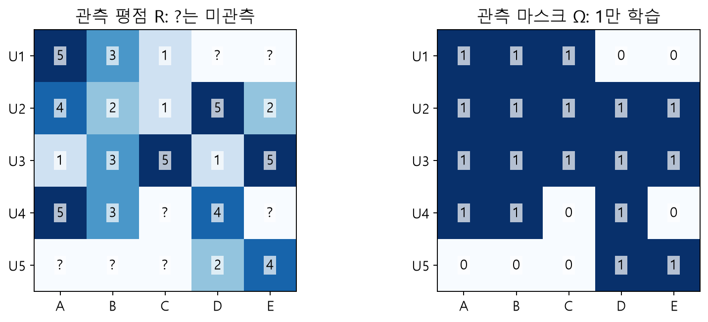

**그림 1.** 이전 수업의 독자 합성 예제입니다. 물음표는 싫다는 뜻이 아니라 아직 관측하지 못했다는 뜻입니다. 관측 평점 합은 56, 관측 수는 18입니다. 25칸 전체를 분모로 쓰지 않습니다.

실제로 관측한 사용자–영화 쌍의 집합을 $\Omega$라고 합니다. 이번 학습은 $\Omega$의 평점만 목표값으로 사용합니다. 코드에서는 빈칸을 포함한 큰 행렬 대신 `user_id, movie_id, rating`의 관측 표를 전달합니다. 표에 명시적으로 들어간 0점은 유효한 평점으로 취급하지만, MovieLens 100K의 실제 평점 범위는 1–5점입니다.

U1이 아직 평가하지 않은 D는 모델이 점수를 제시할 대상입니다. 이 칸의 알려지지 않은 정답을 학습 손실에 넣을 수는 없습니다.

## 3. 행렬을 두 개로 나눈다는 말의 의미

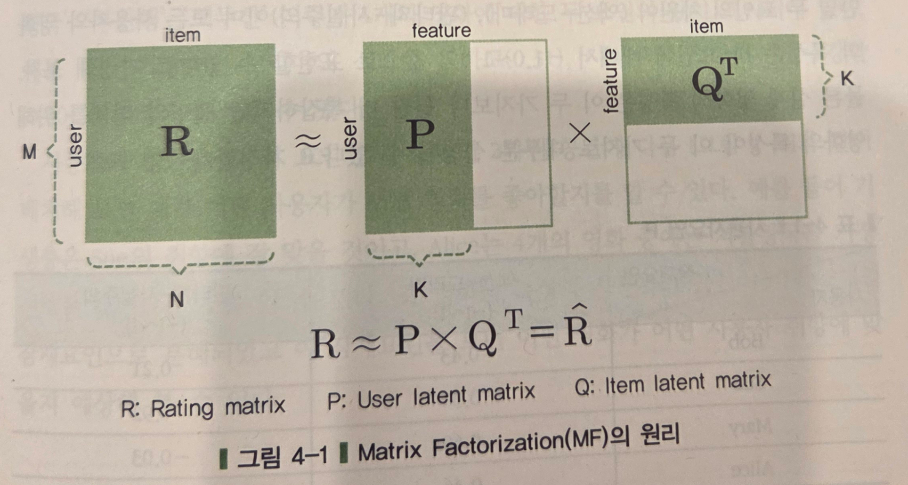

**교재 그림 4-1 직접 발췌.** 임일, 『AI 에이전트를 위한 개인화 추천 알고리즘』, 청람, 2025, 65쪽. 왼쪽의 사용자–영화 관계를 가운데의 사용자–요인과 오른쪽의 요인–영화 관계로 표현합니다. 다음은 같은 구조에 배열 크기를 붙인 수업용 보강입니다.

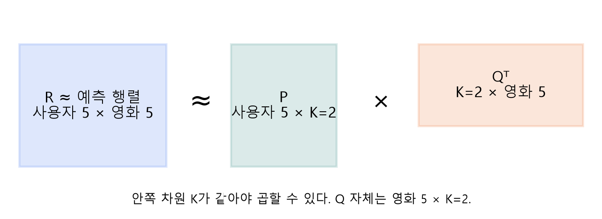

사용자 수 $M$, 영화 수 $N$, 잠재요인 수 $K$에 대해:

$$
R\in\mathbb{R}^{M\times N},\quad P\in\mathbb{R}^{M\times K},
\quad Q\in\mathbb{R}^{N\times K},\quad \hat R=PQ^\top.
$$

$P$의 한 행 $p_u$는 사용자 $u$의 벡터입니다. $Q$의 한 행 $q_i$는 영화 $i$의 벡터이며, $Q^\top$에서는 한 열로 보입니다. 교재의 사용자 $i$·아이템 $j$ 표기를 이 자료에서는 사용자 $u$·아이템 $i$로 구분합니다.

`P @ Q.T`의 결과는 사용자×영화입니다. “분해”는 관측된 불완전한 평점에 잘 맞는 모수를 찾는 근사 학습입니다. 빈칸을 0으로 채운 행렬의 정확한 분해나 SVD 계산을 실행한다는 뜻은 아닙니다.

**C1.** 사용자가 943명, 영화가 1,682편이고 K=8이면 P와 Q의 모양은 무엇인가요? 내적 한 번에는 몇 개의 곱셈 항이 있나요?

## 4. 한 칸의 예측은 내적이다

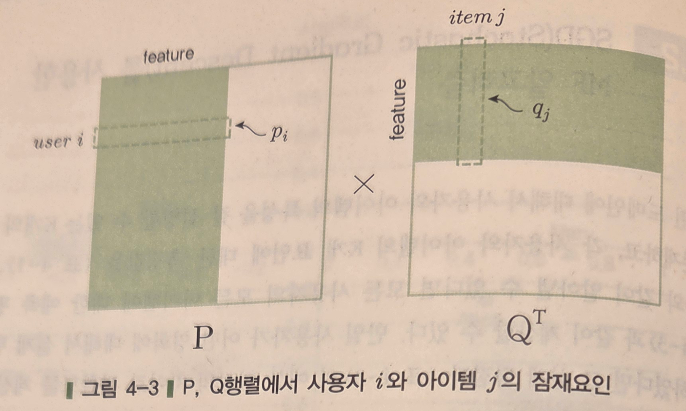

**교재 그림 4-3 직접 발췌.** 같은 책 70쪽. 사용자 한 행과 아이템 한 열을 골라 대응하는 요인끼리 곱하고 합합니다.

$$
\hat r_{ui}=p_u^\top q_i=\sum_{k=1}^{K}p_{uk}q_{ik}.
$$

설명용으로 $p=(0.2,0.4)$, $q=(0.5,-0.1)$을 정해 봅시다. 첫 요인 기여는 $0.2\times0.5=0.10$, 둘째는 $0.4\times(-0.1)=-0.04$입니다. 합은 $0.06$입니다. 두 번째 항은 전체 점수를 낮추는 기여입니다. 이는 계산 예시이며 실제로 학습한 특정 장르의 선호 수치가 아닙니다.

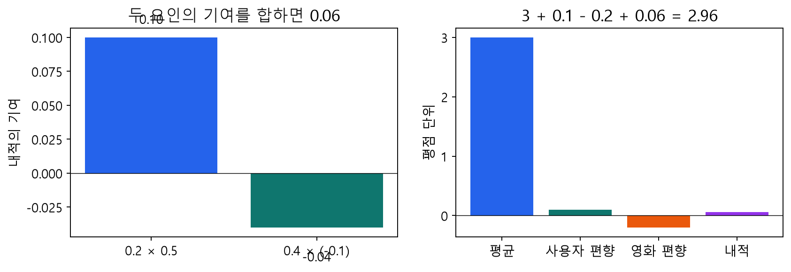

**그림 2.** 왼쪽 막대는 내적의 두 항입니다. 오른쪽은 뒤에서 추가할 평균·편향을 함께 표시합니다. 음수 좌표를 “음수 평점”이나 “그 장르를 반드시 싫어함”으로 바로 번역하지 않습니다.

## 5. 잠재요인 그림을 읽되 과잉 해석하지 않기

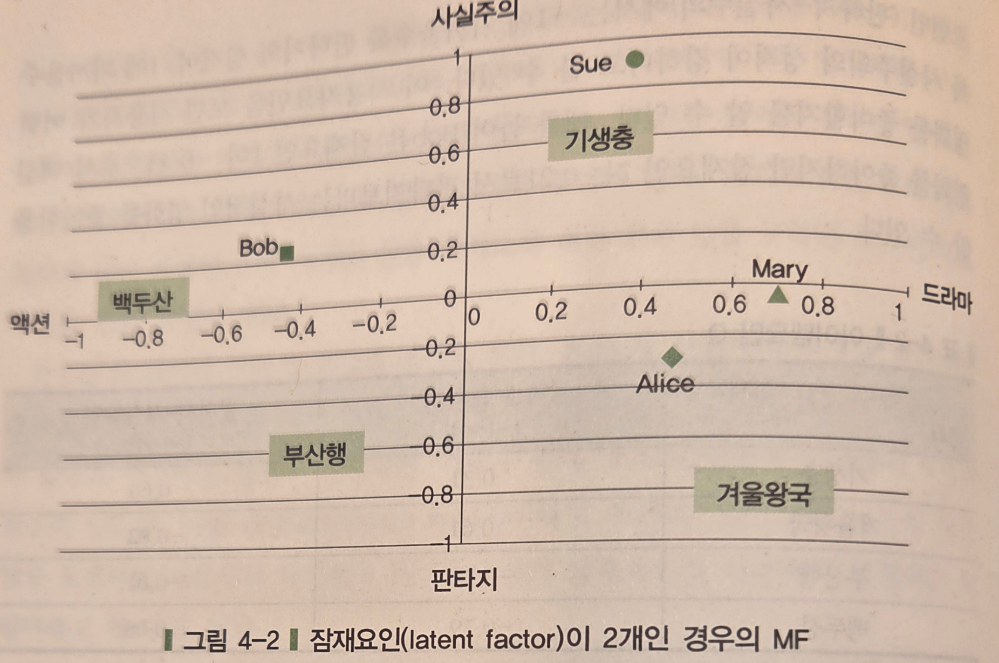

**교재 그림 4-2 직접 발췌.** 같은 책 68쪽. 교재는 두 축에 장르·표현 경향의 이름을 붙여 직관을 제공합니다. 학습에서는 평점 오차를 줄이는 숫자를 찾으며, 축에 이 이름을 자동으로 부여하지 않습니다.

특정 축의 이름은 별도 분석을 통해 조심스럽게 해석해야 합니다. 두 인수에 같은 직교 회전을 적용해도 내적은 유지되므로, 예측이 같아도 좌표의 모습은 달라질 수 있습니다.

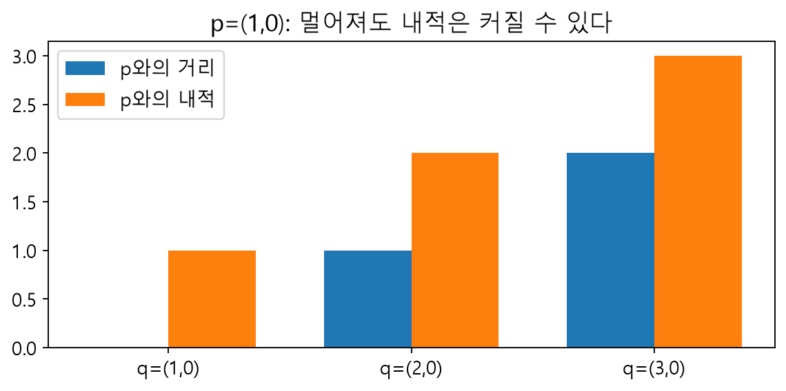

**그림 3.** $p=(1,0)$에 대해 $q=(3,0)$은 $(1,0)$보다 멀지만 내적은 더 큽니다. 이번 점수는 내적이므로 “그림에서 가장 가까운 영화”를 곧바로 최고 점수로 선택하면 안 됩니다.

**C2.** 벡터의 방향이 같을 때 길이가 두 배가 되면 내적은 어떻게 달라지나요? 코사인 유사도와의 차이를 말해 보세요.

## 6. 평점의 기준 수준을 따로 설명하기

사람마다 점수를 후하게 주는 정도가 다르고, 영화마다 전반적으로 받는 평가 수준이 다릅니다. 이를 잠재요인 상호작용과 나눠 표현합니다.

$$
\hat r_{ui}=\mu+b_u+c_i+p_u^\top q_i.
$$

| 항 | 뜻 | 이번 구현 |
|---|---|---|
| $\mu$ | 전체 관측 평점의 기준 | 학습 표의 평균, 학습 중 고정 |
| $b_u$ | 사용자의 전반적인 평가 경향 | 0에서 시작해 SGD로 학습 |
| $c_i$ | 영화의 전반적인 평가 경향 | 0에서 시작해 SGD로 학습 |
| $p_u^\top q_i$ | 이 사용자와 영화의 상호작용 | 두 잠재벡터로 학습 |

설명용 평균 3, 사용자 편향 0.1, 영화 편향 −0.2를 사용하면 예측은 $3+0.1-0.2+0.06=2.96$입니다. 이 평균 3은 손계산을 위해 정한 값이며 5×5 예제의 실제 평균 56/18과 구분합니다.

편향은 사용자 평균에서 전체 평균을 한 번 빼서 고정한 값과 같지 않습니다. 다른 항과 함께 오차를 줄이며 학습합니다. 교재의 전체 평균 $b$, 사용자 편향 $bu$, 아이템 편향 $bd$가 이 자료의 $\mu,b_u,c_i$에 대응합니다.

## 7. 잔차가 알려주는 갱신 방향

실제 평점이 4라면 현재 예측 2.96은 낮습니다. 잔차를 실제값−예측값으로 정의합니다.

$$
e_{ui}=r_{ui}-\hat r_{ui}=4-2.96=1.04,\qquad
\ell_{\mathrm{data}}=\frac12e_{ui}^{2}=0.5408.
$$

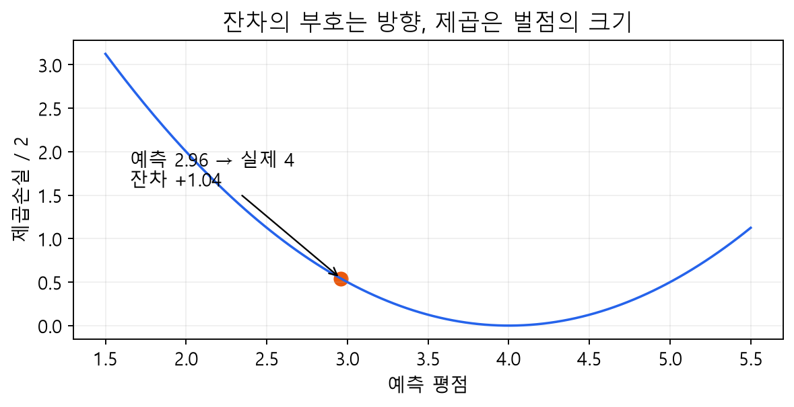

**그림 4.** 예측이 실제값 쪽으로 움직이면 제곱손실이 작아집니다. 그러나 어느 모수를 어느 방향으로 바꿀지는 그 모수가 예측에 미치는 기울기로 결정합니다.

정규화가 없을 때 연쇄법칙을 적용하면:

$$
\frac{\partial\ell}{\partial p_{uk}}=-e_{ui}q_{ik},
\qquad
\frac{\partial\ell}{\partial q_{ik}}=-e_{ui}p_{uk}.
$$

$p_{uk}$가 조금 변할 때 예측은 $q_{ik}$배만큼 변하고, 잔차는 그 반대 방향으로 변합니다. 따라서 양의 잔차라고 모든 좌표를 증가시키지는 않습니다. 현재 $q_2=-0.1$이면 $p_2$를 줄이는 것이 내적을 증가시키는 방향입니다.

**C3.** 이 예에서 정규화 없이 p의 첫 좌표와 둘째 좌표는 각각 어느 방향으로 움직여야 할까요?

## 8. 너무 큰 모수를 억제하는 정규화

관측 오차만 맞추다 보면 큰 모수로 일부 관측을 과하게 설명할 수 있습니다. 한 관측의 목적함수를 다음처럼 정의합니다.

$$
\ell_{ui}=\frac12e_{ui}^2+
\frac{\beta}{2}\left(\lVert p_u\rVert^2+\lVert q_i\rVert^2+b_u^2+c_i^2\right).
$$

정규화 기울기 $\beta p_u$는 좌표를 0 쪽으로 당깁니다. 최종 이동은 데이터 적합 방향과 수축 방향의 합입니다. $\beta$를 높이면 반드시 모든 평가 지표가 좋아지는 것은 아닙니다.

이번 구현은 **매 관측마다 해당 벡터·편향을 정규화하는 규약**을 사용합니다. 전체 목적함수는 관측별 손실의 평균입니다. 자주 관측된 사용자·영화는 더 자주 수축 갱신됩니다. 전체 모수의 제곱합을 딱 한 번 더하는 다른 규약과 정규화 수치를 직접 비교하지 않습니다.

교재 본문 일부 식은 제곱오차 미분의 계수 2를 표시하고 제공 코드는 `error`를 사용합니다. 여기서는 1/2 제곱손실을 채택해 계수 2가 상쇄됩니다. 손실의 배율과 정규화 정의가 다르면 학습률·정규화 값을 그대로 옮기지 않습니다.

## 9. SGD 한 번을 손으로 따라가기

기울기의 반대 방향으로 학습률 $\alpha$만큼 이동합니다.

$$
\begin{aligned}
p_u^{new}&=p_u+\alpha(e_{ui}q_i-\beta p_u),\\
q_i^{new}&=q_i+\alpha(e_{ui}p_u-\beta q_i),\\
b_u^{new}&=b_u+\alpha(e_{ui}-\beta b_u),\\
c_i^{new}&=c_i+\alpha(e_{ui}-\beta c_i).
\end{aligned}
$$

오른쪽의 모든 값은 **갱신 전 상태**입니다. $\alpha=0.05$, $\beta=0.02$와 앞의 예제를 사용합니다.

| 모수 | 갱신 전 | 데이터 방향−수축 | 갱신 후 |
|---|---:|---:|---:|
| $p_1$ | 0.2 | $1.04(0.5)-0.02(0.2)=0.516$ | 0.2258 |
| $p_2$ | 0.4 | $1.04(-0.1)-0.02(0.4)=-0.112$ | 0.3944 |
| $q_1$ | 0.5 | $1.04(0.2)-0.02(0.5)=0.198$ | 0.5099 |
| $q_2$ | −0.1 | $1.04(0.4)-0.02(-0.1)=0.418$ | −0.0791 |
| $b_u$ | 0.1 | $1.04-0.02(0.1)=1.038$ | 0.1519 |
| $c_i$ | −0.2 | $1.04-0.02(-0.2)=1.044$ | −0.1478 |

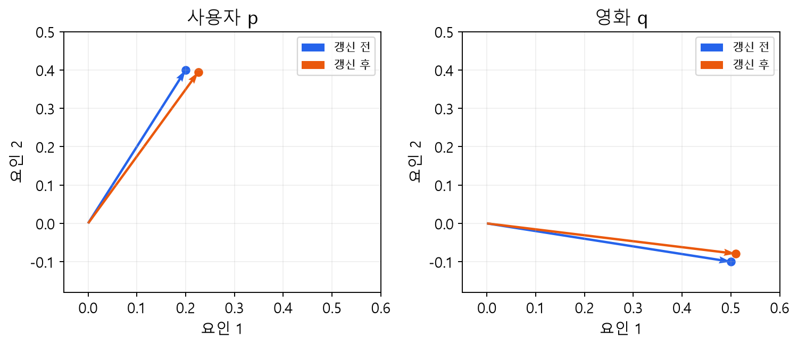

**그림 5.** 두 벡터가 같은 방향으로 평행 이동하는 것이 아닙니다. 각 벡터가 상대 벡터와 잔차에 따라 이동합니다. 초기값과 새 값을 표·그림·코드에서 대조하세요.

출판사 `4장-1.py`는 P를 먼저 갱신하고 이어 Q 갱신에서 바뀐 P를 참조합니다. 이 순차 제자리 갱신과 위의 동일 시점 기울기 갱신은 숫자가 조금 다릅니다. 이번 코드는 `p_old`, `q_old`를 복사해 위 수식과 일치시킵니다. 손계산 보강자료에서 두 방식의 차이를 다시 확인합니다.

## 10. 한 단계와 한 epoch는 다르다

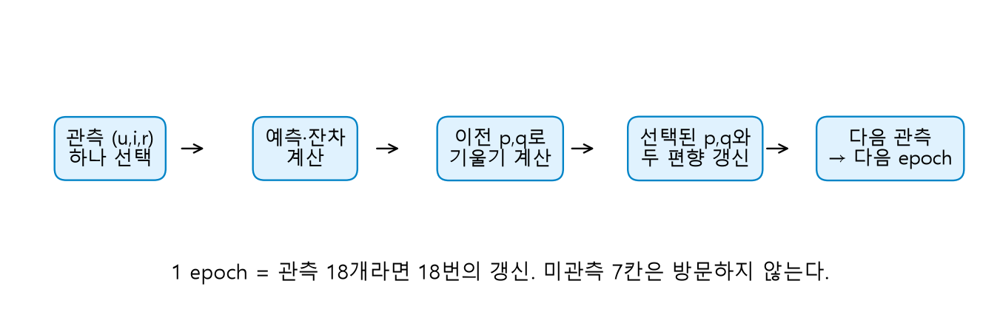

**그림 6.** 18개 관측을 한 번씩 처리하면 1 epoch입니다. 80 epoch이면 1,440번의 관측 갱신입니다. 매 epoch 관측 순서를 섞어 같은 순서에만 의존하지 않게 합니다.

한 관측을 처리할 때 해당 사용자와 영화의 벡터·편향만 직접 바뀝니다. 그러나 그 사용자의 다른 영화 예측과 그 영화의 다른 사용자 예측도 함께 영향을 받습니다. 모수를 공유하기 때문입니다.

각 단계가 다른 관측까지 개선하는 보장은 없습니다. SGD 한 단계의 손실이나 매 epoch RMSE가 항상 단조 감소해야 한다고 요구하지 않습니다.

**C4.** 18개 관측, 30 epoch이면 갱신은 몇 번인가요? U1–A를 학습한 뒤 U1–D 예측도 바뀔 수 있는 이유는 무엇인가요?

## 11. 초기화와 네 가지 설정

| 설정 | 질문 | 이번 기본값 |
|---|---|---|
| K | 벡터에 숫자를 몇 개 둘까? | 손계산 2, 실제 데이터 8 |
| $\alpha$ | 한 번에 얼마나 이동할까? | 0.02 |
| $\beta$ | 모수 크기를 얼마나 억제할까? | 0.02 |
| epoch | 관측 전체를 몇 번 방문할까? | 실제 빠른 실습 12 |

P와 Q를 모두 0으로 시작하면 내적의 데이터 기울기도 0입니다. 편향은 학습될 수 있지만 상호작용 벡터는 0에 머뭅니다. 작은 무작위 값은 이 정체를 피합니다.

교재의 초기화 표준편차는 1/K입니다. 이번 통제 실험에서는 K를 바꾸는 효과와 초기화 규모가 섞이지 않도록 표준편차 0.1을 별도로 고정합니다. seed 고정은 재현을 돕지만 설정이나 배열 크기가 바뀌어도 모든 난수가 같다는 뜻은 아닙니다.

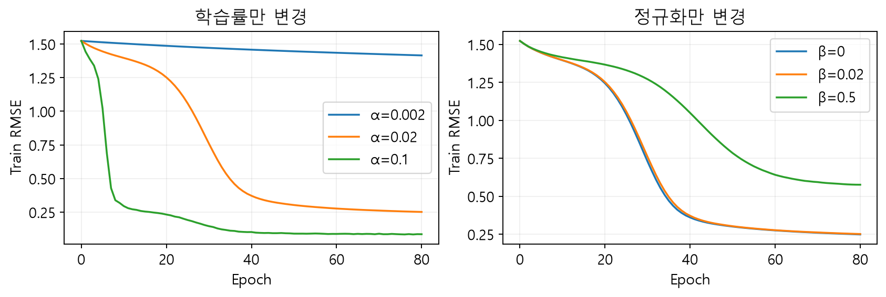

**그림 7.** 독자 18관측 예제의 실제 실행입니다. 왼쪽은 학습률만, 오른쪽은 정규화만 바꿉니다. “빨리 감소”와 “새로운 데이터에 잘 예측”은 다른 주장입니다. 큰 학습률은 진동이나 발산을 일으킬 수도 있습니다.

## 12. 코드를 읽는 순서: 설정 → 학습 → 예측

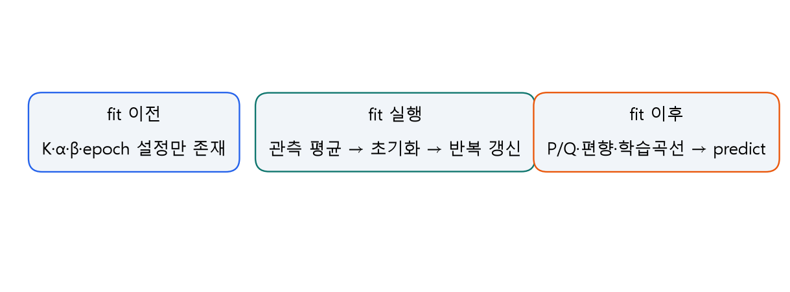

`MFSGD(...)`는 설정을 보관합니다. `fit(ratings)`는 관측 표에서 ID 사전을 만들고 평균·벡터를 초기화하며 반복 갱신한 뒤 자기 자신을 반환합니다. 이후 `P_`, `Q_`, `user_bias_`, `item_bias_`, `history_`가 존재합니다.

```python
model = MFSGD(n_factors=2, learning_rate=0.02,
              regularization=0.02, epochs=80, seed=20261001)
model.fit(ratings)
prediction = model.predict(user_id=1, movie_id=4)
parts = model.explain(user_id=1, movie_id=4)
```

`predict`는 평점 단위 실수 하나를 반환합니다. `explain`은 평균·두 편향·내적·요인별 기여와 알려진 ID 여부를 사전으로 반환합니다. 예측을 1–5 사이로 잘라내지 않으므로 범위를 벗어날 수도 있습니다. 잘라내기는 평가나 제품 설계에서 명시적으로 선택할 별도 규칙입니다.

처음 보는 사용자의 편향·벡터는 0으로 두고 알려진 영화의 편향은 유지합니다. 두 ID가 모두 새로우면 전체 평균을 반환합니다. 이 대체가 새 사용자의 취향을 학습했다는 뜻은 아닙니다.

노트북의 정의 바로가기는 설치 버전 `2026-fall-w05b`에 고정됩니다. 함수 이름뿐 아니라 입력 열·모양, 반환값, fit 전후 상태를 확인하세요. 소스에서 다음 부분을 차례로 읽습니다.

1. `sgd_step`: 한 관측의 갱신 전후를 모두 돌려주는 추적 함수.
2. `MFSGD.fit`: 관측 순서와 epoch, p_old/q_old, 편향 갱신.
3. `MFSGD.predict`, `explain`: 학습한 모수를 예측으로 연결.
4. `MFSGD.rmse`, `recommend`: 관측 채점과 미관측 목록 생성의 차이.
5. `step_view`, `training_view`, `build_mf_app`: 수치 결과와 화면 연결.

## 13. 실제 MovieLens에서 확인할 수 있는 것

MovieLens 100K는 943명·1,682편의 100,000개 1–5점 평점을 제공합니다. 공식 다운로드와 캐시 재사용은 실습이 자동 처리합니다. 빠른 실습에서는 seed=20261001로 뽑은 **20,000개 관측**을 학습하며 전체 100,000개 학습 결과로 부르지 않습니다.

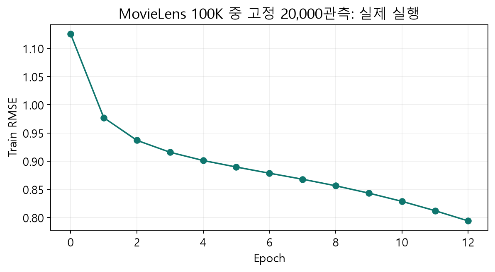

**그림 8.** K=8, 학습률 0.02, 정규화 0.02, 12 epoch의 실제 실행입니다. train RMSE는 초기 **1.125560**, 12 epoch 후 **0.793986**입니다. [실험 설정과 epoch별 수치](https://github.com/lunalab-ai/recommender/tree/2026-fall-w05b/data/sample/w05b-results)를 확인하세요.

$$
\mathrm{RMSE}_{train}=\sqrt{\frac{1}{|\Omega|}\sum_{(u,i)\in\Omega}(r_{ui}-\hat r_{ui})^2}.
$$

RMSE에는 정규화 항이 포함되지 않습니다. `history_.objective`는 관측별 정규화 손실의 평균이며 해석이 다릅니다. 이번에는 교재 기본 알고리즘의 학습을 확인합니다. Train/Test 분리 구현과 새 데이터 성능 평가는 4.4절에서 이어갑니다.

**C5.** “train RMSE가 줄었으므로 지난 시간의 CF보다 추천이 좋다”는 결론에는 어떤 검증이 빠져 있나요?

## 14. 실습 A에서 B로 이어가기

실습 A는 작은 숫자로 내적·오차·한 단계 갱신을 확인합니다. 실습 B는 관측 표로 MF를 학습하고 곡선을 설명합니다. 두 노트북은 독립 실행 가능하며 첫 셀부터 실행하면 필요한 환경과 데이터가 준비됩니다.

빈칸에는 `None`을 사용합니다. 답이 완성되지 않아도 뒤의 독립 시연을 실행할 수 있지만, 미완성 답이 정답으로 채점됐다는 뜻은 아닙니다. 문제마다 목표·힌트·자가 점검을 읽고 자신의 설명을 남기세요.

## 15. 마지막 활동: SGD를 웹 화면으로 연결하기

실습 B 마지막에서 Gradio 앱을 실행합니다. ‘한 평점의 갱신’은 손계산과 같은 초기값에서 출발하고 ‘반복 학습’은 관측 전체를 반복 처리합니다. 실제 데이터 앱에서는 응답 시간을 위해 전달한 표 중 최대 3,000관측의 고정 표본을 사용하고 관측 수를 표시합니다.

1. 학습률을 높이면 어떤 값이 변할지 먼저 예상합니다.
2. 한 설정만 바꾸고 버튼을 누릅니다. 갱신표의 부호와 요인별 기여도를 봅니다.
3. 반복 학습의 epoch 0과 마지막 값을 비교합니다. RMSE와 목적함수를 구분합니다.
4. “관측한 변화”와 “가능한 해석”을 나누어 기록합니다.
5. 앱 수정 문제에서 반환 메시지에 자신의 요약을 추가하고 다시 실행합니다. 입력→함수 인자→반환값→출력 컴포넌트 순서를 확인합니다.

**C6.** 학습률 입력이 함수의 정규화 인자로 잘못 연결되면 그래프를 보고 어떤 잘못된 결론을 내릴 수 있을까요?

공유 주소는 런타임이 실행 중일 때만 유지됩니다. 수업 뒤에는 Colab 사본을 저장하고 다시 실행해 새 앱 주소를 만드세요. 설치 후 재시작 안내가 나오면 런타임을 재시작한 뒤 첫 셀부터 실행합니다.

## 점검 퀴즈

1. MF에서 P와 Q는 각각 무엇을 나타내며, 사용자 943명·영화 1682편·K=8일 때 모양은 무엇인가?
2. 미관측 칸을 0점으로 채워 학습 손실에 포함하면 왜 문제가 되는가?
3. p=(0.2,0.4), q=(0.5,-0.1)의 내적은 얼마이며, 음수 항은 무엇을 뜻하는가?
4. 실제 평점 4, 예측 2.96일 때 잔차와 1/2 제곱손실은 얼마인가?
5. 양의 잔차일 때 잠재벡터의 모든 좌표를 늘려야 하는가? 이유를 설명하라.
6. SGD 한 단계와 한 epoch의 차이는 무엇이며, 18관측·30 epoch의 갱신 수는 얼마인가?
7. P와 Q를 모두 0으로 초기화하면 상호작용 학습에 어떤 문제가 생기는가?
8. 학습 RMSE 감소만으로 새 데이터의 추천 품질이 좋아졌다고 말할 수 없는 이유는 무엇인가?

## 핵심 정리와 출처

MF는 관측 평점을 설명할 잠재벡터를 학습합니다. 한 예측은 평균·두 편향·내적의 합입니다. SGD는 관측 하나의 잔차와 기울기로 해당 모수를 갱신하고 반복합니다. 관측 마스크, 갱신 시점, 초기화, 지표의 평가 범위를 정확히 설명할 수 있어야 합니다.

- 임일, 『AI 에이전트를 위한 개인화 추천 알고리즘: Python, 머신러닝, AI, LLM 활용』, 청람, 2025, 4.1–4.3. 세 그림은 교수자 허용에 따라 해당 영역을 직접 발췌했습니다. 손계산·보강 도식·NumPy 구현·앱은 수업용으로 독립 제작했습니다.
- [Google MF 설명](https://developers.google.com/machine-learning/recommendation/collaborative/matrix): 차원과 내적의 해석.
- [Surprise MF 문서](https://surprise.readthedocs.io/en/stable/matrix_factorization.html): 편향 포함 예측과 SGD 식의 교차 확인. 실습 설치에 Surprise는 필요하지 않습니다.
- [GroupLens 공식 데이터 설명](https://files.grouplens.org/datasets/movielens/ml-100k-README.txt): 데이터 규모·스키마·이용 조건.
- [Gradio Blocks](https://www.gradio.app/docs/gradio/blocks): 화면, 이벤트와 공유 실행. 외부 자료 확인일 2026-09-29.

## 실습과 구현 바로가기

- [Colab A · 한 단계 손계산](https://colab.research.google.com/github/lunalab-ai/recommender/blob/2026-fall-w05b/notebooks/student/w05b-sgd-step.ipynb)
- [Colab B · MF 학습과 웹 앱](https://colab.research.google.com/github/lunalab-ai/recommender/blob/2026-fall-w05b/notebooks/student/w05b-mf-sgd.ipynb)

고정 수업 버전의 정의 첫 줄로 이동합니다. docstring의 입력·반환·상태 변화를 확인하세요.

- [MFSGD](https://github.com/lunalab-ai/recommender/blob/2026-fall-w05b/src/luna_recsys/mf_sgd.py#L54)
- [MFSGD.fit](https://github.com/lunalab-ai/recommender/blob/2026-fall-w05b/src/luna_recsys/mf_sgd.py#L73)
- [MFSGD.predict](https://github.com/lunalab-ai/recommender/blob/2026-fall-w05b/src/luna_recsys/mf_sgd.py#L150)
- [MFSGD.explain](https://github.com/lunalab-ai/recommender/blob/2026-fall-w05b/src/luna_recsys/mf_sgd.py#L133)
- [MFSGD.rmse](https://github.com/lunalab-ai/recommender/blob/2026-fall-w05b/src/luna_recsys/mf_sgd.py#L154)
- [MFSGD.recommend](https://github.com/lunalab-ai/recommender/blob/2026-fall-w05b/src/luna_recsys/mf_sgd.py#L165)
- [sgd_step](https://github.com/lunalab-ai/recommender/blob/2026-fall-w05b/src/luna_recsys/mf_sgd.py#L15)
- [step_view](https://github.com/lunalab-ai/recommender/blob/2026-fall-w05b/src/luna_recsys/mf_lab.py#L10)
- [training_view](https://github.com/lunalab-ai/recommender/blob/2026-fall-w05b/src/luna_recsys/mf_lab.py#L29)
- [build_mf_app](https://github.com/lunalab-ai/recommender/blob/2026-fall-w05b/src/luna_recsys/mf_lab.py#L45)
