# W06a · MF의 평가와 튜닝, MF와 SVD

**딥러닝응용I(추천시스템) · 동덕여자대학교 데이터사이언스전공 · 유원상 교수 · 2026-2**

2026년 10월 6일 · 6주차 1차시 · 주교재 4.4–4.6(79–94쪽)

이번 수업의 질문은 **“훈련 오차가 줄어들면, 보지 않은 평점도 잘 맞힐까?”**입니다. 좋은 설정을 고르는 과정과 그 설정을 공정하게 평가하는 과정을 구분해 봅시다.

수업을 마치면 학습·검증·테스트의 역할을 설명하고, 곡선과 비교표로 MF 설정을 선택하며, SVD 재구성과 희소 평점 예측의 차이를 말할 수 있어야 합니다. 작은 손계산 → 실제 데이터 → 웹 앱 순서로 확인합니다.

## 1. 지난 수업에서 이어가기: MF는 무엇을 학습했나요?

MF는 사용자 벡터 $p_u$와 영화 벡터 $q_i$를 관측 평점에 맞게 학습합니다. 두 벡터의 내적에 전체 평균과 사용자·영화 편향을 더해 한 칸을 예측합니다.

$$
\hat r_{ui}=\mu+b_u+c_i+p_u^\top q_i.
$$

설명용으로 $\mu=3$, $b_u=0.1$, $c_i=-0.2$, $p_u=(0.2,0.4)$, $q_i=(0.5,-0.1)$이면 내적은 $0.10-0.04=0.06$, 예측은 **2.96**입니다. 실제 평점이 4라면 잔차는 $e_{ui}=4-2.96=1.04$입니다. 이 숫자는 손계산 예시이며 뒤의 실제 학습 평균과 다릅니다.

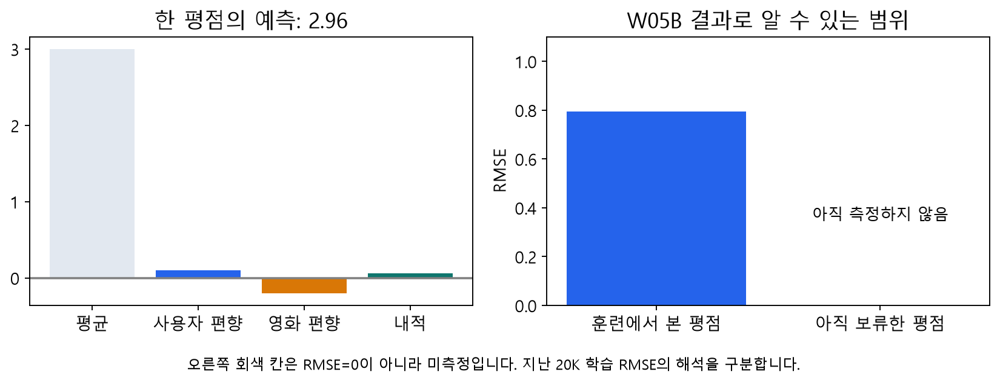

**그림 1.** W05b의 실제 20K 학습 RMSE는 약 0.794였습니다. 당시에는 학습한 관측을 다시 채점했습니다. 보류한 평점의 성능은 측정하지 않았습니다. 회색 칸은 RMSE가 0이라는 뜻이 아닙니다.

SGD는 한 관측의 오차를 줄이도록 해당 사용자·영화의 벡터와 편향을 조금씩 바꿉니다. 예를 들어 학습률 0.05, 정규화 0.02이면 첫 좌표는 다음과 같습니다.

$$
p_{u1}^{new}=0.2+0.05\{1.04(0.5)-0.02(0.2)\}=0.2258.
$$

모든 갱신에 같은 시점의 값을 사용합니다. 관측을 한 번 모두 방문하면 1 epoch입니다. 12,000개 관측을 20 epoch 학습하면 240,000번의 관측 갱신입니다.

**생각해 보기 D1.** 예측이 4에 가까워졌다는 것은 학습한 이 관측에 대한 설명입니다. 이 사실만으로 아직 보지 않은 영화의 평점까지 잘 맞힌다고 말할 수 있을까요?

## 2. 미관측과 보류한 관측은 다릅니다

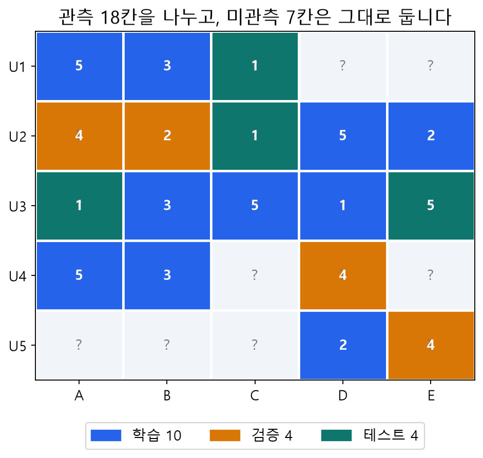

**그림 2.** W05b와 같은 독자 합성 예제입니다. 실제로 알려진 평점 18개를 10/4/4개로 나누었습니다. 작은 표에서는 비율을 정수 개수로 반올림합니다. 원래 몰랐던 7칸은 물음표로 남깁니다.

| 칸의 종류 | 정답을 알고 있나요? | 이번 역할 |
|---|---|---|
| 학습 관측 | 알고 있음 | 평균·편향·벡터를 학습 |
| 검증 관측 | 알고 있지만 학습에서 제외 | 설정과 epoch 선택 |
| 테스트 관측 | 알고 있지만 선택에서도 제외 | 선택이 끝난 뒤 최종 채점 |
| 원래 미관측 | 모름 | 추천 후보가 될 수 있으나 정확도 채점 불가 |

**빈칸을 0점이라고 넣으면 ‘아직 모름’이 ‘실제 0점’으로 바뀝니다.** MovieLens 평점은 1–5점입니다. 수업 코드는 관측 행을 따로 보관하므로 값이 0인지로 관측 여부를 판단하지 않습니다.

같은 사용자나 영화가 학습과 테스트에 모두 등장할 수 있습니다. 이번에는 **사용자–영화 관측쌍**을 분리합니다. 동일한 쌍이 두 집합에 중복되면 안 됩니다. 새 사용자에 대한 평가나 미래 추천을 평가하려면 사용자 단위·시간 단위 분할 등 별도의 설계가 필요합니다.

## 3. 4.4절: 학습할 때 무엇을 감추나요?

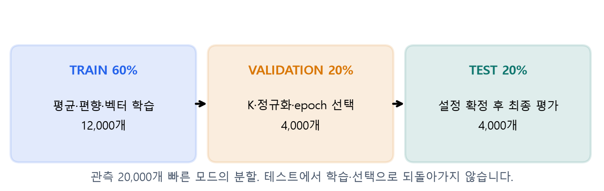

**그림 3.** 실제 실습의 빠른 모드입니다. MovieLens 100K에서 seed=20261006으로 20,000개 관측을 뽑고 12,000/4,000/4,000개로 나눕니다. 전체 100,000개 실험의 성능으로 부르지 않습니다.

학습 관측 집합을 $\Omega_{tr}$라고 하면 전체 평균도 이 집합에서만 계산합니다.

$$
\mu_{tr}=\frac{1}{|\Omega_{tr}|}\sum_{(u,i)\in\Omega_{tr}}r_{ui}.
$$

검증·테스트의 평점을 평균 계산에 섞거나, 그 평점으로 SGD 갱신을 하면 평가 대상 정보를 학습에 사용한 것입니다. 결측 대입, 정규화 기준 등 다른 전처리의 학습도 같은 원칙을 따릅니다.

사용자 ID와 배열 위치도 구별합니다. 실제 ID가 17과 902인 두 사용자를 배열의 0행과 1행에 둘 수 있습니다. `902 - 1`을 배열 위치로 사용하면 안 됩니다. 학습 표에서 만든 ID 사전으로 위치를 찾습니다.

처음 보는 ID가 평가에 있으면 해당 편향과 상호작용을 0으로 둡니다. 알려진 쪽의 편향은 유지하고, 두 ID가 모두 처음이면 학습 평균으로 예측합니다. 이는 취향을 알아낸 것이 아니라 **대체 규칙**입니다. 그런 행을 몰래 버리지 않고 건수까지 보고합니다.

**생각해 보기 C1.** 학습 평균과 전체 관측 평균 중 어느 값을 새 모델의 평균으로 써야 할까요? 사용자 ID를 확인했다는 사실과 그 사용자의 테스트 평점을 학습했다는 사실은 같은가요?

## 4. 교재 코드와 수업 코드를 연결하기

교재 4.4절의 `4장-2.py`는 관측을 75/25로 나누고, 전체 ID를 매핑한 행렬에서 `set_test()`로 보류 평점을 지웁니다. 남은 관측으로 평균과 SGD를 계산합니다. 전체 ID를 매핑했다는 이유만으로 보류 평점이 기울기에 사용되었다고 단정하지 않습니다.

| 교재 제공 코드 | 실제 역할 | 수업 코드에서 읽을 곳 |
|---|---|---|
| `set_test()` | 보류 평점을 학습 행렬에서 제거 | `split_three_way()`의 독립 관측표 |
| `test()` | 초기화와 반복 **학습** | `fit_validated()` |
| `get_one_prediction()` | ID를 위치로 바꾸어 예측 | `MFSGD.predict()` |
| `test_rmse()` | 보류 관측을 채점 | `evaluate_mf()` |

교재 4.5절은 `Test RMSE`를 여러 번 비교해 K와 반복 횟수를 선택합니다. **선택에 반복 사용한 집합은 검증 역할**입니다. 이 수업에서는 그 역할을 validation으로 명확히 표시하고 마지막 테스트를 별도로 남깁니다. 교재 원문을 바꿔 인용한 것이 아니라 평가 설계를 보완한 것입니다.

## 5. 평점 오차를 하나의 숫자로 모으기

같은 관측 집합 $S$에서 다음 지표를 계산합니다. 실제값과 예측값의 차이를 먼저 구한 뒤, 모든 관측에 대해 평균을 냅니다.

$$
\operatorname{MAE}(S)=\frac{1}{|S|}\sum_{(u,i)\in S}|r_{ui}-\hat r_{ui}|,
\qquad
\operatorname{RMSE}(S)=\sqrt{\frac{1}{|S|}\sum_{(u,i)\in S}(r_{ui}-\hat r_{ui})^2}.
$$

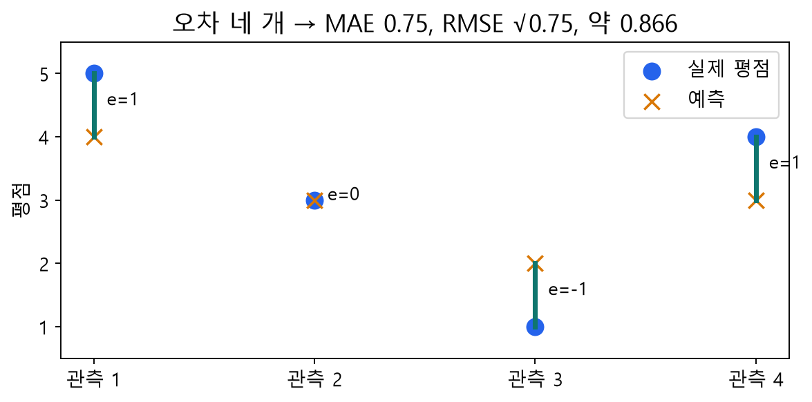

**그림 4.** 실제값 `[5,3,1,4]`, 예측 `[4,3,2,3]`의 잔차는 `[1,0,-1,1]`입니다. 절댓값 평균은 3/4=0.75, 제곱 평균은 3/4, RMSE는 그 제곱근 약 0.866입니다. 부호가 다른 오차를 상쇄하지 않습니다. 큰 오차가 있으면 RMSE가 더 민감하게 반응합니다.

학습 손실에는 정규화 항도 있지만, 보고하는 RMSE에는 정규화 항을 더하지 않습니다. 평점 오차 지표가 좋아졌다는 사실이 top-K 추천 순위나 사용자의 만족도까지 좋아졌다는 뜻은 아닙니다. 지난 시간의 ranking 평가와 구분하세요.

**생각해 보기 C2.** 한 예측 오차가 1에서 3으로 바뀌면 절대오차와 제곱오차는 각각 몇 배가 되나요?

## 6. 4.5절: 학습 곡선은 무엇을 말하나요?

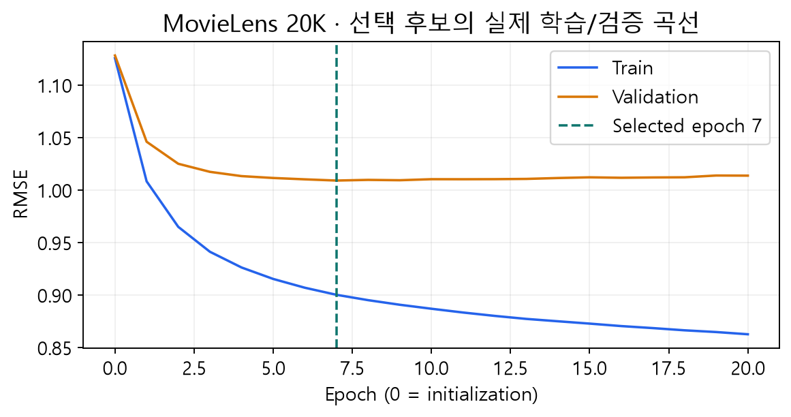

**그림 5.** 이번 고정 20K 표본의 실제 실행입니다. K=2, 학습률 0.02, 정규화 0.2로 20 epoch를 실행했습니다. 파란 학습 오차는 계속 낮아지지만 주황 검증 오차의 최저점은 7 epoch입니다. 그 이후 학습 적합의 개선이 검증 개선으로 이어지지 않습니다.

epoch 0은 무작위 초기화와 학습 평균만 있는 상태입니다. 최적 epoch는 다음 기준으로 고릅니다.

$$
e^*=\operatorname*{arg\,min}_{e\in\{0,\ldots,E\}}
\operatorname{RMSE}_{val}(\theta_e).
$$

여기서 $\theta_e$는 그 시점의 **P, Q, 사용자 편향, 영화 편향 전체**입니다. 숫자 7만 기억하고 실제로는 20 epoch의 모수로 평가하면 선택과 평가가 어긋납니다. 이번 함수는 전체 곡선을 기록한 뒤 선택 상태를 복원합니다. 계산을 중간에 멈추는 조기 중단과 구분하세요.

곡선은 모든 실행에서 반드시 같은 모양이 되는 법칙이 아닙니다. 검증 오차가 계속 줄면 관측한 범위에서는 더 긴 학습을 검토할 수 있습니다. 발산은 성공적인 실험 결과로 덮지 않고 학습률 등을 점검해야 합니다.

**생각해 보기 C3.** 학습 오차가 최소인 epoch와 검증 오차가 최소인 epoch가 다르면 무엇을 선택하나요? 테스트 곡선을 그려 선택하면 왜 문제가 되나요?

## 7. 모수와 하이퍼파라미터를 구별하기

| 대상 | 누가 정하나요? | 바꾸면 무엇이 달라지나요? |
|---|---|---|
| P, Q, 사용자·영화 편향 | SGD가 학습 | 평점의 예측값 |
| K | 실험자가 후보를 지정 | 잠재벡터 길이와 표현 능력 |
| 학습률 α | 실험자가 후보를 지정 | 한 갱신의 보폭 |
| 정규화 β | 실험자가 후보를 지정 | 모수 크기를 억제하는 강도 |
| 최대 epoch와 선택 시점 | 실험 설정과 검증 | 학습 반복의 범위와 사용할 상태 |

수업 구현은 한 관측에서 다음 목적함수를 사용합니다.

$$
\ell_{ui}=\frac12(r_{ui}-\hat r_{ui})^2+
\frac{\beta}{2}(\|p_u\|^2+\|q_i\|^2+b_u^2+c_i^2).
$$

전체 학습 목적은 학습 관측별 손실의 평균입니다. 자주 등장하는 사용자·영화는 정규화 갱신도 더 자주 받습니다. 모수 전체의 제곱합을 한 번만 더하는 다른 규약과 β의 숫자를 그대로 비교하지 않습니다.

K를 크게 하면 더 다양한 상호작용을 표현할 수 있지만 검증 성능 향상이 보장되지는 않습니다. 큰 β도 항상 좋지 않습니다. 학습률이 작아 덜 학습한 상태를 단순히 ‘모형이 나쁘다’고 판단하지 않도록 학습 곡선을 함께 봅니다.

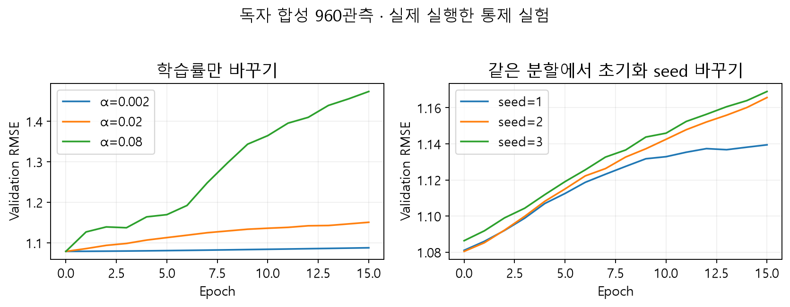

**그림 6.** 독자 합성 960관측에서 실제 실행한 보강 실험입니다. MovieLens 결과가 아닙니다. 왼쪽은 학습률만 바꾸고, 오른쪽은 같은 분할에서 초기화·방문 순서 seed만 바꿨습니다. seed는 결과를 가장 좋게 만드는 숫자로 골라 발표하기 위한 설정이 아닙니다.

## 8. 비교 실험을 공정하게 만들기

교재는 K를 넓게 탐색한 뒤 좁은 범위를 다시 살펴봅니다. 다음 그림은 교재의 특정 실험 결과입니다.

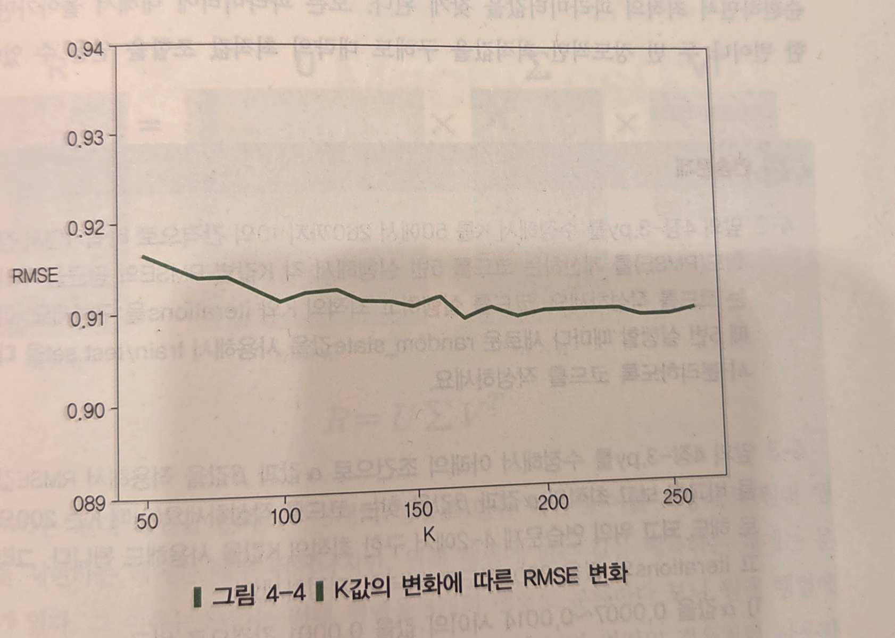

**교재 그림 4-4 직접 발췌.** 임일, 『AI 에이전트를 위한 개인화 추천 알고리즘』, 청람, 2025, 91쪽. 교재의 K=200 해석을 모든 데이터의 정답으로 외우지 않습니다. 이번 분할·표본·초기화·정규화 규약은 교재 실험과 다릅니다.

이번 핵심 실습은 **K={2,8} × β={0.02,0.2}의 네 후보**입니다. α=0.02, 최대 20 epoch, seed=20261006, 초기화 표준편차 0.1, 같은 분할과 무클리핑 평가를 유지합니다. 후보마다 검증 최저 epoch를 선택합니다.

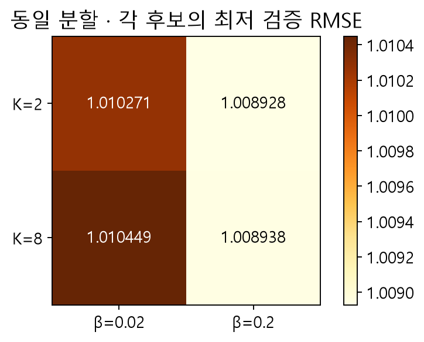

| K | β | 선택 epoch | 학습 RMSE | 검증 RMSE |
|---:|---:|---:|---:|---:|
| 2 | 0.02 | 7 | 0.887868 | 1.010271 |
| 2 | 0.20 | 7 | 0.900122 | 1.008928 |
| 8 | 0.02 | 5 | 0.892494 | 1.010449 |
| 8 | 0.20 | 11 | 0.871257 | 1.008938 |

K=2·β=0.2가 반올림 전 수치에서 최소입니다. 그러나 K=8·β=0.2와의 차이는 약 **0.000011**에 불과합니다. 이 한 분할로 K=2가 본질적으로 우월하다고 결론내리지 않습니다. 확장 실습에서는 여러 초기화·분할을 구별하여 반복하고 계산 비용도 함께 비교합니다.

선택을 마친 모델의 상태를 복원한 뒤 테스트 4,000개를 마지막에 채점했습니다. 이번 본문은 train+validation 재학습을 하지 않습니다.

| 최종 평가 대상 | 테스트 RMSE | 테스트 MAE |
|---|---:|---:|
| 학습 평균으로만 예측 | 1.121443 | 0.943687 |
| 검증으로 선택한 MF | 0.977993 | 0.779149 |

학습 평균은 약 3.529333입니다. 테스트에서 새 사용자 ID를 포함한 행 10개, 새 영화 ID를 포함한 행 75개가 있었고 둘의 합집합 **84개**에 대체 예측을 적용했습니다. 이 행도 지표에 포함했습니다. 테스트 RMSE가 검증 RMSE보다 낮을 수도 있습니다. 서로 다른 표본이므로 두 값 사이에 항상 지켜야 할 대소 관계는 없습니다.

20K 표본에는 관측 수가 매우 적은 사용자가 있어 사용자 층화 조건을 충족하지 못했습니다. 두 단계 모두 무작위 관측 분할로 대체되었으며 코드의 방법 이름은 `random-small-data`입니다. 이름과 달리 전체 크기뿐 아니라 드문 사용자의 존재도 대체 원인이 됩니다.

**비교 문장 틀 C4.** “같은 ___을 유지하고 ___을 바꿨다. 검증 ___를 기준으로 ___을 선택했다. 마지막 테스트 결과는 ___였으나, ___까지 보장하지는 않는다.”

## 9. 4.6절: SVD로 행렬을 다시 만들기


**교재 도식 직접 발췌.** 같은 책 93쪽. 왼쪽부터 행렬의 크기를 확인합니다. 완전 SVD에서는 $U$가 $m\times m$, $\Sigma$가 $m\times n$, $V^\top$가 $n\times n$입니다. 검은색/녹색 표시가 가리키는 앞부분을 남기면 절단 근사를 만들 수 있습니다.

완전한 실수 행렬 $A$의 SVD는 다음과 같습니다.

$$
A=U\Sigma V^\top=\sum_{j=1}^{r}\sigma_j u_jv_j^\top,
\qquad \sigma_1\geq\sigma_2\geq\cdots\geq0.
$$

각 항은 행렬에 더하는 하나의 패턴입니다. 큰 특이값의 항을 먼저 남기면 다음 저랭크 재구성을 얻습니다.

$$
A_k=U_k\Sigma_kV_k^\top.
$$

독자 손계산 예제로 $A=\begin{bmatrix}5&1\\1&5\end{bmatrix}$를 봅시다. 특이값은 6과 4입니다. 첫 방향은 $\frac{1}{\sqrt2}(1,1)^\top$이고 첫 항만 남기면 모든 칸이 3인 행렬입니다.

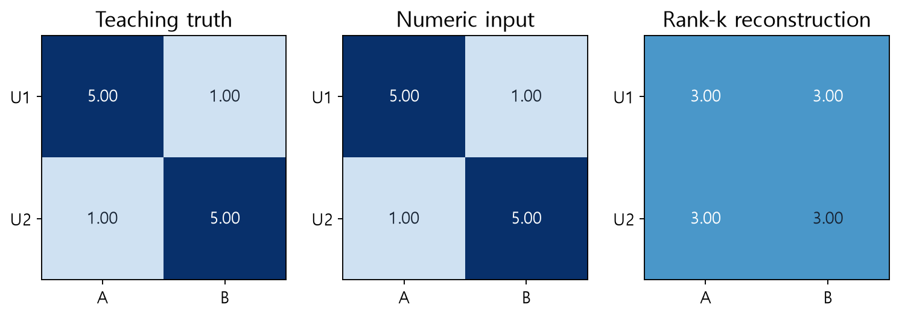

차이 행렬은 $\begin{bmatrix}2&-2\\-2&2\end{bmatrix}$이므로 Frobenius 오차는 $\sqrt{4+4+4+4}=4$입니다. 두 항을 모두 쓰면 원본을 수치 오차 수준에서 재구성합니다. 이 오차는 **주어진 완전 행렬의 재구성 오차**이며 보지 않은 평점의 테스트 RMSE가 아닙니다.

**선택 심화.** 완전 행렬의 비가중 제곱 재구성 오차에서는 절단 SVD가 최적 rank-k 근사를 주며, 오차 제곱은 버린 특이값 제곱의 합입니다. 관측 일부만의 손실과 편향·정규화를 포함한 MF 문제에 이 결론을 그대로 옮기지 않습니다.

## 10. 미관측을 0으로 채우면 어떤 문제가 생기나요?

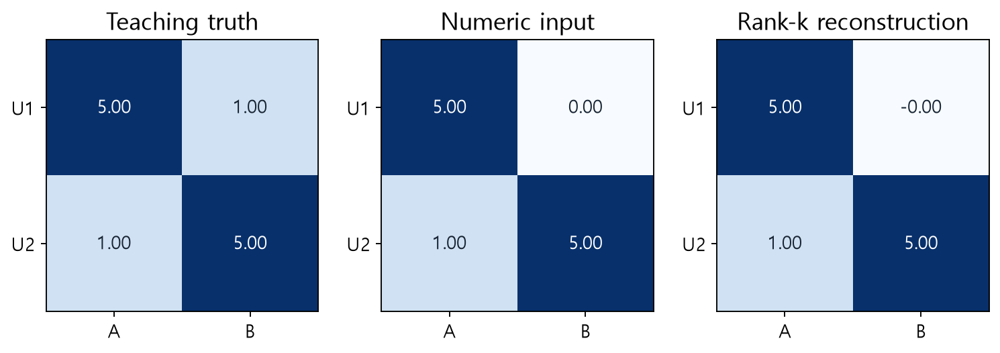

**그림 10.** 원래 1인 U1–B를 설명을 위해 감추고 0을 넣었습니다. 완전 재구성은 이 **0이 포함된 입력**을 잘 복원합니다. 원래 모르는 평점을 알아낸 것이 아닙니다. 실제 추천에서는 미관측 칸의 정답을 알 수 없으므로 이런 방식으로 평가할 수도 없습니다.

추천 MF는 미관측 칸을 손실에서 제외하고 알려진 학습 관측에만 맞춥니다. SVD 기반 방법을 추천에 사용할 수 없다는 뜻은 아닙니다. 결측 대입·중심화·별도 목적함수 등 처리 방식을 명시하고 보류 관측으로 평가해야 합니다.

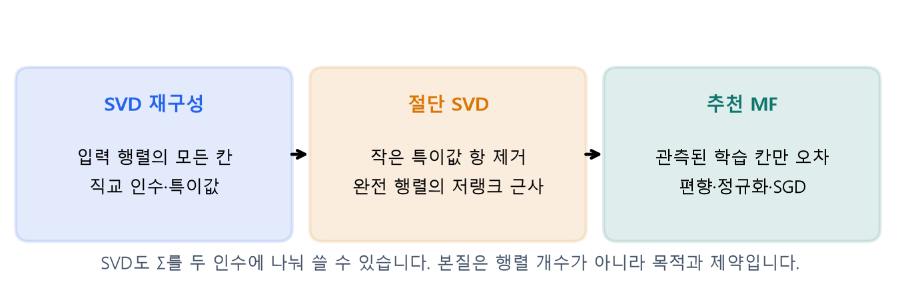

‘SVD는 행렬 3개, MF는 2개’만으로 구별하면 부족합니다. $P=U_k\Sigma_k^{1/2}$, $Q=V_k\Sigma_k^{1/2}$로 두면 절단 SVD도 $PQ^\top$로 쓸 수 있습니다. 중요한 차이는 **목적함수, 관측 처리, 직교 제약, 편향·정규화**입니다. 편향을 더한 MF의 전체 예측 행렬의 rank를 잠재요인 수 K와 무조건 같다고 하지도 않습니다.

추천 라이브러리 Surprise의 `SVD`는 평균·편향·내적의 관측 오차를 SGD로 학습하는 구현입니다. 이름만 보고 `numpy.linalg.svd()`와 같은 연산이라고 생각하지 마세요. 핵심 실습은 기존 NumPy MF를 사용하므로 Surprise 설치가 필요하지 않습니다.

## 11. 코드와 실습을 읽는 순서

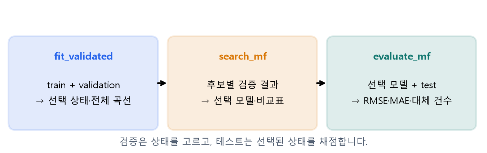

```python
split = split_three_way(ratings, seed=20261006)
chosen, table = search_mf(split.train, split.validation, epochs=20)
# 여기까지 test 평점은 함수에 전달하지 않았습니다.
final_score = evaluate_mf(chosen.model, split.test)
```

`chosen.history`는 실행한 모든 epoch 기록입니다. `chosen.model`은 마지막 epoch가 아니라 선택 epoch로 복원된 모델입니다. `chosen.best_epoch`와 `best_validation_rmse`를 함께 확인합니다.

**실습 A**에서는 작은 분할·손계산·ID 매핑을 확인한 뒤 실제 20K 표본에서 학습 곡선을 읽습니다. **실습 B**에서는 네 후보를 비교하고 선택 후 최종 평가, SVD, 웹 앱으로 이어갑니다. 두 노트북 모두 첫 셀부터 독립 실행할 수 있습니다.

노트북의 정의 바로가기는 공개 버전 `2026-fall-w06a`의 클래스·함수·메서드 시작 행으로 연결됩니다. 먼저 docstring의 입력과 반환값을 읽고, 이후 실제 구현을 확인하세요.

### 자주 확인할 구현

[MFSGD.fit](https://github.com/lunalab-ai/recommender/blob/2026-fall-w06a/src/luna_recsys/mf_sgd.py#L73) · [MFSGD.predict](https://github.com/lunalab-ai/recommender/blob/2026-fall-w06a/src/luna_recsys/mf_sgd.py#L150) · [sgd_step](https://github.com/lunalab-ai/recommender/blob/2026-fall-w06a/src/luna_recsys/mf_sgd.py#L15)

[split_three_way](https://github.com/lunalab-ai/recommender/blob/2026-fall-w06a/src/luna_recsys/mf_evaluation.py#L44) · [fit_validated](https://github.com/lunalab-ai/recommender/blob/2026-fall-w06a/src/luna_recsys/mf_evaluation.py#L126) · [search_mf](https://github.com/lunalab-ai/recommender/blob/2026-fall-w06a/src/luna_recsys/mf_evaluation.py#L187)

[evaluate_mf](https://github.com/lunalab-ai/recommender/blob/2026-fall-w06a/src/luna_recsys/mf_evaluation.py#L99) · [svd_reconstruct](https://github.com/lunalab-ai/recommender/blob/2026-fall-w06a/src/luna_recsys/mf_evaluation.py#L211) · [build_evaluation_app](https://github.com/lunalab-ai/recommender/blob/2026-fall-w06a/src/luna_recsys/mf_evaluation_lab.py#L72)

## 12. 마지막 활동: MF 평가 실험실 확장

앱의 세 탭은 **학습과 검증 / 4개 설정 비교 / SVD와 미관측**입니다. 먼저 결과를 예상한 뒤 한 설정만 바꾸고 실행합니다. 앱에는 테스트 데이터를 전달하지 않으며, 최종 테스트 평가는 노트북에서 수행합니다.

실습 B에서 `report_fn(history, best_epoch)`를 작성해 선택 epoch의 학습·검증 차이를 해석하는 문장을 화면에 추가합니다. **UI 입력 → callback → 공통 학습 함수 → 표·그림·내 문장**의 연결을 따라가세요. 제공 화면을 실행하는 데서 끝내지 않고 출력 함수를 수정해 재실행합니다.

Colab의 공유 주소는 실행 중인 런타임에 의존합니다. 런타임을 종료하면 다시 노트북을 실행해 새 주소를 열어야 합니다. 설치 후 재시작 안내가 나타나면 재시작한 뒤 첫 셀부터 다시 실행합니다. 다운로드가 실패하면 실제 데이터 검증을 합성 데이터로 통과한 것처럼 처리하지 않습니다.

## 점검 퀴즈

1. 미관측 평점과 테스트를 위해 보류한 평점은 어떻게 다른가요?
2. 전체 평균을 계산할 때 검증·테스트 평점을 제외해야 하는 이유는 무엇인가요?
3. K와 epoch를 고를 때 사용한 데이터를 최종 테스트라고 보고하면 어떤 문제가 있나요?
4. 실제값 [5,3,1,4], 예측 [4,3,2,3]의 MAE와 RMSE는 얼마인가요?
5. 검증 오차가 7 epoch에서 최소라면 마지막 20 epoch 모델을 평가해도 되나요?
6. K를 크게 하면 검증 성능이 항상 좋아지나요? 이번 비교표는 무엇을 보여주나요?
7. 0으로 채운 행렬을 SVD로 정확히 재구성하면 미관측 평점 예측도 정확한가요?
8. Surprise의 SVD와 NumPy의 SVD를 같은 연산이라고 볼 수 있나요?

## 기억할 세 문장과 참고자료

- 학습은 모수를 바꾸고, 검증은 설정을 고르며, 테스트는 선택이 끝난 모델을 채점합니다.
- 최적 설정은 데이터·분할·후보·계산 조건을 함께 말해야 의미가 있습니다.
- 완전한 행렬의 재구성과 미관측 평점의 예측은 다른 평가 문제입니다.

주교재: 임일(2025), 『AI 에이전트를 위한 개인화 추천 알고리즘: Python, 머신러닝, AI, LLM 활용』, 청람, 4.4–4.6, 79–94쪽. 그림 4-4와 93쪽 도식은 수업용 직접 발췌, 나머지 그림과 2×2 예제는 수업용 제작입니다.

- [scikit-learn: 모형 선택과 교차검증](https://scikit-learn.org/stable/modules/cross_validation.html)
- [NumPy: SVD와 재구성](https://numpy.org/doc/stable/reference/generated/numpy.linalg.svd.html)
- [Surprise: SGD 기반 SVD 구현](https://surprise.readthedocs.io/en/latest/matrix_factorization.html)
- [GroupLens: MovieLens 100K와 이용 조건](https://grouplens.org/datasets/movielens/100k/)

실측 기준: 2026-10-05, Python 3.12, 고정 seed·표본·분할. 실행시간은 환경에 따라 달라집니다. 재현 가능한 설정과 결과표는 실습에서 다시 확인합니다.
