# W06b · 고유값·고유벡터부터 이해하는 SVD와 추천시스템

**딥러닝응용I(추천시스템) · 동덕여자대학교 데이터사이언스전공 · 유원상 교수 · 2026-2**

2026년 10월 8일 · 6주차 2차시 · 주교재 4.6 「MF와 SVD」, 93–94쪽

이번 수업의 질문은 **“숫자가 들어 있는 표를 어떻게 몇 개의 방향과 패턴으로 설명할 수 있을까?”**입니다. 고유값·고유벡터를 처음 배운다고 가정합니다. 행렬곱부터 천천히 시작하여 지난 시간의 SVD 결과가 어디서 나왔는지 직접 계산합니다.

아래 작은 행렬들은 수업용으로 만든 합성 예제입니다. 실제 영화 평점 데이터에서 얻은 결과가 아닙니다. 교재의 MF/SVD 설명에 선형대수 기초와 손계산을 보충했습니다. 원본 교재 도식은 출처를 표시했습니다.

읽는 순서는 **그림 → 수치 계산 → 수식 → Python 검산 → 내 말로 해석**입니다. 기호를 한 번에 외우기보다 같은 예제의 입력과 출력을 계속 확인하세요. 계산 문제9개의 문제편과 상세 풀이편도 별도로 제공합니다.

## 1. 지난 MF 수업에서 여기로 오는 이유

지난 시간 MF에서는 사용자의 잠재벡터와 영화의 잠재벡터를 학습했습니다. 두 벡터의 내적에 평균과 편향을 더하면 한 평점을 예측했습니다.

$$\hat r_{ui}=\mu+b_u+c_i+p_u^\top q_i.$$

여기서 오늘 복습할 부분은 **작은 벡터의 곱으로 큰 표의 여러 숫자를 표현한다**는 생각입니다. MF의 모든 학습 과정을 다시 외울 필요는 없습니다. 오늘은 먼저 값이 모두 주어진 행렬을 정확히 분해하고 다시 만드는 방법을 배웁니다. 미관측 평점이 있는 추천 문제와의 차이는 마지막에 돌아옵니다.

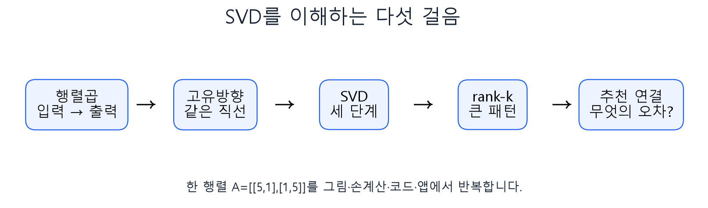

**그림1. 읽는 순서.** 숫자표를 읽는 법과 화살표의 길이를 먼저 준비합니다. 고유벡터를 통해 특별한 방향을 찾고, SVD로 방향별 크기를 분리합니다. 마지막에 몇 개의 패턴만 남겨 보고 추천 MF와 비교합니다.

| 기호 | 읽기 | 이 수업에서의 뜻 |
|---|---|---|
| $A$ | 에이 | 값을 모두 알고 있는 행렬 |
| $x,v,u$ | 엑스·브이·유 | 기본적으로 세로로 쓴 열벡터 |
| $A^\top$ | 에이 전치 | 행과 열을 바꾼 행렬 |
| $I$ | 아이 | 곱해도 벡터를 바꾸지 않는 단위행렬 |
| $\lambda$ | 람다 | 고유값, 특별한 방향의 부호 있는 배율 |
| $\sigma$ | 시그마 | 특이값, 음이 아닌 길이 배율 |
| $\Sigma$ | 큰 시그마 | 특이값을 대각선에 놓은 행렬 |
| $\|x\|$ | 엑스의 노름 | 벡터의 길이 |

## 2. 행렬은 숫자표이면서 벡터를 바꾸는 규칙

행렬의 크기는 행 수와 열 수로 표시합니다. $m\times n$ 행렬에는 세로로 $m$개의 행, 가로로 $n$개의 열이 있습니다. $A_{ij}$는 $i$번째 행과 $j$번째 열의 원소입니다. 행과 열을 뒤바꾸지 않는 것이 계산의 첫 단계입니다.

$$A=\begin{bmatrix}2&1\\0&1\end{bmatrix},\qquad x=\begin{bmatrix}1\\2\end{bmatrix}.$$

$x$는 평면에서 오른쪽1, 위쪽2를 가리키는 화살표로 그릴 수 있습니다. $Ax$는 행렬이 정한 규칙으로 이 화살표를 바꾼 결과입니다.

$$Ax=\begin{bmatrix}2\cdot1+1\cdot2\\0\cdot1+1\cdot2\end{bmatrix}
=\begin{bmatrix}4\\2\end{bmatrix}.$$

첫 행은 첫 출력좌표, 둘째 행은 둘째 출력좌표를 계산합니다. 안쪽 크기를 맞춰 $(2\times2)(2\times1)=(2\times1)$인지도 확인합니다.

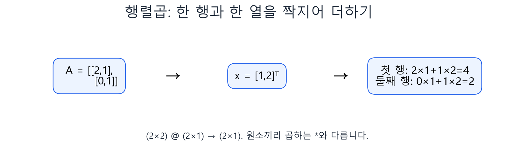

**그림2.** 첫 행과 입력의 대응 숫자를 곱한 뒤 더합니다. 벡터의 각 좌표에 행렬의 대각원소만 곱하면 비대각원소가 주는 영향을 놓칩니다.

열로 읽는 방법도 있습니다. $A$의 첫 열을 $a_1$, 둘째 열을 $a_2$라고 하면 $Ax=x_1a_1+x_2a_2$입니다. 즉 입력좌표는 두 출력 화살표를 섞는 비율입니다.

$$Ax=1\begin{bmatrix}2\\0\end{bmatrix}+2\begin{bmatrix}1\\1\end{bmatrix}
=\begin{bmatrix}4\\2\end{bmatrix}.$$

**확인 C1.** 위 계산에서 `A * x`와 `A @ x`를 같은 뜻으로 써도 될까요? Python의 `*`는 원소별 곱이고 `@`는 행렬곱이라는 차이를 설명해 보세요.

## 3. 전치·내적·길이·직교를 준비하기

전치는 행과 열을 맞바꿉니다. $2\times3$ 행렬은 전치하면 $3\times2$가 됩니다. 전치 자체는 역행렬을 구하는 연산이 아닙니다.

$$\begin{bmatrix}a&b\\c&d\end{bmatrix}^{\top}=\begin{bmatrix}a&c\\b&d\end{bmatrix}.$$

두 열벡터의 내적은 한 벡터를 전치해서 곱하며 결과는 숫자 하나입니다. 벡터 길이는 자신과의 내적에 제곱근을 씌운 것입니다.

$$a^\top b=a_1b_1+a_2b_2,\qquad
\|a\|=\sqrt{a^\top a}=\sqrt{a_1^2+a_2^2}.$$

예를 들어 $(3,4)^\top$의 길이는 $\sqrt{9+16}=5$입니다. 길이로 나눈 $(3/5,4/5)^\top$은 길이가1인 **단위벡터**입니다. 방향은 유지하고 길이만 맞추는 작업이 **정규화**입니다. 0벡터는 길이가0이므로 이 방법으로 정규화할 수 없습니다.

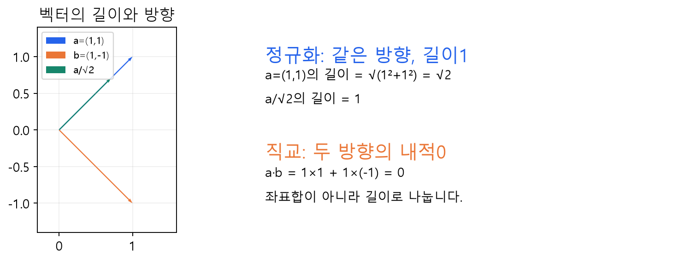

**그림3.** 파란 화살표와 초록 화살표는 같은 방향이며 길이만 다릅니다. 파란색과 주황색의 $(1,1)^\top$과 $(1,-1)^\top$은 내적이 $1-1=0$이므로 직교합니다. 각각을 길이 $\sqrt2$로 나누면 직교정규한 두 벡터가 됩니다.

직교정규 벡터들을 열로 모은 정방행렬 $V$는 $V^\top V=I$를 만족합니다. 이 곱의 대각원소는 각 열의 길이 제곱1, 비대각원소는 서로 다른 열 사이의 내적0입니다. 이처럼 만든 직교행렬은 벡터의 길이와 각도를 보존합니다. 회전하거나 반사할 수 있지만 늘이거나 줄이지는 않습니다.

## 4. 고유벡터는 어떤 특별한 방향인가?

보통 행렬을 곱하면 벡터의 방향과 길이가 함께 바뀝니다. 그런데 어떤 0이 아닌 벡터는 곱한 뒤에도 같은 직선 위에 남습니다. 이 벡터가 고유벡터이고, 그 배율이 고유값입니다.

$$Av=\lambda v,\qquad v\ne0.$$

왼쪽은 행렬을 곱한 결과이고 오른쪽은 원래 벡터를 숫자 하나로 늘이거나 줄인 결과입니다. 두 결과가 같다는 뜻입니다. 고유벡터는 벡터, 고유값은 숫자입니다.

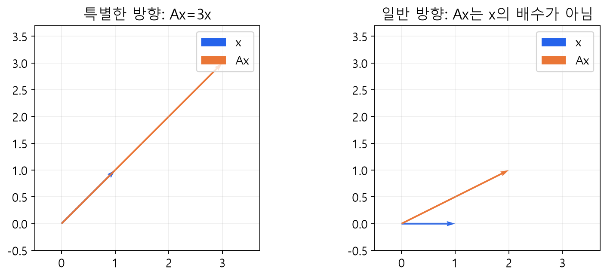

**그림4.** $B=\begin{bmatrix}2&1\\1&2\end{bmatrix}$에서 $(1,1)^\top$은3배, $(1,-1)^\top$은1배가 됩니다. 반면 $(1,0)^\top$은 $(2,1)^\top$이 되어 원래 직선에서 벗어납니다.

| 고유값 | 변환 결과 |
|---|---|
| $\lambda>1$ | 같은 방향으로 길이가 늘어남 |
| $0<\lambda<1$ | 같은 방향으로 길이가 줄어듦 |
| $\lambda<0$ | 반대 방향으로 향하며 길이는 $|\lambda|$배 |
| $\lambda=0$ | 출력이0벡터가 되어 방향이 사라짐 |

$\lambda=0$이어도 입력 고유벡터 $v$는0이 아닙니다. 또한 고유벡터에 0이 아닌 수를 곱한 벡터도 같은 고유값의 고유벡터입니다. 계산과 표시를 편리하게 하기 위해 길이1로 정규화합니다.

일반 실수행렬의 고유값이 언제나 실수인 것은 아닙니다. 이 수업의 손계산은 실수 고유값과 직교정규 고유벡터를 갖는 **대칭행렬**을 중심으로 진행합니다. SVD를 유도할 때도 대칭인 $A^\top A$를 사용합니다.

**확인 C2.** 고유값−2는 길이가−2라는 뜻일까요? 길이와 방향을 나누어 설명해 보세요.

## 5. 고유값·고유벡터를 실제로 구하는 순서

고유벡터의 식에서 오른쪽을 왼쪽으로 옮깁니다. 벡터 $v$에 숫자 $\lambda$를 곱하는 것은 $\lambda I$를 곱하는 것과 같습니다.

$$Bv=\lambda v\quad\Longrightarrow\quad(B-\lambda I)v=0.$$

계수행렬이 가역이라면 양쪽에 역행렬을 곱해 $v=0$만 얻습니다. 우리는 0이 아닌 해를 원하므로 계수행렬이 가역이 아니어야 합니다. $2\times2$에서는 행렬식 $ad-bc$가0이 되는 $\lambda$를 찾습니다. 이것이 $\det(B-\lambda I)=0$을 푸는 이유입니다.

대표 기초 예제 $B=\begin{bmatrix}2&1\\1&2\end{bmatrix}$를 계산해 봅시다.

$$\det(B-\lambda I)=(2-\lambda)(2-\lambda)-1\cdot1
=\lambda^2-4\lambda+3=(\lambda-3)(\lambda-1)=0.$$

고유값3을 넣으면 $-x+y=0$, 즉 $y=x$입니다. $x=1$로 두면 $(1,1)^\top$을 얻고 길이 $\sqrt2$로 나눕니다. 고유값1을 넣으면 $x+y=0$, 즉 $y=-x$이므로 $(1,-1)^\top/\sqrt2$를 얻습니다.

$$v_1=\frac1{\sqrt2}(1,1)^\top,\qquad v_2=\frac1{\sqrt2}(1,-1)^\top.$$

계산이 끝나면 반드시 **원래 식**으로 돌아갑니다. $Bv_1=3v_1$, $Bv_2=v_2$인지 확인하고, 각 벡터 길이가1인지 확인합니다. 상세한 행별 계산은 문제4 풀이에서 다시 볼 수 있습니다.

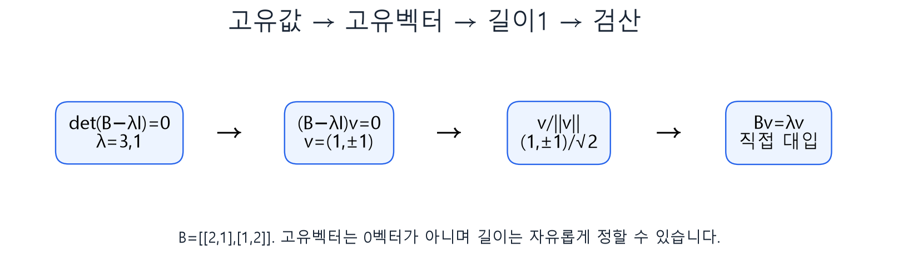

**그림5.** ‘고유값을 먼저 구하고 → 그 값마다 연립방정식을 풀고 → 벡터 길이를 맞추고 → 원래 식으로 확인’합니다. 고유값만 구했다고 고유벡터 계산이 끝난 것은 아닙니다.

## 6. SVD의 세 행렬은 무엇을 담당하나?

실수 행렬 $A$의 특이값 분해, 즉 SVD는 다음과 같습니다.

$$A=U\Sigma V^\top.$$

행렬이 벡터에 작용할 때는 **오른쪽부터** 계산합니다. $Ax=U\{\Sigma(V^\top x)\}$이므로 $V^\top$가 먼저, 그다음 $\Sigma$, 마지막으로 $U$가 작용합니다.

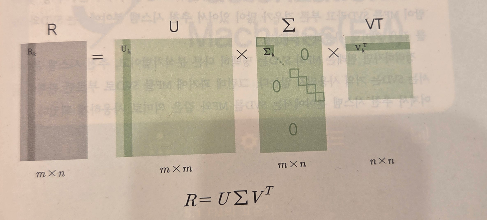

**교재 도식 직접 발췌.** 임일(2025), 『AI 에이전트를 위한 개인화 추천 알고리즘』, 청람, 93쪽. 완전 SVD의 크기는 $U:m\times m$, $\Sigma:m\times n$, $V^\top:n\times n$입니다. 색으로 표시된 앞부분을 남기는 것은 뒤에서 배울 절단 근사와 연결됩니다.

| 인수 | 역할 | 화살표 관점 |
|---|---|---|
| $V^\top$ | 입력을 특별한 방향의 좌표로 읽기 | 회전·반사, 길이 보존 |
| $\Sigma$ | 방향마다 특이값을 곱하기 | 늘이기·줄이기·0으로 눌러 없애기 |
| $U$ | 결과를 출력 공간의 방향에 배치하기 | 회전·반사, 길이 보존 |

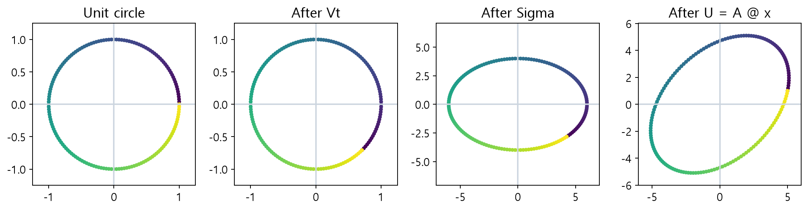

**그림7.** 같은 색의 점이 이동하는 경로를 보세요. $V^\top$ 후에는 원의 모양이 유지되고, $\Sigma$ 후에는 방향별 배율로 타원이 됩니다. $U$ 후에는 타원의 방향이 바뀝니다. 패널마다 표시 축의 범위가 다를 수 있으므로 눈으로 보이는 크기뿐 아니라 눈금도 읽습니다. rank가 부족하면 타원이 선분이나 점으로 눌릴 수 있습니다.

**확인 C3.** $U$부터 벡터에 곱하면 같은 결과가 나올까요? 행렬곱의 순서와 괄호 안 계산을 설명하세요.

## 7. 왜 A의 고유값이 아니라 AᵀA를 구할까?

$A$가 $m\times n$이면 입력은 $n$차원, 출력은 $m$차원입니다. 직사각형 행렬은 $Av=\lambda v$의 양쪽 크기부터 맞지 않을 수 있습니다. 반면 $A^\top A$는 항상 $n\times n$ 정방행렬이고 대칭입니다.

$$x^\top A^\top Ax=(Ax)^\top(Ax)=\|Ax\|^2\ge0.$$

왼쪽의 복잡해 보이는 식은 오른쪽의 ‘출력 화살표 길이 제곱’입니다. 어떤 $x$에서도 음수가 아니므로 $A^\top A$의 고유값은 음수가 아닙니다. $v$가 단위 고유벡터라면 다음 관계가 됩니다.

$$A^\top Av=\lambda v,\quad\|v\|=1
\quad\Longrightarrow\quad\|Av\|^2=v^\top(\lambda v)=\lambda.$$

따라서 그 방향의 출력 길이는 $\sqrt\lambda$이고 이것이 특이값입니다.

$$\sigma_j=\sqrt{\lambda_j},\qquad Av_j=\sigma_j u_j,\qquad
u_j=\frac{Av_j}{\sigma_j}\quad(\sigma_j>0).$$

$v_j$는 입력 쪽 방향, $u_j$는 출력 쪽 방향입니다. 큰 특이값은 해당 입력 방향의 단위 화살표를 더 길게 만든다는 뜻입니다. 모든 고유값이 같거나 중복되면 방향의 선택이 유일하지 않을 수 있습니다.

**확인 C4.** $A^\top A$의 고유값이36이라면 특이값은36일까요, 6일까요? 길이와 길이 제곱의 관계로 설명하세요.

## 8. 지난 예제의 SVD를 이제 직접 계산하기

$$A=\begin{bmatrix}5&1\\1&5\end{bmatrix}.$$

**1단계 — 전치해서 곱합니다.**

$$A^\top A=\begin{bmatrix}5(5)+1(1)&5(1)+1(5)\\1(5)+5(1)&1(1)+5(5)\end{bmatrix}
=\begin{bmatrix}26&10\\10&26\end{bmatrix}.$$

**2단계 — 고유값을 구합니다.**

$$\det(A^\top A-\lambda I)=(26-\lambda)^2-100
=\lambda^2-52\lambda+576=(\lambda-36)(\lambda-16)=0.$$

따라서36과16입니다. 원래 행렬의 숫자5·1을 그대로 특이값으로 쓰거나, 이 고유값을 특이값으로 쓰지 않습니다.

**3단계 — 고유벡터를 구하고 정규화합니다.**

36을 넣으면 $-10x+10y=0$이므로 $y=x$입니다. 16을 넣으면 $10x+10y=0$이므로 $y=-x$입니다. 각각 길이 $\sqrt2$로 나누어 아래 두 열을 만듭니다.

$$V=\frac1{\sqrt2}\begin{bmatrix}1&1\\1&-1\end{bmatrix}.$$

**4단계 — 제곱근으로 특이값을 구합니다.**

$$\Sigma=\begin{bmatrix}\sqrt{36}&0\\0&\sqrt{16}\end{bmatrix}
=\begin{bmatrix}6&0\\0&4\end{bmatrix}.$$

**5단계 — 출력 방향을 구합니다.**

$$Av_1=\frac1{\sqrt2}\begin{bmatrix}6\\6\end{bmatrix},\quad
u_1=\frac{Av_1}{6}=\frac1{\sqrt2}\begin{bmatrix}1\\1\end{bmatrix},$$

$$Av_2=\frac1{\sqrt2}\begin{bmatrix}4\\-4\end{bmatrix},\quad
u_2=\frac{Av_2}{4}=\frac1{\sqrt2}\begin{bmatrix}1\\-1\end{bmatrix}.$$

이 예제에서는 $U=V$입니다. 모든 행렬에서 같지는 않습니다. 문제3과 문제8에서 다른 경우를 확인합니다.

**6단계 — 곱해서 원본과 비교합니다.**

$$U\Sigma V^\top=\frac12\begin{bmatrix}6&4\\6&-4\end{bmatrix}
\begin{bmatrix}1&1\\1&-1\end{bmatrix}
=\frac12\begin{bmatrix}10&2\\2&10\end{bmatrix}=A.$$

여기까지 계산해야 ‘분해 결과를 알고 있다’에서 ‘계산 방법을 설명할 수 있다’로 넘어갑니다. 문제5 해설에는 정규화·고유값 검산·각 행렬의 역할을 더 자세히 적었습니다.

## 9. 큰 패턴 몇 개만 남기면 무슨 일이 생기나?

SVD는 하나의 큰 곱이면서 작은 패턴의 합이기도 합니다.

$$A=\sum_{j=1}^{r}\sigma_j u_jv_j^\top.$$

$u_jv_j^\top$는 열벡터와 행벡터의 **외적**입니다. 결과는 숫자 하나가 아니라 원본과 같은 크기의 행렬입니다. 위 예제에서는 두 패턴으로 나뉩니다.

$$A=\begin{bmatrix}3&3\\3&3\end{bmatrix}+\begin{bmatrix}2&-2\\-2&2\end{bmatrix}.$$

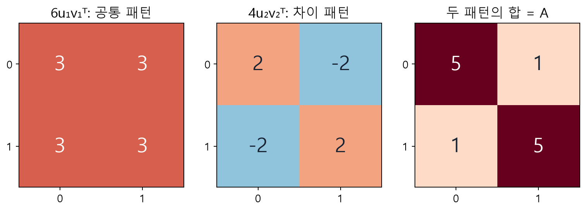

**그림8.** 첫 패턴은 공통된 수준3, 둘째는 대각과 비대각의 차이를 표현합니다. 첫 패턴만 남기면 공통 수준은 유지되지만 대각이 더 크다는 차이를 잃습니다. 이 해석은 이 수업용 행렬에 대한 것이며 실제 잠재축의 이름이 자동으로 정해지는 것은 아닙니다.

rank는 독립적인 열 방향의 수입니다. 모든 칸이3인 행렬의 두 열은 같으므로 독립적인 방향이 하나이고 rank는1입니다. 행렬이 작아지거나 원소가 하나만 남는다는 뜻이 아닙니다.

$$A_k=U_k\Sigma_kV_k^\top,\qquad
\|A-A_k\|_F=\sqrt{\sum_{i,j}(A_{ij}-(A_k)_{ij})^2}.$$

완전한 행렬에 대해 모든 칸을 같은 가중치로 비교하는 Frobenius 오차에서는 큰 특이값부터 남긴 절단 SVD가 최적 rank-k 근사를 줍니다. 이때 오차 제곱은 버린 특이값 제곱의 합입니다. 이 최적성은 관측 일부의 평점 손실을 최소화하는 추천 MF 문제와 동일한 조건이 아닙니다.

$$\|A-A_1\|_F^2=2^2+(-2)^2+(-2)^2+2^2=16=\sigma_2^2.$$

따라서 Frobenius 오차는4입니다. 원소당 RMSE는 $\sqrt{16/4}=2$로 다른 숫자입니다. 무엇을 더하고 무엇으로 나누는지 항상 밝혀야 합니다.

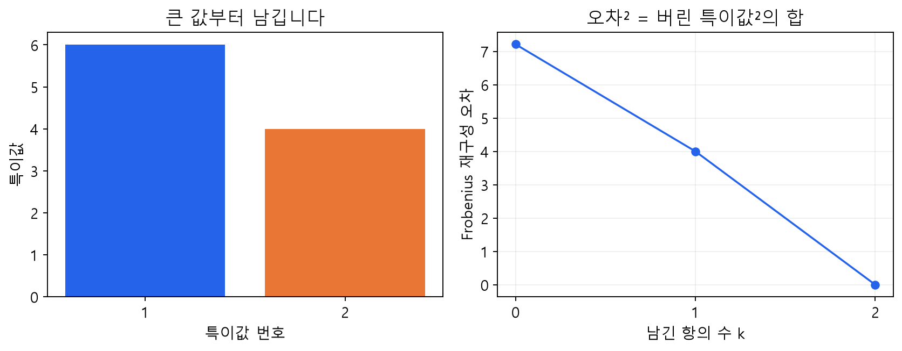

**그림9.** 이 작은 행렬에서 k=0,1,2의 재구성 오차를 계산했습니다. k=2에서는 모든 패턴을 남깁니다. 오차 감소는 주어진 완전 행렬에 대한 것이며 새 평점 예측이 좋아진다는 보장은 아닙니다.

**확인 C5.** rank-1의 제곱합 보존 비율은 $36/(36+16)$입니다. 이를 ‘추천 정확도 약69%’라고 말해도 될까요?

## 10. 직사각형·0 특이값·부호에서 주의할 점

완전 SVD, 축소 SVD, 절단 SVD는 구분해서 읽습니다. $q=\min(m,n)$일 때 다음과 같습니다.

| 형태 | U의 크기 | Σ의 크기 | Vᵀ의 크기 | 원본 복원 |
|---|---|---|---|---|
| 완전 | $m\times m$ | $m\times n$ | $n\times n$ | 정확 |
| 축소 | $m\times q$ | $q\times q$ | $q\times n$ | 정확 |
| k항 절단 | $m\times k$ | $k\times k$ | $k\times n$ | 일반적으로 근사 |

양의 특이값 r개만 남기는 compact 표현도 rank-r 행렬을 정확히 복원합니다. 축소라고 항상 근사인 것은 아닙니다. 절단에서 모든 비영 항을 남겨도 정확히 복원됩니다.

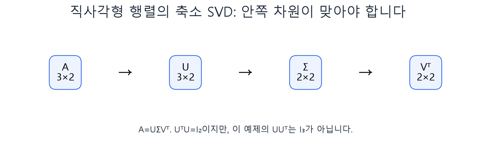

**그림10.** 문제7은 $3\times2$ 행렬을 축소 SVD로 정확히 표현합니다. 문제8은 두 번째 특이값이0입니다. $u_j=Av_j/\sigma_j$에0을 넣어 나누지 말고 양의 항만 쓰거나 필요한 직교 방향을 별도로 보충합니다.

같은 SVD라도 $u_j$와 $v_j$의 부호를 **함께** 바꾸면 외적은 바뀌지 않습니다. 중복 특이값에서는 같은 부분공간 안의 다른 직교 기저가 나올 수도 있습니다. 답지와 배열이 똑같은지만 보지 말고 재구성·직교성·특이값으로 검산합니다.

## 11. Python은 손계산을 어떻게 확인하는가?

다음 코드는 값을 모두 알고 있는 작은 행렬을 분해합니다. 파일 다운로드나 개인 경로가 필요 없습니다.

```python
import numpy as np
A = np.array([[5., 1.], [1., 5.]])
U, s, Vt = np.linalg.svd(A, full_matrices=False)
Sigma = np.diag(s)
rebuilt = U @ Sigma @ Vt
print(s)                         # 약 [6., 4.]
print(np.allclose(rebuilt, A))    # True
```

`s`는 특이값만 담은 1차원 배열입니다. `np.diag(s)`가 그 값을 대각선에 놓습니다. 실수 행렬에서 `Vt`는 이미 $V^\top$이므로 다시 전치해서 곱하지 않습니다. `np.allclose`는 작은 부동소수점 차이를 허용하여 비교합니다.

손계산에서는 $A^\top A$를 통해 원리를 이해하지만, 실제 큰 수치 계산은 이 행렬을 일부러 만들어 분해하기보다 검증된 SVD 함수를 사용합니다. NumPy는 LAPACK의 SVD 알고리즘을 사용합니다. $A^\top A$ 경로는 작은 특이값을 구할 때 수치 오차를 키울 수 있으므로 교육적 유도와 계산 구현을 구별합니다.

**확인 C6.** `U * s * Vt`로 원본을 재구성하려는 코드는 왜 잘못될 수 있을까요? 원소별 곱과 행렬곱, `s`의 모양을 확인하세요.

실습의 공통 함수는 입력·출력·부작용을 설명하는 docstring과 정의 바로가기를 제공합니다. `svd_steps`는 학습된 모델을 만들지 않고, 전달된 완전 행렬을 분해하여 중간값과 오차를 반환합니다. 함수 이름에 SVD가 있다고 해서 관측 평점으로 SGD 학습을 수행하는 것은 아닙니다.

## 12. 다시 추천시스템: 무엇을 복원하고 무엇을 예측하는가?

교재4.6절은 SVD와 MF라는 용어의 혼동, 미관측값 처리의 차이를 설명합니다. 수업에서는 이를 다음 세 경우로 나누어 읽습니다.

| 구분 | 입력과 목표 | 관측하지 않은 칸 |
|---|---|---|
| 수학적 SVD | 값이 모두 주어진 행렬을 분해·재구성 | 별도 처리 없이 NaN을 넣을 수 없음 |
| 절단 SVD | 완전 행렬을 몇 개의 패턴으로 근사 | 대입했다면 그 대입값도 재구성 대상 |
| 추천 MF | 관측한 학습 평점의 오차를 줄임 | 손실에서 제외하고 학습 후 예측 |

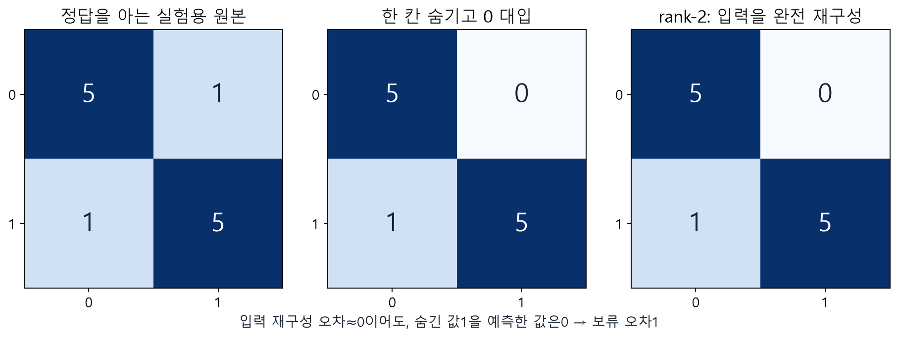

**그림11.** 원래1인 한 칸을 감추고0을 넣었습니다. rank-2로 그 입력을 완전히 복원하면 그 칸은0입니다. 입력 재구성 오차는0이지만 감춘 실제값1에 대한 절대오차는1입니다. 이 반례는 모든 항을 남긴 정확한 재구성 조건입니다. 절단하면 대입값이 반드시 그대로 남는 것은 아닙니다.

‘SVD는 행렬3개, MF는2개’만으로 구별하면 부족합니다. $P=U_k\Sigma_k^{1/2}$, $Q=V_k\Sigma_k^{1/2}$로 놓으면 절단 SVD도 $PQ^\top$로 쓸 수 있습니다. 중요한 것은 **목적함수·관측 처리·직교 제약·편향·정규화**입니다.

Surprise의 `SVD` 클래스는 평균·편향·잠재벡터로 관측 평점의 정규화 오차를 SGD로 학습합니다. `np.linalg.svd`와 이름이 비슷하지만 같은 연산이 아닙니다. SVD 기반 접근을 추천에 사용할 수 없다는 뜻도 아닙니다. 결측 대입·중심화·모형과 평가 방법을 명확히 정해야 합니다.

**확인 C7.** 미관측값을0으로 채운 입력을 완벽히 복원했다는 말만으로 추천을 잘한다고 결론내릴 수 없는 이유를 한 문장으로 쓰세요.

## 13. 마지막 활동: 눈으로 계산하는 SVD 앱

Colab A는 기초 계산과 고유분해·SVD 검산, Colab B는 rank 근사·미관측 반례·웹 앱으로 구성됩니다. 각각 새 CPU 런타임에서 독립 실행할 수 있습니다. 연습의 미완성 변수는 시연용 변수와 분리되어 있어 다음 활동을 막지 않습니다. 전체 실행 성공과 자신의 빈칸 정답 여부는 구분하세요.

앱의 **고유방향**에서 각도45도와0도를 비교하고, **SVD 세 단계**에서 같은 색 점을 따라갑니다. **rank와 재구성**에서 k=0,1,2를 바꾸며 출력 크기·오차·보존 비율을 읽습니다. **지난 MF 실험 이어가기**는 명시적인 작은 합성 자료를 사용하는 복습 모드이며 이전 MovieLens 성능 결과가 아닙니다.

각 실험에서 ‘바꾸기 전 예상 / 실제 수치 / 그림에서 달라진 점 / 이유’를 기록하세요. 실습 B에서는 공통 계산 결과를 받아 해석 문장을 만드는 `my_report`를 수정합니다. UI 설정이 callback으로 들어가고, 같은 공통 함수의 결과가 표·그림·내 문장으로 나오는 연결을 확인합니다.

Gradio 공유 주소는 실행 중인 Colab 런타임에 의존합니다. 런타임을 종료하면 노트북을 다시 실행해 새 주소를 열어야 합니다. 고정 Colab 링크와 잠시 실행되는 앱 주소를 구분하세요.

## 점검 퀴즈

1. $A=\begin{bmatrix}2&1\\0&1\end{bmatrix}$, $x=\begin{bmatrix}1\\2\end{bmatrix}$이다. $A$와 $x$의 크기를 쓰고, $Ax$, $A^\top$, $A^\top A$를 구하라. 모든 원소의 곱셈과 덧셈을 보이라.
2. $a=(1,1)^\top$, $b=(1,-1)^\top$의 내적과 길이를 구하라. 각각을 단위벡터로 바꾸고, 두 열로 만든 $V$에 대해 $V^\top V=I$를 확인하라.
3. $D=\operatorname{diag}(3,-2)$이다. $e_1=(1,0)^\top$, $e_2=(0,1)^\top$가 고유벡터인지 확인하고 고유값을 구하라. $z=(1,1)^\top$도 고유벡터인가? $D$의 특이값과 고유값은 같은가?
4. $B=\begin{bmatrix}2&1\\1&2\end{bmatrix}$에 대해 $\det(B-\lambda I)=0$을 전개하여 고유값을 구하라. 각 고유값의 고유벡터를 연립방정식으로 구하고 정규화한 뒤 대입 검산하라.
5. $A=\begin{bmatrix}5&1\\1&5\end{bmatrix}$의 SVD를 구하라. $A^\top A$ → 고유값 → 정규 고유벡터 → 특이값 → 왼쪽 특이벡터 → $U\Sigma V^\top$ 재구성 순서를 모두 보이라.
6. Q5의 첫 특이값 항만 남긴 $A_1$을 구하라. $A-A_1$, Frobenius 오차, 원소당 RMSE, 제곱합 보존 비율을 계산하고 각각의 의미를 설명하라.
7. $C=\begin{bmatrix}3&0\\0&2\\0&0\end{bmatrix}$에 대해 축소 SVD의 각 크기와 인수를 구하라. $U^\top U$와 $UU^\top$를 비교하고 rank-1 근사 오차를 구하라.
8. $E=\begin{bmatrix}3&0\\4&0\end{bmatrix}$의 특이값을 구하라. 0으로 나누지 않고 compact SVD와 한 가지 완전 SVD를 제시하고 재구성하라.
9. 설명용 정답 행렬 $R=\begin{bmatrix}5&1\\1&5\end{bmatrix}$에서 첫 행 둘째 열을 감춘다. 그 자리에0을 넣은 $M$을 rank-2 SVD로 완전히 재구성하면 해당 칸의 예측은 얼마인가? 입력 $M$에 대한 오차와 감춘 한 칸의 실제 오차를 계산하고 비교하라.

## 기억할 내용과 참고자료

고유벡터는 변환 후 같은 직선에 남는 특별한 방향입니다. 특이값은 $A^\top A$ 고유값의 음이 아닌 제곱근이며 입력의 단위방향이 늘어나는 길이 배율입니다. SVD는 방향별 패턴을 합쳐 행렬을 만들고, 일부만 남기면 저차원 근사가 됩니다. 원본 재구성과 미관측 평점 예측은 서로 다른 평가 문제입니다.

- 주교재: 임일(2025), 『AI 에이전트를 위한 개인화 추천 알고리즘: Python, 머신러닝, AI, LLM 활용』, 청람, 4.6, 93–94쪽. 교재 도식 외 그림과 계산 예제는 자체 제작입니다.
- [MIT OCW: SVD와 고유분해의 연결](https://ocw.mit.edu/courses/18-06sc-linear-algebra-fall-2011/pages/positive-definite-matrices-and-applications/singular-value-decomposition/)
- [NumPy: SVD의 반환값과 재구성](https://numpy.org/doc/stable/reference/generated/numpy.linalg.svd.html)
- [NumPy: 대칭행렬 고유분해 eigh](https://numpy.org/doc/stable/reference/generated/numpy.linalg.eigh.html)
- [Surprise: SGD 기반 추천 SVD](https://surprise.readthedocs.io/en/stable/matrix_factorization.html)

웹 문서 확인: 2026-10-08. 실습에서는 직접 계산한 값과 코드 출력을 비교하며 라이브러리 버전·검증 환경은 별도 실행 기록으로 남깁니다.
