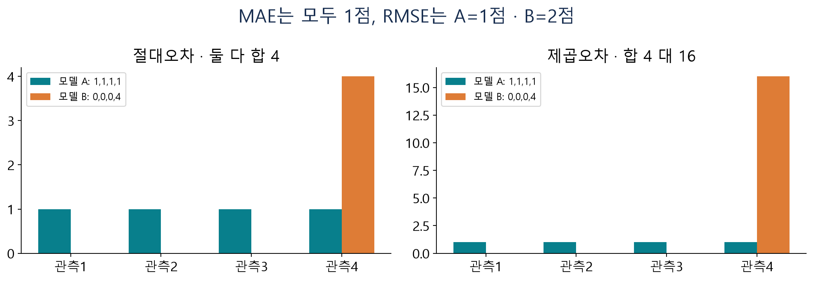
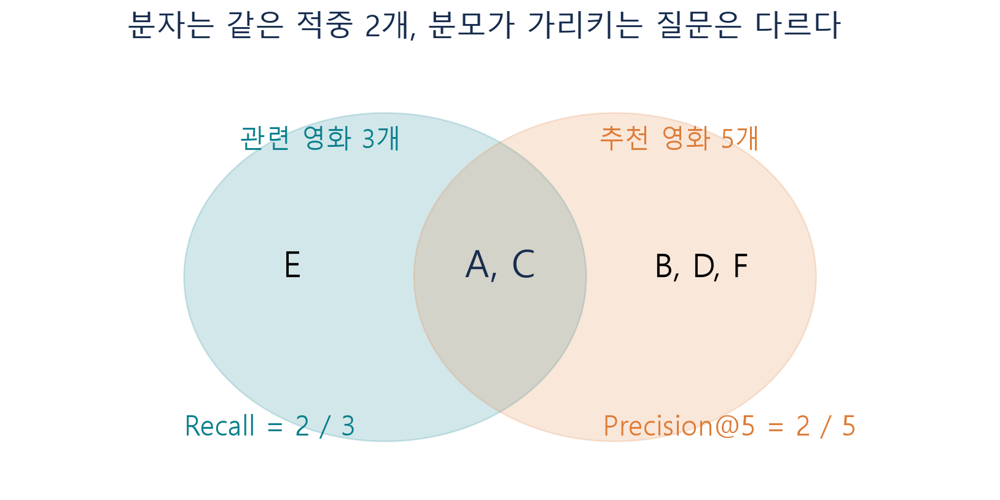
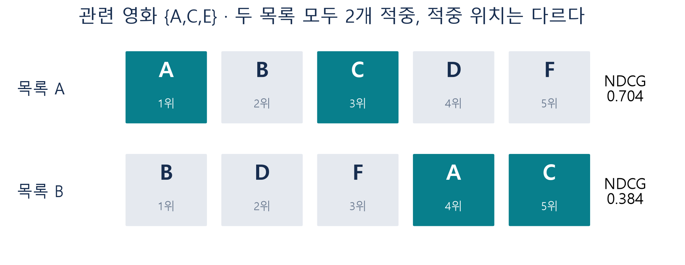
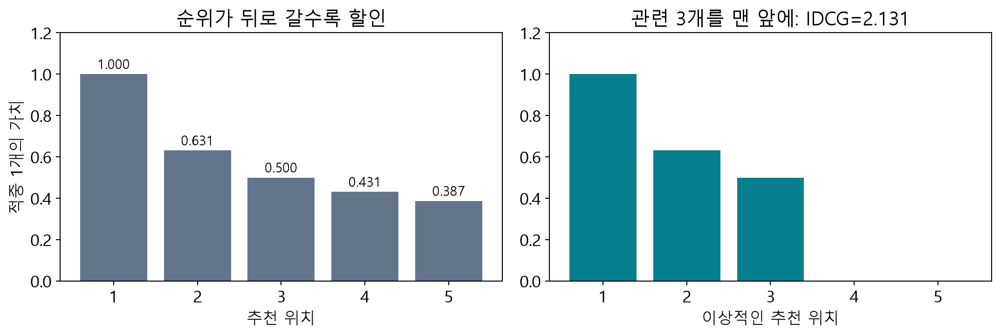
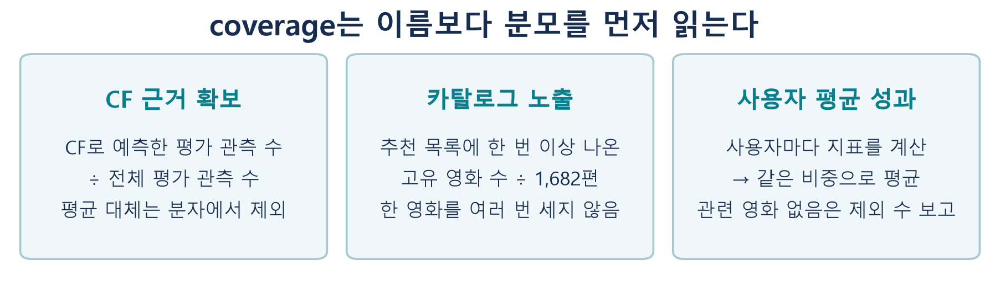

# W05A 보강 · 추천 성과지표를 그림과 계산으로 이해하기

**딥러닝응용I(추천시스템) · 동덕여자대학교 · 유원상 교수 · 2026-2**

2026년 9월 29일 수업 보강자료 · 주교재 3.9의 성과지표와 이전 순위 평가 복습

지표의 공식을 읽을 수 있어도 무엇을 측정하는지 설명하기는 어렵습니다. 이 자료에서는 같은 숫자를 여러 관점에서 보며 **단위, 분자, 분모, 비교 대상**을 먼저 확인합니다. [본 강의](../sessions/w05a-model-comparison.md)와 [계산 실습 A](https://colab.research.google.com/github/lunalab-ai/recommender/blob/2026-fall-w05a/notebooks/student/w05a-review-metrics.ipynb)를 함께 사용할 수 있습니다.

## 1. 평가 질문부터 세 가지로 나누기

| 묻고 싶은 것 | 비교할 대상 | 적합한 지표 |
|---|---|---|
| “이 사람은 몇 점을 줄까?”를 얼마나 틀렸나 | 실제 평점과 예측 평점 | MAE, RMSE |
| 추천 목록에서 좋아할 영화가 얼마나 확인됐나 | 추천 집합과 관련 영화 집합 | Precision, Recall |
| 확인된 좋은 영화를 앞쪽에 놓았나 | 관련 영화가 등장하는 위치 | NDCG |

하나의 점수로 세 질문을 모두 답하지 않습니다. 평균 평점이 4.1이라는 것은 많은 사람이 평가했다는 뜻이 아니고, 코사인이 0.9라는 것은 실제 평점이 4.5점이라는 뜻도 아닙니다.

**S1 · 단위 구분.** 영화 A의 점수가 250, 영화 B의 점수가 0.92, 영화 C의 예측이 4.2라면, 각각 평가 횟수·코사인·평점 중 어떤 단위일 수 있는지 적으세요. 숫자 크기만으로 세 영화를 비교할 수 있는지도 설명하세요.

## 2. MAE: 오차의 방향을 지우고 크기를 평균내기

실제 평점을 $y$, 예측을 $\hat y$라고 하면 오차는 $e=y-\hat y$입니다. 양수는 낮게 예측한 경우, 음수는 높게 예측한 경우입니다. 오차를 그대로 더하면 서로 지워질 수 있으므로 오차의 크기를 평가할 때 절댓값이나 제곱을 사용합니다.

실제값 [5,4,2,1]을 두 모델이 다음처럼 예측했다고 가정합니다. 실제 조사 자료가 아닌 독립 계산 예제입니다.

| 관측 | 실제 | A 예측 | A 오차 | B 예측 | B 오차 |
|---|---:|---:|---:|---:|---:|
| 1 | 5 | 4 | 1 | 5 | 0 |
| 2 | 4 | 3 | 1 | 4 | 0 |
| 3 | 2 | 3 | −1 | 2 | 0 |
| 4 | 1 | 2 | −1 | 5 | −4 |

A의 단순 오차 평균은 0입니다. 그렇지만 네 번 모두 1점씩 틀렸습니다. 부호가 상쇄됐다고 예측이 완벽해진 것은 아닙니다.

$$
MAE_A=\frac{|1|+|1|+|-1|+|-1|}{4}=1,
\qquad MAE_B=\frac{0+0+0+4}{4}=1.
$$

두 모델 모두 평균 절대오차는 1점입니다. 이것은 모든 관측을 정확히 1점씩 틀렸다는 뜻이 아닙니다. B처럼 대부분 맞히다가 한 번 크게 틀려도 같은 평균이 나옵니다.

## 3. RMSE: 큰 오차가 있는지 더 강하게 반영하기

**그림 1.** 왼쪽에서는 A와 B의 막대 높이 합이 같습니다. 오른쪽에서는 B의 마지막 오차 4가 제곱되어 16이 됩니다. 제곱은 큰 오차의 비중을 키웁니다.

$$
MSE_A=\frac{1+1+1+1}{4}=1,\qquad MSE_B=\frac{0+0+0+16}{4}=4.
$$

MSE의 단위는 점수의 제곱입니다. 마지막에 제곱근을 취해 평점 단위로 돌아옵니다.

$$
RMSE_A=\sqrt{1}=1,\qquad RMSE_B=\sqrt{4}=2.
$$

“큰 실수를 줄이고 싶다”는 목적에서는 B의 한 번 큰 실수가 더 문제가 될 수 있습니다. RMSE는 오차의 최대값을 반환하는 지표는 아니며, 여전히 전체 제곱오차를 평균한 값입니다. 같은 평가 표에서 계산하면 RMSE는 MAE 이상이고, 모든 절대오차가 같을 때 두 값이 같습니다.

**S2 · 계산과 해석.** 실제 [5,2,4,1], 예측 [4,3,4,3]에서 오차·절대오차·제곱오차를 각각 적고 MAE와 RMSE를 구하세요. RMSE를 구할 때 제곱근을 평균 전과 후 중 어디에 두는지도 표시하세요.

### 평점 오차가 작으면 순위도 좋을까?

두 영화 A와 B의 실제 평점이 각각 5와 3이라고 가정합니다. 관련성은 4점 이상이므로 A만 관련 영화입니다.

| 모델 | A의 예측 | B의 예측 | 두 평점의 RMSE | Top-1 |
|---|---:|---:|---:|---|
| X | 3.9 | 4.0 | 약 1.051 | B |
| Y | 4.0 | 1.0 | 약 1.581 | A |

X는 평점 오차가 더 작지만 A보다 B를 높게 배치해 Top-1에서 관련 영화를 놓칩니다. Y는 B의 점수를 많이 틀려 RMSE가 크지만 첫 추천에는 A를 놓습니다. 이것은 어느 지표가 틀렸다는 뜻이 아닙니다. **두 지표가 다른 목적을 평가하기 때문**입니다.

## 4. Precision과 Recall: 같은 적중, 다른 분모

관련 영화가 {A,C,E}이고 Top-5가 [A,B,C,D,F]라고 합시다. 적중은 A와 C 두 개입니다.

**그림 2.** 왼쪽 원 전체가 찾아야 할 관련 영화, 오른쪽 원 전체가 제시한 추천입니다. 교집합은 같지만 무엇을 기준으로 나누는지가 다릅니다.

- Precision@5: 추천한 5자리 중 관련 영화가 2개, $2/5=0.4$.
- Recall@5: 관련 영화 3개 중 2개를 찾음, $2/3\approx0.667$.

Precision은 추천 목록의 적중 밀도에, Recall은 찾아야 할 영화의 포착 정도에 초점을 둡니다. N을 늘리면 같은 순위의 prefix를 더 보여 주므로 적중 개수와 Recall은 감소하지 않습니다. Precision은 새로 추가한 영화가 얼마나 적중하는지에 따라 올라갈 수도 내려갈 수도 있습니다. 두 지표가 언제나 반대 방향으로 움직인다고 외우지 않습니다.

이번 구현에서는 후보가 부족해 5개 대신 3개만 반환해도 Precision@5의 분모는 요청한 5입니다. 빈 추천 자리를 성공으로 보지 않는 규약입니다. 반환 개수와 요청 N을 함께 기록합니다.

**S3 · 분모 찾기.** 관련 영화 8편 중 Top-10에 3편이 들어갔습니다. Precision과 Recall의 분자와 분모를 먼저 쓰고 계산하세요. Precision을 3/8로 계산했다면 어떤 질문으로 바뀐 것인지 설명하세요.

### 미관측은 비선호와 다르다

MovieLens에는 모든 사람이 모든 영화를 평가한 표가 없습니다. 평가 자료에서 관련 영화로 확인되지 않은 후보에는 낮은 평점 영화뿐 아니라 미관측 영화도 포함됩니다. 여기서 측정한 순위 적중률은 **보류한 관측에서 확인된 관련 영화의 회수 성능**입니다.

전체 카탈로그의 모든 비적중을 실제 비선호로 간주해 Accuracy나 FPR을 쉽게 계산하면 해석에 문제가 생깁니다. Accuracy는 후보가 대부분 비관련일 때 높은 값이 나오는 문제도 있습니다. 교재의 혼동행렬 개념과 실제 추천 자료의 관측 한계를 함께 읽어야 합니다.

## 5. NDCG: 앞에서 맞힌 것을 더 높이 평가하기

**그림 3.** 목록 A의 적중 위치는 1위와 3위, B는 4위와 5위입니다. P와 R은 같지만 사용자가 먼저 만날 가능성이 큰 앞쪽의 관련성을 구분하고 싶습니다.

이번 이진 NDCG에서 적중은 1, 그 외는 0입니다. 각 위치의 점수를 $\log_2(j+1)$로 나누어 할인합니다.

| 위치 j | 1 | 2 | 3 | 4 | 5 |
|---|---:|---:|---:|---:|---:|
| 할인 가중치 | 1 | 0.631 | 0.500 | 0.431 | 0.387 |
| 목록 A 적중 | 1 | 0 | 1 | 0 | 0 |
| 목록 B 적중 | 0 | 0 | 0 | 1 | 1 |
| 이상적인 적중 | 1 | 1 | 1 | 0 | 0 |

$$
DCG_A=1+0.5=1.5,\qquad DCG_B\approx0.431+0.387=0.818.
$$

관련 영화가 총 3개이므로 가장 좋은 Top-5는 그 세 영화를 첫 세 자리에 놓습니다.

$$
IDCG=1+\frac1{\log_2 3}+\frac1{\log_2 4}\approx2.131.
$$

$$
NDCG_A\approx0.704,\qquad NDCG_B\approx0.384.
$$

**그림 4.** 실제 DCG만 비교하면 관련 영화가 많은 사용자가 유리할 수 있습니다. 각 사용자의 가능한 최선인 IDCG로 나누어 상대적인 순위 품질을 읽습니다. 이 정규화만으로 모든 사용자 집단의 비교 문제가 해결되는 것은 아닙니다.

문헌에 따라 관련성을 0/1이 아닌 여러 단계로 두거나 gain을 다르게 정의하기도 합니다. 같은 NDCG라는 이름만 보고 다른 정의의 값을 섞지 않습니다.

**S4 · 예측하기.** 적중 영화의 집합을 유지한 채 두 적중을 1위·2위로 옮기면 P, R, NDCG 중 무엇이 변하나요? 위치별 기여를 사용해 설명하세요.

## 6. 한 명의 결과를 전체 결과로 모으기

U1은 관련 영화 1편 중 1편을, U2는 관련 영화 10편 중 1편을 찾았다고 합시다. 두 사용자 모두 N=5로 평가했습니다.

| 사용자 | 적중/관련 | Recall | Precision@5 |
|---|---|---:|---:|
| U1 | 1/1 | 1.0 | 0.2 |
| U2 | 1/10 | 0.1 | 0.2 |

사용자별 Recall의 평균은 $(1+0.1)/2=0.55$입니다. 이것이 이번 **macro Recall**입니다. 전체 적중 2를 전체 관련 영화 11로 나눈 $2/11\approx0.182$는 다른 집계입니다. 사용자를 동등하게 보는지, 관련 영화 한 개를 동등하게 보는지의 차이입니다.

관련 영화가 하나도 없는 U3이 있으면 $0/0$을 자동으로 0점이라고 덮어쓰지 않습니다. 이번 실습은 U3을 모든 모델에서 동일하게 제외하고 “후보 사용자 3명, 평가 가능 2명, 제외 1명”으로 보고합니다. 따라서 최종 평균이 어떤 사용자 집단의 평균인지도 중요합니다.

F1은 먼저 사용자별 P·R로 계산하고 그 F1들을 평균합니다. 평균 P·평균 R의 조화평균으로 대체하지 않습니다. 비선형 계산과 평균의 순서는 일반적으로 바꿀 수 없습니다.

**S5 · 평균의 의미.** 위 예에서 Recall=0.55가 “관련 영화 11편 중 55%를 찾았다”라는 뜻이 아닌 이유를 적으세요.

## 7. coverage와 대체 예측을 함께 보기

**그림 5.** coverage라고 쓰인 열은 분모를 확인해야 합니다. 이번 표에는 두 다른 비율을 명시적으로 분리했습니다.

- 평가 관측 10건 중 8건에 CF 근거가 있고 2건은 평균 대체라면 CF 근거 확보율은 80%입니다. RMSE에는 10건 모두 들어갑니다.
- 카탈로그 20편 중 사용자들의 추천 목록에 총 4편만 한 번 이상 등장했다면 카탈로그 노출은 20%입니다. 같은 영화를 여러 사용자에게 추천해도 고유 영화 수에서는 한 번 셉니다.
- 내용 프로필이 비어 영화 평균으로 대체한 비율도 별도로 표시합니다. 대체값이 있다는 사실이 내용 정보가 충분했다는 뜻은 아닙니다.

근거가 충분한 관측만 골라 RMSE를 계산하면 어려운 사례가 평가에서 빠집니다. 기준을 엄격하게 해서 RMSE가 좋아졌을 때는 평가 분모가 유지됐는지와 대체 예측이 늘었는지도 확인하세요.

## 8. 내 결과를 설명하는 문장 만들기

“모델 A가 좋다”에서 멈추지 말고 다음 형태로 적습니다.

> 같은 분할·사용자·후보와 N=10에서 설정을 ○○만 바꿨다. 검증 지표 △△는 ○○에서 ○○로 변했고, 추천 목록에서는 ○○가 바뀌었다. 이는 ○○와 관련될 수 있지만, 이 실험은 ○○를 검증하지 않았으므로 일반화에는 한계가 있다.

빈칸의 수치는 자신의 실행 결과를 사용합니다. 결과를 보기 전에 쓴 가설과 실행 후의 관찰을 구분하세요. 낮은 RMSE, 높은 NDCG, 다양한 카탈로그 노출, 개별 사용자의 만족은 동시에 같은 방향으로 변하지 않을 수 있습니다.

**S6 · 웹 앱 연결.** 실습 B의 비교 앱에서 사용자·N을 고정하고 CF 이웃 수만 바꾸세요. 평점 오차, NDCG, 추천 목록을 함께 기록하고 지표 하나만으로는 설명할 수 없는 점을 한 문장 적으세요.

## 출처와 예제의 성격

주교재 3.9, 인쇄 pp.59–62의 오차·정밀도·재현율·F1·coverage 및 관측 한계를 바탕으로 재설명했습니다. 수치 예제와 모든 그림은 수업용 독립 제작입니다. NDCG의 순위 할인과 macro 집계는 이전 수업과 아래 보충자료를 연결했습니다.

- [Stanford IR: 집합 평가](https://nlp.stanford.edu/IR-book/html/htmledition/evaluation-of-unranked-retrieval-sets-1.html), [순위 평가](https://nlp.stanford.edu/IR-book/html/htmledition/evaluation-of-ranked-retrieval-results-1.html).
- [MovieLens100K README](https://files.grouplens.org/datasets/movielens/ml-100k-README.txt).
- [실제 수업 지표 구현](https://github.com/lunalab-ai/recommender/blob/2026-fall-w05a/src/luna_recsys/ranking.py#L163): 요청 N을 Precision 분모로 사용하는 규약. 자료 확인: 2026-09-28.
